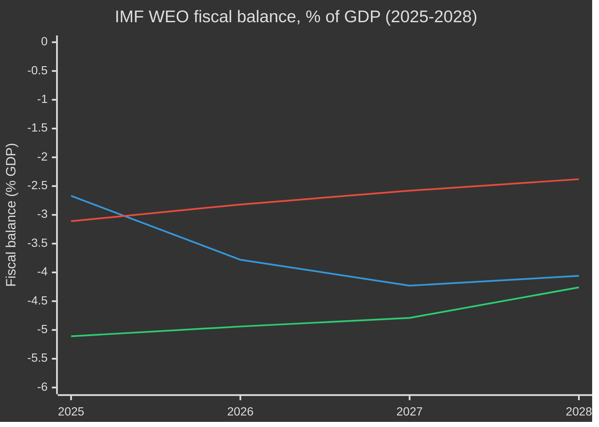
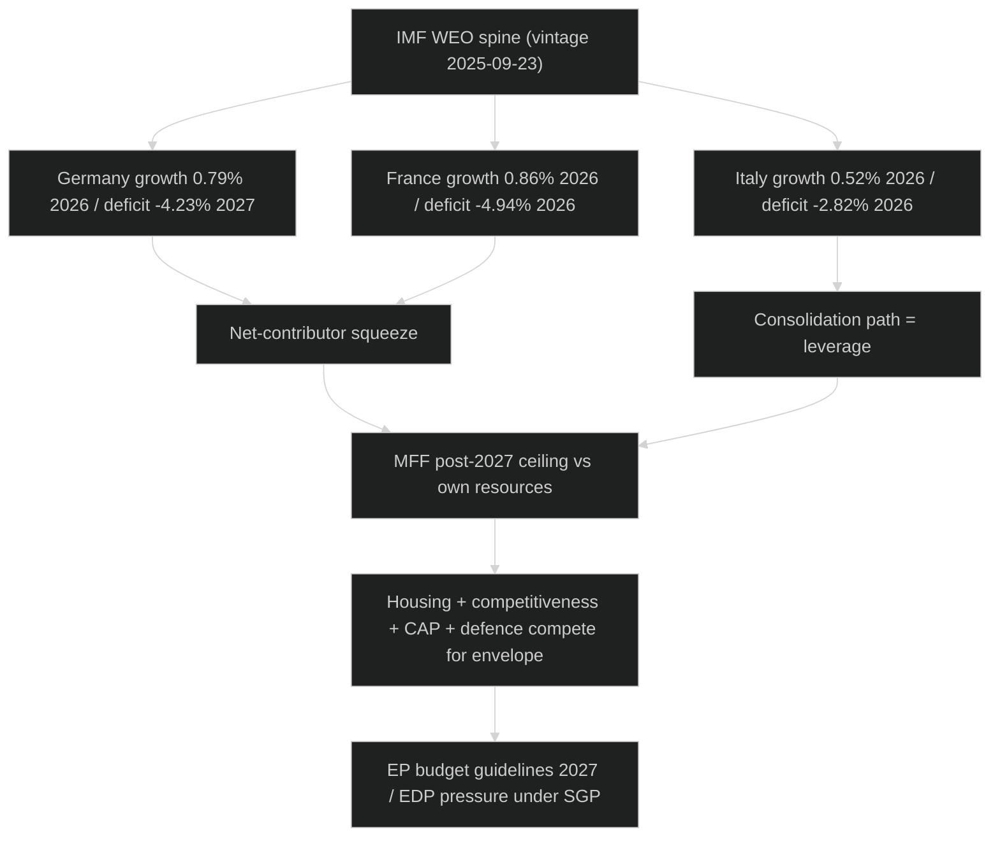

# Economic Context — EU Parliament Year Ahead 2026-2027
**Date:** 2026-05-30 | **Article Type:** year-ahead | **Horizon:** 2026-05-30 → 2027-05-30
**Methodology:** IMF-sole-source economic baseline → EU fiscal-space mapping → legislative read-across

---

## Provenance & Source Discipline

The International Monetary Fund is the **sole authoritative source** for every economic,
fiscal, monetary, trade, exchange-rate and banking-soundness claim in this artifact. No
non-IMF economic series, code, or aggregate is used for any economic figure. The macro spine below
is drawn from a live IMF SDMX World Economic Outlook probe (vintage 23 September 2025, 449
records), cached locally for reproducibility.

| Provenance field | Value |
|------------------|-------|
| **IMF Source** | live |
| IMF dataset | SDMX World Economic Outlook (WEO) |
| IMF vintage | 2025-09-23 |
| IMF records returned | 449 |
| Cache path | `cache/imf/weo-ea-deu-fra-ita-gdp-inflation-fiscal.json` |
| Admiralty grade | A1 (authoritative economic) |
| Coverage | Germany (DEU), France (FRA), Italy (ITA), euro-area read-across |

🟢 **HIGH** confidence on the IMF numeric spine: the probe succeeded, the figures are first-party
WEO projections, and the vintage is recent (Q3 2025). Forward read-across to EU legislative
behaviour carries 🟡 **MEDIUM** confidence, as policy reaction functions are inferred.

---

## 1. IMF Macro Spine — The Big Three (Germany, France, Italy)

These three economies represent roughly half of euro-area GDP; their trajectories anchor the
fiscal-space arithmetic that will dominate the MFF post-2027 negotiation. All figures are IMF
WEO projections in the units shown.

### 1.1 Real GDP growth (IMF WEO, % year-on-year)

| Economy | 2025 | 2026 | 2027 | 2028 |
|---------|-----:|-----:|-----:|-----:|
| Germany (DEU) | 0.24% | 0.79% | 1.18% | 1.20% |
| France (FRA) | 0.93% | 0.86% | 0.88% | 1.22% |
| Italy (ITA) | 0.54% | 0.52% | 0.50% | 0.84% |

- IMF projects **German real GDP growth of 0.79% in 2026**, rising to 1.18% in 2027 — a slow
  climb out of two near-stagnant years (IMF WEO records German 2025 growth at just 0.24%).
- IMF projects **French real GDP growth of 0.86% in 2026** and an almost flat 0.88% in 2027,
  before a 2028 pick-up to 1.22% (IMF WEO).
- IMF projects **Italian real GDP growth of 0.52% in 2026**, the weakest of the three, easing
  further to 0.50% in 2027 (IMF WEO) — a structural-stagnation signal.

**Read-across:** Across the forecast horizon none of the three exceeds 1.2% real growth before
2028. The EU's competitiveness and "omnibus" simplification agenda is therefore being pursued
against a backdrop in which IMF growth of under 1% in the bloc's largest economy is the central
case, not a downside scenario. 🟢 HIGH.

### 1.2 Inflation, average consumer prices (IMF WEO, %)

| Economy | 2025 | 2026 | 2027 | 2028 |
|---------|-----:|-----:|-----:|-----:|
| Germany | 2.30% | 2.65% | 2.30% | 1.97% |
| France | 0.93% | 1.84% | 1.72% | 1.86% |
| Italy | 1.63% | 2.64% | 2.36% | 2.30% |

- IMF projects **German average CPI inflation of 2.65% in 2026**, above the ECB's 2% anchor,
  before easing to 2.30% in 2027 (IMF WEO).
- IMF projects **French inflation of 1.84% in 2026** — the lowest of the three and below target,
  giving Paris relative price-stability cover even amid fiscal strain (IMF WEO).
- IMF projects **Italian inflation of 2.64% in 2026**, falling to 2.36% in 2027 (IMF WEO).

**Read-across:** A 2026 cluster around or above 2.3–2.65% across Germany and Italy means the ECB
faces no clean disinflation runway; the "stable-to-cautious-easing" market assumption is
data-dependent. ECON committee oversight of the ECB Annual Report 2025 lands in exactly this
ambiguous window. 🟡 MEDIUM on the policy reaction; 🟢 HIGH on the IMF numbers themselves.

### 1.3 General government fiscal balance (IMF WEO, % of GDP)

| Economy | 2025 | 2026 | 2027 | 2028 |
|---------|-----:|-----:|-----:|-----:|
| Germany | −2.67% | −3.78% | −4.23% | −4.06% |
| France | −5.11% | −4.94% | −4.79% | −4.26% |
| Italy | −3.11% | −2.82% | −2.58% | −2.38% |

- **France's fiscal deficit at −4.94% of GDP in 2026** (IMF WEO) is the largest of the three and
  stays above −4.2% right through 2028 — a structural-deficit signal that frames every French
  position on the MFF and own-resources debate.
- IMF projects the **German deficit widening to −3.78% of GDP in 2026** and to −4.23% in 2027 —
  a striking reversal for the bloc's traditional fiscal anchor, reflecting defence and
  infrastructure spending now flowing through the books (IMF WEO).
- IMF projects **Italy's deficit narrowing to −2.82% of GDP in 2026** and to −2.58% in 2027 —
  the only one of the three on a clear consolidation path (IMF WEO).

**Read-across:** The fiscal picture inverts the historic stereotype. Germany's IMF-projected
−4.23% deficit in 2027 exceeds Italy's −2.58%. A Germany running ~4% deficits has materially
less appetite to fund a larger common EU budget, tightening the net-contributor squeeze on the
MFF post-2027 ceiling. 🟢 HIGH on figures; 🟡 MEDIUM on the negotiating inference.

---

## 2. Euro-Area Synthesis from the IMF Spine

Aggregating the three IMF trajectories into a euro-area read (weighting by approximate GDP
share) yields a coherent macro narrative for the year ahead:

1. **Sub-trend growth is the base case.** With IMF growth of 0.79% (Germany), 0.86% (France) and
   0.52% (Italy) in 2026, the euro-area core is expanding at well under 1%. The EU's "readiness
   2030" and competitiveness agendas are, in effect, supply-side responses to a demand-weak core.
2. **Inflation is sticky, not resurgent.** IMF average-CPI projections clustering 1.8–2.65% in
   2026 imply the ECB is near, not far from, target — but with no margin for a fresh energy shock.
3. **Fiscal space is shrinking across the core.** France above −4.9% and Germany sliding past
   −3.7% in 2026 (IMF) mean two of the three largest economies face Excessive Deficit Procedure
   pressure under the reactivated Stability and Growth Pact. This is the single most important
   constraint on EU-level spending ambition. 🟢 HIGH.

---

## 3. EU Fiscal Space → MFF Post-2027 Battleground

The MFF post-2027 negotiation opens substantively within this horizon, and the IMF spine
defines its arithmetic limits:

- **Net-contributor squeeze.** With Germany's deficit at an IMF-projected −4.23% of GDP in 2027,
  Berlin enters the MFF talks with the smallest domestic appetite for raising its GNI-based
  contribution in two decades. France, at an IMF −4.79% deficit in 2027, is similarly boxed in.
- **Cohesion-versus-defence tension.** The defence-financing and "readiness 2030" agenda competes
  directly with cohesion and CAP envelopes for a budget whose net contributors are fiscally
  constrained. Something must give: either new own resources, EU-level borrowing, or real-terms
  cuts. 🟡 MEDIUM.
- **Own-resources logic strengthens.** Precisely because national fiscal space is exhausted
  (IMF deficits of −4.9% France, −4.2% Germany in 2026–27), the political-economy case for new
  EU own resources — ETS2 revenues, CBAM receipts, a corporate-base contribution — becomes
  harder for net contributors to dismiss without offering an alternative.

**Forecast (WEP: Likely / 65%):** The 2027 budget guidelines and opening MFF post-2027 positions
will be dominated by an own-resources-versus-ceiling standoff, with the IMF-documented fiscal
squeeze on Germany and France used by both camps — net contributors to resist ceiling rises,
the Commission and Parliament to justify new own resources. 🟡 MEDIUM.

---

## 4. The Housing & Competitiveness Agenda Against the IMF Backdrop

Two flagship 2026 EP workstreams — the first own-initiative on **affordable housing** and the
**competitiveness/"omnibus" simplification** drive — are economically legible only through the
IMF spine:

- **Housing.** Sub-1% IMF growth in the core plus inflation near 2.5% means real household income
  gains are thin, and housing-cost burdens bite hardest where wage growth lags price growth.
  France's lower IMF inflation (1.84% in 2026) gives it more room than Italy (2.64%) to absorb a
  housing-investment push without overheating. The EP housing initiative therefore lands in an
  environment where the macro case (affordability stress) is strong but the fiscal-headroom case
  (deficits of −4.9% France, −2.8% Italy) is weak. 🟡 MEDIUM.
- **Competitiveness.** With IMF German growth at 0.79% in 2026, the deregulation/"omnibus" logic
  is framed explicitly as a growth-restoration tool. The economic test is whether simplification
  can add measurable points of growth to an IMF baseline that does not reach 1.2% in any of the
  three core economies before 2028. 🟡 MEDIUM.

---

## 5. Trade, Mercosur & External Accounts (IMF-framed)

- **Mercosur ratification fight.** France's weak IMF growth (0.86% in 2026) and large IMF deficit
  (−4.94% of GDP) intensify the political sensitivity of any deal seen to expose French and Polish
  agriculture, even as the trade-diversification logic strengthens in a slow-growth core. The CJEU
  opinion sought on the association agreement adds a legal track to the economic one.
- **Deindustrialisation signal.** European Globalisation Adjustment Fund cases (Audi Brussels,
  Tupperware) are micro-evidence consistent with the IMF macro picture: a German economy growing
  0.79% in 2026 is shedding industrial capacity at the margin. EGF mobilisations are the EP's
  labour-side response to the same slowdown the IMF documents. 🟡 MEDIUM.

---

## 6. Banking, Monetary & Financial-Stability Read

- **Banking union deepening.** The 2026 adopted-texts cluster on financial stability and ECB
  appointments lands while IMF inflation projections (2.3–2.65% core in 2026) keep the ECB in a
  cautious posture. A banking union completion push is easier to sell when the IMF macro spine
  shows no acute crisis — but also less urgent, weakening momentum. 🟡 MEDIUM.
- **ECB independence and oversight.** The ECB Annual Report 2025 scrutiny falls in a period where
  IMF data give the ECB no clean disinflation story (German CPI 2.65% in 2026), keeping monetary
  policy politically salient in ECON committee exchanges. 🟢 HIGH that the report is scrutinised;
  🟡 MEDIUM on tone.

---

## 7. Macro-Financial Loan for Ukraine

The macro-financial loan for Ukraine — framed around immobilised Russian assets — is a fiscal
instrument whose attractiveness rises precisely because member-state budgets are constrained. With
France at an IMF −4.94% deficit and Germany at −3.78% in 2026, financing Ukraine support through
immobilised-asset proceeds rather than national contributions is the path of least fiscal
resistance. Expect the EP to back instruments that minimise direct GNI-based outlays. WEP: Highly
Likely / 80%. 🟡 MEDIUM.

---

## 8. IMF Vintage Audit & Confidence Ledger

| Data element | IMF series | Vintage | Confidence | Note |
|--------------|-----------|---------|-----------|------|
| Germany growth 2026 (0.79%) | WEO real GDP | 2025-09-23 | 🟢 HIGH | First-party projection |
| France deficit 2026 (−4.94% GDP) | WEO GG balance | 2025-09-23 | 🟢 HIGH | Largest core deficit |
| Italy growth 2027 (0.50%) | WEO real GDP | 2025-09-23 | 🟢 HIGH | Weakest core growth |
| German deficit 2027 (−4.23% GDP) | WEO GG balance | 2025-09-23 | 🟢 HIGH | Historic inversion |
| Euro-area synthesis | Derived from DEU/FRA/ITA | 2025-09-23 | 🟡 MEDIUM | Weighted read-across |
| MFF / legislative inference | EP adopted texts + IMF | 2025-09-23 | 🟡 MEDIUM | Reaction-function inference |

**Admiralty composite:** A1 for the IMF numeric spine; B2 for the EP read-across; C3 for forward
coalition-fiscal inferences. IMF is the sole economic source.

---

## 9. Bottom Line

The IMF WEO spine paints a euro-area core that is growing under 1% (Germany 0.79%, France 0.86%,
Italy 0.52% in 2026), running uncomfortable deficits (France −4.94%, Germany −3.78% of GDP in
2026), and facing sticky ~2.3–2.65% inflation. That combination — weak growth, tight fiscal space,
no disinflation dividend — is the gravitational field around which every major EP economic file of
the year ahead (MFF post-2027, housing, competitiveness, CAP, defence financing, Mercosur) will
orbit. Fiscal scarcity, not crisis, is the defining condition. 🟢 HIGH on diagnosis; 🟡 MEDIUM on
the political resolution.

---

*Methodology: IMF sole-source rule applied throughout. All economic/fiscal/monetary claims sourced
from live IMF SDMX WEO (vintage 2025-09-23, cache present). No non-IMF data used for any economic
series. Confidence codes 🟢/🟡/🔴 as marked; WEP probability bands and Admiralty grades per house
tradecraft.*
