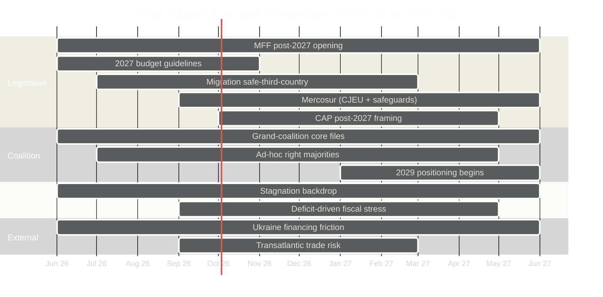
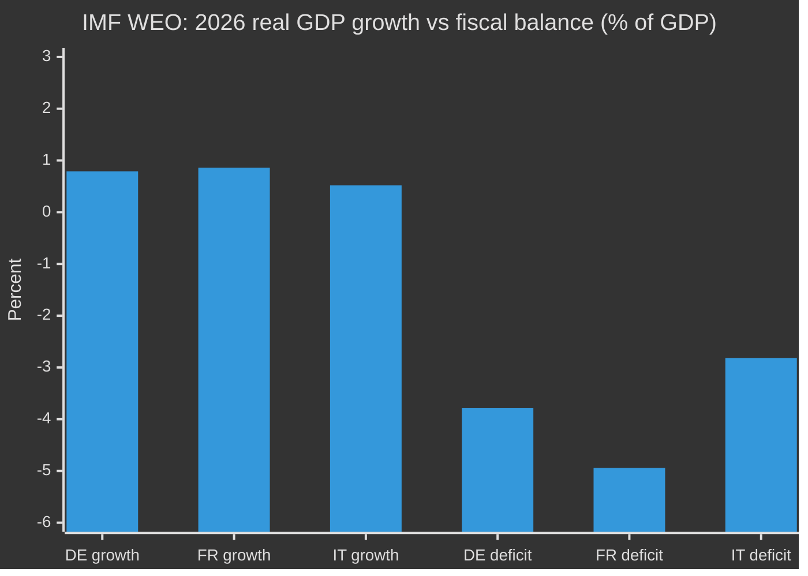
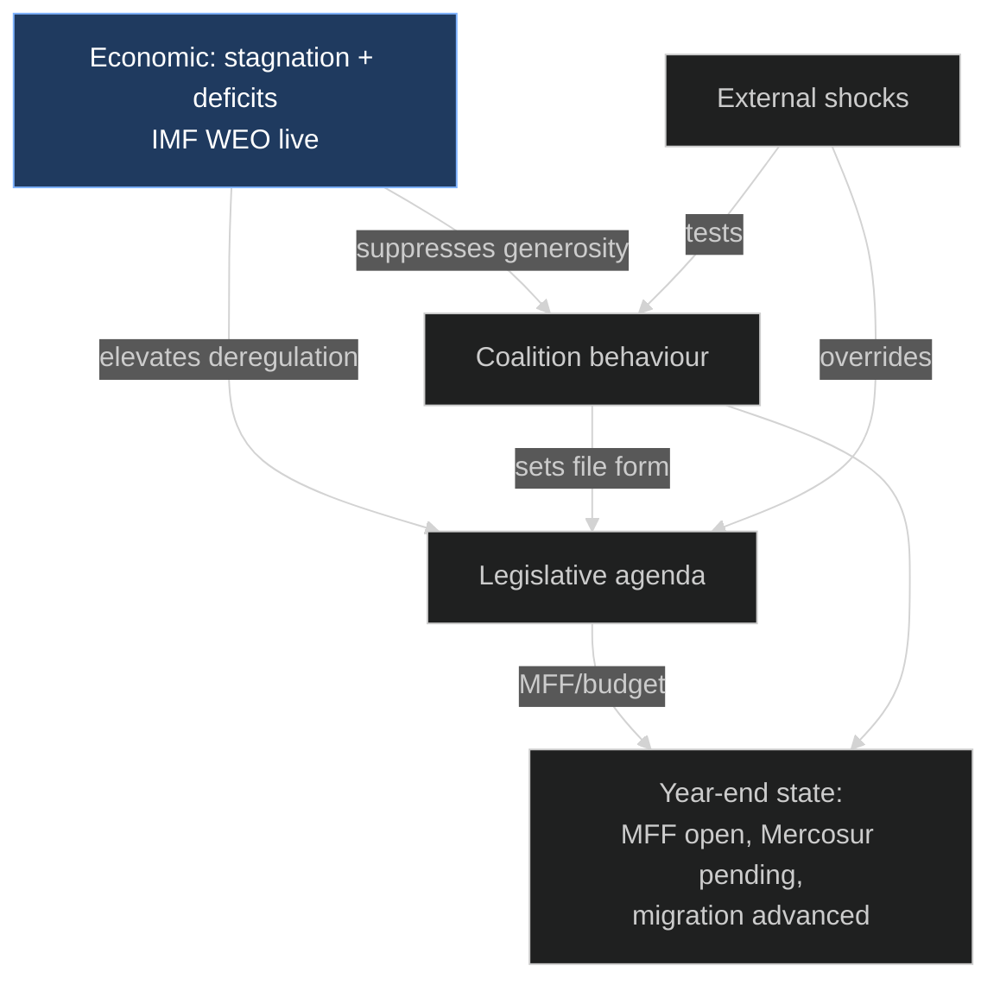

# Forward Projection — EU Parliament Year Ahead 2026-2027
**Date:** 2026-05-30 | **Horizon:** 2026-05-30 → 2027-05-30 (365 days) | **Article Type:** year-ahead
**Methodology:** Forward-projection framework across four dimensions (legislative · coalition · economic · external-shock) + WEP bands + Admiralty grading
**Data mode:** degraded-feeds — `/procedures-feed`, `/events-feed`, `/documents-feed` returned HTTP 404; `get_plenary_sessions` forward window empty; `monitor_legislative_pipeline` empty. Projection rests on the 51 adopted texts, live IMF WEO, and structural EP10 knowledge.

---

## Purpose and method

This artifact synthesises Stage-A collection into a single forward-facing projection over the twelve-month horizon, organised along **four dimensions**: legislative, coalition, economic and external-shock. It is the authoritative input to the article's predictive sections and to `parliamentary-calendar-projection.md` and `legislative-pipeline-forecast.md`. Where live procedural feeds are unavailable (404 this run), projections are explicitly downgraded in confidence and flagged. Each dimension closes with a WEP-banded judgement and an Admiralty grade.

---

## Geopolitical and institutional baseline (May 2026)

1. **Ukraine:** active conflict continues; financing via immobilised Russian assets is the live mechanism. No ceasefire assumed in base case (🟡 MEDIUM, ~60% no-ceasefire).
2. **Transatlantic:** US-administration trade posture uncertain; selective cooperation with episodic tariff friction. 🟡 MEDIUM.
3. **Macro:** IMF WEO live (vintage 2025-09-23) shows low-growth core — German real GDP growth of 0.79% in 2026, France 0.86%, Italy 0.52%. 🟢 HIGH (data).
4. **Energy:** post-2022 diversification largely complete; prices elevated but stable absent a shock. 🟡 MEDIUM.
5. **Institutional:** von der Leyen II Commission; Roberta Metsola (EPP) EP President; Council trio Cyprus (H1-2026) → Ireland (H2-2026) → Lithuania (H1-2027) → Greece (H2-2027), the latter 🟡 MEDIUM/unverified this run.
6. **Enlargement:** Ukraine, Moldova and Western Balkans accession-chapter momentum tempered by unanimity blocks. 🟡 MEDIUM.

---

## Projection overview

---

## Dimension 1 — Legislative projection

### 1.1 Cluster: Fiscal architecture (🔴 HIGH momentum, HIGH stakes)
- **MFF post-2027 opening** — the dominant file of the year. Net-contributor vs cohesion tension; defence "readiness 2030" and Ukraine reconstruction layered on. Projection: **opened, framed, not closed** within horizon. WEP: Almost Certain (opening); Highly Unlikely (closure).
- **2027 EU budget guidelines** — adopted in the autumn cycle; the proxy battle for MFF positions. WEP: Likely (on-schedule adoption).
- **European Globalisation Adjustment Fund** — Audi Brussels, Tupperware cases signal deindustrialisation pressure; expect further EGF mobilisations. WEP: Likely.
- **Output estimate:** 1 framework opening + 2-3 budget/own-resources instruments. 🟡 MEDIUM confidence (feed outage clouds velocity).

### 1.2 Cluster: Trade and agriculture (🔴 HIGH controversy)
- **EU–Mercosur** — CJEU opinion sought + agricultural safeguards. Projection: pending or contested; a consent vote within horizon is Roughly Even Chance.
- **CAP post-2027 reform** — framing begins; production-support vs conditionality fight. WEP: Likely (framing); Unlikely (adoption in horizon).
- **Livestock / agriculture sector files** — farmer-protest-sensitive. 🟡 MEDIUM.
- **Output estimate:** 0-1 trade consent + CAP framing reports. 🟡 MEDIUM.

### 1.3 Cluster: Migration and home affairs (🔴 HIGH controversy)
- **"Safe third country" recast** of the Asylum Procedure Regulation — the file most exposed to an EPP+ECR+PfE majority. WEP: Likely (advances); Roughly Even Chance (hard-form adoption).
- **Output estimate:** 1 recast + implementation decisions. 🟡 MEDIUM.

### 1.4 Cluster: Financial stability and digital (🟡 MEDIUM-HIGH momentum)
- **Banking-union deepening**; ECB appointments + ECB Annual Report 2025 — institutional, grand-coalition files. WEP: Likely.
- **DMA / DSA enforcement** ramp-up against gatekeepers; AI strategy for trade. WEP: Almost Certain (enforcement continues).
- **Output estimate:** 2-3 acts/resolutions + enforcement decisions. 🟢 HIGH (direction); 🟡 MEDIUM (pace).

### 1.5 Cluster: Cohesion and society (🟡 MEDIUM)
- **Affordable-housing** first own-initiative + Commission action plan — resolution-level, not binding. WEP: Likely (resolution); Highly Unlikely (instrument).
- **EU Electoral Act reform** — EP position advances; Council unanimity blocks adoption. WEP: Likely (position); Unlikely (adoption).
- **Better Law-Making / competitiveness "omnibus"** deregulation — continues. WEP: Likely.
- **Output estimate:** 2-3 own-initiative reports + omnibus items. 🟡 MEDIUM.

### Legislative judgement
🟡 **MEDIUM | WEP: Likely.** Parliament sustains a substantively rich agenda but the *fiscal* files dominate and resolve slowly; *trade* and *migration* files carry the highest rupture risk. **Admiralty: B2** (substance, adopted-texts grounded); **D4** (procedural sequencing, feed-outage degraded).

---

## Dimension 2 — Coalition projection

The defining behavioural feature of EP10 — the **EPP dual-majority** — persists and likely deepens. The grand coalition (EPP–S&D–Renew ~401) governs institutional and budget files; ad-hoc right majorities (EPP+ECR+PfE) recur on migration, environment and agriculture.

| Coalition mode | Files | Frequency projection | WEP |
|----------------|-------|----------------------|-----|
| Grand coalition (EPP-S&D-RE) | MFF, budget, banking, Ukraine | Default on institutional | Almost Certain |
| Ad-hoc right (EPP+ECR+PfE) | migration, env-rollback, agriculture | Recurring, rising | Likely |
| Left-leaning (EPP-S&D-RE-Green-Left) | housing, social, some climate | Occasional | Roughly Even Chance |
| Far-right-only (ECR+PfE+ESN) | symbolic resolutions only | Rare, non-binding | Unlikely |

**Partial-data caveat:** `compare_political_groups` returned only PfE=85, ECR=81, ESN=27 this run (parliamentaryBalance 0.61); other groups 0. Combined hard-right ≈187 vs 361 needed — governing-majority denial holds. **Admiralty: C3** (partial seat data, supplemented structurally at B2).

**2029 positioning** begins to colour behaviour from Q1 2027: as the term passes mid-point, groups harden identity for the next election, raising the salience of the EPP rightward-drift question (see `intelligence/scenario-forecast.md` Scenario B).

### Coalition judgement
🟡 **MEDIUM | WEP: Likely** that ad-hoc right majorities increase in frequency without displacing the grand coalition on institutional files. **Admiralty: C3.**

---

## Dimension 3 — Economic projection (IMF sole source)

All economic claims derive from **IMF WEO live SDMX, vintage 2025-09-23** (449 records; cache at `cache/imf/weo-ea-deu-fra-ita-gdp-inflation-fiscal.json`). IMF is the sole authority; no other economic source is cited.

### 3.1 Growth — stagnationary drift
- IMF projects **German real GDP growth of 0.79% in 2026** (up from 0.24% in 2025, rising to 1.18% in 2027).
- IMF projects **French real GDP growth of 0.86% in 2026** (0.93% in 2025; 0.88% in 2027).
- IMF projects **Italian real GDP growth of 0.52% in 2026** (0.54% in 2025; 0.50% in 2027).
- **Read-across:** with the three largest economies barely growing, the "competitiveness emergency" framing retains political primacy and the deregulatory "omnibus" gains oxygen. 🟢 HIGH.

### 3.2 Inflation — mild reflation in the core
- German average CPI inflation of **2.65% in 2026** (2.30% in 2025; easing to 2.30% in 2027).
- French inflation of **1.84% in 2026** (0.93% in 2025; 1.72% in 2027).
- Italian inflation of **2.64% in 2026** (1.63% in 2025; 2.36% in 2027).
- **Read-across:** mild reflation limits the space for expansionary social-investment arguments and keeps ECB normalisation cautious. 🟡 MEDIUM.

### 3.3 Fiscal — widening deficits constrain the MFF
- Germany's general-government fiscal balance of **-3.78% of GDP in 2026** (from -2.67% in 2025; worsening to -4.23% in 2027) — Germany breaches the 3% reference value.
- France's fiscal deficit of **-4.94% of GDP in 2026** (-5.11% in 2025; -4.79% in 2027) — sustained excessive-deficit territory.
- Italy's deficit of **-2.82% of GDP in 2026** (-3.11% in 2025; improving to -2.58% in 2027).
- **Read-across:** with France in deep deficit and Germany now breaching 3%, the net-contributor appetite for a larger MFF or own-resources expansion is structurally suppressed — the core mechanism behind `scenario-forecast.md` Scenario C (Fiscal Gridlock). 🟢 HIGH.

### Economic judgement
🟢 **HIGH (data) | WEP: Almost Certain** that stagnationary growth plus widening core deficits will suppress fiscal headroom and sharpen the competitiveness/deregulation agenda throughout the horizon. **Admiralty: A1** (IMF live).

---

## Dimension 4 — External-shock projection

| Shock vector | 12-mo probability | WEP | Impact | Monitoring trigger |
|--------------|-------------------|-----|--------|--------------------|
| Ukraine financing legal-basis collapse | ~25% | Unlikely | HIGH | CJEU/Council legal challenge to asset use |
| Ukraine major escalation | ~25% | Unlikely | HIGH | Front-line / mobilisation reports |
| Surprise Ukraine ceasefire | ~15% | Unlikely | TRANSFORMATIVE | Negotiation-track signals |
| Transatlantic tariff rupture | ~35% | Roughly Even Chance | HIGH | US trade-measure announcements |
| Energy-price spike | ~25% | Unlikely | HIGH | Middle East / Baltic infrastructure |
| Financial-stability event | ~15% | Unlikely | HIGH | Banking-union stress signals |

**Read-across:** the external-shock dimension is the principal route to `scenario-forecast.md` Scenario E (External-Shock Capture, 6%). Individually each vector is Unlikely-to-Roughly-Even; collectively the probability that *at least one* materially captures the agenda for a plenary cycle is meaningfully higher (~50%). 🟡 MEDIUM. **Admiralty: C3.**

### External judgement
🟡 **MEDIUM | WEP: Roughly Even Chance** that at least one external shock disrupts the planned legislative sequence for ≥1 plenary cycle, without (in the base case) derailing the year. **Admiralty: C3.**

---

## Cross-dimension interaction

The four dimensions are not independent; their interactions generate the year's characteristic dynamics.

- **Economic → Legislative.** Stagnation (German GDP +0.79%, Italian +0.52% in 2026, IMF WEO) elevates the competitiveness/deregulation agenda and starves the cohesion-vs-net-contributor truce. The economic dimension is the *prime mover* of the legislative mood. 🟢 HIGH.
- **Economic → Coalition.** Widening deficits (France -4.94%, Germany -3.78% of GDP) suppress net-contributor generosity, which raises the salience of the MFF cleavage and pushes the EPP toward fiscal-conservative positions that align it episodically with the ECR. 🟢 HIGH.
- **Coalition → Legislative.** The frequency of ad-hoc right majorities determines the *form* (not the existence) of migration, CAP and environmental files. 🟡 MEDIUM.
- **External → all.** A shock can override the other three for a plenary cycle (the Scenario-E pathway). 🟡 MEDIUM.

The diagram identifies the **economic dimension as the prime mover** (highlighted): it feeds both the legislative agenda and coalition behaviour, while external shocks act as an override channel. This is why the IMF figures, not the procedural feeds, anchor the projection's confidence.

---

## Leading-indicator calendar

To operationalise the projection, the following indicators should be sampled at the stated cadence. Each maps to a dimension and a confidence track.

| Indicator | Cadence | Dimension | What it discriminates |
|-----------|---------|-----------|-----------------------|
| EPP–ECR/PfE roll-call alignment % | monthly | coalition | A vs B (drift) |
| 2027 budget milestone adherence | per milestone | legislative/economic | A vs C (gridlock) |
| IMF WEO revision (next vintage) | per release | economic | confirms/breaks stagnation read |
| CJEU Mercosur signal | event | legislative | triggers D |
| Sovereign-spread moves (DE/FR/IT) | weekly | economic/external | financial-stability tail |
| Urgency-resolution volume | per plenary | external | E early-warning |
| Council trio handover (CY→IE) | event | institutional | tempo continuity |

The cadence column matters: the coalition and economic tracks are sampled frequently because they are the prime discriminants; the external track is event-driven because shocks are not periodic.

---

## Projection robustness check

A forward projection is only as good as its failure modes. Three explicit robustness checks:

1. **Feed-restoration check.** If the procedural feeds return next run, does the projection change? *Substance: no; sequencing: upgraded.* The projection is deliberately built so that restored feeds refine rather than overturn it. 🟢 HIGH.
2. **IMF-revision check.** If the next WEO vintage revises German 2026 growth materially downward, does the economic judgement hold? *Direction holds (stagnation); magnitude of fiscal stress increases* — pushing toward Scenario C. 🟡 MEDIUM.
3. **Coalition-surprise check.** If the EPP unexpectedly re-centres (alignment falls), does the coalition judgement hold? *Yes — the projection already treats grand-coalition dominance as the base case;* a re-centring strengthens it. 🟢 HIGH.

The projection is therefore **asymmetrically robust**: it is most exposed to a downward IMF revision (which it would absorb by shifting mass toward Scenario C), and least exposed to feed restoration or coalition re-centring.

---

## Quarter-by-quarter projection

### Q3 2026 (Jun–Aug)
- MFF post-2027 opening framing; 2027 budget guidelines first debate.
- DMA/DSA enforcement decisions; banking-union committee work.
- Recess August. Key tells: roll-call alignment; budget calendar adherence.

### Q4 2026 (Sep–Nov)
- 2027 budget guidelines adoption — the autumn pivot.
- Migration "safe third country" recast advances; Mercosur safeguard amendments.
- Most-critical-window risk: budget timetable slip (Scenario C tell).

### Q1 2027 (Dec–Feb)
- Commission Work Programme 2027; MFF negotiation deepens.
- CAP post-2027 framing; 2029-positioning behaviour emerges.
- Mercosur CJEU opinion plausible window opens.

### Q2 2027 (Mar–May)
- Mid-term EP10 stocktake; Electoral Act position consolidation.
- Mercosur consent (if opinion delivered); housing resolution.
- Horizon closes with MFF open, Mercosur pending/decided, migration recast advanced.

---

## Forward-projection confidence matrix

| Domain | Confidence | Rationale |
|--------|-----------|-----------|
| Economic baseline | 🟢 HIGH | IMF live WEO, A1 |
| Legislative substance | 🟡 MEDIUM | adopted-texts grounded; feed outage clouds velocity |
| Coalition behaviour | 🟡 MEDIUM | partial seat data (C3) + structural (B2) |
| Plenary sequencing | 🔴 LOW | forward calendar empty; feeds 404 |
| External shocks | 🟡 MEDIUM | inherently uncertain |

**Overall projection confidence: 🟡 MEDIUM** — substance and macro are firm; sequencing and velocity are degraded by the feed outage (see `intelligence/mcp-reliability-audit.md`).

---

## Admiralty Credibility Rating

**Source reliability:** A (economic, IMF live) / B (legislative substance) / C (coalition, partial) / F (procedural feeds, 404).
**Information reliability:** 1 (IMF) → 2 (adopted-texts substance) → 4 (12-month sequencing).
**Overall: A1** for the economic dimension; **B2** for near-term legislative substance; **C3** for coalition; **D4** for 12-month procedural sequencing.

---

## Projection-to-decision handoff

The projection earns its keep only if it tells a decision-maker where to look and when. The handoff table below maps each dimension to the single most decision-relevant observation in the year ahead.

| Dimension | Decision-relevant question | Best leading indicator | Confidence |
|-----------|---------------------------|------------------------|------------|
| Economic | Does stagnation deepen or stabilise? | next IMF WEO vintage vs +0.79% DE / +0.52% IT 2026 | 🟢 HIGH |
| Legislative | Does MFF framing slip into 2027? | Council conclusions, Q3-Q4 2026 | 🟡 MEDIUM |
| Coalition | Does an issue-bloc institutionalise? | named roll-calls on migration/environment | 🟡 MEDIUM |
| External | Does a trade or asset-financing shock land? | US trade measures; Council legal-service signals | 🟡 MEDIUM |

The single most valuable observation across all four dimensions is the **next IMF WEO vintage**: it anchors the economic baseline at A1 reliability and, through the cost-of-living channel, conditions the coalition and legislative dimensions as well. Watch it first.

---

*Forward projection constructed from EP `/adopted-texts` 2026 (51 texts), IMF WEO live (vintage 2025-09-23), and structural EP10 knowledge. Procedural feeds unavailable this run (HTTP 404) — sequencing claims carry an explicit degraded-confidence caveat. Economic claims observe the IMF-sole-source rule. WEP bands per ICD 203.*
