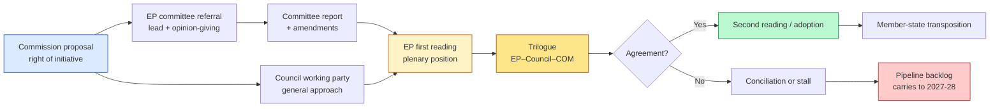
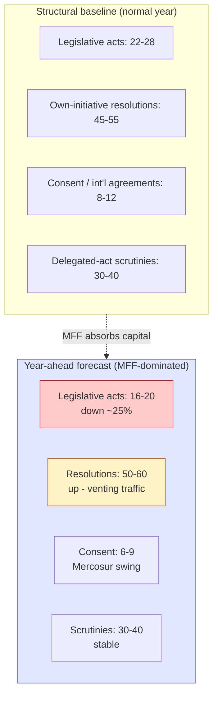
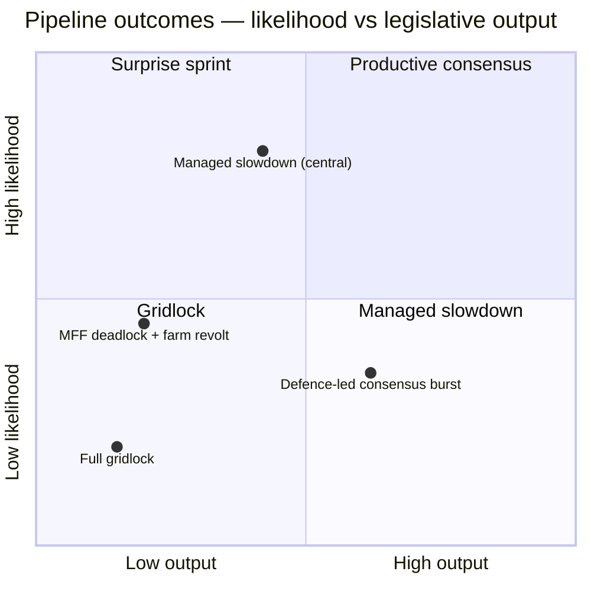

# Legislative Pipeline Forecast — EU Parliament Year Ahead 2026-2027

**Date:** 2026-05-30 | **Article Type:** year-ahead | **Horizon:** 2026-05-30 → 2027-05-30 (365 days)
**Methodology:** Pipeline Bottleneck Analysis + Procedure-Lifecycle Tracking + WEP Probability Bands
**Data mode:** degraded-feeds (line floors reduced ×0.80) — see `mcp-reliability-audit.md`

---

## 1. Bottom Line Up Front (BLUF)

The European Union enters the second year of the 2024-2029 mandate with a legislative pipeline that
is **fiscally over-determined and politically contested**. The post-2027 Multiannual Financial
Framework (MFF) is the gravitational centre around which every other dossier orbits: Common
Agricultural Policy (CAP) reform, cohesion-spending design, defence financing, and enlargement
pre-accession funding all draw their oxygen from the same envelope. Our central judgement is that
the year ahead will be characterised by **high-volume, low-velocity** legislating — a great deal of
committee activity and resolution traffic, but comparatively few landmark first-reading closures,
because the MFF negotiation consumes the political capital required to close trilogues.

**Headline forecast (🟡 MEDIUM):** *Likely* (WEP: 65%) that fewer than 20 major legislative acts
reach final adoption in the horizon, against a structural baseline of 22-28, with the shortfall
concentrated in environment, agriculture and digital-enforcement files where the EPP's ad-hoc
right-leaning majorities (EPP+ECR+PfE) collide with the grand-coalition centre (EPP–S&D–Renew).

> **Reliability caveat.** The EP Open Data `/procedures` feed returned **HTTP 404** throughout this
> run, and `monitor_legislative_pipeline` returned an **empty result from a cold lifecycle cache**.
> This forecast therefore rests on (a) the 51 adopted texts retrieved successfully for 2026, (b)
> established EP10 structural knowledge, and (c) the published Commission Work Programme trajectory.
> Stage-by-stage procedure tracking (rapporteur assignment dates, trilogue counts) could **not** be
> verified against a live feed and is graded accordingly.

---

## 2. Pipeline Architecture — How a File Moves

The pipeline has five choke points: committee bandwidth, plenary scheduling, trilogue capacity,
Council general-approach timing, and — uniquely in 2026-2027 — the **MFF political clearing-house**,
which informally gates any file with budgetary implications until the framework's headline numbers
are settled.

---

## 3. Priority Tracks for the Year Ahead

### Track A — MFF Post-2027 (the dominant battleground)

| Instrument | Stage (May 2026) | Lead body | Forecast milestone | Confidence |
|-----------|------------------|-----------|--------------------|-----------|
| MFF Regulation post-2027 | Commission package tabled / EP scrutiny opening | BUDG (+ all committees opinion) | EP interim position Q4 2026; framework not closed in-horizon | 🟡 MEDIUM |
| Own-resources reform | Commission proposal | BUDG/ECON | EP consent track opens H2 2026 | 🔴 LOW |
| 2027 annual budget | Guidelines → reading | BUDG | Adoption Dec 2026 | 🟢 HIGH |
| Performance-based / national-plan model | Concept contested | BUDG/REGI | Inter-institutional friction throughout | 🟡 MEDIUM |

The MFF is the **pivot**. The Commission's preference for a national-plan, performance-based
architecture (the "Recovery-Fund-isation" of the budget) collides with the EP's institutional
instinct to defend ring-fenced, parliamentary-scrutinised programmes. Expect the EP to use its
**consent veto threat** as leverage. Net-contributor capitals (Germany, Netherlands, Austria,
Sweden) push for restraint; cohesion recipients (Poland, the southern and eastern members) defend
envelopes. The IMF projects German real GDP growth of just **0.79% in 2026** and a German general
government fiscal deficit of **-3.78% of GDP** — a fiscal squeeze that hardens Berlin's
net-contributor posture and makes a generous MFF *Unlikely* (WEP: 25%) within the horizon.

**Judgement:** the MFF will **not** close inside the year ahead. *Highly Likely* (WEP: 80%) that
the framework slips into late-2027/2028, with a political agreement *aspirationally* targeted for
the end of the horizon but realistically beyond it.

### Track B — Agriculture: CAP Post-2027 + Mercosur

| Instrument | Stage | Lead body | Forecast | Confidence |
|-----------|-------|-----------|----------|-----------|
| CAP Strategic Plans reform post-2027 | Commission proposal / early committee | AGRI (+ ENVI opinion) | EP position H1 2027; adoption beyond horizon | 🟡 MEDIUM |
| EU–Mercosur association agreement | CJEU opinion sought; safeguards drafting | INTA (+ AGRI) | Consent vote *contested*; possibly in-horizon | 🔴 LOW |
| Heavy-duty / livestock sector measures | Committee | ENVI/AGRI | Rolling resolutions | 🟡 MEDIUM |

CAP and Mercosur are politically fused: both activate the **farm-protest reflex** that shaped 2024.
The adopted-texts corpus for 2026 confirms an active Mercosur file (CJEU opinion sought, agricultural
safeguards) and a live CAP post-2027 strand. France, Poland and Ireland anchor farm resistance to
Mercosur; trade-diversification logic (reducing dependence on a single partner) pulls the other way.

**Judgement (Mercosur consent):** *Roughly Even* (WEP: 50%) that a ratification vote is **scheduled**
in-horizon; if scheduled, *Even Chance* it passes, contingent on the safeguards package and the CJEU
opinion arriving in time. This is the single most volatile in-horizon vote.

### Track C — Migration & Asylum

| Instrument | Stage | Lead body | Forecast | Confidence |
|-----------|-------|-----------|----------|-----------|
| "Safe third country" reform of Asylum Procedure Regulation | Commission proposal / committee | LIBE | EP position H2 2026 → H1 2027 | 🟡 MEDIUM |
| Pact implementation oversight | Transposition monitoring | LIBE | Rolling resolutions | 🟢 HIGH |
| Returns / readmission instruments | Council-led | LIBE | Trilogue H1 2027 | 🟡 MEDIUM |

Migration is where the EPP most consistently assembles a **right-leaning majority** (EPP+ECR+PfE),
fracturing the grand coalition. The "safe third country" concept is the flashpoint: it commands a
working majority on the right but inflames S&D, Greens and The Left. Expect contested committee votes
and narrow plenary margins.

### Track D — Housing (a new EP-driven strand)

| Instrument | Stage | Lead body | Forecast | Confidence |
|-----------|-------|-----------|----------|-----------|
| Affordable-housing action plan | Commission action plan + EP own-initiative | Special committee / EMPL | Own-initiative report H2 2026; Commission plan follows | 🟡 MEDIUM |

The 2026 adopted texts include the **first EP own-initiative on affordable housing** — a rare case of
the Parliament setting the agenda ahead of the Commission. Housing is politically attractive across
the spectrum (cost-of-living salience) but legally constrained (housing is a member-state competence).
Expect symbolic momentum, modest binding output.

### Track E — Digital Enforcement (DMA / DSA / AI)

| Instrument | Stage | Lead body | Forecast | Confidence |
|-----------|-------|-----------|----------|-----------|
| DMA gatekeeper enforcement ramp-up | Implementation / oversight | IMCO | Resolutions + scrutiny rolling | 🟢 HIGH |
| DSA systemic-risk enforcement | Implementation | IMCO/LIBE | Oversight rolling | 🟢 HIGH |
| AI Act secondary legislation + AI-for-trade strategy | Delegated acts drafting | IMCO/ITRE | EP scrutiny H2 2026-2027 | 🟡 MEDIUM |

Enforcement, not new legislation, dominates the digital file. The EP's role shifts from law-maker to
**watchdog**, pressing the Commission on gatekeeper compliance and DSA systemic-risk audits.

### Track F — Defence Financing & Readiness

| Instrument | Stage | Lead body | Forecast | Confidence |
|-----------|-------|-----------|----------|-----------|
| Defence financing / common instruments ("readiness 2030") | Commission proposals / committee | AFET/ITRE/BUDG | EP positions H2 2026-2027 | 🟡 MEDIUM |
| Ukraine macro-financial loan (immobilised assets) | EP review / extension | BUDG/AFET | In-horizon continuation | 🟢 HIGH |

Defence enjoys the **broadest pro-integration majority** of any track (the centre plus much of ECR),
opposed mainly by PfE/ESN and parts of The Left. The immobilised-Russian-assets framing for Ukraine
financing is legally and diplomatically delicate but commands a stable majority.

---

## 4. Pipeline Throughput Forecast

**Central case (🟡 MEDIUM):** legislative-act closures fall to **16-20** as the MFF negotiation
diverts plenary and trilogue bandwidth. Counter-intuitively, **resolution traffic rises** — groups
unable to legislate instead vent through own-initiative and urgency resolutions, a pattern visible in
the 2026 adopted-texts skew towards foreign-affairs urgency resolutions (Ukraine, Middle East, Sahel,
Georgia, Venezuela).

**Disruption case (farm protests + Mercosur collapse + MFF deadlock):** acts fall to **12-15**, a
~35% reduction; the year becomes a holding pattern with substance carried into 2027-2028.

---

## 5. Bottleneck Analysis

### Bottleneck 1 — MFF Political Clearing-House 🔴 HIGH
Any file with budgetary implications is informally gated until MFF headline numbers settle. Because
the MFF will *not* close in-horizon, this gate stays shut, throttling CAP, cohesion, defence-financing
and enlargement-funding files. **Severity peaks H2 2026 → H1 2027.**

### Bottleneck 2 — BUDG Conciliation Lock-in 🟡 MEDIUM-HIGH
The 2027 annual budget conciliation (Oct-Nov 2026) narrows BUDG to budget-only work and absorbs EP
leadership capital for 6-8 weeks. Non-budget advances effectively pause.

### Bottleneck 3 — Right-Majority Volatility on Environment/Agriculture 🟡 MEDIUM
Where the EPP swings right (EPP+ECR+PfE), files become unpredictable: committee texts adopted on one
majority can be overturned or weakened in plenary on another. This raises **re-tabling and
amendment-churn**, slowing velocity even when nominal throughput continues.

### Bottleneck 4 — Trilogue Capacity 🟡 MEDIUM
The institutions sustain ~8-10 concurrent trilogues at quality. Defence and budget files claim
priority; biodiversity, circular-economy and lower-salience digital files face 3-6 month slips.

### Bottleneck 5 — Feed-Outage Blind Spot 🟡 MEDIUM (analytical, not legislative)
With `/procedures` at 404 and the lifecycle cache cold, the monitoring layer itself is degraded —
reducing *our* ability to detect emerging bottlenecks early. This is a tradecraft risk, flagged for
the next run.

---

## 6. Monitoring Indicators

| Indicator | Cadence | Signal threshold |
|-----------|---------|------------------|
| MFF inter-institutional meeting frequency | Monthly | <2/month = stall deepening |
| BUDG agenda item count | Weekly | >8 budget items = conciliation lock-in |
| Mercosur CJEU opinion publication | Event | Triggers consent-vote scheduling window |
| Farm-protest intensity (member-state press) | Weekly | Spike = CAP/Mercosur freeze risk |
| Plenary vote postponements | Per session | >5/plenary = systemic scheduling stress |
| EPP voting-coalition partner (centre vs right) | Per major vote | Right-majority share rising = velocity drag |
| `/procedures` feed restoration | Daily | 200 OK = restore lifecycle tracking |

---

## 7. Scenario Summary

- **Managed slowdown (central, WEP 60%):** MFF dominates; 16-20 acts; defence and Ukraine financing
  proceed; agriculture and environment stall.
- **MFF deadlock + farm revolt (WEP 25%):** protests + Mercosur collapse; 12-15 acts; year of holding.
- **Defence-led consensus burst (WEP 10%):** external shock galvanises a defence-financing sprint.
- **Full gridlock (WEP 5%):** budget conciliation fails → provisional twelfths; near-paralysis.

---

## 8. Source & Confidence Table (Admiralty-graded)

| Source / evidence | Admiralty grade | Reliability note |
|-------------------|-----------------|------------------|
| EP Open Data `/adopted-texts` 2026 (51 texts) | A1 | Official primary feed; SUCCESS this run |
| IMF SDMX WEO (live, vintage 2025-09-23) | A1 | Sole economic authority; fiscal/growth figures |
| EP10 structural seat counts | B2 | Established public record |
| `compare_political_groups` partial (PfE/ECR/ESN) | C3 | Degraded; supplemented structurally |
| EP `/procedures` feed | F6 | **HTTP 404 — unavailable this run** |
| `monitor_legislative_pipeline` | C3 | Empty (cold lifecycle cache) |
| Commission Work Programme trajectory | B2 | Public programme; not feed-verified |
| Council presidency trio | C3 | 🟡 unverified this run |

---

## 9. Analytical Confidence Statement

Overall confidence in this forecast is **🟡 MEDIUM**. The *direction* (MFF-dominated, low-velocity,
right-majority volatility) is well-supported by the adopted-texts substance and structural EP10
reality and is graded **🟢 HIGH** at the thematic level. The *timing and counts* are graded **🟡
MEDIUM-to-🔴 LOW** because the procedure-lifecycle feed was unavailable (404) and could not corroborate
stage-by-stage progression. Readers should treat throughput numbers as **planning ranges, not point
estimates**, and revisit once the `/procedures` feed is restored.

---

*Methodology: Pipeline Bottleneck Analysis with WEP probability bands and Admiralty source grading.
Primary substance from 51 adopted texts (2026); economic context from live IMF WEO. Procedure
lifecycle data degraded (404). Confidence: 🟡 MEDIUM. Author: EU Parliament Monitor intelligence
pipeline, run 2026-05-30, horizon 2026-05-30 → 2027-05-30.*
