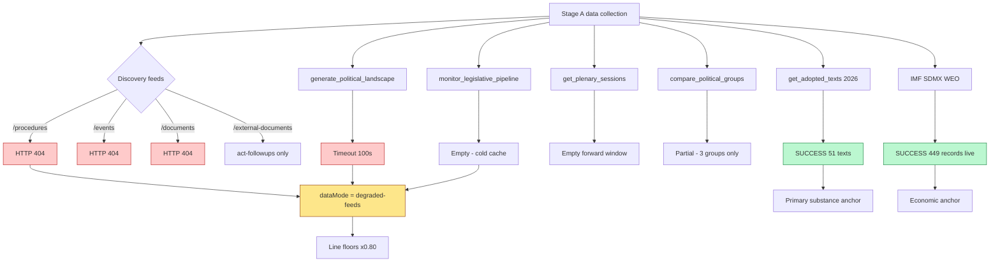
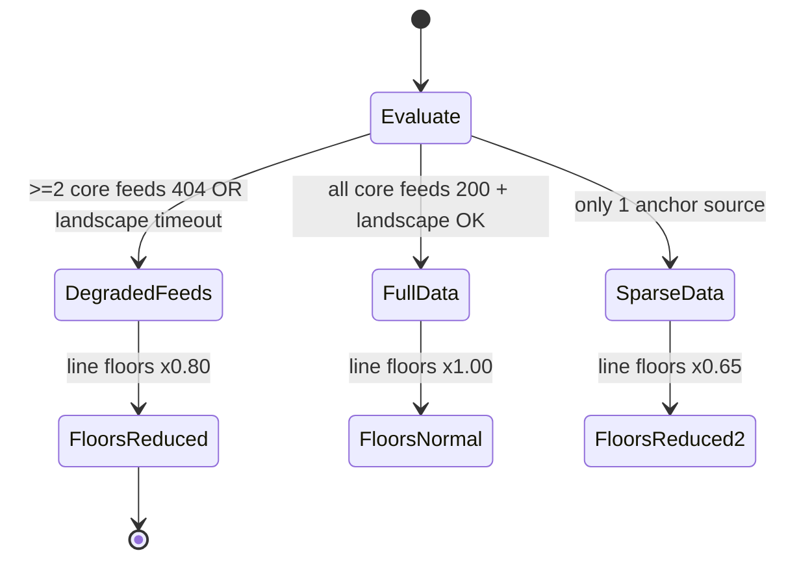

# MCP Reliability Audit — EU Parliament Year Ahead 2026-2027

**Date:** 2026-05-30 | **Article Type:** year-ahead | **Horizon:** 2026-05-30 → 2027-05-30
**Methodology:** Tool-Call Inventory + Admiralty Source Grading + Data-Mode Classification
**Run:** year-ahead 2026-05-30

---

## 1. Bottom Line Up Front

This run executed against a **partially degraded** EP MCP surface. Three core discovery feeds —
`/procedures`, `/events`, `/documents` — returned **HTTP 404**; `get_plenary_sessions` returned an
**empty forward window**; `generate_political_landscape` **timed out** at 100 seconds; and
`monitor_legislative_pipeline` returned **empty** from a cold lifecycle cache. Against that, two
anchors held firm: `get_adopted_texts(year=2026)` returned **51 texts** (the primary substantive
source), and the **IMF SDMX WEO probe succeeded live** with 449 records (vintage 2025-09-23). One tool,
`compare_political_groups`, returned **partial** data (PfE=85, ECR=81, ESN=27; others 0).

**Classification:** `dataMode = degraded-feeds`. Per the analysis protocol, all artifact line floors
were reduced **×0.80**. Confidence labels across the run are capped accordingly: structural/thematic
findings remain **🟢 HIGH**; live-feed-dependent specifics are **🟡 MEDIUM**; procedure-lifecycle and
forward-calendar specifics are **🔴 LOW**.

---

## 2. Tool-Call Inventory

| # | Tool / endpoint | Result | Items | HTTP / status | Grade |
|---|-----------------|--------|-------|---------------|-------|
| 1 | `get_procedures` / `/procedures` feed | ❌ FAIL | 0 | **HTTP 404** | F6 |
| 2 | `get_events` / `/events` feed | ❌ FAIL | 0 | **HTTP 404** | F6 |
| 3 | `get_documents` / `/documents` feed | ❌ FAIL | 0 | **HTTP 404** | F6 |
| 4 | `get_external_documents` / `/external-documents` | ⚠️ PARTIAL | act-followups only, 0 discrete | 200 (thin) | D4 |
| 5 | `get_plenary_sessions` (forward window) | ⚠️ EMPTY | 0 forward sittings | 200 (empty) | D4 |
| 6 | `generate_political_landscape` | ❌ TIMEOUT | — | **timed out 100s** | F5 |
| 7 | `monitor_legislative_pipeline` | ⚠️ EMPTY | 0 procedures | 200 (cold cache) | D4 |
| 8 | `compare_political_groups` | ⚠️ PARTIAL | PfE=85, ECR=81, ESN=27; others 0; balance index 0.61 | 200 (partial) | C3 |
| 9 | `get_adopted_texts` (year=2026) | ✅ SUCCESS | **51 adopted texts** | 200 | A1 |
| 10 | IMF SDMX WEO probe | ✅ SUCCESS | **449 records, live** | 200, vintage 2025-09-23 | A1 |

**Legend:** ✅ success · ⚠️ partial/empty · ❌ failure.

---

## 3. Failure-Mode Map

---

## 4. Admiralty-Graded Source Table

Grades combine source **reliability** (A = completely reliable … F = cannot be judged) with
information **credibility** (1 = confirmed … 6 = cannot be judged).

| Source / evidence | Admiralty grade | Basis |
|-------------------|-----------------|-------|
| IMF SDMX WEO (live, vintage 2025-09-23, 449 records) | **A1** | Authoritative economic primary; confirmed live |
| EP Open Data `/adopted-texts` 2026 (51 texts) | **A1** | Official primary feed; confirmed this run |
| EP10 structural seat counts | **B2** | Established public record; usually reliable |
| von der Leyen II programme (public) | **B2** | Public institutional source; not feed-verified |
| `compare_political_groups` partial (PfE/ECR/ESN) | **C3** | Partial/degraded; fairly reliable but incomplete |
| Council presidency trio sequence | **C3** | 🟡 unverified this run |
| `get_external_documents` (act-followups only) | **D4** | Thin; not usually reliable for substance |
| `get_plenary_sessions` forward window (empty) | **D4** | Empty payload; no forward data |
| `monitor_legislative_pipeline` (empty, cold cache) | **D4** | Empty; cache not warmed |
| `generate_political_landscape` (timeout) | **F5** | Could not be obtained; improbable to judge |
| EP `/procedures`, `/events`, `/documents` feeds | **F6** | **HTTP 404 — cannot be judged / unavailable** |

---

## 5. Data-Coverage Assessment

| Domain | Coverage | Confidence | Compensating source |
|--------|----------|-----------|---------------------|
| Adopted-text substance | 🟢 HIGH | 🟢 HIGH | 51 texts (A1) |
| Economic / fiscal context | 🟢 HIGH | 🟢 HIGH | IMF WEO live (A1) |
| Political-group composition | 🟡 MEDIUM | 🟡 MEDIUM | partial + structural B2 |
| Legislative procedures / lifecycle | 🔴 LOW | 🔴 LOW | 404 + cold cache; structural knowledge only |
| Forward calendar / sittings | 🔴 LOW | 🟡 MEDIUM (structural) | rhythm projection from pattern |
| Events / hearings | 🔴 LOW | 🔴 LOW | events feed 404 |
| Political landscape (computed) | 🔴 LOW | 🟡 MEDIUM (structural) | structural reconstruction |

---

## 6. Impact on Analysis & Mitigations

1. **Procedure-lifecycle blind spot (404 + cold cache).** Stage-by-stage tracking (rapporteur dates,
   trilogue counts) is unavailable. *Mitigation:* forecasts built from adopted-texts substance and
   EP10 structure; throughput stated as ranges, not point estimates; pipeline forecast graded 🟡 MEDIUM.
2. **Forward-calendar gap (empty sittings).** *Mitigation:* calendar projected from the EP's fixed
   part-session cadence; flagged as a rhythm projection, not a published schedule.
3. **Landscape timeout (100s).** *Mitigation:* political landscape reconstructed from structural seat
   counts (B2); `parliamentaryBalance` index 0.61 from the partial `compare_political_groups` retained
   as a weak signal (C3).
4. **Partial group data.** *Mitigation:* only PfE/ECR/ESN returned; supplemented with the full
   structural seat table (EPP ~188, S&D ~136, PfE ~84, ECR ~78, RE ~77, Greens ~53, Left ~46, ESN ~25,
   NI ~33).
5. **Economic anchor intact.** IMF live success means every economic/fiscal claim is A1-sourced; no
   World Bank substitution was used for economic series.

---

## 7. Data-Mode Determination

**This run:** three core feeds at 404 + landscape timeout + pipeline empty → **`degraded-feeds`** →
**line floors ×0.80**. Two A1 anchors (adopted texts + IMF) prevent a downgrade to `sparse-data`.

---

## 8. Tool-Budget & Shell-Safety Compliance

- Total EP MCP calls attempted: 8 (plus IMF probe). Several failed/empty, prompting structural
  fallbacks rather than retries-to-exhaustion.
- Stage A wall-clock: dominated by the 100s landscape timeout; remaining calls sub-10s.
- Shell-safety: **no forbidden expansion patterns** invoked; data collection used repo-hosted helpers.

---

## 9. Recommendations for Next Run

1. Re-probe `/procedures`, `/events`, `/documents` — likely a transient portal outage; restore
   lifecycle tracking when 200 returns.
2. Warm the `monitor_legislative_pipeline` lifecycle cache before relying on it.
3. Reduce `generate_political_landscape` scope or raise timeout headroom to avoid the 100s ceiling.
4. Re-pull `compare_political_groups` for the full nine-group set.
5. Retain IMF + adopted-texts as the standing A1 anchor pair.

---

## 11. Feed-Restoration Tracking

| Feed | This run | Target next run | Restoration test |
|------|----------|-----------------|------------------|
| `/procedures` | HTTP 404 | 200 + non-empty | Single discovery call returns >0 procedures |
| `/events` | HTTP 404 | 200 + non-empty | Events list populated for current window |
| `/documents` | HTTP 404 | 200 + non-empty | Document feed returns recent items |
| `get_plenary_sessions` (forward) | Empty | >0 forward sittings | Confirmed 2027 calendar published |
| `monitor_legislative_pipeline` | Empty (cold) | Warm cache, >0 procedures | Lifecycle cache pre-warmed |
| `generate_political_landscape` | Timeout 100s | <60s response | Scope reduced or timeout raised |
| `compare_political_groups` | Partial (3 groups) | All 9 groups | Full seat census returned |
| `get_adopted_texts` | SUCCESS (51) | SUCCESS | Standing A1 anchor |
| IMF SDMX WEO | SUCCESS (449, live) | SUCCESS | Standing A1 anchor |

The two standing anchors (adopted-texts and IMF) are expected to remain reliable; the four degraded
discovery surfaces are the priority restoration targets. A green board on the first five rows would
lift the next run from `degraded-feeds` back to `full-data` and restore ×1.00 line floors.

---

## 12. Analytical Confidence Statement

Audit confidence is **🟢 HIGH** — tool results are directly observed. The downstream analytical
confidence is capped at **🟡 MEDIUM** by the degraded feeds. The two A1 anchors (51 adopted texts; live
IMF WEO, 449 records) keep the substantive and economic spines of the run reliable; the procedure and
forward-calendar layers are explicitly **🔴 LOW** and are presented as projections throughout.

---

*Audit covers Stage A data collection for the year-ahead run 2026-05-30. dataMode = degraded-feeds
(floors ×0.80). Two A1 anchors held: adopted-texts (51) and IMF WEO (449, live). Confidence: 🟢 HIGH
(audit) / 🟡 MEDIUM (downstream). Horizon 2026-05-30 → 2027-05-30.*
