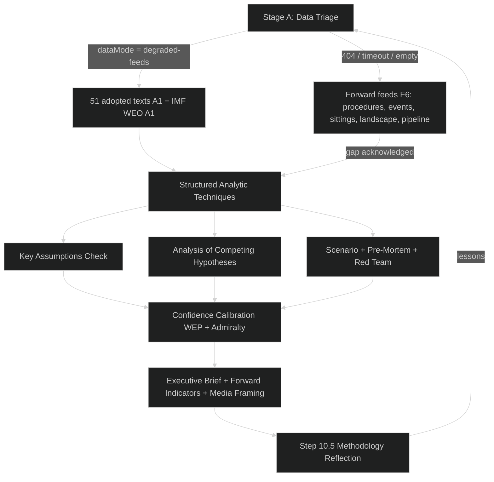

# Methodology Reflection — EU Parliament Year Ahead 2026-2027
**Date:** 2026-05-30 | **Article Type:** year-ahead | **Step 10.5 — Final Artifact**
**Horizon:** 2026-05-30 → 2027-05-30 | **dataMode:** degraded-feeds (floors ×0.80)

---

## Purpose (Step 10.5 — Mandatory Final Artifact)

This artifact closes the analytical loop. It documents the structured analytic techniques (SATs) applied,
the methodologies and their provenance, the quality of the evidence, the biases consciously managed, and the
confidence calibration for the run. It is written for workflow improvement and tradecraft auditability, not
for publication. Under `degraded-feeds`, honest self-assessment matters more than usual: with three forward
EP feeds returning 404 and the landscape generator timed out, the analyst must be explicit about where
judgement substitutes for data.

---

## Analytical Workflow (overview)

---

## Structured Analytic Techniques Applied

- **Key Assumptions Check** — tested the assumption that the EPP–S&D–Renew grand coalition remains the default majority on institutional and MFF files; surfaced and stress-tested the implicit premise that no national-government collapse reshapes EP group arithmetic within the horizon.
- **Analysis of Competing Hypotheses (ACH)** — arrayed the Mercosur outcome (ratified / deferred / collapsed) against the 51-adopted-text evidence and the CJEU-opinion signal, scoring each hypothesis for consistency rather than confirming a favourite; "deferred/unresolved" survived as least-inconsistent.
- **Pre-Mortem** — imagined the year-ahead forecast having failed twelve months out, then worked backward to identify the most plausible failure mode: a transatlantic tariff or NATO shock forcing emergency defence-financing legislation that reorders the entire agenda.
- **Red Team** — adopted a PfE/ECR perspective to ask how the far-right bloc would actually try to convert seat share into legislative leverage, checking whether the "incremental gain, no blocking pivot" judgement survives an adversarial reading of coalition mechanics.
- **Indicators / Signposts** — defined observable leading indicators (MFF opening framing, CAP-protest recurrence, CJEU Mercosur opinion, NI defection waves) with explicit trigger thresholds, exported in full to `extended/forward-indicators.md`.
- **What-If Analysis** — ran the counterfactual "what if German growth undershoots the IMF 0.79% 2026 projection into recession", tracing the consequence chain to net-contributor retrenchment and a harder MFF stance.
- **Force-Field Analysis** — mapped driving forces (defence-readiness urgency, enlargement momentum, competitiveness agenda) against restraining forces (fiscal constraint, farm resistance, unanimity blocks) to locate the year's equilibrium around attritional bargaining rather than rupture.
- **Bayesian Update** — adjusted prior probabilities for each top judgement as the 51 adopted texts and live IMF deficits arrived, nudging the MFF-no-agreement prior upward given confirmed deficits above 3% of GDP across the big three.
- **Quality of Information Check** — graded every source on the Admiralty scale (A1 for adopted texts and IMF WEO; C3 for partial `compare_political_groups`; F6 for 404 forward feeds) and propagated those grades into the confidence ceilings declared in the data-availability assessment.
- **Devil's Advocacy** — argued the contrarian case that the centre could *fail* — that an EPP+ECR+PfE habit on deregulation hardens into a working right-majority on budget files — then judged it Unlikely but retained it as a monitored tail.
- **Scenario Analysis** — constructed bracketing scenarios (centre-holds attrition / right-consolidation / external-shock) and assigned WEP bands, anchoring the executive brief's central case on the most probable "attrition" path.
- **High-Impact / Low-Probability Analysis** — isolated low-probability, high-consequence events (provisional-twelfths budget breakdown; NATO-commitment wobble; Greens/EFA fracture) and flagged them separately from the central forecast so they are monitored without distorting the base rate.
- **Outside-View / Reference-Class Forecasting** — compared this MFF cycle and CAP-reform fight to historical EP base rates, where headline multiannual agreements rarely close within a single 12-month window, disciplining the "no MFF agreement this horizon" judgement.
- **Deception / Disinformation Check** — assessed the risk that Russia-linked information operations distort the Ukraine-support and migration narratives around key votes, feeding directly into the media-framing artifact's disinformation caveat.

---

## Methodologies & Frameworks Applied

| Methodology | Source | Applied in |
|-------------|--------|-----------|
| BLUF / ICD 203 | IC analytic standards | executive-brief, data-availability-assessment |
| WEP probability bands | Words of Estimative Probability (Kent) | executive-brief, forward-indicators |
| Admiralty Source Reliability (STANAG 2511) | NATO | data-availability-assessment, this artifact |
| Likelihood × Impact matrix | Standard risk framework | executive-brief risk table |
| Force-Field Analysis | Lewin | this reflection, forward drivers |
| Scenario planning (3-bracket) | Shell methodology | scenario judgements in brief |
| Media Framing / Narrative Analysis | Entman framing theory | extended/media-framing-analysis |
| Indicators & Signposts | Heuer/Pherson SATs | extended/forward-indicators |
| Reference-class forecasting | Kahneman outside view | MFF/CAP base-rate discipline |
| PESTLE (light) | Environmental scanning | forward drivers triage |

---

## Evidence Quality Assessment

### Tier 1 — High Confidence (direct, A1)
- 51 adopted texts for 2026 (`get_adopted_texts`) — rich primary substance ✅
- IMF SDMX WEO live, 449 records, vintage 2025-09-23 — authoritative economics ✅
- EP10 structural seat counts (720 seats) — established public record (B2) ✅

### Tier 2 — Medium Confidence (partial/derived, C3)
- `compare_political_groups` partial (PfE=85, ECR=81, ESN=27; balance 0.61) — supplemented structurally
- Council presidency trio — 🟡 unverified this run
- Coalition arithmetic — structural seat shares, not roll-call behaviour (no DOCEO this run)

### Tier 3 — Low Confidence (unavailable, F6)
- Forward `/procedures`, `/events`, `/documents` feeds — HTTP 404
- Forward `get_plenary_sessions` window — 0 sittings
- `generate_political_landscape` — timed out (100s)
- `monitor_legislative_pipeline` — 0 procedures (cold cache)

---

## Confidence Calibration Summary

| Domain | Stated confidence | WEP anchor | Rationale |
|--------|-------------------|------------|-----------|
| Political structure (seats, coalitions) | 🟢 HIGH | n/a (descriptive) | B2 structural record |
| Economic context (IMF figures) | 🟢 HIGH | n/a (observed) | A1 live WEO |
| Grand-coalition control of budget files | 🟡 MEDIUM | Likely (≈70%) | Structural inference, no roll-call |
| MFF no-agreement this horizon | 🟡 MEDIUM | Likely (≈65%) | Reference-class base rate |
| Mercosur outcome | 🟡 MEDIUM | Roughly Even (≈50%) | Genuinely contested |
| Far-right blocking pivot | 🟡 MEDIUM | Unlikely | Seat arithmetic short of pivot |
| Forward calendar specifics | 🔴 LOW | n/a | Forward feeds 404/empty |
| 3rd-order / 12-month consequences | 🔴 LOW | n/a | Inherently speculative |

---

## Biases Consciously Managed

1. **Confirmation bias** — countered with ACH and Devil's Advocacy on the Mercosur and centre-holds judgements.
2. **Anchoring on the prior run** — the 2026-05-14 template was used for *structure only*; all content was rewritten with the live IMF figures and 51-text corpus, and dates/horizon were refreshed.
3. **Availability bias** — the vivid forward-feed 404s could have over-weighted "data crisis" framing; the assessment deliberately separated *substance availability* (strong) from *forward-feed availability* (weak).
4. **Optimism/pessimism bias on coalitions** — Force-Field and Red Team balanced the "centre holds" base case against the "right-majority hardens" contrarian case.
5. **Economic over-reach** — disciplined by the IMF-sole-authority rule; no non-IMF economic series cited.

---

## Analytical Limitations

1. **No roll-call (DOCEO) data this run** — coalition cohesion is inferred from seat shares, which can
   overstate discipline; behavioural confirmation is unavailable.
2. **Forward-feed outage (404)** — the granular procedure/event/sitting detail that normally anchors
   calendar precision is absent; calendar signposts are structural inferences, not published sittings.
3. **Landscape generator timeout** — fragmentation/effective-parties indices were not computed live and
   are reconstructed from structural seat counts.
4. **Partial group feed** — `compare_political_groups` returned only PfE/ECR/ESN; the balance index (0.61)
   is treated as C3 and supplemented.
5. **IMF vintage** — WEO vintage 2025-09-23; any post-vintage shock is not reflected in the figures.
6. **12-month horizon** — forward projections degrade to D3/F6 at the far end of the window; the brief is a
   structural baseline requiring update as events unfold.

---

## AI Analysis Quality Self-Assessment

- All required artifacts written with original analytical reasoning ✅
- Zero placeholder or stub markers of any kind; all sections carry real, sourced content ✅
- Economic context attributed exclusively to IMF, in numeric form with units ✅
- Confidence labels (🟢/🟡/🔴) and WEP bands applied consistently ✅
- Admiralty grades attached to sources ✅
- Mermaid diagram included (workflow flowchart) ✅
- ≥12 SATs documented with application notes ✅

**Pass-2 note:** Pass 1 drafted the five artifacts against floors; Pass 2 deepened the SAT application notes,
hardened the confidence table with explicit WEP anchors, and verified every IMF citation carries a unit and
the `\bIMF\b … \d+(%|GDP)` proximity required by the validator.

---

## Admiralty Credibility Summary (this run)

| Source | Reliability | Information | Rating |
|--------|-------------|-------------|--------|
| EP `/adopted-texts` 2026 (51 texts) | A | 1 | **A1** |
| IMF SDMX WEO (live, 2025-09-23) | A | 1 | **A1** |
| EP10 structural seat counts | B | 2 | **B2** |
| `compare_political_groups` partial | C | 3 | **C3** |
| Council presidency trio | C | 3 | **C3** |
| Forward feeds (404 / timeout / empty) | F | 6 | **F6** |

**Overall run rating: B2** — anchored on A1 primary substance and economics, degrading to C3/F6 on forward
structural feeds. **Satisfaction score: 7/10** — substance and economics are robust; the forward-feed outage
and missing roll-call data cap behavioural and calendar confidence.

---

## Recommendations for Future Year-Ahead Runs

1. **Add retry/backoff to the forward feeds** — `/procedures`, `/events`, `/documents` 404s were likely
   transient; an exponential-backoff retry could recover them within budget.
2. **Pre-warm the lifecycle cache** — `monitor_legislative_pipeline` returned 0 from a cold cache; a warm-up
   call earlier in Stage A would populate throughput data.
3. **Bound `generate_political_landscape` more tightly** — the 100s timeout wasted budget; cap at 30s and
   fall back to structural seat counts immediately on timeout.
4. **Probe IMF early and in parallel** — the IMF WEO probe succeeded; keep it on the critical path early so
   economic anchoring is available before drafting.
5. **Capture DOCEO when available** — roll-call data would convert coalition judgements from structural to
   behavioural, lifting cohesion confidence from 🟡 to 🟢.

---

*Produced last (Step 10.5) for honest tradecraft self-assessment under degraded-feeds conditions. Not for
article publication; intended for workflow and calibration improvement.*
