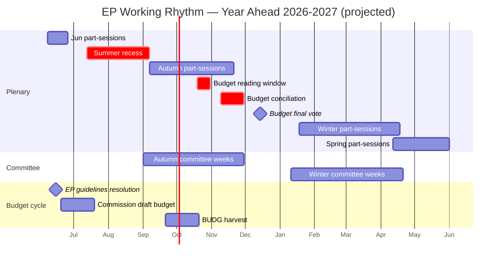
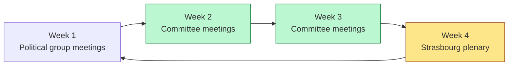
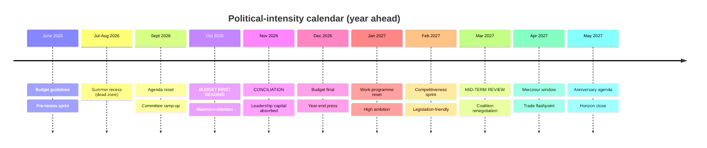

# Parliamentary Calendar Projection — EU Parliament 2026-2027

**Date:** 2026-05-30 | **Article Type:** year-ahead | **Horizon:** 2026-05-30 → 2027-05-30
**Methodology:** Calendar Intelligence Analysis + Budget-Cycle Mapping + Rhythm Forecasting
**Data mode:** degraded-feeds (line floors reduced ×0.80)

---

## 1. Bottom Line Up Front

The European Parliament's working rhythm across the year ahead is **structurally predictable but
empirically unconfirmed** for this run. The institution moves to a fixed cadence — twelve Strasbourg
part-sessions a year, interspersed Brussels mini-plenaries, committee weeks, and an annual budget
cycle that peaks in the autumn. We project that cadence with **🟢 HIGH** structural confidence, while
flagging a material caveat: `get_plenary_sessions` returned an **empty forward window** this run (no
forward sittings published yet to the Open Data Portal), so the specific dates below are projected
from the EP's established part-session pattern, **not** read from a live calendar feed.

**Headline judgement (🟡 MEDIUM):** the autumn 2026 budget conciliation will be the year's single
busiest political window, and the January-February 2027 post-budget reset its principal
legislation-friendly window. The mid-term of EP10 (spring 2027) opens a coalition-renegotiation
opportunity ahead of 2029 positioning.

> **Reliability caveat.** `get_plenary_sessions` (forward window) → **EMPTY (0 forward sittings)**.
> All dates are projections from the EP's standard 4-week part-session cycle and historical calendar,
> not confirmed sittings. Treat as a **rhythm projection**, not a published schedule.

---

## 2. The Annual Rhythm Model

The Parliament's year is **bimodal**: a productive but contested autumn dominated by the budget, and a
high-ambition winter-spring reset once the budget is closed. The summer (mid-July to early September)
and the Christmas turn are dead zones for legislating.

---

## 3. Projected Strasbourg Part-Sessions (rhythm projection)

Strasbourg part-sessions run Monday afternoon to Thursday midday, on a roughly four-week cycle with
recess gaps. Projected windows for the horizon:

| Month | Projected part-session windows | Notes |
|-------|--------------------------------|-------|
| June 2026 | early-June; late-June | Last before summer recess; budget guidelines |
| July 2026 | (one early-July, then recess) | Summer recess begins ~mid-July |
| September 2026 | mid-Sept; late-Sept | Return from recess; agenda reset |
| October 2026 | early-Oct; **late-Oct (budget first reading)** | Budget reading window |
| November 2026 | early-Nov; **mid-Nov (conciliation)** | Conciliation period |
| December 2026 | **mid-Dec (budget final vote)** | Year-end; budget closes |
| January 2027 | mid-Jan; late-Jan | Commission 2027 work programme |
| February 2027 | early-Feb; late-Feb | Competitiveness sprint |
| March 2027 | mid-Mar; late-Mar | EP10 mid-term review |
| April 2027 | mid-Apr | Mercosur consent window (if scheduled) |
| May 2027 | early-May; late-May | Three-year anniversary agenda; horizon close |

*(Brussels mini-plenaries — Wednesday-Thursday — are interspersed roughly monthly, typically in the
weeks between Strasbourg sessions.)*

---

## 4. Committee-Week Structure

Between part-sessions, the Parliament runs **committee and group weeks**. The standard four-week cycle
is: Group week → Committee week → Committee week → Strasbourg week. Committee throughput — where the
real legislative drafting happens — is therefore concentrated in the two mid-cycle weeks.

**Implication:** committee bandwidth — not plenary time — is the binding constraint for legislative
output. The autumn budget cycle reallocates BUDG committee weeks to budget-only work, squeezing the
shared committee calendar.

---

## 5. Budget-Cycle Milestones (the spine of the year)

| # | Milestone | Projected timing | Significance |
|---|-----------|------------------|--------------|
| 1 | EP budget guidelines resolution | June 2026 | 🟡 Sets EP political priorities for 2027 budget |
| 2 | Commission draft budget 2027 | June-July 2026 | 🟡 Opens formal procedure |
| 3 | BUDG committee harvest (first-reading amendments) | Sept-Oct 2026 | 🔴 CRITICAL — committee position |
| 4 | Budget first-reading plenary | late-Oct 2026 | 🔴 CRITICAL — EP transmits to Council |
| 5 | Budget conciliation (21-day) | Nov 2026 | 🔴 CRITICAL — 27-MEP conciliation committee |
| 6 | Budget final vote | mid-Dec 2026 | 🔴 CRITICAL — President declares budget adopted |
| 7 | Commission 2027 work programme | Jan 2027 | 🟡 Sets committee agenda |
| 8 | EP10 mid-term review | Mar-May 2027 | 🟡 Coalition renegotiation window |

**MFF overlay (new this horizon).** Beyond the annual budget, the **post-2027 MFF negotiation** runs
in parallel through the whole horizon, adding inter-institutional meetings on top of the annual cycle
and intensifying the autumn crunch. The annual budget and the MFF compete for the same BUDG bandwidth.

The fiscal backdrop sharpens the conciliation stakes: the IMF projects France's general government
deficit at **-4.94% of GDP in 2026** and Italy's at **-2.82% of GDP**, with German growth of only
**0.79%** — a constrained environment that hardens net-contributor positions and makes the conciliation
*Likely* contentious (WEP: 65%).

---

## 6. High-Traffic vs Legislation-Friendly Windows

### High-traffic weeks (maximum political activity, low spare bandwidth)
1. **Late-October 2026 (budget first reading)** — attention saturates on the budget.
2. **Mid-November 2026 (conciliation)** — EP leadership capital fully committed.
3. **Mid-December 2026 (budget final)** — year-end; calendar closes.
4. **Mid-January 2027 (work-programme reset)** — high-priority agenda-setting.
5. **March 2027 (mid-term review)** — coalition renegotiation opportunity.

### Legislation-friendly windows (lower competing priorities)
1. **June 2026** — pre-recess; guidelines not yet contentious.
2. **February 2027** — post-budget reset; full committee bandwidth.
3. **April 2027** — pre-anniversary sprint; productive committee period.

---

## 7. Recurring vs One-Off Agenda Items

**Recurring (every part-session):**
- Commission statements on current affairs
- Question time with Commission and Council
- Urgency-procedure debates (foreign-affairs resolutions — Ukraine, Middle East, Sahel, Georgia,
  Venezuela — recur heavily, consistent with the 2026 adopted-texts skew)
- Topical motions for resolutions

**One-off strategic items projected in-horizon:**
- EP budget guidelines resolution (June 2026)
- Budget 2027 first reading, conciliation, final vote (Oct-Dec 2026)
- Commission 2027 work programme debate (Jan 2027)
- MFF post-2027 interim/consent debates (rolling H2 2026 → H1 2027)
- Mercosur consent vote (Apr-May 2027, if CJEU opinion and safeguards align)
- Presidency changeover joint debates (each six-month cycle: Ireland → Lithuania handover, Jan 2027)
- EP10 mid-term review (Mar-May 2027)

---

## 8. Presidency-Handover Calendar Overlay

Council presidency changeovers (🟡 MEDIUM, unverified this run) punctuate the calendar with joint
debates and priority-setting:
- **1 July 2026:** Cyprus → Ireland handover (priorities debate in July/September plenary)
- **1 January 2027:** Ireland → Lithuania handover (priorities debate in January plenary)

Each handover triggers a programme presentation to plenary and recalibrates which Council general
approaches arrive for trilogue.

---

## 9. Calendar Risk Register

| Risk | Likelihood | Calendar impact |
|------|-----------|-----------------|
| Budget conciliation overruns | 🟡 MEDIUM | Squeezes December legislative slots |
| MFF meetings collide with annual budget | 🟢 HIGH | Compounds autumn BUDG overload |
| Farm protests force urgency debates | 🟡 MEDIUM | Displaces scheduled legislative votes |
| Forward sittings remain unpublished to feed | 🟡 MEDIUM | Continued calendar blind spot for monitoring |
| External shock (security) forces extraordinary session | 🔴 LOW | Disrupts projected rhythm |

---

## 10. Source & Confidence Table (Admiralty-graded)

| Source / evidence | Admiralty grade | Reliability note |
|-------------------|-----------------|------------------|
| EP standard part-session pattern | B2 | Established public record |
| `get_plenary_sessions` (forward) | F6 | **EMPTY — 0 forward sittings this run** |
| EP Open Data `/adopted-texts` 2026 | A1 | Confirms recurring agenda themes |
| IMF SDMX WEO (live) | A1 | Fiscal backdrop to budget cycle |
| Council presidency trio | C3 | 🟡 unverified; handover dates projected |
| Budget-cycle procedure (Treaty timetable) | A2 | Treaty-fixed; reliable structure |

---

## 11. Analytical Confidence Statement

Structural rhythm confidence is **🟢 HIGH** — the EP's part-session cadence, budget timetable and
committee-week structure are Treaty- and rule-anchored and change little year to year. Specific-date
confidence is **🟡 MEDIUM**, downgraded because the forward sitting feed was empty; the dates here are
**projections**, to be reconciled when the EP publishes the confirmed 2027 calendar. The budget-cycle
spine and the autumn-crunch / winter-reset pattern are the load-bearing, high-confidence findings.

---

*Data sources: EP standard part-session pattern; `get_plenary_sessions` returned empty forward window;
adopted-texts 2026 for recurring-item evidence; live IMF WEO for fiscal backdrop. Confidence: 🟢 HIGH
structural / 🟡 MEDIUM date-specific. Run 2026-05-30, horizon 2026-05-30 → 2027-05-30.*
