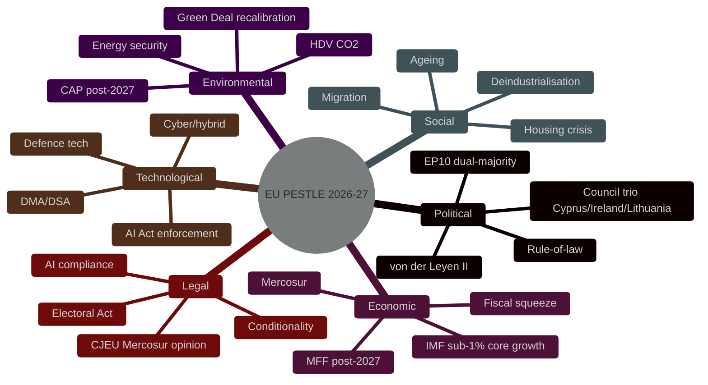
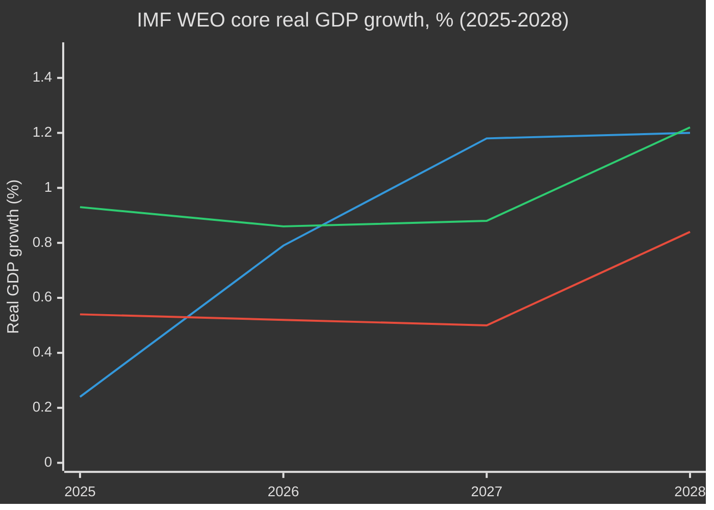

# PESTLE Analysis — EU Parliament Year Ahead 2026-2027
**Date:** 2026-05-30 | **Article Type:** year-ahead | **Horizon:** 2026-05-30 → 2027-05-30
**Framework:** PESTLE — Political · Economic · Social · Technological · Legal · Environmental

---

## Framework Overview

This artifact applies the PESTLE environmental scan to the European Parliament's operating
environment for the 365-day forward window (2026-05-30 → 2027-05-30). Each factor carries
documented evidence and an explicit confidence label (🟢 HIGH / 🟡 MEDIUM / 🔴 LOW). The
economic block follows the IMF-sole-source rule; no non-IMF economic series is used. Substance is
anchored to the 51 adopted texts of 2026 (EP Open Data `/adopted-texts`, A1/B2) plus EP10
structural knowledge, given this run's degraded feed environment (procedures/events/documents
feeds returned 404).

---

## P — Political Factors

### P1: EP10 Dual-Majority Arithmetic (Critical) — 🟢 HIGH
The 720-seat chamber has **no two-group majority**: EPP (188) + S&D (136) = 324, fully 37 short of
the 361 threshold. Governance runs on two alternating majorities — a centrist grand coalition
(EPP + S&D + RE = 401, +40) for institutional and budget files, and a fragile ad-hoc right majority
(EPP + ECR + PfE + ESN = 375, +14) on migration, environment and agriculture. Every major vote is a
coalition-assembly exercise; policy uncertainty is structural, not episodic.
**Implication:** Issue-by-issue routing dominates the legislative year; EPP is the swing actor.

### P2: Commission–Parliament Alignment — 🟢 HIGH
The von der Leyen II Commission is broadly EPP-anchored, producing strong executive–legislative
alignment on competitiveness, defence and digital tracks. Commission-initiated files on the
"omnibus" simplification drive advance faster than EP own-initiative resolutions, while S&D
opposition risks becoming a structural blocking minority on social and climate files.
**Implication:** Commission Work Programme items outpace Parliament-initiated legislation.

### P3: Council Presidency Trio & Member-State Overhang — 🟡 MEDIUM
The presidency trio (unverified this run): Cyprus H1-2026, Ireland H2-2026, Lithuania H1-2027,
Greece H2-2027. National politics feed directly into group cohesion: French RN strength pressures
the French EPP/RE delegations; Germany's new fiscal posture (IMF deficit widening to −3.78% of GDP
in 2026) reshapes its EU-budget stance; Italy's Meloni government links ECR pragmatism to Council
engagement; Hungary's antagonism strains PfE coherence.
**Implication:** Presidency priorities and national elections set the legislative tempo.

### P4: Rule-of-Law as Persistent Battleground — 🟡 MEDIUM
Article 7 proceedings (Hungary), conditionality disputes and democratic-resilience signals
(Georgia, Western Balkans) keep rule-of-law live throughout the horizon, intertwined with the
budget via the conditionality mechanism.
**Implication:** Rule-of-law and budget access remain legally and politically coupled.

### P5: Mid-Term Positioning for 2029 — 🟡 MEDIUM
2027 is EP10's mid-term; far-right consolidation (PfE/ECR/ESN, 187 nominal seats) is the headline
structural test as groups position for the 2029 election. Expect more frequent EPP rightward votes
on migration and agriculture.
**Implication:** Electoral positioning increasingly colours substantive votes.

---

## E — Economic Factors (IMF-Sole-Source)

### E1: Sub-Trend Core Growth — 🟢 HIGH (IMF numbers) / 🟡 MEDIUM (read-across)
IMF WEO (vintage 2025-09-23) projects **German real GDP growth of 0.79% in 2026**, **French growth
of 0.86%** and **Italian growth of 0.52%** — the core expanding under 1%. None of the three exceeds
1.2% before 2028 (IMF). The competitiveness agenda is a supply-side answer to demand-weak growth.
**Implication:** Growth scarcity frames every economic file; "omnibus" simplification is pitched as
a growth-restoration tool.

### E2: Sticky Inflation, No Disinflation Dividend — 🟢 HIGH
IMF projects **German average CPI of 2.65% in 2026**, **Italian CPI of 2.64%**, and **French CPI of
1.84%** — a 2026 cluster at or above target for two of three core economies. The ECB faces a
data-dependent, cautious path with no clean easing runway.
**Implication:** ECB scrutiny (ECON, ECB Annual Report 2025) stays politically salient.

### E3: Shrinking Fiscal Space — 🟢 HIGH
IMF projects **France's fiscal deficit at −4.94% of GDP in 2026** (−4.79% in 2027), the **German
deficit widening to −3.78% in 2026 and −4.23% in 2027**, while **Italy consolidates to −2.82% in
2026**. Two of the three largest economies face Excessive Deficit Procedure pressure under the
reactivated Stability and Growth Pact; the historic fiscal-anchor stereotype inverts (Germany's
2027 deficit exceeds Italy's).
**Implication:** The single hardest constraint on EU-level spending ambition and the MFF ceiling.

### E4: MFF post-2027 & Own Resources — 🟡 MEDIUM
With net contributors fiscally boxed in (IMF: France −4.94%, Germany −3.78% of GDP in 2026), the
MFF post-2027 negotiation becomes an own-resources-versus-ceiling standoff. ETS2, CBAM and
corporate-base contributions gain traction precisely because national budgets are exhausted.
**Implication:** Dominant fiscal battleground of the year; cohesion vs defence vs CAP tension.

### E5: Trade, Mercosur & Deindustrialisation — 🟡 MEDIUM
France's weak IMF growth (0.86%) and large deficit (−4.94% of GDP) sharpen Mercosur agricultural
sensitivity even as trade diversification logic strengthens. EGF cases (Audi Brussels, Tupperware)
are micro-evidence consistent with the IMF macro slowdown.
**Implication:** Trade-versus-agriculture and deindustrialisation become recurring EP themes.

---

## S — Social Factors

### S1: Housing Affordability — 🟡 MEDIUM
The first EP own-initiative on affordable housing and a Commission action plan respond to acute
cost-of-living stress. With IMF core growth under 1% and inflation near 2.5%, real income gains are
thin and housing-cost burdens bite. France's lower IMF inflation (1.84% in 2026) gives more room
than Italy (2.64%) to act without overheating, but deficits cap fiscal headroom.
**Implication:** Strong macro case, weak fiscal case — a defining social-policy tension.

### S2: Migration as Social Flashpoint — 🟡 MEDIUM
The "safe third country" reform of the Asylum Procedure Regulation dominates the social-political
agenda. PfE/ECR exploit migration anxieties; EPP faces pressure to show border results; S&D's
solidarity stance strains the centrist coalition.
**Implication:** Migration is the prime trigger for ad-hoc right majorities.

### S3: Deindustrialisation & Worker Displacement — 🟡 MEDIUM
EGF mobilisations (Audi Brussels, Tupperware) signal industrial-job losses consistent with IMF's
0.79% German growth. Subcontracting-chain and labour-rights adopted texts keep social protection on
the agenda against the competitiveness/deregulation drive.
**Implication:** Social-Europe versus competitiveness is a live coalition fault line.

### S4: Ageing Demographics & Identity — 🟡 MEDIUM
Rising median age across all 27 member states drives pension/healthcare pressure and labour
shortages; far-right growth reflects migration and economic-displacement anxiety in peripheral
regions.
**Implication:** Demographic strain underwrites both labour-migration debate and far-right appeal.

---

## T — Technological Factors

### T1: AI Act Enforcement (Critical) — 🟢 HIGH
The AI Act's first enforcement milestones land in the horizon: general-purpose-AI obligations enter
force and high-risk oversight begins. The "AI strategy for trade" links AI competitiveness to the
external agenda.
**Implication:** IMCO/LIBE monitor implementation; amendments likely if governance gaps emerge.

### T2: DMA/DSA Enforcement Ramp-Up — 🟢 HIGH
Enforcement against designated gatekeepers intensifies (2026 adopted-texts cluster). Mainstream
consensus (EPP + S&D + RE + Greens) backs robust enforcement; PfE/ESN intermittently dissent on
"sovereignty" grounds.
**Implication:** Digital enforcement is among the most coalition-stable files of the year.

### T3: Cyber & Hybrid Threat — 🟡 MEDIUM
Russian hybrid pressure elevates cybersecurity urgency; NIS2 implementation creates national
authority roles; AI-enabled attacks expand the threat surface around MEP communications and
critical infrastructure.
**Implication:** Cyber-resilience follow-up legislation and oversight remain active.

### T4: Defence & Space Technology — 🟡 MEDIUM
"Readiness 2030", EU defence-industrial instruments, Galileo, Copernicus and Iris² connectivity
are EP-relevant dual-use technology investments competing for constrained fiscal space.
**Implication:** Defence-tech financing collides with the IMF-documented fiscal squeeze.

---

## L — Legal Factors

### L1: CJEU Opinion on EU–Mercosur (High Impact) — 🟡 MEDIUM
The CJEU compatibility opinion sought on the Mercosur association agreement (with agricultural
safeguards) could reshape EU trade-policy architecture and sets precedent for the EP's use of the
Court as a political-legislative instrument.
**Implication:** A legal track now runs parallel to the economic Mercosur fight.

### L2: EU Electoral Act Reform — 🔴 LOW (passage uncertain)
Uniform electoral procedure and transnational-list proposals face special-majority and member-state
ratification hurdles; national constitutional courts retain authority over electoral procedures.
**Implication:** Institutional deepening is legally constrained; outcome Roughly Even.

### L3: Rule-of-Law Conditionality Litigation — 🟡 MEDIUM
Active CJEU proceedings on the conditionality mechanism and Article 7 dynamics keep the
budget–conditionality nexus in the courts as well as the chamber.
**Implication:** Legal outcomes shape budget-access politics.

### L4: AI Act Compliance Cascade — 🟢 HIGH
The AI Act imposes a cascading compliance requirement across EU public bodies, with GDPR-style
extraterritorial reach. The EP's own AI use must comply.
**Implication:** Compliance, not legislation, is the dominant 2026-27 AI legal workstream.

### L5: Trade & Sanctions Law — 🟡 MEDIUM
CBAM WTO-compatibility, immobilised-Russian-asset framing for the Ukraine macro-financial loan, and
any external tariff measures generate live legal questions.
**Implication:** Trade-law dynamics intersect the Ukraine-financing and CBAM files.

---

## E — Environmental Factors

### E1: Green Deal Recalibration vs Competitiveness — 🟡 MEDIUM
Heavy-duty vehicle CO2 standards and broader environmental files face competitiveness-driven
moderation. EPP increasingly aligns with ECR/PfE on rollback amendments; S&D + Greens + RE defend
ambition.
**Implication:** Environment is a recurring ad-hoc-right battleground.

### E2: CAP post-2027 & Farmer Protests — 🟡 MEDIUM
CAP reform and livestock/agriculture files intersect with farmer-protest risk and the Mercosur
fight; agricultural safeguards become a cross-cutting demand.
**Implication:** Agriculture links environment, trade and budget into one volatile nexus.

### E3: Energy Security — 🟡 MEDIUM
Post-2022 diversification from Russian gas is largely complete; LNG infrastructure, renewables
permitting and the France-pro-nuclear/Germany-post-nuclear split persist, with Middle East/Ukraine
price-shock risk that would disturb the IMF inflation path (core CPI already ~2.3–2.65% in 2026).
**Implication:** Energy shocks are the chief upside risk to the IMF inflation baseline.

### E4: Climate Finance & Extreme Weather — 🟡 MEDIUM
Extreme-weather frequency pressures the Civil Protection Mechanism, adaptation finance and
agricultural-loss mechanisms — all competing for the fiscally constrained MFF envelope.
**Implication:** Adaptation costs add to the budget-scarcity squeeze.

---

## PESTLE Summary Assessment

| Factor | Impact | Trend | Key driver | Confidence |
|--------|--------|-------|-----------|-----------|
| Political (dual-majority) | CRITICAL | → complex-stable | EP10 fragmentation (ENP ≈ 6.6) | 🟢 HIGH |
| Economic (fiscal/growth) | HIGH | 🔼 rising pressure | IMF sub-1% growth + −4.9% FR deficit | 🟢 HIGH |
| Social (housing/migration) | HIGH | 🔼 rising tension | affordability + far-right amplification | 🟡 MEDIUM |
| Technological (AI/digital) | VERY HIGH | 🔼 accelerating | AI Act + DMA enforcement | 🟢 HIGH |
| Legal (CJEU/conditionality) | HIGH | 🔼 expanding scope | Mercosur opinion + conditionality | 🟡 MEDIUM |
| Environmental (climate/CAP) | HIGH | ↘ moderating ambition | competitiveness recalibration | 🟡 MEDIUM |

**Strategic conclusion:** Economic scarcity (IMF: core growth <1%, France deficit −4.94% of GDP in
2026) is the gravitational centre; technological and legal factors are ascending in influence
relative to traditional politics. The year ahead is defined by a fiscally constrained Parliament
routing each dossier through one of two majorities, with the MFF post-2027 fight as the apex
contest. 🟡 MEDIUM overall; 🟢 HIGH on the IMF and arithmetic foundations.

---

*Methodology: PESTLE per artifact catalog. Economic block follows IMF-sole-source rule (live SDMX
WEO, vintage 2025-09-23); no non-IMF economic series used. Substance anchored to 2026 adopted texts
(A1/B2) under degraded-feed conditions. Confidence 🟢/🟡/🔴 as marked.*
