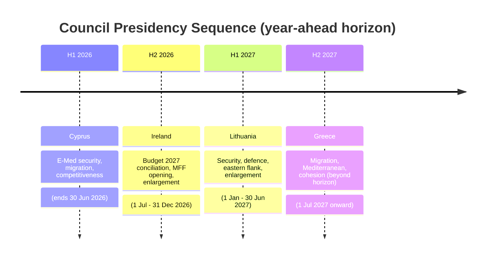
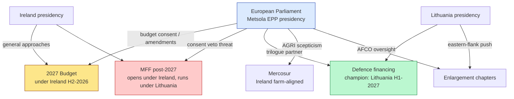
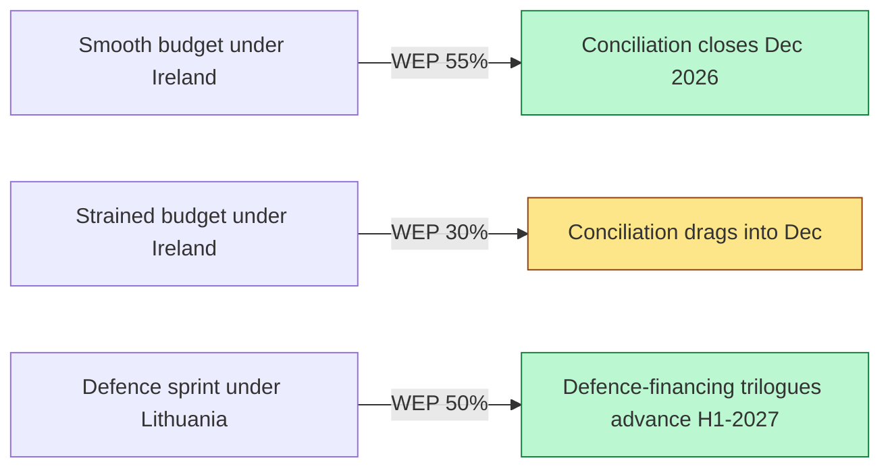

# Presidency Trio Context — EU Parliament Year Ahead 2026-2027

**Date:** 2026-05-30 | **Article Type:** year-ahead | **Horizon:** 2026-05-30 → 2027-05-30
**Methodology:** Presidency Trio Impact Analysis + EP Interplay Mapping
**Data mode:** degraded-feeds (line floors reduced ×0.80)

---

## 1. Bottom Line Up Front

The Council of the EU rotates its presidency every six months, with three consecutive presidencies
forming an 18-month **trio** that coordinates a shared programme. For the year ahead, the relevant
sequence is **Cyprus (H1 2026) → Ireland (H2 2026) → Lithuania (H1 2027) → Greece (H2 2027)**, marked
**🟡 MEDIUM (unverified this run)**. Two of these presidencies — Ireland and Lithuania — span the bulk
of our horizon and will set the inter-institutional tempo for the budget cycle, MFF negotiation,
enlargement and defence.

**Headline judgement (🟡 MEDIUM):** the **Irish presidency (H2 2026)** inherits the politically
heaviest task — steering the 2027 annual budget conciliation while the MFF post-2027 negotiation
opens. The **Lithuanian presidency (H1 2027)** then carries the security-and-enlargement agenda into
the EP10 mid-term. The EP's leverage is greatest during the autumn budget reading, which falls under
the Irish presidency.

> **Reliability caveat.** The presidency trio sequence is graded **🟡 MEDIUM / Admiralty C3** —
> it was **not verified against a live feed** this run and rests on the standard published Council
> rotation. Specific national priorities are inferred from each member state's known interests, not
> from official presidency programmes (not retrieved).

---

## 2. The Trio Sequence

Within the horizon (2026-05-30 → 2027-05-30), the **tail of Cyprus**, the **whole of Ireland**, the
**whole of Lithuania**, and the **opening of Greece** are in scope. Ireland and Lithuania are the
decisive presidencies.

---

## 3. Presidency-by-Presidency Outlook

### 3.1 Cyprus — H1 2026 (concluding, to 30 June 2026) 🟡 MEDIUM

- **Likely priorities:** Eastern Mediterranean security; migration in a Mediterranean frame;
  competitiveness and energy security.
- **EP interplay:** LIBE engagement on migration; ITRE on energy. Cyprus brings direct
  frontline-migration and Eastern-Med-gas experience.
- **Horizon relevance:** only the final month falls in-horizon; Cyprus's legacy is handing a part-set
  budget-preparation agenda to Ireland and advancing the "safe third country" migration debate.

### 3.2 Ireland — H2 2026 (1 July – 31 December 2026) 🟡 MEDIUM

- **Likely priorities:** stewarding the **2027 annual budget** to conciliation and final vote;
  opening **MFF post-2027** negotiations; **enlargement** (Ukraine, Moldova, Western Balkans accession
  chapters); single-market competitiveness; digital and trade files.
- **National colouring:** a small, open, trade-dependent, net-recipient-turned-contributor economy
  with strong pro-enlargement and pro-single-market instincts; sensitive on **agriculture and
  Mercosur** (Irish beef exposure) and on **corporate-tax / own-resources** questions.
- **EP interplay:** **highest-leverage presidency in-horizon.** The EP's budget first reading
  (late-October) and conciliation (November) fall squarely under Dublin. EP-Presidency relations will
  determine whether conciliation is smooth or fraught. Ireland's farm sensitivity aligns it with EP
  AGRI scepticism on Mercosur — a point of EP-Council convergence.
- **Friction risk:** if MFF headline numbers sour the budget atmosphere, conciliation becomes
  contentious (🟡 MEDIUM).

### 3.3 Lithuania — H1 2027 (1 January – 30 June 2027) 🟡 MEDIUM

- **Likely priorities:** **security and defence** (front-line eastern-flank state); **Ukraine support**
  and the immobilised-assets financing track; **enlargement** momentum; energy independence from
  Russia; cyber and hybrid-threat resilience.
- **National colouring:** hawkish on Russia; strong advocate of defence financing, "readiness 2030"
  and EU bonds for defence; pro-enlargement for Ukraine and Moldova.
- **EP interplay:** strong alignment with the EP's **broad pro-defence majority** (centre + much of
  ECR). Lithuania will press Council general approaches on defence-financing instruments, feeding the
  EP's AFET/ITRE/BUDG trilogue queue. Expect a **productive defence window** under Vilnius — the most
  consensual track of the year.
- **Friction risk:** PfE/ESN and parts of The Left resist defence-bond mutualisation; Lithuania's
  ambition may outrun net-contributor caution (🟡 MEDIUM).

### 3.4 Greece — H2 2027 (from 1 July 2027, mostly beyond horizon) 🟡 MEDIUM

- **Likely priorities:** migration and Mediterranean management; cohesion-funding defence (as a
  cohesion recipient in the MFF fight); enlargement.
- **Horizon relevance:** only the first month touches the horizon's end; Greece inherits the MFF
  end-game and the migration file's next phase.

---

## 4. EP–Presidency Leverage Map

The EP's principal lever is **budget consent**: its first reading and conciliation role under the
Irish presidency give it real bargaining weight on the 2027 budget and indirect leverage on MFF
direction. On defence, the EP is an **ally** of the Lithuanian presidency rather than a brake.

---

## 5. Presidency Priorities vs EP Majorities

| Presidency | Flagship priority | EP majority disposition | Convergence |
|-----------|-------------------|-------------------------|-------------|
| Cyprus (H1-26) | Migration / E-Med | LIBE contested; EPP right-leaning | 🟡 Partial |
| Ireland (H2-26) | Budget 2027 + MFF opening | Grand centre defends programmes | 🟡 Negotiated |
| Ireland (H2-26) | Enlargement | Broad EP support | 🟢 High |
| Ireland (H2-26) | Mercosur caution (farm) | AGRI sceptical; INTA split | 🟢 Aligned (on caution) |
| Lithuania (H1-27) | Defence financing | Broad pro-defence majority | 🟢 High |
| Lithuania (H1-27) | Ukraine / immobilised assets | Stable majority | 🟢 High |
| Greece (H2-27) | Migration / cohesion | Contested | 🟡 Partial |

---

## 6. Inter-Institutional Cooperation Framework

EP President **Roberta Metsola (EPP)** maintains structured cooperation with each presidency: monthly
President-to-Presidency contacts, joint legislative-planning sessions, and AFCO oversight of
inter-institutional relations. The **trio joint programme** provides 18-month continuity; the handover
debates (Cyprus→Ireland in July 2026; Ireland→Lithuania in January 2027) are the formal EP touchpoints
where each presidency presents its programme to plenary.

**Key leverage point:** the EP's budget first reading traditionally lands under the second-half
presidency — Ireland this horizon. Strained EP-Dublin relations would make budget negotiations more
contentious; aligned relations (likely, given shared enlargement and farm-caution instincts) smooth
the path.

---

## 7. Confidence & Source Table (Admiralty-graded)

| Source / evidence | Admiralty grade | Reliability note |
|-------------------|-----------------|------------------|
| Council rotation sequence | C3 | 🟡 unverified this run; standard published order |
| National-priority inference | C3 | Inferred from known member-state interests |
| EP10 majority structure | B2 | Established public record |
| Budget-cycle Treaty timetable | A2 | Treaty-fixed |
| IMF fiscal backdrop | A1 | Live WEO (contextual) |
| Presidency official programmes | F6 | **Not retrieved this run** |

---

## 8. Handover-Risk Watch-List

| Handover | Date (projected) | Continuity risk | Watch signal |
|----------|------------------|-----------------|--------------|
| Cyprus → Ireland | 1 Jul 2026 | Budget-preparation files mid-flight | Whether draft-budget priorities carry intact |
| Ireland → Lithuania | 1 Jan 2027 | MFF negotiation mid-stream | Whether MFF momentum survives handover |
| Lithuania → Greece | 1 Jul 2027 (post-horizon) | Defence + enlargement files | Beyond horizon; flagged for next run |

Trio coordination is designed to smooth these handovers via the shared 18-month programme, but a
mid-stream MFF negotiation is unusually sensitive to presidency change: Lithuania's security-first
emphasis differs from Ireland's budget-and-trade emphasis, and the MFF's centre of gravity may shift
accordingly at the January 2027 handover.

---

## 9. Scenario Lines for Presidency–EP Interplay

- **Smooth budget (WEP: 55%):** Ireland's farm-caution and pro-enlargement instincts align with EP
  majorities; conciliation closes on schedule.
- **Strained budget (WEP: 30%):** MFF tensions bleed into the annual budget; conciliation tightens.
- **Defence sprint (WEP: 50%):** Lithuania's eastern-flank push meets the EP's pro-defence majority,
  producing the year's most productive trilogue window.

---

## 10. Analytical Confidence Statement

Confidence is **🟡 MEDIUM** overall, capped by the unverified trio sequence and the absence of
official presidency programmes. The structural finding — that Ireland (H2-2026) is the
highest-leverage presidency because it holds the budget conciliation, while Lithuania (H1-2027) opens
the most consensual defence window — is robust and graded **🟢 HIGH** conditional on the rotation being
confirmed. National-priority specifics are graded **🟡 MEDIUM** as inferences. Re-grade upward once the
Council rotation and presidency programmes are feed-verified.

---

*Sources: standard Council presidency rotation (🟡 unverified); EP interinstitutional framework; EP10
structural majorities; live IMF WEO for fiscal context. Council presidency trio marked 🟡 MEDIUM,
Admiralty C3. Confidence: 🟡 MEDIUM. Run 2026-05-30, horizon 2026-05-30 → 2027-05-30.*
