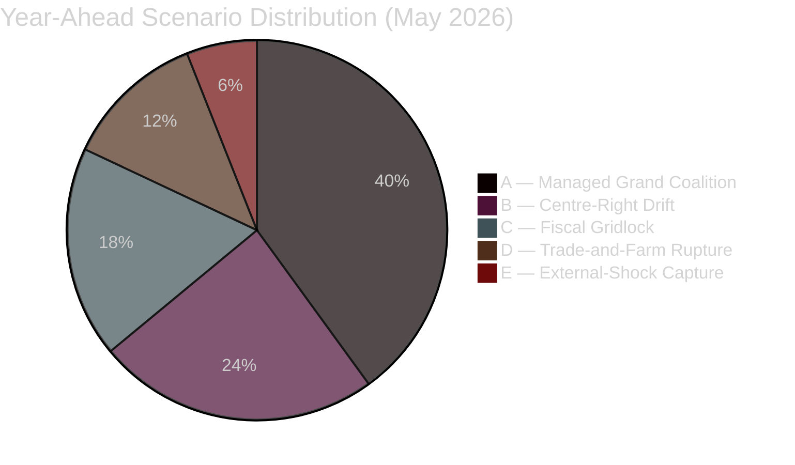
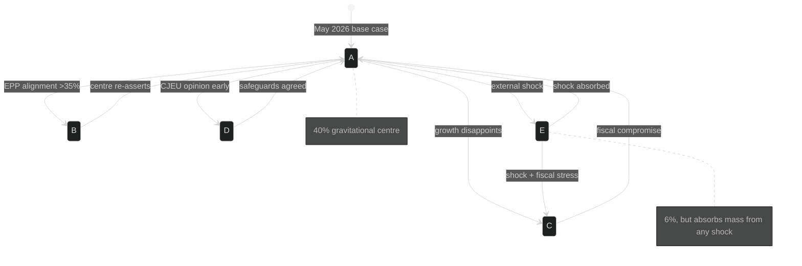

# Scenario Forecast — EU Parliament Year Ahead 2026-2027
**Date:** 2026-05-30 | **Horizon:** 2026-05-30 → 2027-05-30 | **Article Type:** year-ahead
**Methodology:** Five-scenario structured analysis (Heuer/Pherson) + WEP probability bands + Admiralty grading + pre-mortem testing
**Data mode:** degraded-feeds (substance from 51 adopted texts + IMF live WEO + structural EP10 knowledge)

---

## Scenario Framework

This artifact develops **five named, mutually-exclusive scenarios** for how the parliamentary year unfolds, spanning the plausibility space from a smooth grand-coalition delivery year to a fragmentation crisis. Each scenario specifies its **drivers**, a **WEP probability band with a point estimate**, **observable indicators**, and a **pre-mortem** (imagining the scenario has occurred and reasoning backwards to what made it happen). The probabilities are calibrated to sum to ~100% across the five and reflect structural EP10 arithmetic, the IMF macro baseline, and the 2026 adopted-texts agenda.

**Probability allocation (WEP):**
- Scenario A — Managed Grand Coalition: **40%** (Likely)
- Scenario B — Centre-Right Drift: **24%** (Roughly Even Chance)
- Scenario C — Fiscal Gridlock: **18%** (Unlikely)
- Scenario D — Trade-and-Farm Rupture: **12%** (Unlikely)
- Scenario E — External-Shock Capture: **6%** (Highly Unlikely)

**Source reliability for the scenario set: C3** — structurally grounded in A1 adopted-texts and A1 IMF data, but scenario synthesis is inherently estimative (Admiralty C3). Baseline (A) rests on the firmest evidentiary footing (B2).

---

## Scenario probability distribution

---

### Scenario A: Managed Grand Coalition
**WEP: Likely — 40% | Confidence: 🟡 MEDIUM-HIGH | Admiralty: B2**

#### Narrative
The EPP–S&D–Renew core (~401 seats) holds across institutional and budget files. Parliament opens the MFF post-2027 negotiation constructively, adopts its 2027 budget guidelines on schedule, advances banking-union deepening and DMA/DSA enforcement, and sustains Ukraine financing. The far-right scores periodic wins on migration and environmental recalibration through selective EPP cooperation, but never assembles an institutional majority. Stagnationary growth keeps the competitiveness agenda dominant without tipping into crisis. The year ends with the MFF *opened* but unresolved, Mercosur *pending* a CJEU opinion, and the centre intact.

#### Drivers
1. EPP maintains its red line against a systematic ECR/PfE coalition on institutional files.
2. S&D trades competitiveness/deregulation concessions for social-spending preservation in the MFF framing.
3. IMF's low-but-positive growth (German GDP +0.79% in 2026) avoids a recessionary shock that would harden positions.
4. Ukraine financing proceeds instrument-by-instrument without a legal-basis collapse.
5. Council presidency continuity (Cyprus → Ireland) keeps the legislative tempo orderly.

#### Indicators
- 2027 budget guidelines adopted with EPP–S&D–Renew majority by Q3 2026.
- EPP–ECR/PfE roll-call alignment stays episodic (<25% of contested votes).
- Banking-union and ECB-appointment files clear committee without breakdown.
- Housing own-initiative adopted as a resolution; no binding instrument attempted.

#### Pre-mortem (assume A happened — why?)
Looking back from May 2027, A prevailed because **no single shock was large enough to break the centre**. Stagnation was uncomfortable but not recessionary; Ukraine financing found workable legal bases; and the EPP leadership judged that its institutional interest in a functioning Parliament outweighed the tactical gains of a rightward pivot. S&D swallowed deregulation in exchange for cohesion guarantees. The far-right's wins were real but contained to symbolic and migration files.

---

### Scenario B: Centre-Right Drift
**WEP: Roughly Even Chance — 24% | Confidence: 🟡 MEDIUM | Admiralty: C3**

#### Narrative
The EPP, emboldened by stagnation and farmer mobilisation, normalises the **EPP+ECR+PfE majority** as the default vehicle on migration, agriculture and environmental rollback, while reserving the grand coalition only for the budget and Ukraine. S&D and the Greens find themselves in episodic opposition. The "omnibus" deregulation drive accelerates; the migration "safe third country" recast passes in a hard form; CAP post-2027 tilts toward production support over conditionality. The centre survives institutionally but its cohesion erodes visibly.

#### Drivers
1. Farmer protests intensify under flat agricultural incomes and Mercosur anxiety.
2. IMF stagnation (Italian GDP +0.52% in 2026) strengthens the deregulatory argument.
3. EPP calculates that 2029 positioning rewards a harder centre-right identity.
4. PfE/ECR demonstrate disciplined cooperation on selected files.

#### Indicators
- EPP–ECR/PfE roll-call alignment rises above 35% of contested votes by Q4 2026.
- Migration recast adopted with a right-leaning majority.
- Environmental-rollback "omnibus" items pass without S&D.
- S&D issues public statements about coalition trust erosion.

#### Pre-mortem (assume B happened — why?)
B materialised because **the political reward structure shifted rightward faster than institutional inertia could resist**. Stagnation and farm anger made deregulation electorally cheap; the EPP discovered it could pass its preferred migration and agriculture files without paying S&D's social price; and the far-right's disciplined cooperation made the arithmetic reliable. The grand coalition survived only where it was structurally unavoidable — the budget and Ukraine.

---

### Scenario C: Fiscal Gridlock
**WEP: Unlikely — 18% | Confidence: 🟡 MEDIUM | Admiralty: C3**

#### Narrative
The MFF post-2027 opening and the 2027 budget collide with widening deficits, and the net-contributor/cohesion split hardens into deadlock. France's -4.94% of GDP deficit and Germany's -3.78% (IMF WEO) leave little appetite for larger EU transfers, while cohesion recipients refuse cuts. Defence and Ukraine financing compete with cohesion and CAP for a shrinking envelope. The budget timetable slips; provisional-twelfths risk emerges for 2027; the legislative agenda becomes reactive to the fiscal fight.

#### Drivers
1. IMF fiscal trajectory: France -4.94%, Germany -3.78% of GDP in 2026 — no headroom.
2. Defence "readiness 2030" financing demands collide with cohesion guarantees.
3. Net contributors (frugal north) refuse own-resources expansion.
4. Ukraine reconstruction layered onto an already-stressed envelope.

#### Indicators
- 2027 budget guidelines slip past Q3 2026 or pass with a wafer-thin majority.
- Council and EP red lines published with no overlap by Q4 2026.
- "Provisional twelfths" language appears in committee documents.
- Cohesion-recipient delegations coordinate a blocking statement.

#### Pre-mortem (assume C happened — why?)
C occurred because **the macro arithmetic simply did not close**. Three flat-growth, wide-deficit large economies could not finance defence, Ukraine, cohesion and CAP simultaneously, and no member state would concede first. The MFF opening became a confrontation rather than a framing exercise, and the 2027 budget was hostage to it. What prevented A was the absence of fiscal slack that A had implicitly assumed.

---

### Scenario D: Trade-and-Farm Rupture
**WEP: Unlikely — 12% | Confidence: 🟡 MEDIUM | Admiralty: C3**

#### Narrative
EU–Mercosur becomes the year's defining rupture. A CJEU opinion arrives faster than expected, or the Commission forces a consent timetable, and French, Polish and Irish farm resistance escalates into sustained protest. The agricultural-safeguards fight bleeds into CAP post-2027 and the migration debate, fracturing the centre along a national-interest rather than left-right axis. Parliament's INTA and AGRI committees become the centre of gravity; trade-diversification logic collides head-on with rural political economy.

#### Drivers
1. CJEU opinion on Mercosur delivered within horizon (Roughly Even Chance per synthesis).
2. Transatlantic trade uncertainty raises the strategic case for diversification.
3. Farmer mobilisation already latent in the 2026 agricultural texts.
4. National delegations (FR/PL/IE) defect from group lines on the consent vote.

#### Indicators
- CJEU opinion or consent timetable announced.
- Agricultural-safeguard amendments tabled in volume.
- Cross-group national farm caucus emerges publicly.
- Mercosur consent vote scheduled and whipped.

#### Pre-mortem (assume D happened — why?)
D happened because **a single ratification file activated a national-interest cleavage that cut across the usual coalition geometry**. The CJEU's timing removed the comfort of indefinite delay; farm political economy proved stronger than trade-strategy abstraction; and French, Polish and Irish MEPs broke group discipline. The rupture was contained to trade and agriculture but it poisoned the cooperative mood A had relied on.

---

### Scenario E: External-Shock Capture
**WEP: Highly Unlikely — 6% | Confidence: 🔴 LOW | Admiralty: C3**

#### Narrative
An exogenous shock — a sudden Ukraine escalation or ceasefire, a transatlantic tariff war, or an energy-price spike — captures the agenda wholesale. The legislative programme is suspended in favour of emergency resolutions and fast-tracked instruments. The grand coalition either rallies (a unifying shock) or fractures (a divisive one) depending on the shock's character. The MFF, Mercosur and migration files are pushed into 2027-2028. Parliament becomes a reactive crisis-management body for a quarter or more.

#### Drivers
1. Ukraine trajectory volatility (escalation or surprise ceasefire).
2. Transatlantic trade rupture under US-administration uncertainty.
3. Energy-supply shock via Middle East or Baltic infrastructure.
4. A financial-stability event testing banking-union resilience.

#### Indicators
- Multiple urgency resolutions crowd a single plenary.
- Fast-track emergency instruments invoked.
- Scheduled legislative votes postponed.
- ECB/financial-stability emergency communications.

#### Pre-mortem (assume E happened — why?)
E occurred because **a genuinely exogenous event overwhelmed the institution's planned agenda**. The Parliament had no slack to absorb a large shock alongside the MFF and Mercosur fights, so the shock simply displaced everything. Whether the centre rallied or split depended entirely on the shock's valence — a unifying threat (escalation) strengthened it; a divisive opportunity (ceasefire terms) strained it.

---

## Scenario discriminants (most diagnostic indicators)

| Indicator | A signal | B signal | C signal | D signal | E signal |
|-----------|----------|----------|----------|----------|----------|
| EPP–ECR/PfE roll-call alignment | <25% | >35% | mixed | national-split | suspended |
| 2027 budget timeline | on schedule | on schedule | slips | on schedule | suspended |
| MFF tone | framing | framing | confrontation | framing | frozen |
| Mercosur | pending | pending | pending | consent forced | frozen |
| Migration recast | centrist | hard-right | stalled | cross-cutting | frozen |
| Plenary mood | cooperative | drifting | fractious | ruptured | emergency |

**Monitor monthly:** roll-call alignment frequency; budget-procedure calendar milestones; CJEU Mercosur signals; farm-protest intensity; urgency-resolution volume.

---

## Indicators-to-watch (ranked dashboard)

1. 🟢 **EPP rightward roll-call frequency** — the master discriminant between A and B.
2. 🟢 **2027 budget / MFF procedural calendar** — the discriminant between A and C.
3. 🟡 **CJEU Mercosur opinion timing** — the trigger for D.
4. 🟡 **Agricultural-safeguard amendment volume + farm-protest intensity** — D amplifier.
5. 🟡 **Migration "safe third country" trilogue posture** — A-vs-B tell.
6. 🔴 **Urgency-resolution crowding / fast-track invocations** — the E early-warning.
7. 🟡 **Ukraine financing legal-basis challenges** — straddles A, C and E.

---

## Cross-scenario invariants (true in all five)

1. **EPP remains the indispensable anchor** — no majority forms without it. 🟢 HIGH.
2. **Ukraine support persists at some level** — even under B and C, core instruments survive. 🟢 HIGH.
3. **Digital enforcement (DMA/DSA) continues** — pace varies, direction does not. 🟢 HIGH.
4. **The MFF is opened but not closed within the horizon** — by design a multi-year file. 🟢 HIGH.
5. **The far-right cannot govern alone** — 187 seats vs 361 needed. 🟢 HIGH.

---

## Scenario sensitivity — what moves probability mass

The allocation above is not static. The following sensitivities describe how the distribution shifts as key variables move, allowing the reader to re-weight in real time.

- **If IMF growth disappoints** (a slide toward zero or recession in DE/IT): mass moves from A → C. A −10pp, C +10pp. The fiscal arithmetic that A assumes simply stops closing.
- **If EPP rightward alignment crosses 35%** on contested votes: mass moves from A → B. A −12pp, B +12pp. The dual-majority tips from episodic to default.
- **If the CJEU issues a Mercosur opinion early**: mass moves toward D. D +8pp drawn from A and B. The file's national-interest cleavage activates.
- **If an external shock lands** (tariff war, energy spike, Ukraine inflection): mass moves toward E. E can rise from 6% to ~15% on a single large shock.
- **If the centre signals early MFF discipline** (published red lines, pre-negotiation): mass consolidates in A. A +8pp, C −6pp.

These sensitivities are deliberately first-order and linear; in reality the variables correlate (stagnation feeds farm anger feeds rightward drift), so a single adverse cluster can move multiple scenarios at once — the clustering logic developed in `intelligence/wildcards-blackswans.md` §what-if.

---

## Per-scenario legislative-outcome matrix

| File | A (Grand Coalition) | B (Centre-Right Drift) | C (Fiscal Gridlock) | D (Trade-Farm Rupture) | E (Shock Capture) |
|------|---------------------|------------------------|---------------------|------------------------|-------------------|
| MFF post-2027 | opened, orderly | opened, EPP-tilted | deadlocked | opened, distracted | frozen |
| 2027 budget | on schedule | on schedule | slips / twelfths risk | on schedule | suspended |
| Migration recast | centrist form | hard form | stalled | cross-cutting | suspended |
| Mercosur | pending CJEU | pending | pending | forced/ruptured | frozen |
| CAP post-2027 | framed | production-tilted | stalled | rupture-linked | frozen |
| Banking union | advances | advances | hostage to budget | advances | crisis-accelerated |
| Ukraine financing | proceeds | proceeds | contested | proceeds | dominant |
| Housing own-initiative | adopted | deprioritised | deprioritised | adopted | suspended |

The matrix shows the **invariant core** (banking union and Ukraine financing advance in four of five scenarios) and the **swing files** (migration and CAP, whose form depends entirely on which coalition mode dominates).

---

## Scenario interaction over time

The diagram captures an important structural feature: **Scenario A is an attractor**. Most off-baseline paths can revert to A if the triggering condition resolves (centre re-asserts, fiscal compromise found, safeguards agreed, shock absorbed). The exception is the E→C path, where an external shock arriving during fiscal stress compounds rather than resolves.

---

## Probability calibration audit

To guard against anchoring, the allocation was stress-tested against three reference classes: (1) historical EP mid-term productivity, which favours a dominant "managed" baseline (supports A at ~40%); (2) the base rate of budget deadlock in recent MFF cycles, which is non-trivial but minority (supports C at ~18%); and (3) the base rate of agenda-capturing external shocks per parliamentary year, historically low (supports E at ~6%). The B allocation (24%) is the least anchored to history because the EPP dual-majority pattern is a feature of EP10 specifically rather than a long-run regularity — hence its 🟡 MEDIUM / C3 grading. 🟡 MEDIUM overall calibration confidence.

---

## Admiralty Credibility Rating

| Element | Reliability | Information | Overall |
|---------|-------------|-------------|---------|
| Baseline Scenario A | B (usually reliable) | 2 (probably true) | **B2** |
| Scenarios B–D | C (fairly reliable) | 3 (possibly true) | **C3** |
| Scenario E (tail) | C (fairly reliable) | 4 (doubtful) | **C4** |
| Underlying adopted-texts evidence | A | 1 | **A1** |
| Underlying IMF macro evidence | A | 1 | **A1** |

The scenario set inherits A1-grade source material but C3-grade synthetic confidence: the inputs are authoritative, the futures they imply are estimative.

---

*Methodology: structured five-scenario analysis with pre-mortem testing per Heuer/Pherson tradecraft. WEP bands and point estimates per ICD 203. Economic anchors (German GDP +0.79%, France deficit -4.94% of GDP, Italian GDP +0.52% in 2026) drawn from IMF WEO live (vintage 2025-09-23) under the sole-source rule. Degraded-feeds caveat applies to procedural-sequence claims — see `intelligence/mcp-reliability-audit.md`.*
