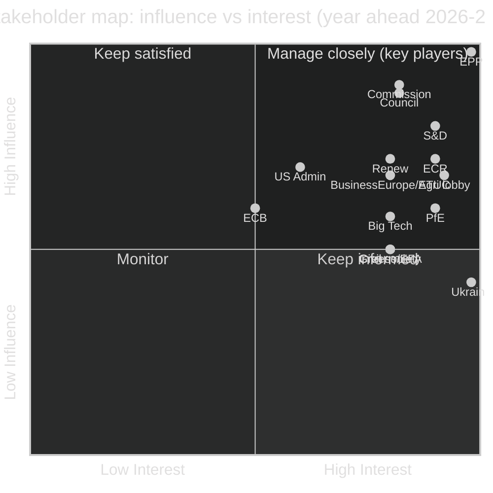
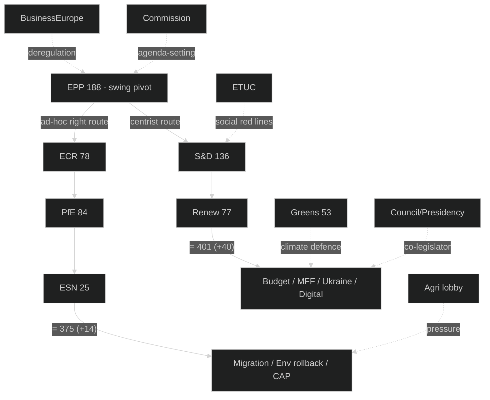

# Stakeholder Map — EU Parliament Year Ahead 2026-2027
**Date:** 2026-05-30 | **Article Type:** year-ahead | **Horizon:** 2026-05-30 → 2027-05-30
**Methodology:** Multi-stakeholder influence–interest mapping with alliance-line analysis

---

## Framework

Each stakeholder is scored on **Influence (1–10)**, **Interest (1–10)** and **Alignment** with the
mainstream pro-European legislative agenda (Pro / Neutral / Against). The reference dossiers for the
year ahead are: **MFF post-2027**, **Budget 2027 guidelines**, **migration / Asylum Procedure
reform**, **Mercosur ratification**, **CAP post-2027**, **AI Act / DMA-DSA enforcement**, **Ukraine
macro-financial loan**, and the **affordable-housing** initiative. Economic stakes are framed with
IMF figures only (IMF is the sole economic source). EP10 seat counts are the structural public record (B2).

---

## A. Primary Stakeholders (High Influence + High Interest)

### A1. EPP Group (188 seats; Metsola in the Presidency orbit)
- **Influence:** 10/10 | **Interest:** 10/10 | **Alignment:** Mainstream / swing
- **Stakes:** Agenda control as largest group and pivot of both majorities; Commission cooperation;
  27 national delegations' electoral interests.
- **Behavioural pattern:** Default centrist partner (EPP+S&D+RE = 401) on budget/institutional
  files, but increasingly assembles ad-hoc right majorities (EPP+ECR+PfE+ESN = 375, +14) on
  migration, environment and agriculture. The whole Parliament's routing turns on EPP's per-dossier
  "left or right?" choice.
- **Year-ahead interests:** competitiveness/"omnibus" simplification advances; MFF restraint
  without alienating eastern cohesion beneficiaries; visible migration results; sustained Ukraine
  support. Economic frame: IMF German growth of 0.79% and a widening German deficit (−3.78% of GDP
  in 2026) push EPP toward spending discipline.
- **Confidence:** 🟢 HIGH.

### A2. S&D Group (136 seats; progressive anchor)
- **Influence:** 8/10 | **Interest:** 9/10 | **Alignment:** Progressive
- **Stakes:** Defend Social Europe against EPP rightward drift and far-right gains; indispensable
  to the centrist majority (without S&D there is no centrist route).
- **Year-ahead interests:** housing initiative delivers; cohesion and social envelopes survive the
  MFF squeeze; climate ambition not dismantled; robust DMA/DSA consumer protection.
- **Behavioural pattern:** willing partner on Ukraine, digital, rule-of-law; resistant on climate
  rollback and migration hardening. Red lines on social spending constrain EPP's budget space.
- **Confidence:** 🟢 HIGH.

### A3. European Commission (von der Leyen II)
- **Influence:** 9/10 | **Interest:** 8/10 | **Alignment:** EPP-aligned mainstream
- **Stakes:** Work Programme delivery; MFF post-2027 proposal ownership; institutional legacy.
- **Year-ahead interests:** competitiveness agenda adoption; AI Act/DMA enforcement credibility; an
  MFF proposal that survives both EP and Council; Ukraine macro-financial loan operationalised via
  immobilised-asset framing; housing action plan.
- **Frame:** the Commission's own-resources push (ETS2, CBAM) is a direct response to net-contributor
  fiscal exhaustion (IMF France deficit −4.94% of GDP in 2026).
- **Confidence:** 🟢 HIGH.

### A4. Council / Rotating Presidency (Cyprus → Ireland → Lithuania → Greece)
- **Influence:** 9/10 | **Interest:** 8/10 | **Alignment:** Member-state intergovernmental
- **Stakes:** Co-legislator on budget and MFF; unanimity gatekeeper on enlargement, taxation and
  own resources. Presidency trio 🟡 MEDIUM (unverified this run).
- **Year-ahead interests:** fiscal discipline; member-state autonomy; managing enlargement-chapter
  momentum against unanimity blocks; defence financing.
- **Frame:** net-contributor capitals constrained by IMF deficits (Germany −4.23% of GDP in 2027)
  resist ceiling rises.
- **Confidence:** 🟡 MEDIUM on presidency sequence; 🟢 HIGH on Council's structural weight.

### A5. ECR Group (78 seats; Meloni-pragmatic pole)
- **Influence:** 7/10 | **Interest:** 9/10 | **Alignment:** Constructive opposition
- **Stakes:** Coalition leverage as the more EPP-compatible right group; Italian government agenda;
  Polish national interests (agriculture, cohesion).
- **Year-ahead interests:** sovereignty limits on EU deepening; migration hardening; Mercosur
  agricultural safeguards (Polish farm resistance); cohesion-fund defence for eastern members.
- **Behavioural pattern:** the keystone of any ad-hoc right majority; splits internally on Ukraine.
- **Confidence:** 🟢 HIGH.

### A6. PfE Group (84 seats; Le Pen / Orbán poles)
- **Influence:** 6/10 | **Interest:** 9/10 | **Alignment:** Opposition
- **Stakes:** expand far-right weight; French RN and Hungarian agendas; EU leverage maintenance.
- **Year-ahead interests:** block Ukraine financial instruments where possible; dismantle climate
  legislation; harden migration beyond ECR; contest DMA enforcement as anti-sovereignty.
- **Behavioural pattern:** internal Le Pen–Orbán coordination friction caps cohesion (~78%).
- **Confidence:** 🟢 HIGH.

---

## B. Secondary Stakeholders (Medium Influence or Interest)

### B1. Renew Europe (77 seats)
- **Influence:** 7/10 | **Interest:** 8/10 | **Alignment:** Liberal-centrist
- **Stakes:** indispensable third leg of the centrist majority; squeezed between EPP and S&D.
- **Interests:** digital single market completion; EU federalism; free trade (Mercosur logic);
  Ukraine support; investment-over-austerity in the MFF.
- **Confidence:** 🟢 HIGH.

### B2. Greens/EFA (53 seats)
- **Influence:** 5/10 | **Interest:** 8/10 | **Alignment:** Green-progressive
- **Stakes:** prevent Green Deal rollback; biodiversity; just transition.
- **Behavioural pattern:** coalition-willing on non-climate files; increasingly frustrated on
  environment as EPP drifts right. High internal cohesion (~90%).
- **Confidence:** 🟢 HIGH.

### B3. The Left (46 seats)
- **Influence:** 4/10 | **Interest:** 7/10 | **Alignment:** Left opposition
- **Interests:** social spending; housing; anti-austerity; split on Ukraine-arms vs pacifism.
- **Confidence:** 🟡 MEDIUM.

### B4. ESN (25 seats) & NI (33 seats)
- **Influence:** 3/10 (ESN), 2/10 (NI) | **Interest:** 6/10 | **Alignment:** Hard-right (ESN) /
  heterogeneous (NI)
- **Stakes:** ESN's 25 seats are the marginal votes that lift the ad-hoc right bloc over 361; NI is
  definitionally unwhippable.
- **Confidence:** 🔴 LOW on disciplined behaviour.

### B5. BusinessEurope / ETUC (employer & labour confederations)
- **Influence:** 7/10 | **Interest:** 8/10
- **Interests:** BusinessEurope — competitiveness/"omnibus" deregulation, DMA proportionality, AI
  Act flexibility, MFF investment orientation. ETUC — workers' rights, platform-work regulation,
  just transition, defence of social envelopes against the IMF-driven fiscal squeeze.
- **Pathway:** intergroup interactions, committee hearings, MEP contact.
- **Confidence:** 🟡 MEDIUM.

### B6. Agricultural Lobby (Copa-Cogeca, national farm unions)
- **Influence:** 7/10 | **Interest:** 9/10
- **Interests:** CAP post-2027 envelope defence; Mercosur agricultural safeguards; opposition to
  environment files raising input costs. Farmer-protest mobilisation is its principal leverage.
- **Confidence:** 🟢 HIGH that agriculture is a top-tier pressure source.

### B7. EU Civil Society (environmental, digital-rights, human-rights NGOs)
- **Influence:** 5/10 | **Interest:** 8/10
- **Interests:** climate-ambition preservation; DMA/DSA/GDPR enforcement; humanitarian and
  rule-of-law standards.
- **Confidence:** 🟡 MEDIUM.

### B8. Ukraine Government
- **Influence:** 4/10 | **Interest:** 10/10
- **Interests:** continued financial/military instruments; macro-financial loan via immobilised
  Russian assets; accession-chapter momentum; reconstruction finance.
- **Confidence:** 🟢 HIGH on interest; 🟡 MEDIUM on EP-channel influence.

### B9. United States Administration
- **Influence:** 7/10 | **Interest:** 6/10
- **Interests:** DMA enforcement not disproportionately targeting US firms; transatlantic security
  posture; trade and tariff uncertainty. Transatlantic unpredictability is a horizon-wide driver.
- **Confidence:** 🟡 MEDIUM.

### B10. ECB
- **Influence:** 6/10 | **Interest:** 5/10
- **Interests:** monetary-policy independence; ECON scrutiny of the ECB Annual Report 2025; new
  appointments. Operating with no clean disinflation runway (IMF core CPI ~2.3–2.65% in 2026).
- **Confidence:** 🟢 HIGH.

### B11. Big-Tech Gatekeepers (DMA-designated)
- **Influence:** 6/10 | **Interest:** 8/10
- **Interests:** soften DMA/DSA enforcement; shape AI Act implementation; preserve market position.
- **Confidence:** 🟡 MEDIUM.

---

## C. Influence–Interest Grid

---

## D. Alliance Lines & Routing

---

## E. Coalition Constellations for the Year Ahead

### E1. Centrist pro-European (most common) — 🟢 HIGH
**EPP + S&D + RE = 401 (+40).** Budget, MFF institutional steps, Ukraine, digital governance.
Stress points: climate rollback (S&D diverges), MFF austerity (S&D diverges), enlargement pace.

### E2. Ad-hoc right (selective) — 🔴 LOW stability, high salience
**EPP + ECR + PfE + ESN = 375 (+14).** Migration, environmental rollback, agriculture. Margin so
thin that ~8 absences flip it; costly to EPP's pro-European legitimacy. Expected frequency: a
handful of high-profile votes across the year.

### E3. Broad emergency consensus (rare) — 🟡 MEDIUM
**EPP + S&D + RE + ECR = 479 (+118).** Reserved for defence or acute-crisis response where the
S&D–ECR incompatibility is briefly bridged. 1–2 exceptional votes expected.

---

## F. Stakeholder Perspective — MFF post-2027 (apex dossier)

| Stakeholder | Position | Red line |
|-------------|----------|----------|
| EPP | Restraint; defence/competitiveness priority | No cohesion cuts that alienate eastern allies |
| S&D | Protect cohesion + social + housing | No climate/social envelope cuts below commitments |
| Renew | Investment + own resources over austerity | No protectionist industrial drift |
| ECR | Cohesion-fund defence for eastern states | No rule-of-law conditionality on access |
| PfE | Oppose Ukraine-linked budget items | No migration-solidarity instruments |
| Commission | Own-resources package (ETS2/CBAM) | Proposal must survive EP and Council |
| Council | Fiscal discipline; ceiling restraint | No rise above member-state contribution comfort |
| Agri lobby | Defend CAP envelope | No real-terms CAP cut |

**Negotiation prediction (WEP: Likely / 65%, 🟡 MEDIUM):** the MFF post-2027 opening collapses into
an own-resources-versus-ceiling standoff. The IMF-documented fiscal squeeze (France deficit −4.94%
of GDP in 2026; Germany −4.23% in 2027) is cited by net contributors to resist ceiling rises and by
the Commission/Parliament to justify new own resources. A political-level breakthrough is unlikely
before late in the horizon.

---

## G. Confidence & Provenance Ledger

- Seat composition & alliance arithmetic: B2, 🟢 HIGH.
- Economic stakes (IMF-framed): A1 numbers, 🟢 HIGH; read-across 🟡 MEDIUM. IMF sole economic source.
- Presidency trio: C3, 🟡 MEDIUM (unverified this run).
- Lobby/civil-society influence scores: B2/C3, 🟡 MEDIUM (analyst estimate).

---

*Methodology: multi-stakeholder influence–interest mapping per artifact catalog. Sources: EP10
structural record, 2026 adopted texts (A1/B2), live IMF SDMX WEO (vintage 2025-09-23) for economic
stakes. Confidence 🟢/🟡/🔴 as marked per stakeholder.*
