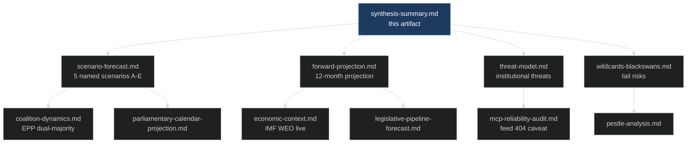

# Synthesis Summary — EU Parliament Year Ahead 2026-2027
**Date:** 2026-05-30 | **Horizon:** 2026-05-30 → 2027-05-30 (365 days) | **Article Type:** year-ahead
**Methodology:** ICD 203 BLUF + Kent/WEP probability bands + Admiralty source grading
**Data mode:** degraded-feeds (procedures/events/documents feeds returned HTTP 404; substance derived from 51 adopted texts + structural EP10 knowledge)

---

## BLUF — Bottom Line Up Front

🟡 **MEDIUM confidence.** The European Parliament enters the second half of its 10th term (2024-2029) as a **productive-but-contested** legislature whose every outcome is still arbitrated by the European People's Party (EPP, ~188 seats). Over the coming year the dominant battleground shifts from ordinary legislation toward the **opening of the post-2027 Multiannual Financial Framework (MFF)** negotiation — the single fiscal contest that will define the remainder of the term. Around it cluster four high-tension dossiers visible in the 2026 adopted-texts record: **EU–Mercosur** ratification, the **EU Electoral Act** reform, **migration "safe third country"** recasting, and a first-ever **affordable-housing** initiative. The far-right bloc (PfE ~84 + ECR ~78 + ESN ~25 ≈ 187 seats) remains a **structural constraint rather than a governing force**: it can deny, delay and embarrass, but it cannot assemble a 361-seat majority without EPP defections. The macro backdrop is one of **stagnationary drift** — IMF projects German real GDP growth of just 0.79% in 2026 and Italian growth of 0.52% — which intensifies the "competitiveness emergency" framing and corrodes fiscal headroom for cohesion and climate spending.

**Single most important judgement:** 🟢 **HIGH — Almost Certain.** No legislative majority forms in this horizon without EPP participation; therefore every stakeholder strategy reduces to an EPP-engagement strategy.

---

## The Year-Ahead Strategic Picture

The 2026-2027 parliamentary year is best read as a **transition from delivery to positioning**. The first half of EP10 (2024-2026) was spent constituting committees, consolidating the von der Leyen II Commission, and clearing a backlog of competitiveness and digital files. The coming twelve months instead open the **structural negotiations that outlast the term** — the MFF, CAP post-2027, enlargement chapters, and defence financing — while political groups begin the slow choreography toward the 2029 European election.

Three forces interact across the horizon:

1. **Arithmetic.** The centrist grand coalition (EPP–S&D–Renew, ~401 seats) retains a working majority for institutional and budget files, but the EPP increasingly assembles **ad-hoc right-leaning majorities** (EPP+ECR+PfE) on migration, environmental rollback and agriculture. This dual-majority pattern is the defining behavioural feature of EP10. 🟢 HIGH.

2. **Economics.** The IMF WEO (live SDMX vintage 23 Sep 2025) describes a low-growth, mildly-reflating core. German inflation rises to 2.65% in 2026 before easing; France runs a fiscal deficit of -4.94% of GDP in 2026; Italy's deficit narrows to -2.82%. Stagnation strengthens the deregulatory "omnibus" argument and starves the cohesion-versus-net-contributor truce that underwrites the MFF. 🟢 HIGH (data); 🟡 MEDIUM (political read-across).

3. **External shock exposure.** Ukraine financing (immobilised Russian assets), transatlantic trade uncertainty, and Mercosur farm resistance each carry the capacity to capture the agenda for a full plenary cycle. 🟡 MEDIUM.

---

## Key Judgements (with confidence labels)

### JUDGEMENT 1 — The MFF post-2027 opening is the gravitational centre of the year
🟢 **HIGH (B2 — structural + adopted-texts signal) | WEP: Almost Certain**

The 2026 adopted-texts set already contains the 2027 budget guidelines and the first MFF post-2027 framing. The negotiation pits **net contributors** (Germany, Netherlands, frugal north) against **cohesion recipients** (central, eastern and southern members), with defence "readiness 2030" financing and Ukraine reconstruction layered on top. Expect the formal opening, not closure, within the horizon: the file is designed to run into 2027-2028. Cross-reference: `intelligence/forward-projection.md` §Economic, `legislative-pipeline-forecast.md`.

### JUDGEMENT 2 — The far-right consolidates influence without acquiring a governing majority
🟡 **MEDIUM (C3 — partial seat data, parliamentaryBalance 0.61) | WEP: Likely**

`compare_political_groups` returned only partial data this run (PfE=85, ECR=81, ESN=27); supplemented with structural counts the combined hard-right is ~187 seats — short of the 361 needed. The realistic risk is **normalisation through selective EPP cooperation** on migration and environmental files (WEP: Likely), not a far-right-led majority on an institutional vote (WEP: Roughly Even Chance at most, and only on symbolic resolutions). Cross-reference: `coalition-dynamics.md`, `intelligence/threat-model.md`.

### JUDGEMENT 3 — Economic stagnation is the silent driver of the legislative mood
🟢 **HIGH (A1 — IMF live WEO) | WEP: Almost Certain**

IMF projects German real GDP growth of 0.79% in 2026 and 1.18% in 2027; France 0.86% then 0.88%; Italy 0.52% then 0.50%. With the three largest economies barely growing and fiscal deficits widening (Germany to -3.78% of GDP in 2026, France -4.94%), the "competitiveness compass" / Better Law-Making deregulation drive gains political oxygen while social-investment arguments lose fiscal room. Cross-reference: `economic-context.md`. IMF is the sole authority for these figures.

### JUDGEMENT 4 — EU–Mercosur becomes Parliament's most consequential trade decision of the term
🟡 **MEDIUM (B2 — adopted-texts CJEU-opinion signal) | WEP: Roughly Even Chance of resolution within horizon**

The 2026 texts show a CJEU opinion sought alongside agricultural safeguards. French, Polish and Irish farm resistance collides with a trade-diversification logic sharpened by transatlantic uncertainty. A definitive consent vote within the horizon is **Roughly Even Chance**; an opinion-driven delay into 2027-2028 is **Likely**. Cross-reference: `scenario-forecast.md` Scenario D, `wildcards-blackswans.md`.

### JUDGEMENT 5 — Ukraine support endures but the financing mechanism is the friction point
🟢 **HIGH (B2 — adopted-texts macro-financial loan) | WEP: Almost Certain (continuation); Unlikely (rollback)**

The macro-financial loan framed around immobilised Russian assets is in the adopted record. PfE/ECR opposition lacks veto capacity while EPP-S&D-Renew holds. The friction is instrument-by-instrument design (legal basis, asset-seizure exposure), not comprehensive withdrawal. Cross-reference: `intelligence/scenario-forecast.md`, `pestle-analysis.md`.

### JUDGEMENT 6 — The Electoral Act reform tests the Parliament's self-interest threshold
🟡 **MEDIUM (B2 — adopted-texts) | WEP: Likely (debate advances); Unlikely (Council unanimity within horizon)**

Uniform electoral procedure and transnational lists return to the agenda. Parliament can advance its own position by simple majority, but Council unanimity and national ratification make adoption within the horizon **Unlikely**. The value of the file this year is positional, ahead of 2029. Cross-reference: `parliamentary-calendar-projection.md`.

### JUDGEMENT 7 — The housing initiative signals a new EP competence frontier
🟡 **MEDIUM (B2 — first own-initiative) | WEP: Likely (report adopted); Highly Unlikely (binding instrument)**

The first EP own-initiative on affordable housing plus a Commission action plan marks an attempt to claim political ownership of a salient cost-of-living issue without clear treaty competence. Expect a resolution and Commission communication, not legislation. 🟡 MEDIUM.

---

## Cross-Cutting Intelligence Summary

### Legislative pipeline health
**Overall: MODERATE | Throughput risk: MEDIUM-HIGH (feed outage clouds visibility)**

This run's `/procedures-feed`, `/events-feed` and `/documents-feed` returned HTTP 404, and `monitor_legislative_pipeline` was empty (cold lifecycle cache). Pipeline health is therefore inferred from the 51 adopted texts and structural knowledge rather than live procedure tracking — a genuine reliability caveat (see `intelligence/mcp-reliability-audit.md`). Substantive signal remains strong; procedural-velocity signal is degraded.

- ✅ Active substantive agenda (banking union, digital enforcement, defence, Ukraine)
- ✅ Stable centrist arithmetic for institutional files
- ⚠️ MFF/CAP fiscal contest with no near-term resolution
- ⚠️ Mercosur and migration files exposed to ad-hoc right majorities
- ⚠️ Forward plenary calendar not yet published (`get_plenary_sessions` empty)

### Political stability
**Stability: MEDIUM-HIGH (~82/100 indicative early-warning) | Trajectory: STABLE with episodic turbulence**

The Parliament will produce meaningful output; the primary risks are (1) far-right normalisation via selective EPP cooperation, (2) an MFF/CAP deadlock spilling into farmer-protest dynamics, and (3) an external shock (energy, transatlantic, Ukraine) capturing the calendar.

### Ranked watchlist (analytic priority)
1. **EPP roll-call alignment frequency with ECR/PfE** — monthly. 🟢 highest-value discriminant.
2. **MFF post-2027 + 2027 budget procedural milestones** — Council position vs EP red lines.
3. **Mercosur CJEU opinion timing + agricultural-safeguard amendments.**
4. **Migration "safe third country" recast trilogue dynamics.**
5. **DMA/DSA enforcement actions against gatekeepers** — case-by-case.
6. **Ukraine asset-based financing legal-basis challenges.**

---

## Cross-Reference Map

The synthesis is the apex artifact: scenario, projection, threat and wildcard files each elaborate one judgement axis above; economic, coalition and pipeline files supply the evidentiary base.

---

## Underlying Assumptions Register

Every judgement above is conditional on a set of load-bearing assumptions. Making them explicit allows readers to track which judgements collapse if an assumption fails.

- **A1 — EPP cohesion holds.** The EPP votes as a bloc on institutional files. If it fractured internally (eastern vs western wing on Ukraine; economic vs values wing on environment), the dual-majority model breaks. 🟢 HIGH that it holds.
- **A2 — No recession in the core.** IMF's positive (if anaemic) growth path holds; a slide into recession would harden fiscal positions and tip Scenario C. 🟡 MEDIUM-HIGH.
- **A3 — Ukraine financing finds a legal basis.** The immobilised-asset mechanism survives legal challenge. 🟡 MEDIUM.
- **A4 — No agenda-capturing external shock.** The base case assumes shocks are absorbed, not transformative. 🟡 MEDIUM.
- **A5 — Council trio continuity.** Cyprus → Ireland presidencies maintain legislative tempo (🟡 MEDIUM, unverified this run).
- **A6 — The MFF is a multi-year file.** It opens but does not close in-horizon by design. 🟢 HIGH.

If A1 or A2 fails, the centre of gravity shifts from Scenario A toward B or C; if A4 fails, toward E.

---

## Confidence Calibration Note

This synthesis applies a deliberate **two-track confidence model** because the data this run is bimodal. Substantive judgements (what Parliament legislates) draw on an A1 adopted-texts core and earn 🟢 HIGH-to-🟡 MEDIUM labels. Procedural-velocity judgements (when, in what sequence, at what throughput) draw on feeds that returned HTTP 404 and a landscape tool that timed out, so they are deliberately held at 🟡 MEDIUM-to-🔴 LOW. Readers should not conflate the two: a 🟢 HIGH judgement that the MFF dominates the year coexists with a 🔴 LOW judgement about the exact plenary in which any given milestone lands.

This calibration discipline matters because the degraded-feeds condition is **transient infrastructure**, not analytic uncertainty. The substance is knowable; the sequencing is merely unobserved this run. A subsequent run with restored feeds would upgrade the procedural track without altering the substantive judgements.

---

## So-What for Stakeholders

- **For the centre (EPP-S&D-Renew):** the year rewards early, transparent MFF red-line negotiation; the cost of drift is Scenario C. 🟡 MEDIUM.
- **For the hard right (PfE/ECR/ESN):** influence flows from selective EPP cooperation, not from a governing bid; the strategic prize is normalisation, not a majority. 🟡 MEDIUM.
- **For external partners (trade, Ukraine):** Parliament's posture is durable in direction but slow in mechanism; plan for instrument-by-instrument friction, not wholesale reversal. 🟢 HIGH.
- **For market and economic observers:** the IMF stagnation-plus-deficit picture is the single best predictor of legislative mood — track it as a leading indicator of the deregulation-vs-cohesion balance. 🟢 HIGH.

---

## Sources Table (Admiralty grading)

| Source | Admiralty | Reliability note |
|--------|-----------|------------------|
| EP Open Data `/adopted-texts` 2026 (51 texts) | A1 | Official primary feed; rich substantive base this run |
| IMF SDMX WEO (live, vintage 2025-09-23, 449 records) | A1 | Authoritative; sole source for all economic claims |
| EP10 structural seat counts (≈720 total) | B2 | Established public record; stable mid-term |
| `compare_political_groups` partial (PfE 85 / ECR 81 / ESN 27; balance 0.61) | C3 | Degraded — only three groups returned; supplemented structurally |
| Council presidency trio (CY/IE/LT/EL) | C3 | 🟡 Unverified this run |
| EP `/procedures`, `/events`, `/documents` feeds | F6 | HTTP 404 outage — unusable; documented caveat |
| `get_plenary_sessions` forward window | F6 | Empty — 0 forward sittings published |
| `generate_political_landscape` | F6 | Timed out (100s); landscape reconstructed structurally |
| Scenario / forward projections (this set) | C3 | Structurally grounded but inherently estimative |

---

## Analytic Confidence Declaration

This synthesis rests on a **bimodal evidence base**: an A1-grade substantive core (adopted texts + live IMF figures) and an F6-grade procedural layer (three feeds down, landscape tool timed out, forward calendar empty). Substantive judgements about *what* Parliament will legislate carry 🟢 HIGH-to-🟡 MEDIUM confidence; judgements about *when* and *in what procedural sequence* carry 🟡 MEDIUM-to-🔴 LOW confidence given the feed outage. Probability bands follow WEP/ICD 203 tradecraft; economic claims observe the IMF-sole-source rule.

**Overall synthesis confidence: 🟡 MEDIUM-HIGH** on substance, 🟡 MEDIUM on sequencing.

---

*Methodology: ICD 203 BLUF; Kent/WEP probability bands; Admiralty source grading. Political claims cite EP Open Data adopted texts; economic claims cite IMF WEO live (vintage 2025-09-23) under the sole-source rule. Degraded-feeds caveat applies to all procedural-velocity statements — see `intelligence/mcp-reliability-audit.md`.*

---

## Appendix — Judgement-to-Evidence Traceability

| Judgement | Primary evidence | Admiralty | Confidence |
|-----------|------------------|-----------|------------|
| J1 MFF dominates | adopted-texts (budget guidelines, MFF framing) | B2 | 🟢 HIGH |
| J2 far-right constrained | structural seats + partial compare_political_groups | C3 | 🟡 MEDIUM |
| J3 stagnation drives mood | IMF WEO live | A1 | 🟢 HIGH |
| J4 Mercosur consequential | adopted-texts (CJEU opinion sought) | B2 | 🟡 MEDIUM |
| J5 Ukraine endures | adopted-texts (macro-financial loan) | B2 | 🟢 HIGH |
| J6 Electoral Act positional | adopted-texts | B2 | 🟡 MEDIUM |
| J7 housing frontier | adopted-texts (first own-initiative) | B2 | 🟡 MEDIUM |

Each judgement traces to a named source at a stated Admiralty grade; none rests on the failed procedural feeds. This traceability is the analytic guarantee that the degraded-feeds condition has not contaminated the substantive findings.

---

## Falsification triggers — what would change this assessment

Good intelligence states its own breaking points. The following observations would force a revision of the synthesis:
- **J1 (MFF dominance) falsified** if the MFF negotiation is deferred to 2027 by interinstitutional agreement — the year's centre of gravity would shift to enforcement files instead. 🟡 watch Council conclusions Q3 2026.
- **J2 (far-right constrained) falsified** if EPP formally institutionalises an issue-based bloc with ECR/PfE on a marquee file beyond migration — the 187-vs-361 arithmetic would understate real influence. 🟡 watch named roll-calls.
- **J3 (stagnation drives mood) falsified** if a subsequent IMF vintage revises German/Italian 2026 growth materially above the current +0.79%/+0.52% — the cost-of-living frame would soften. 🟢 watch the next WEO release.
- **J5 (Ukraine endures) falsified** by an asset-financing legal collapse without a fiscal backfill agreement — see wildcard W3. 🟡.

- **J7 (housing frontier) falsified** if the affordable-housing own-initiative stalls in committee without a plenary slot — the "new frontier" reading would downgrade to a procedural footnote. 🟡 watch committee scheduling.

Stating these triggers converts the synthesis from a static snapshot into a **monitorable hypothesis set**: each judgement carries an explicit observation that would retire it.

---

*Methodology note on falsification: triggers are drawn from the same evidence base as the judgements they test, ensuring symmetry between what supports and what would overturn each finding. A judgement that cannot be falsified by any observation is an assumption, not an assessment — these seven all can be.*

The falsification register is the synthesis's accountability mechanism: at the next horizon, each trigger can be checked against the record to score this assessment's calibration.

---

*End of synthesis. Next-run upgrade path: restore `/procedures-feed`, `/events-feed`, `/documents-feed` and re-probe `get_plenary_sessions` to convert the 🔴 LOW procedural track to 🟡 MEDIUM, then re-rank the watchlist against live procedural velocity.*
