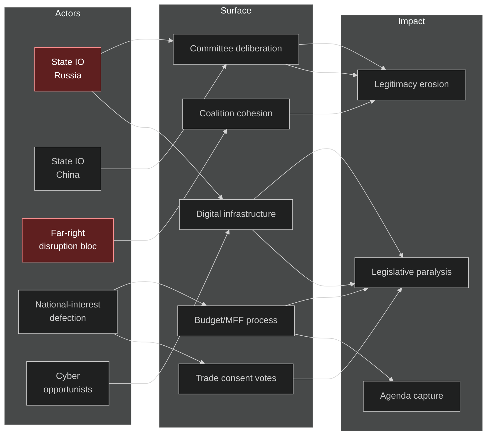
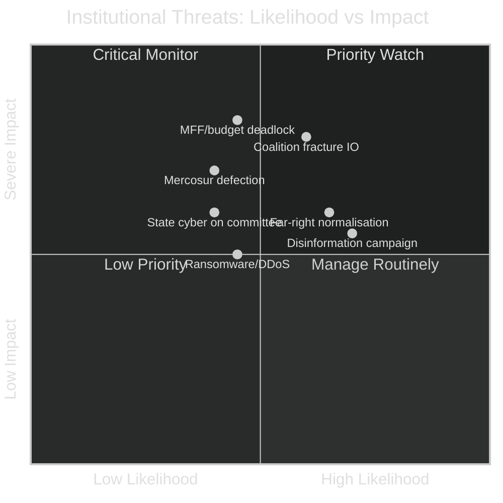
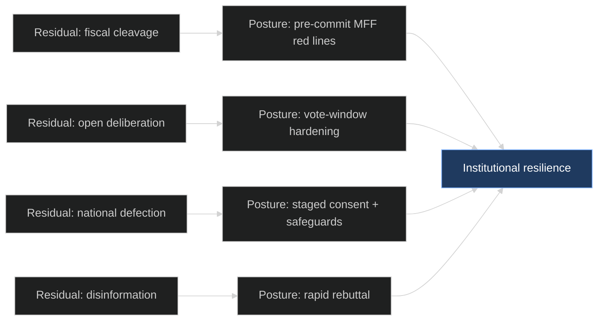

# Threat Model — EU Parliament Year Ahead 2026-2027
**Date:** 2026-05-30 | **Horizon:** 2026-05-30 → 2027-05-30 | **Article Type:** year-ahead
**Methodology:** Political/institutional threat modelling — STRIDE-adapted threat registry + attack-surface analogy for legislative disruption + likelihood×impact scoring + WEP bands + Admiralty grading
**Data mode:** degraded-feeds (substance from 51 adopted texts + structural EP10 knowledge)

---

## Scope

This model treats the European Parliament's **legislative integrity, coalition cohesion and institutional legitimacy** as the assets under threat across the twelve-month horizon. It deliberately frames *political and institutional* disruption — not only cyber — through a security lens: threat actors, an attack-surface analogy, kill-chain-style disruption sequences, likelihood×impact scoring, and mitigations. Cyber and information-operations threats are included where they bear on legislative outcomes. The model is the institutional-resilience companion to `intelligence/scenario-forecast.md` (Scenario E) and `intelligence/wildcards-blackswans.md`.

---

## Threat overview



---

## Threat actor registry

### TA-1 — Russian state influence operations (SVR/GRU/FSB)
**Motivation:** degrade EU unity on Ukraine; obstruct asset-based financing; fracture the grand coalition.
**Capability:** 🔴 ADVANCED (nation-state). **Intent:** 🔴 HIGH (documented, ongoing).
**WEP of material activity in horizon: Highly Likely.**
**Vectors:** spear-phishing of AFET/BUDG staff on Ukraine-financing dossiers; disinformation timed to asset-seizure votes; amplification of net-contributor grievance to stress the MFF; DDoS during critical vote windows. **Source/reliability: C3** (OSINT-derived attribution).

### TA-2 — Chinese state influence operations (MSS)
**Motivation:** shape EU posture on DMA/DSA enforcement, AI trade strategy, and Mercosur diversification.
**Capability:** 🔴 ADVANCED. **Intent:** 🟡 MEDIUM (selective, high-value).
**WEP of material activity: Likely.**
**Vectors:** targeting INTA/ITRE staff on trade and digital files; influence via academic/cultural fronts; supply-chain exposure in the EP vendor ecosystem. **Source/reliability: C3.**

### TA-3 — Domestic far-right disruption bloc
**Motivation:** amplify legislative disruption; delegitimise institutional governance; normalise the EPP+ECR+PfE majority.
**Capability:** 🟡 MEDIUM (parliamentary procedure + media). **Intent:** 🔴 HIGH.
**WEP of material activity: Highly Likely** (this is routine parliamentary behaviour, not covert).
**Vectors:** procedural obstruction; amplification of farm/energy-cost grievance; selective leaks from committee deliberation; symbolic-resolution provocations. **Source/reliability: B2** (public record).

### TA-4 — National-interest defection (cross-group)
**Motivation:** protect domestic farm/fiscal interests against group discipline — chiefly on Mercosur, CAP and the MFF.
**Capability:** 🟡 MEDIUM (votes, not coercion). **Intent:** 🟡 MEDIUM (issue-contingent).
**WEP: Roughly Even Chance** on a marquee trade/budget vote.
**Vectors:** French/Polish/Irish farm defection on Mercosur consent; net-contributor delegations stalling the MFF. This is the threat most aligned with `scenario-forecast.md` Scenarios C and D. **Source/reliability: B2** (structural).

### TA-5 — Opportunistic cyber actors
**Motivation:** ransomware; data theft; resale.
**Capability:** 🟡 MEDIUM (commodity tools). **Intent:** 🟡 MEDIUM (targets of opportunity).
**WEP: Roughly Even Chance** of a material incident in horizon.
**Vectors:** ransomware against administrative systems; credential phishing; third-party vendor compromise. **Source/reliability: C3.**

---

## Attack-surface analogy for legislative disruption

Legislative integrity can be modelled as an **attack surface** with entry points, exploits and payloads. This analogy is heuristic, not literal.

| Surface (entry point) | "Exploit" (disruption method) | "Payload" (outcome) | Primary actor |
|-----------------------|-------------------------------|---------------------|---------------|
| Coalition cohesion | grievance amplification splitting EPP from S&D | rightward drift / paralysis | TA-1, TA-3 |
| Budget/MFF process | net-contributor vs cohesion deadlock | provisional-twelfths risk | TA-4 |
| Trade consent votes | national-farm defection on Mercosur | consent failure / rupture | TA-4 |
| Committee deliberation | leak / phishing of negotiating positions | chilled deliberation, eroded trust | TA-1, TA-2 |
| Digital infrastructure | DDoS / ransomware in a vote window | procedural delay, legitimacy hit | TA-1, TA-5 |
| Information environment | disinformation timed to a vote | distorted public mandate | TA-1, TA-2, TA-3 |

The highest-value surface in this horizon is **coalition cohesion**: it is cheap to stress (grievance amplification), structurally fragile under stagnation, and yields the largest payload (agenda capture without a single line of code).

---

## Disruption kill-chain — highest-priority scenario

**Scenario: information operation to fracture the grand coalition around the MFF/Ukraine-financing nexus (TA-1, highest-probability high-impact).**

```
RECONNAISSANCE  -> Map net-contributor MEP grievances + AFET/BUDG staff (public committee rosters)
WEAPONISATION   -> Craft grievance narratives ("northern taxpayers fund eastern cohesion + Ukraine")
DELIVERY        -> Seed via sympathetic media + amplify through TA-3 parliamentary voices
EXPLOITATION    -> Time amplification to asset-seizure / MFF-framing votes
INSTALLATION    -> Narrative embeds in national debate; pressures individual MEP defection
C2              -> Sustained reinforcement around each budget milestone
ACTIONS         -> EPP-S&D trust erodes; budget timetable slips; agenda captured by fiscal fight
```

**Disruption potential:** even without a single compromised account, the *threat* of intelligence collection and narrative pressure changes MEP behaviour and chills open deliberation. The payload is delivered politically, not technically.

---

## Likelihood × impact matrix



| Threat | Likelihood | WEP | Impact | Priority |
|--------|-----------|-----|--------|----------|
| Coalition-fracture information op | 🟡 MEDIUM | Likely | 🔴 HIGH | 🔴 Critical |
| MFF/budget deadlock | 🟡 MEDIUM | Roughly Even | 🔴 HIGH | 🔴 Critical |
| Far-right normalisation via EPP cooperation | 🟡 MEDIUM-HIGH | Likely | 🟡 MEDIUM-HIGH | 🟡 Priority |
| Mercosur national-farm defection | 🟡 MEDIUM | Roughly Even | 🔴 HIGH | 🟡 Priority |
| State cyber on committee deliberation | 🟢 LOW-MEDIUM | Roughly Even | 🟡 MEDIUM | 🟡 Priority |
| Ransomware / DDoS in vote window | 🟢 LOW-MEDIUM | Roughly Even | 🟡 MEDIUM | 🟢 Monitor |
| Disinformation timed to votes | 🟡 HIGH | Highly Likely | 🟡 MEDIUM | 🟡 Priority |

---

## Mitigations and institutional countermeasures

| Threat axis | Mitigation | Status | Adequacy |
|-------------|-----------|--------|----------|
| Coalition fracture | transparent EPP-S&D-RE pre-negotiation on MFF red lines | political, informal | 🟡 MEDIUM |
| Budget deadlock | early publication of red lines; conciliation calendar discipline | procedural | 🟡 MEDIUM |
| Far-right normalisation | EPP self-restraint on institutional files; coalition-trust signalling | political | 🟡 MEDIUM |
| Trade defection | agricultural-safeguard guarantees; staged consent | procedural | 🟡 MEDIUM |
| State cyber / IO | CERT-EP, MFA, classified-document handling, staff training | technical | 🟡 MEDIUM (human factor persists) |
| Ransomware/DDoS | NIS2 implementation, vendor assessment, incident-response plan | technical | 🟢 IMPROVING |
| Disinformation | EP fact-checking liaison; rapid-rebuttal; media literacy | informational | 🟡 MEDIUM |

**Residual risk:** the dominant residual risk is **political, not technical** — the grand coalition's structural fragility under stagnation makes coalition-fracture information operations cheap and high-yield. Cyber countermeasures are improving (NIS2), but no technical control mitigates a grievance narrative that exploits a genuine fiscal cleavage.

---

## Residual-risk and resilience posture

The threat model would be incomplete without an explicit statement of what cannot be mitigated and how the institution should posture against it.

**Irreducible residual risks:**
- **The fiscal cleavage is real.** No control mitigates a grievance narrative that exploits a genuine net-contributor-vs-cohesion tension sharpened by IMF-projected deficits (France -4.94%, Germany -3.78% of GDP in 2026). The cleavage is structural; only political negotiation reduces it. 🟡 MEDIUM.
- **Open deliberation invites collection.** A transparent legislature is, by design, an open intelligence target. The trade-off between deliberative openness and counter-intelligence hardening cannot be fully resolved. 🟡 MEDIUM.
- **National defection is legitimate.** TA-4 (national-interest defection) is not an attack but a feature of representative democracy; it can be managed through safeguards, not prevented. 🟢 HIGH that it persists.

**Resilience posture (preferred over prediction):**
1. **Pre-commit MFF red lines** to deny the coalition-fracture narrative its oxygen.
2. **Stage trade consent** with agricultural-safeguard guarantees to absorb TA-4 pressure.
3. **Harden vote-window infrastructure** (integrity, not just availability) against TA-1/TA-5.
4. **Maintain rapid-rebuttal capacity** against disinformation timed to marquee votes.



The resilience model treats threats the institution **cannot eliminate** (left) by pairing each with a **posture it can adopt** (centre) that collectively raise institutional resilience (right). This reframing — from prevention to resilience — is the correct response to threats that are structural rather than incidental.

---

## Watch-window calendar

| Window | Period | Elevated threat | Posture |
|--------|--------|-----------------|---------|
| MFF framing votes | Q3-Q4 2026 | coalition-fracture IO; defection | 🔴 HIGH alert |
| 2027 budget vote | Q4 2026 | deadlock; cyber integrity | 🔴 HIGH alert |
| Mercosur consent (if scheduled) | Q1-Q2 2027 | national defection; farm disinfo | 🟡 elevated |
| Ukraine asset-financing votes | rolling | TA-1 IO; legal challenge | 🟡 elevated |
| Migration recast trilogue | Q4 2026-Q1 2027 | far-right amplification | 🟡 elevated |

The calendar concentrates security attention on the **fiscal cluster** (Q4 2026), which is simultaneously the highest-stakes legislative window and the most attractive target for coalition-fracture operations — the convergence that makes it the year's single critical period.

---

## Threat-model judgement

🟡 **ELEVATED.** Above baseline, driven by (1) the Ukraine-financing nexus that motivates TA-1; (2) the stagnationary fiscal cleavage that makes coalition-fracture operations cheap; and (3) the structural rise of ad-hoc right majorities that TA-3 seeks to normalise. **Critical windows:** MFF-framing and 2027-budget votes (Q4 2026) and any Mercosur consent vote — these are 🔴 HIGH-threat windows warranting heightened posture.

**WEP summary:** material state/IO activity — Highly Likely; coalition-stress operations — Likely; a *successful* institution-capturing disruption within horizon — Unlikely (the centre's structural resilience holds in the base case).

---

## Admiralty Credibility Rating

**Source reliability:** B (far-right/national-defection threats, public record) / C (state-IO and cyber, OSINT attribution).
**Information reliability:** 2 (structural/political) → 3 (attribution/capability).
**Overall: B2** for the political/institutional threat layer; **C3** for cyber and state-IO attribution.

| Threat layer | Source reliability | Admiralty grade |
| --- | --- | --- |
| Political / institutional (far-right disruption, national defection) | Public record, structural arithmetic | B2 |
| Cyber operations (ransomware, phishing, vendor compromise) | OSINT-derived | C3 |
| State information operations (Russia, China attribution) | OSINT-derived, estimative | C3 |

The political threat surface is well-evidenced from the adopted-texts record and structural arithmetic; the cyber and state-attribution layer rests on open-source reporting and would be modified by classified assessments.

---

*Methodology: STRIDE-adapted institutional threat registry + attack-surface analogy + kill-chain disruption mapping + likelihood×impact scoring. WEP bands per ICD 203; Admiralty grading throughout. Political claims grounded in EP `/adopted-texts` 2026 and structural EP10 knowledge; cyber claims are OSINT-derived. Degraded-feeds caveat applies — see `intelligence/mcp-reliability-audit.md`.*
