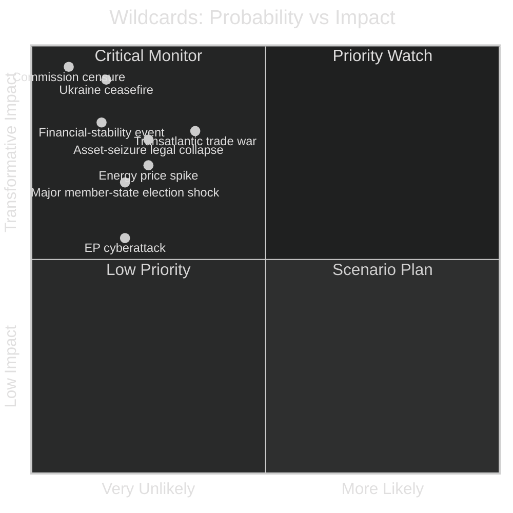
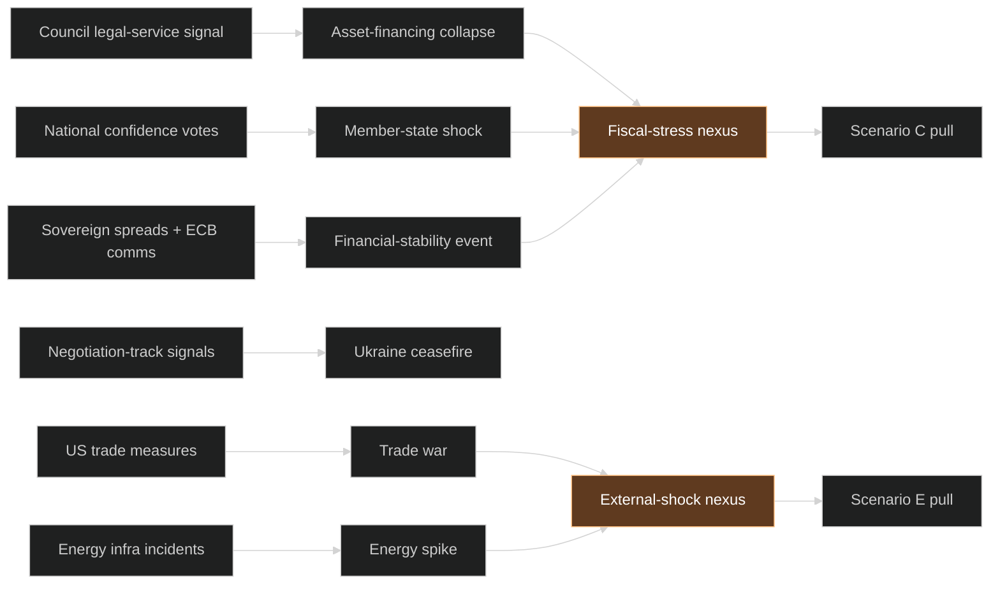

# Wildcards and Black Swans — EU Parliament Year Ahead 2026-2027
**Date:** 2026-05-30 | **Horizon:** 2026-05-30 → 2027-05-30 | **Article Type:** year-ahead
**Methodology:** Wildcard / black-swan analysis (CIA Red Cell-adapted) + what-if testing + WEP bands + Admiralty grading
**Data mode:** degraded-feeds (substance from 51 adopted texts + IMF live WEO + structural EP10 knowledge)

---

## Framework

**Wildcards** are low-probability, high-impact events that are *foreseeable* — individually unlikely but collectively significant, and amenable to early-indicator monitoring. **Black swans** are *genuinely unforeseen* events that would invalidate the base-case analysis if they occurred. This artifact catalogues eight wildcards and two black-swan classes for the twelve-month horizon, each with a WEP probability band, impact rating, what-if reasoning, and early indicators. Probabilities are indicative orders of magnitude, not statistical frequencies. **Overall reliability of this artifact: C3** — speculative by construction.

The wildcard portfolio is the tail-risk companion to `intelligence/scenario-forecast.md` (especially Scenario E, External-Shock Capture) and `intelligence/threat-model.md`.

---

## Portfolio map

---

## Wildcard 1 — Commission censure motion
**WEP: Almost No Chance → Highly Unlikely (~7%) | Impact: CATASTROPHIC | Confidence: 🔴 LOW**

Parliament retains the Article 234 TFEU power to censure the Commission (absolute majority, 361+ votes). The arithmetic is theoretically reachable only via an anti-mainstream coalition that would require ECR + PfE + ESN + significant EPP/Renew/Green defections — politically implausible while the von der Leyen II Commission delivers the competitiveness agenda the EPP wants.

**What-if:** if a major financial scandal or a perceived enforcement-capture failure (DMA/DSA) implicated Commissioners, the far-right would *threaten* censure for leverage but ultimately prefer a Commission it can influence. **Early indicators:** a Commissioner resignation; a coordinated cross-bloc censure-threat statement; EPP public distancing from a Commissioner. **Source/reliability: C3.**

---

## Wildcard 2 — Surprise Ukraine ceasefire
**WEP: Unlikely (~16%) | Impact: TRANSFORMATIVE | Confidence: 🔴 LOW**

A negotiated or imposed ceasefire would reorient the entire foreign-policy and defence-financing agenda. Reconstruction-framework legislation would accelerate; the immobilised-Russian-assets financing logic would mutate toward reparations/reconstruction; and accountability debates (war-crimes tribunal, EP role) would dominate.

**What-if:** a ceasefire could *fracture* the mainstream coalition on terms (justice-vs-pragmatism) even as it relieves the financing friction — a divisive rather than unifying shock. **Early indicators:** negotiation-track signals; US-mediation announcements; a sudden shift in Council language on asset use. **Source/reliability: C3.** This is the single most transformative wildcard of the horizon.

---

## Wildcard 3 — Immobilised-asset financing legal collapse
**WEP: Unlikely (~25%) | Impact: HIGH | Confidence: 🟡 MEDIUM**

The macro-financial loan for Ukraine framed around immobilised Russian assets is legally novel. A CJEU challenge, a Council legal-service adverse opinion, or a member-state veto on the asset-seizure basis could collapse the mechanism mid-horizon, forcing a scramble for alternative financing under fiscal stress.

**What-if:** with France running a fiscal deficit of -4.94% of GDP and Germany at -3.78% (IMF WEO), member-state budgets cannot easily backfill a collapsed asset-based instrument — turning a legal setback into a fiscal crisis and feeding `scenario-forecast.md` Scenario C. **Early indicators:** Council legal-service opinions; a member-state reservation; CJEU docketing of an asset challenge. **Source/reliability: B2** (adopted-texts mechanism is real; legal-risk read is estimative).

---

## Wildcard 4 — Transatlantic trade war
**WEP: Roughly Even Chance (~35%) | Impact: HIGH | Confidence: 🟡 MEDIUM**

US-administration trade posture is uncertain. A move to broad tariffs on EU goods, met by EU retaliation, would capture INTA and the plenary, sharpen the Mercosur diversification logic, and stress the export-exposed large economies precisely as they stagnate (German GDP +0.79%, Italian +0.52% in 2026, IMF WEO).

**What-if:** a tariff shock would *strengthen* the strategic case for Mercosur (diversification) while *worsening* the farm politics around it — pulling Scenarios A, B and D simultaneously. **Early indicators:** US trade-measure announcements; Trans-Atlantic Economic Council friction; retaliation-list drafting in INTA. **Source/reliability: C3.**

---

## Wildcard 5 — Energy-price spike
**WEP: Unlikely (~25%) | Impact: HIGH | Confidence: 🟡 MEDIUM**

Despite diversification from Russian gas, Europe remains exposed to a Middle East escalation (Strait of Hormuz / LNG), Baltic or North Sea infrastructure sabotage, or an extreme-weather generation shortfall. A spike would fast-track emergency energy legislation (2022 precedent) and intensify the climate-vs-cost recalibration the far-right amplifies.

**What-if:** a spike arriving during the MFF fight would compound fiscal stress and hand the deregulatory "omnibus" camp a powerful cost-of-living argument. **Early indicators:** Middle East escalation; subsea-infrastructure incidents; cold-snap generation warnings; TTF price moves. **Source/reliability: C3.**

---

## Wildcard 6 — Major member-state election or government shock
**WEP: Unlikely (~20% for at least one surprise) | Impact: HIGH | Confidence: 🟡 MEDIUM**

MEP group membership is fixed mid-term, but a French snap election, a German coalition collapse, or an early Italian vote would shift the *national* political gravity behind individual MEPs, pressuring deviation from group lines on the MFF, Mercosur and migration.

**What-if:** a French government collapse during the MFF negotiation would freeze a key net-contributor position for months, stalling the file (Scenario C amplifier). **Early indicators:** national confidence-vote signals; coalition-partner withdrawal threats; presidential-authority erosion. **Source/reliability: C3.**

---

## Wildcard 7 — Financial-stability event
**WEP: Unlikely (~15%) | Impact: HIGH | Confidence: 🟡 MEDIUM**

The 2026 banking-union-deepening agenda sits against mild reflation (German CPI 2.65%, Italian 2.64% in 2026, IMF WEO) and widening sovereign deficits. A sovereign-bank-doom-loop scare — most plausibly around a high-deficit sovereign — would pull the ECB and the banking-union files to the centre and crowd the legislative calendar.

**What-if:** a stability event would *accelerate* banking-union deepening (crisis-as-catalyst) while *worsening* the MFF fiscal fight — a double-edged shock. **Early indicators:** sovereign-spread widening; ECB emergency communications; bank-funding-stress signals. **Source/reliability: B2** (banking agenda real; trigger estimative).

---

## Wildcard 8 — Cyberattack on EP systems in a vote window
**WEP: Unlikely but non-trivial (~20%) | Impact: MEDIUM-HIGH | Confidence: 🟡 MEDIUM**

The EP's open, distributed digital estate is exposed. A data-integrity attack (as opposed to mere availability) timed to a critical MFF or Ukraine vote would be higher-impact than the 2022 DDoS precedent, casting doubt on a vote record and eroding legitimacy.

**What-if:** even a *suspected* integrity compromise during the 2027-budget vote could force a re-run and a legitimacy debate the far-right would amplify. **Early indicators:** reconnaissance against committee staff; vendor-ecosystem compromises; threat-actor chatter ahead of marquee votes. **Source/reliability: C3.** Cross-reference `intelligence/threat-model.md` TA-1/TA-5.

---

## Pre-mortem stress test of the base case

A disciplined wildcard analysis must imagine the base case *failing*. Suppose that by May 2027 the Year-Ahead base case (Scenario A, Managed Grand Coalition) has been falsified — what wildcard combination most plausibly did it?

The most likely falsifier is **not a single black swan but a correlated cluster**: a downward IMF growth revision (deepening the stagnation already at German +0.79% / Italian +0.52% in 2026) arriving alongside a transatlantic trade rupture (W4) and an asset-financing legal setback (W3). Each alone is survivable; together they would simultaneously starve the MFF (fiscal), capture the agenda (trade), and remove a Ukraine-financing pillar (legal) — collapsing A into a blend of C and E. This clustering insight is the single most important output of the wildcard exercise: **the institution is robust to any one tail event and fragile to a correlated triad.**

The secondary falsifier is a **divisive Ukraine inflection** (W2 ceasefire on contested terms), which would split the centre on justice-vs-pragmatism precisely where it is otherwise unified — a values cleavage that no fiscal compromise can paper over.

---

## What-if deep dives

### What-if: asset-financing collapses mid-MFF (W3 × MFF)
If the immobilised-asset mechanism fails legally during the MFF negotiation, member states would face backfilling a multi-billion Ukraine commitment from national budgets already in deficit (France -4.94%, Germany -3.78% of GDP, IMF WEO). The realistic outcome is not abandonment of Ukraine but a **bitter redistribution fight** layered onto the MFF — the worst-case fusion of W3 and Scenario C. 🟡 MEDIUM that this combination, if W3 occurs, tips the year into gridlock.

### What-if: tariff war during stagnation (W4 × economic)
A transatlantic tariff war striking export-dependent economies already at near-zero growth would convert a trade dispute into a domestic-political emergency in Germany, France and Italy, forcing an EP-level response while simultaneously strengthening the strategic logic for Mercosur. The paradox — a trade shock that *helps* one trade file (Mercosur diversification) while *hurting* the economy — is the defining what-if of the external dimension. 🟡 MEDIUM.

### What-if: energy spike into the climate debate (W5 × legislative)
An energy-price spike would hand the deregulatory "omnibus" camp a cost-of-living argument of unusual force, accelerating environmental recalibration beyond what Scenario B alone implies and giving the far-right a potent amplification theme. 🟡 MEDIUM.

---

## Indicator-to-wildcard wiring

The wiring diagram makes the monitoring task concrete: six observable indicators feed eight wildcards, which cluster into two nexuses (fiscal-stress and external-shock) that respectively pull toward Scenarios C and E. An analyst watching the six left-hand indicators is, in effect, watching the entire tail-risk portfolio.

---

## Black-swan classes (genuinely unforeseen)

### BS-1 — Institutional discontinuity
An abrupt leadership crisis (EP President, a major group leader), a constitutional-court ruling reshaping EU competence, or a treaty-level event could invalidate the coalition arithmetic this analysis assumes. **WEP: Almost No Chance individually | Impact: TRANSFORMATIVE.** By definition no reliable early indicator exists; the analytic response is *resilience*, not prediction. 🔴 LOW.

### BS-2 — Exogenous systemic event
A pandemic-scale health event, a large-scale natural disaster, or a major non-European geopolitical rupture (e.g. a Taiwan-Strait crisis) would displace the entire EU agenda. **WEP: Almost No Chance individually | Impact: TRANSFORMATIVE.** 🔴 LOW.

The proper treatment of black swans is not probability estimation but **portfolio robustness**: the base-case judgements in `intelligence/synthesis-summary.md` should be read as conditional on the absence of BS-1/BS-2.

---

## What-if cross-impact summary

| Wildcard | Pulls toward scenario | Compounds with |
|----------|----------------------|----------------|
| Asset-financing collapse (W3) | C (Fiscal Gridlock) | W6, W7 |
| Transatlantic trade war (W4) | D (Trade-Farm Rupture) + E | W5 |
| Energy spike (W5) | E (External-Shock Capture) | W4, W7 |
| Member-state shock (W6) | C | W3 |
| Financial-stability event (W7) | C + E | W3, W6 |
| Ukraine ceasefire (W2) | E (divisive variant) | — |

The clustering shows a **fiscal-stress nexus** (W3+W6+W7) capable of converging on Scenario C, and an **external-shock nexus** (W4+W5) feeding Scenario E. Monitoring should treat these as correlated, not independent.

---

## Early-indicator dashboard (ranked)

1. 🟡 **Council legal-service signals on asset-based financing** (W3) — highest-leverage tell.
2. 🟡 **US trade-measure announcements** (W4).
3. 🟡 **Sovereign-spread + ECB emergency comms** (W7).
4. 🟡 **Ukraine negotiation-track signals** (W2).
5. 🟡 **National confidence-vote / coalition-collapse signals** (W6).
6. 🟡 **Energy-infrastructure incidents + TTF moves** (W5).
7. 🟢 **EP-systems reconnaissance / vendor compromise** (W8).
8. 🟢 **Cross-bloc censure-threat statements** (W1).

---

## Admiralty Credibility Rating

**Source reliability: C (fairly reliable)** — wildcard analysis is inherently speculative, grounded in structured scenario methodology rather than direct evidence.
**Information reliability: 3 (possibly true)** for foreseeable wildcards; **4-5 (doubtful)** for black-swan classes.
**Overall: C3** for the wildcard portfolio; **D5** for black swans — to be treated as contingency prompts, not forecasts.

| Class | Source reliability | Admiralty grade |
| --- | --- | --- |
| Foreseeable wildcards (W1–W8) | Structured scenario methodology, estimative | C3 |
| Black-swan classes (BS-1, BS-2) | Speculative by construction | D5 |

**Highest-priority monitoring:** W3 (asset-financing legal collapse) and W4 (transatlantic trade war) — the combination of meaningful probability, high impact, and a live early-indicator channel makes them the most actionable tail risks of the horizon.

---

**Analyst's closing note:** the discipline of wildcard analysis is not prediction but **pre-imagination** — rehearsing the unlikely so that, if it arrives, the institution recognises it early rather than late. The eight wildcards and two black-swan classes here are rehearsal prompts, not forecasts.

---

*Methodology: CIA Red Cell-adapted wildcard/black-swan analysis with what-if cross-impact testing. WEP bands per ICD 203; probabilities are indicative orders of magnitude. Economic anchors (German GDP +0.79%, France deficit -4.94% of GDP, German CPI 2.65% in 2026) drawn from IMF WEO live (vintage 2025-09-23) under the sole-source rule. Confidence is 🔴 LOW by construction — these are definitionally low-probability events. Degraded-feeds caveat applies — see `intelligence/mcp-reliability-audit.md`.*
