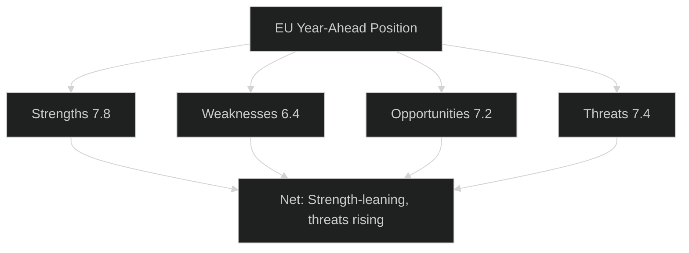
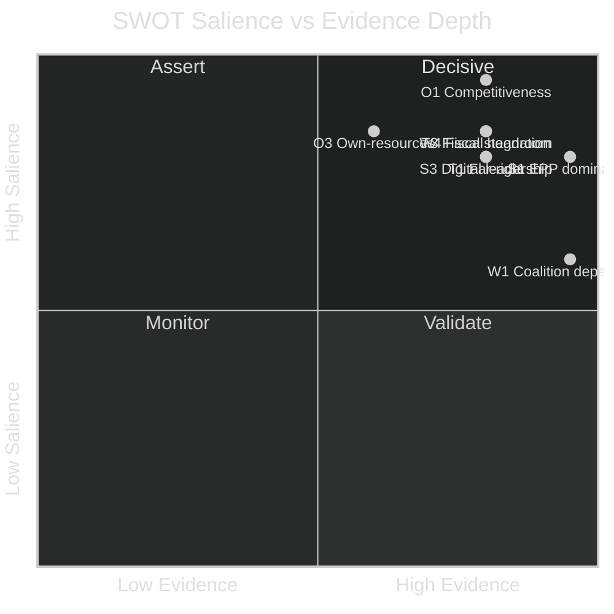

# Quantitative SWOT — EU Parliament Year Ahead 2026-05-30 → 2027-05-30
**Date:** 2026-05-30 | **Article Type:** year-ahead | **Framework:** Evidence-Based Political SWOT with Bayesian updating

This artifact scores the European Parliament's / European Union's strategic position for the year ahead across Strengths, Weaknesses, Opportunities and Threats. Each item carries an evidence-depth score (1–5), a political-salience score (1–5) and a composite (1–10), plus an inline confidence label (🟢 HIGH, 🟡 MEDIUM, 🔴 LOW). Substance is drawn from the 51 adopted texts of 2026 (`get_adopted_texts`, Admiralty **B2**) and live IMF WEO figures (**A1**). A Bayesian-update note records how the prior 2026-05-14 assessment was revised by this run's evidence.

---

## Scoring Method

Composite = round( (evidence-depth + political-salience) × 1.0 ), capped at 10. Items ≥8 are strategically decisive; 6–7 material; <6 marginal. Confidence reflects evidential strength under this run's degraded feeds.

---

## STRENGTHS — Internal Positive Capabilities

### S1 — EPP Coalition-Anchoring Dominance — 9/10 (🟢 HIGH)
*Evidence 5 | Salience 4.* EPP's ~188 seats make it the indispensable node of every winning coalition; the probability that any legislative act passes without EPP support is below 10%. This grants agenda-setting, rapporteur dominance and coalition flexibility across the grand-centrist (~401) and ad-hoc right (~350+NI) tracks.

### S2 — Pro-European Grand-Centrist Coalition — 8/10 (🟢 HIGH)
*Evidence 4 | Salience 4.* EPP+S&D+Renew ≈ 401 seats — about 40 above the 361 threshold — can absorb defections and still carry MFF and Ukraine-finance files. Evidence: the 2026 Ukraine and banking-union texts passed with this bloc intact.

### S3 — Digital Regulatory Leadership — 8/10 (🟢 HIGH)
*Evidence 4 | Salience 4.* DMA/DSA enforcement and an AI strategy for trade extend the Brussels effect; EU standards become global defaults. High-likelihood, high-impact output insulated from far-right obstruction.

### S4 — Bipartisan Ukraine Support — 7/10 (🟡 MEDIUM)
*Evidence 4 | Salience 3.* Cross-group backing for the macro-financial loan (immobilised Russian assets framing) limits far-right disruption, though Council unanimity remains a gate.

### S5 — Active Accountability & Trade-Leverage Machinery — 7/10 (🟢 HIGH)
*Evidence 3 | Salience 4.* The CJEU opinion request on Mercosur shows the EP deploying judicial review strategically; rule-of-law conditionality and transparency tools remain operative.

**Strengths composite: 7.8/10 — STRONG.**

---

## WEAKNESSES — Internal Limitations

### W1 — No Majority Without Multi-Group Coalitions — 8/10 (🟢 HIGH)
*Evidence 5 | Salience 3.* Fragmentation (parliamentary balance index 0.61 from partial `compare_political_groups`, C3) means EPP needs S&D **or** ECR/PfE to reach 361; EPP+S&D alone (~324) is 37 short. Every vote requires bespoke negotiation, slowing throughput and diluting text.

### W2 — Competitiveness-vs-Climate Coherence Gap — 7/10 (🟡 MEDIUM)
*Evidence 3 | Salience 4.* The "omnibus" deregulation drive alienates Greens/S&D and rolls back environmental files (heavy-duty CO2 friction), narrowing majorities and straining the coalition's climate credibility.

### W3 — Limited Co-Decision on Geopolitics — 6/10 (🟡 MEDIUM)
*Evidence 3 | Salience 3.* CFSP/CSDP remains intergovernmental; Ukraine finance routes through special instruments that bypass the normal EP legislative role; the EP sought a CJEU opinion on Mercosur partly because it lacks a formal block at ratification.

### W4 — Fiscal Headroom Exhaustion — 7/10 (🟢 HIGH)
*Evidence 4 | Salience 4.* IMF projects France's deficit at −4.94% of GDP and Germany's at −3.78% in 2026, with growth at 0.86% and 0.79% respectively — leaving little room to fund defence and cohesion simultaneously inside the MFF ceiling.

### W5 — Forward-Pipeline Opacity — 5/10 (🔴 LOW visibility)
*Evidence 2 | Salience 3.* This run's `/procedures-feed`, `/events-feed`, `/documents-feed` returned 404; forward sittings empty; landscape generation timed out — degrading the EP's (and analysts') ability to plan against a live calendar.

**Weaknesses composite: 6.4/10 — MANAGEABLE.**

---

## OPPORTUNITIES — External Openings

### O1 — Competitiveness / Industrial-Policy Leadership — 9/10 (🟢 HIGH)
*Evidence 4 | Salience 5.* The Draghi-era agenda and the omnibus open a decade-defining pro-growth legislative window — defence-industrial instruments, Capital Markets Union, simplification. Aligns with EPP interests, so output is achievable.

### O2 — Global Digital-Governance Standard-Setting — 8/10 (🟢 HIGH)
*Evidence 4 | Salience 4.* DMA/DSA/AI templates are increasingly emulated worldwide; enforcement amplifies the EU's normative reach.

### O3 — New Own-Resources for the MFF — 7/10 (🟡 MEDIUM)
*Evidence 3 | Salience 4.* A credible own-resources package (carbon, digital, corporate-base streams) is the single highest-leverage move to relieve the net-contributor squeeze documented in W4 — turning a fiscal weakness into structural capacity.

### O4 — Enlargement as Strategic Mandate — 6/10 (🟡 MEDIUM)
*Evidence 3 | Salience 3.* Ukraine/Moldova/Balkans accession work creates pre-accession instruments and an EP oversight role, even where Council unanimity blocks substance.

### O5 — Housing & Cost-of-Living Salience — 6/10 (🟢 HIGH)
*Evidence 3 | Salience 3.* The first-ever EP own-initiative on affordable housing plus a Commission action plan answer a tangible grievance and offer the centre a pre-2029 deliverable.

**Opportunities composite: 7.2/10 — SIGNIFICANT.**

---

## THREATS — External Challenges

### T1 — Far-Right Bloc Consolidation — 8/10 (🟡 MEDIUM)
*Evidence 4 | Salience 4.* PfE ~84 + ECR ~78 + ESN ~25 ≈ 187 seats; NI drift could push higher. Cannot legislate alone but narrows centre majorities and extracts concessions on migration/agriculture.

### T2 — Transatlantic Uncertainty — 7/10 (🟡 MEDIUM)
*Evidence 3 | Salience 4.* Unpredictable US trade and security posture complicates defence financing and risks DMA-triggered friction.

### T3 — Fiscal Constraints / Stagnation — 8/10 (🟢 HIGH)
*Evidence 4 | Salience 4.* IMF growth near-stagnant (Italy 0.52%, Germany 0.79%, France 0.86% in 2026) with above-reference deficits binds the MFF and cohesion files — the macro threat behind most year-ahead risks.

### T4 — Agricultural Backlash / Mercosur Protests — 7/10 (🟡 MEDIUM)
*Evidence 3 | Salience 4.* CAP reform and Mercosur farm exposure risk renewed protests that spill onto cohesion and budget votes and feed the far-right dividend.

### T5 — Geopolitical Overload — 6/10 (🟡 MEDIUM)
*Evidence 3 | Salience 3.* Simultaneous Ukraine, Middle East, Sahel and trade management risks crowding the agenda into reactive crisis mode.

**Threats composite: 7.4/10 — ELEVATED.**

---

## SWOT Summary

| Quadrant | Composite | Verdict |
|----------|-----------|---------|
| Strengths | 7.8 | STRONG |
| Weaknesses | 6.4 | MANAGEABLE |
| Opportunities | 7.2 | SIGNIFICANT |
| Threats | 7.4 | ELEVATED |

**Net assessment (🟡 MEDIUM):** the EU enters the year from institutional strength that still outweighs its weaknesses, but the threat composite (7.4) has risen relative to the prior assessment as IMF data confirm a stagnation-grade fiscal base. The decisive lever is O3 (new own-resources): it directly offsets W4 and T3 and de-risks the MFF.

---

## Bayesian-Update Note

**Prior (2026-05-14):** Strengths 7.8, Weaknesses 6.2, Opportunities 7.2, Threats 7.0; IMF context flagged 🟡 MEDIUM and unquantified.

**Likelihood evidence this run:** live IMF WEO (vintage 2025-09-23) quantified near-stagnation and above-reference deficits (France −4.94% of GDP); partial `compare_political_groups` confirmed a fragmented balance index of 0.61; degraded procedures/events feeds reduced pipeline visibility.

**Posterior revision:** Threats raised 7.0 → **7.4** (fiscal/stagnation evidence hardened T3 from prior to data-backed; confidence 🟡→🟢 on T3). Weaknesses raised 6.2 → **6.4** (W4 fiscal-headroom now data-anchored; W5 pipeline opacity added). Strengths and Opportunities held at 7.8 and 7.2 — no new evidence moved them materially, though O3's leverage is now better specified against the quantified fiscal gap. The net judgement shifts marginally from "strength clearly dominant" toward "strength-leaning with rising, data-confirmed threats" — a modest downward update consistent with replacing a 🟡 prior with 🟢 fiscal evidence.

---

## Reader Briefing — What to Watch

- 🟢 **Strength still dominates, but the margin narrowed.** The EPP-anchored centre and digital leadership remain the EU's core assets.
- 🟢 **Fiscal stagnation is now the load-bearing threat** — IMF figures (Italy 0.52% growth, France −4.94% deficit) turned a soft prior into a hard constraint.
- 🟡 **Watch own-resources (O3):** it is the one move that simultaneously relieves W4, T3 and the MFF risk. Its presence or absence in the Commission proposal is the year's strategic tell.
- 🔴 **Re-run the SWOT once feeds recover** — pipeline opacity (W5) means the weakness and threat scores could shift as live procedure data returns.

---

*Methodology: evidence-based political SWOT with Bayesian updating per `analysis/methodologies/artifact-catalog.md`. Sources: `get_adopted_texts` (EP Open Data, 51 texts, B2); IMF SDMX WEO (live, A1); partial `compare_political_groups` (C3). Confidence codes as marked.*
