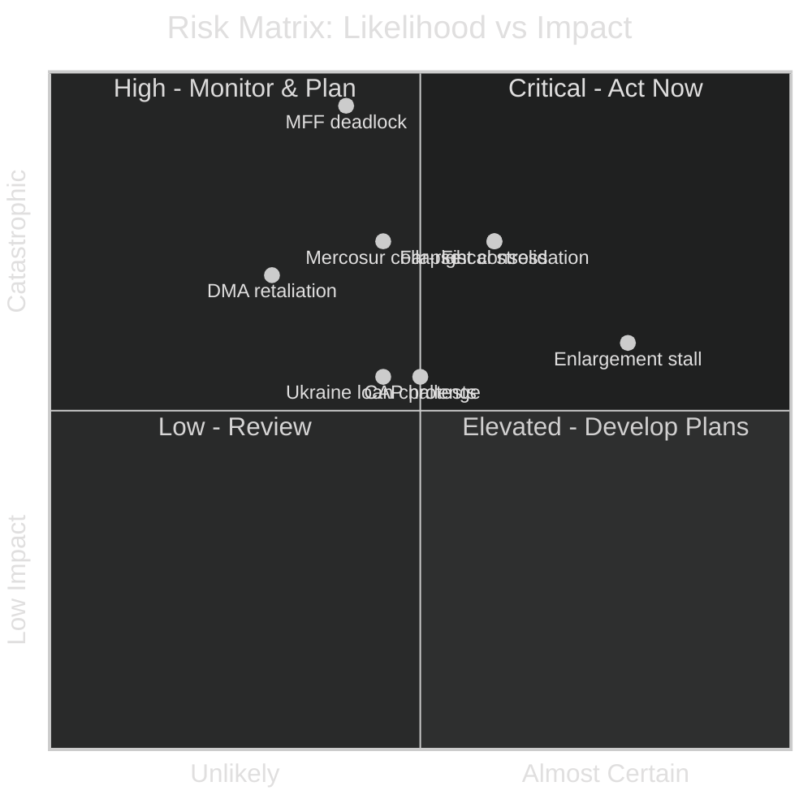
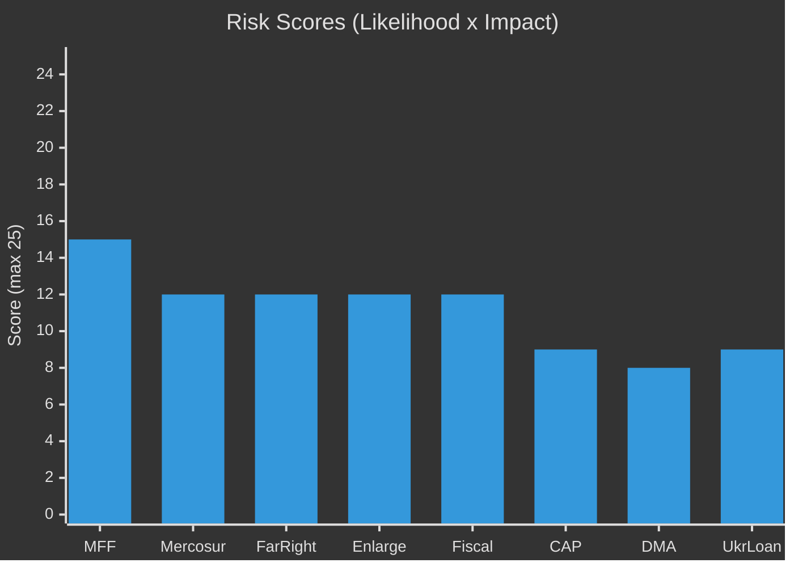

# Risk Matrix — EU Parliament Year Ahead 2026-05-30 → 2027-05-30
**Date:** 2026-05-30 | **Article Type:** year-ahead | **Methodology:** Likelihood × Impact Scoring with WEP probability bands

This artifact registers the top political risks of the year ahead, scores each on likelihood × impact, attaches a **Words of Estimative Probability (WEP)** band, and records mitigations and residual risk. Confidence inline: 🟢 HIGH, 🟡 MEDIUM, 🔴 LOW. Substance from the 51 adopted texts of 2026 (`get_adopted_texts`) and live IMF WEO. Overall source reliability for this register: **Admiralty B2** for structural risks, **C3** for tail and third-order risks.

---

## Scoring Framework

- **Likelihood scale:** 1 (Almost No Chance) → 5 (Almost Certain).
- **Impact scale:** 1 (Negligible) → 5 (Catastrophic).
- **Risk score:** Likelihood × Impact (max 25). Threshold: **≥12 HIGH**, **8–11 MEDIUM**, **<8 LOW**.
- **WEP bands:** Almost Certain (≥90%) / Highly Likely (75–89%) / Likely (60–74%) / Roughly Even (45–59%) / Even Chance (≈50%) / Unlikely (25–44%) / Highly Unlikely (10–24%) / Almost No Chance (<10%).

---

## Risk Register

### RISK-001 — MFF post-2027 Deadlock → Provisional Twelfths
| Parameter | Value |
|-----------|-------|
| **Category** | Institutional / Fiscal |
| **Likelihood** | 3 — *Unlikely-to-Roughly-Even* (WEP: 40%) |
| **Impact** | 5 (Catastrophic — all EU programmes disrupted) |
| **Risk score** | **15 — HIGH** |
| **Owner** | BUDG Committee + Council presidency |
| **Horizon** | Q4 2026 → Q2 2027 |
| **Evidence** | 2027 budget guidelines adopted; net-contributor squeeze per IMF (Germany deficit −3.78% of GDP, France −4.94% in 2026) |
| **Mitigation** | Early own-resources debate; special-instrument routing for Ukraine; precedent for eventual resolution (2013, 2020) |
| **Residual** | 10 — MEDIUM |

*Analysis (🟡 MEDIUM):* the MFF is the year's dominant fiscal battleground. With France and Germany both fiscally stretched (IMF WEO), the net-contributor-versus-cohesion split is unusually hard. A full deadlock into provisional twelfths is **Unlikely** but no longer remote; brinkmanship into 2027 is **Likely**.

---

### RISK-002 — EU–Mercosur Ratification Collapse
| Parameter | Value |
|-----------|-------|
| **Category** | Trade / Institutional |
| **Likelihood** | 3 — *Roughly Even* (WEP: 45%) |
| **Impact** | 4 (Serious — largest trade deal stalls/fails) |
| **Risk score** | **12 — HIGH** |
| **Owner** | DG Trade; INTA Committee; CJEU |
| **Horizon** | Q3 2026 → Q2 2027 |
| **Evidence** | CJEU opinion sought + agricultural safeguards (2026 adopted texts) |
| **Mitigation** | Front-loaded beef/poultry/ethanol safeguards; protocol adjustments; trade-diversification logic |
| **Residual** | 9 — MEDIUM |

*Analysis (🟡 MEDIUM):* France, Poland and Ireland farm resistance is potent; the CJEU opinion adds a legal wildcard. Outright collapse is **Roughly Even**; a delayed, safeguard-laden ratification is the modal outcome.

---

### RISK-003 — Far-Right Bloc Consolidation Erodes Centre Majorities
| Parameter | Value |
|-----------|-------|
| **Category** | Political |
| **Likelihood** | 3 — *Likely on incremental drift* (WEP: 60%) |
| **Impact** | 4 (Serious — mainstream majority narrows) |
| **Risk score** | **12 — HIGH** |
| **Owner** | EPP leadership / President Metsola |
| **Horizon** | Continuous (mid-term to 2029) |
| **Evidence** | PfE ~84 + ECR ~78 + ESN ~25 ≈ 187; partial `compare_political_groups` (PfE 85, ECR 81, ESN 27; balance index 0.61, C3) |
| **Mitigation** | EPP's structural need for Renew/S&D on institutional files; reputational cost of right-stretch majorities |
| **Residual** | 9 — MEDIUM |

*Analysis (🟡 MEDIUM):* incremental NI drift toward the ECR/PfE orbit is **Likely**; a wholesale realignment that displaces the grand-centrist bloc is **Unlikely** within the year. The risk is gradual majority-narrowing on migration and environment files.

---

### RISK-004 — Enlargement Stall (Unanimity Block)
| Parameter | Value |
|-----------|-------|
| **Category** | Geopolitical / Institutional |
| **Likelihood** | 4 — *Highly Likely on substance* (WEP: 78%) |
| **Impact** | 3 (Moderate-Serious — strategic credibility cost) |
| **Risk score** | **12 — HIGH** |
| **Owner** | AFET; European Council |
| **Horizon** | Continuous |
| **Evidence** | Accession-chapter momentum vs unanimity; Orbán veto posture |
| **Mitigation** | Cluster-based chapter sequencing; gradual integration tools; pre-accession funds |
| **Residual** | 9 — MEDIUM |

*Analysis (🟡 MEDIUM):* symbolic progress is achievable, but substantive chapter advances for Ukraine/Moldova are **Highly Likely** to be blocked at Council by unanimity holdouts. High likelihood, moderate impact.

---

### RISK-005 — Fiscal Stress Forces Pro-Cyclical Consolidation
| Parameter | Value |
|-----------|-------|
| **Category** | Economic |
| **Likelihood** | 3 — *Likely* (WEP: 60%) |
| **Impact** | 4 (Serious — squeezes cohesion + defence) |
| **Risk score** | **12 — HIGH** |
| **Owner** | ECON; member-state treasuries |
| **Horizon** | Continuous |
| **Evidence (IMF, A1)** | France fiscal deficit −4.94% of GDP (2026), Germany −3.78%, Italy −2.82%; growth Germany 0.79%, France 0.86%, Italy 0.52% |
| **Mitigation** | Own-resources reform; off-MFF special instruments; phased SGP adjustment paths |
| **Residual** | 9 — MEDIUM |

*Analysis (🟢 HIGH on data, 🟡 MEDIUM on path):* with the three largest economies near-stagnant and two above the 3%-of-GDP deficit reference, fiscal consolidation pressure is **Likely** to bind the MFF and crowd out new spending — the macro brake behind RISK-001.

---

### RISK-006 — CAP Reform Ignites Farmer Protests
| Parameter | Value |
|-----------|-------|
| **Category** | Political / Social |
| **Likelihood** | 3 — *Roughly Even* (WEP: 50%) |
| **Impact** | 3 (Moderate — agenda disruption) |
| **Risk score** | **9 — MEDIUM** |
| **Owner** | AGRI; member states |
| **Horizon** | Q4 2026 → Q2 2027 |
| **Mitigation** | Income-support ring-fencing; phased greening; Mercosur-safeguard linkage |
| **Residual** | 6 — LOW |

---

### RISK-007 — DMA/DSA Enforcement Triggers US Trade Retaliation
| Parameter | Value |
|-----------|-------|
| **Category** | Geopolitical / Economic |
| **Likelihood** | 2 — *Unlikely* (WEP: 30%) |
| **Impact** | 4 (Serious — EU–US friction) |
| **Risk score** | **8 — MEDIUM** |
| **Owner** | DG COMP; DG Trade |
| **Horizon** | Continuous |
| **Mitigation** | Consultation windows; proportionate fining; WTO-consistent framing |
| **Residual** | 6 — LOW |

---

### RISK-008 — Ukraine Russian-Asset Loan Faces Legal/Unanimity Challenge
| Parameter | Value |
|-----------|-------|
| **Category** | Geopolitical / Legal |
| **Likelihood** | 3 — *Roughly Even* (WEP: 45%) |
| **Impact** | 3 (Moderate — disbursement delay) |
| **Risk score** | **9 — MEDIUM** |
| **Owner** | AFET; Council; Legal Service |
| **Horizon** | Continuous |
| **Mitigation** | Robust legal basis; phased disbursement; coalition-of-willing fallback |
| **Residual** | 6 — LOW |

---

## Risk Heat Map

---

## Top Risks by Score

| Rank | Risk | Score | WEP band | Treatment |
|------|------|-------|----------|-----------|
| 1 | MFF post-2027 deadlock | 15 | Unlikely (40%) | Own-resources sequencing + off-MFF routing |
| 2 | Mercosur ratification collapse | 12 | Roughly Even (45%) | Front-load safeguards |
| 3 | Far-right consolidation | 12 | Likely (60%) | EPP coalition discipline |
| 4 | Enlargement stall | 12 | Highly Likely (78%) | Cluster sequencing |
| 5 | Fiscal-stress consolidation | 12 | Likely (60%) | New own resources |

---

## Admiralty Credibility Rating

- **Source reliability: B (usually reliable)** — EP institutional data, adopted texts, IMF WEO, historical precedent.
- **Information reliability: 2 (probably true)** — likelihoods are structural estimates; WEP bands are analytical, not actuarial.
- **Overall: B2** for the five HIGH structural risks; **C3** for tail risks (DMA retaliation, asset-loan legal challenge) and third-order cascades. Reliability is degraded this run by the procedures/events feed outage (404), so timeline-sensitive likelihoods carry wider error bars.

---

## Reader Briefing — What to Watch

- 🔴 **MFF deadlock is the top risk** (score 15) despite an *Unlikely* (40%) central estimate, because its impact is catastrophic. Watch the autumn 2026 budget first reading for early-warning friction.
- 🟡 **Enlargement stall is the most probable risk** (*Highly Likely*, 78%) but moderate in impact — expect symbolic chapter progress, blocked substance.
- 🟢 **Fiscal stress is the connective tissue:** IMF's near-stagnation and above-reference deficits drive both the MFF and CAP risks. New own-resources is the single most consequential mitigation.
- 🟡 **Mercosur and the Ukraine asset-loan are the legal wildcards** — CJEU and Council unanimity could reshape both at short notice.

---

*Methodology: likelihood × impact with WEP bands per `analysis/methodologies/artifact-catalog.md`. Sources: `get_adopted_texts` (EP Open Data, B2); IMF SDMX WEO (live, A1). Confidence: 🟢 HIGH on framework and IMF data; 🟡 MEDIUM on probability estimates.*
