# Election Cycle — 2026-05-31

<h2 id="reader-intelligence-guide">Reader Intelligence Guide</h2>

Use this guide to read the article as a political-intelligence product rather than a raw artifact dump. High-value reader lenses appear first; technical provenance remains available in the audit appendices.

| Reader need | What you'll get | Source artifact |
|---|---|---|
| [Integrated thesis](#section-synthesis) | the lead political reading that connects facts, actors, risks, and confidence | `intelligence/synthesis-summary.md` |
| [Significance scoring](#section-significance) | why this story outranks or trails other same-day European Parliament signals | `classification/significance-classification.md` |
| [Actors and forces](#section-actors-forces) | who is driving the story, what political forces line up behind them, and which institutional levers they can pull | `classification/actor-mapping.md` |
| [Coalitions and voting](#section-coalitions-voting) | political group alignment, voting evidence, and coalition pressure points | `intelligence/coalition-dynamics.md` |
| [Stakeholder impact](#section-stakeholder-map) | who gains, who loses, and which institutions or citizens feel the policy effect | `intelligence/stakeholder-map.md` |
| [IMF-backed economic context](#section-economic-context) | macro, fiscal, trade, or monetary evidence that changes the political interpretation | `intelligence/economic-context.md` |
| [Risk assessment](#section-risk) | policy, institutional, coalition, communications, and implementation risk register | `risk-scoring/risk-matrix.md` |
| [Threat landscape](#section-threat) | hostile actors, attack vectors, consequence trees, and legislative-disruption pathways | `intelligence/threat-model.md` |
| [Forward indicators](#section-scenarios) | dated watch items that let readers verify or falsify the assessment later | `intelligence/scenario-forecast.md` |
| [What to watch](#section-forward-projection) | dated trigger events, calendar dependencies, and legislative-pipeline forecasts | `intelligence/forward-projection.md` |
| [Electoral arc and mandate](#section-electoral-arc) | where the story sits in the EP term, mandate fulfilment, seat projection, and presidency-trio context | `intelligence/term-arc.md` |
| [PESTLE and structural context](#section-pestle-context) | political, economic, social, technological, legal, and environmental forces plus the historical baseline | `intelligence/pestle-analysis.md` |
| [Extended intelligence](#section-extended-intel) | devil's-advocate critique, comparative parallels, historical precedents, and media framing | `extended/comparative-international.md` |
| [MCP data reliability](#section-mcp-reliability) | which feeds were healthy, which were degraded, and how data limits bound conclusions | `intelligence/mcp-reliability-audit.md` |
| [Analytical quality and reflection](#section-quality-reflection) | self-assessment scores, methodology audit, structured analytic techniques, and known limitations | `intelligence/analysis-index.md` |

<h2 id="section-key-takeaways">Key Takeaways</h2>

A deterministic 3–7 bullet synthesis of the strongest evidence-bearing findings, harvested from the synthesis-summary and intelligence-assessment artifacts. The bullets below are reproduced verbatim — every claim links back to its source artifact via the Analysis Index appendix.

- **One-line read:** govern from strength, campaign from weakness — platform holds, cushion shrinks.
- **Decisive risk:** right-of-centre corridor hardening (WEP: Roughly Even), not majority loss.
- **Banked vs at-risk:** institutional competence banked; migration/social terrain ceded.
- **Confidence:** 🟡 MEDIUM overall; 🟢 HIGH on gap-signature and IMF data.

<h2 id="section-synthesis">Synthesis Summary</h2>

> **Article type:** `election-cycle` · **Data mode:** `degraded-feeds` · **Horizon:** 2026-05-31 → 2031-05-30
> Integrates the run's analysis artifacts into a single intelligence picture of the EP10 mid-term and the trajectory to the 2029 European election. Probabilities use WEP bands; key evidence carries Admiralty grades.

### BLUF

At the EP10 term midpoint (term-progress index ≈ 38%), the European Parliament governs from structural strength but campaigns from defensive weakness. The centrist platform (EPP–S&D–Renew, 396 seats, Admiralty A1) holds a reliable majority for institutional files while a consolidated 191-seat hard-right supplies episodic right-of-centre majorities on migration and deregulation. The mid-term record is a 🟡 PARTIAL mandate (~59% delivery) strong on institutions and weak on the redistributive files that drive turnout. Central forecast: continuity with rightward drift — platform returned in 2029 with the cushion roughly halved (35 → 17 seats above threshold). WEP: Likely.

### Integrated Picture

The artifacts converge on one structural story. `actor-mapping.md` and `coalition-dynamics.md` establish the three-corridor vote geometry; `forces-analysis.md` quantifies a +3 rightward net pressure; `economic-context.md` supplies the low-growth/high-deficit backdrop (IMF, all three large economies sub-1% growth in 2026, France −4.94% of GDP); `mandate-fulfilment-scorecard.md` and `commission-wp-alignment.md` independently identify the *same* migration + Social Europe gaps as the platform's 2029 vulnerability; `seat-projection.md` and `forward-projection.md` translate the drift into a reduced-majority central forecast; `scenario-forecast.md` brackets the outcome space with a tail-heavy structural-break scenario.

### Key Judgments

1. **The platform holds, but the cushion shrinks.** WEP: Likely the platform retains majority to and through 2029; WEP: Roughly Even the cushion falls below 10 seats (Admiralty B2).
2. **The decisive near-term risk is corridor hardening, not majority loss.** A structural EPP–ECR partnership (Scenario C) reshapes the EP without an election. WEP: Roughly Even (Admiralty B2).
3. **The economy mildly favours the opposition.** Sub-1% growth and constrained deficits impose an incumbency penalty (Admiralty A2 on data; B3 on transmission).
4. **The 2029 vulnerability map is already written.** Migration and Social Europe under-delivery cede the high-salience terrain (Admiralty A2).

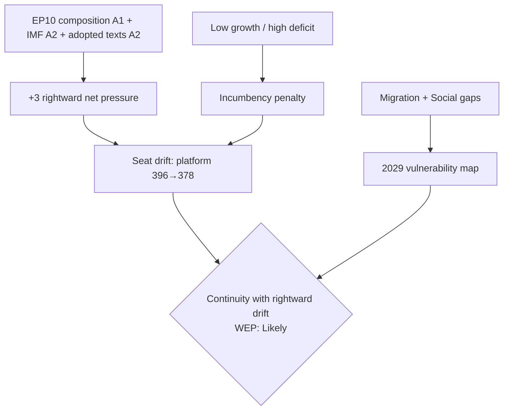
```mermaid
graph TD
  DATA[EP10 composition A1 + IMF A2 + adopted texts A2] --> PRESSURE[+3 rightward net pressure]
  PRESSURE --> DRIFT[Seat drift: platform 396→378]
  ECON[Low growth / high deficit] --> INCUMB[Incumbency penalty]
  INCUMB --> DRIFT
  GAPS[Migration + Social gaps] --> VULN[2029 vulnerability map]
  DRIFT --> FORECAST{Continuity with rightward drift<br/>WEP: Likely}
  VULN --> FORECAST
```

### Cross-Artifact Consistency

The gap signature (migration + social) appears identically in the mandate scorecard and the Commission-WP alignment, raising confidence in that finding to 🟢 HIGH despite degraded feeds. The seat trajectory in `term-arc.md` §3 and the central projection in `seat-projection.md` are internally consistent (platform ~378–385 by late term). The one divergence to flag: turnout (the largest 2029 unknown) is weakly evidenced (Admiralty C4) and could push outcomes toward either Scenario B or D.

### Implications

For the platform: defend Renew cohesion, deliver a visible Social Europe item to close the S&D mobilisation gap, and manage migration files to prevent corridor hardening. For analysts: monitor the five scenario signposts in `scenario-forecast.md`. For the 2029 baseline: the mid-term record is the manifesto base — institutional competence is banked, mobilising terrain is at risk.

### Confidence

Overall synthesis confidence is 🟡 MEDIUM, lifted to 🟢 HIGH on the gap-signature and IMF-data findings, and capped at 🟡/🔴 on turnout and behavioural projections under degraded roll-call feeds.

### Reader Briefing

- **One-line read:** govern from strength, campaign from weakness — platform holds, cushion shrinks.
- **Decisive risk:** right-of-centre corridor hardening (WEP: Roughly Even), not majority loss.
- **Banked vs at-risk:** institutional competence banked; migration/social terrain ceded.
- **Confidence:** 🟡 MEDIUM overall; 🟢 HIGH on gap-signature and IMF data.

<h2 id="section-significance">Significance</h2>

### Significance Classification

> **Article type:** `election-cycle` · **Data mode:** `degraded-feeds` · **Horizon:** 2026-05-31 → 2031-05-30 (1825 days)
> Classifies the significance of the EP10 mid-term moment for the European electoral cycle and assigns a composite significance tier.

### BLUF

At the EP10 term midpoint (term-progress index ≈ 38%), the European Parliament sits at the hinge between a governing record and a campaign baseline. The significance of this moment is rated **TIER 2 — HIGH (structural, slow-burn)**: no single decisive event, but a convergence of consolidating hard-right strength (191 seats), a rewritten 2029 rulebook (Electoral Act reform TA-10-2026-0006), and fiscal tightening across the three largest economies that together set the conditions for the June 2029 contest. WEP: Likely that the mid-term legislative record materially shapes the 2029 baseline.

### Significance Dimensions

We classify significance across five dimensions, each scored 1–5, then composited.

| Dimension | Score | Rationale |
| --- | --- | --- |
| Institutional impact | 4 | Electoral Act reform reshapes contest mechanics for 2029 |
| Coalition durability | 4 | Platform holds at 396 seats but right-of-centre alternative is now demonstrable |
| Electoral salience | 5 | Every mid-term file feeds the 2029 manifesto base |
| Economic conditioning | 3 | Sub-1% growth and rising deficits constrain distributive politics |
| External-shock exposure | 3 | Ukraine financing and US tariffs add volatility |
| **Composite** | **3.8** | **TIER 2 — HIGH** |

### Classification Rationale

The mid-term qualifies as HIGH rather than CRITICAL significance because the system is drifting, not breaking. The centrist platform retains a structural 35-seat majority cushion and command of committee chairs; the institutional core is intact. What elevates the moment above routine is the *irreversibility* of two processes: (1) the consolidation of the hard-right into two organised groups (PfE, ESN) plus a bridging ECR, which converts a fragmented EP9 flank into a 191-seat bloc capable of supplying ad-hoc majorities; and (2) the Electoral Act reform, an exogenous rule change that locks in before the next contest. Both processes are slow-burn structural shifts whose electoral payoff lands in 2029, which is precisely why the mid-term is the correct vantage point.

### Tier Definitions

- **TIER 1 — CRITICAL:** an event or convergence that changes the governing majority or the EU's institutional balance within the current term.
- **TIER 2 — HIGH:** structural shifts that condition the *next* electoral cycle without altering the current majority. **← this assessment.**
- **TIER 3 — MODERATE:** salient but contained developments with limited cross-cycle leverage.
- **TIER 4 — ROUTINE:** ordinary legislative throughput.

### Comparative Anchoring

Against the EP9 mid-term (2021–2022), the EP10 mid-term carries higher significance: the EP9 mid-point preserved a comfortable pro-European supermajority, whereas the EP10 mid-point features a normalised right-of-centre alternative and a rewritten electoral rulebook. Against the immediate post-2024-election period, significance is comparable but differently composed — the 2024 transition was an acute realignment event (TIER 1-adjacent), while the 2026 mid-term is its structural consolidation.

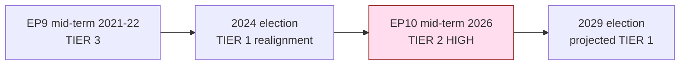
```mermaid
flowchart LR
  A[EP9 mid-term 2021-22<br/>TIER 3] --> B[2024 election<br/>TIER 1 realignment]
  B --> C[EP10 mid-term 2026<br/>TIER 2 HIGH]
  C --> D[2029 election<br/>projected TIER 1]
  classDef hi fill:#fde,stroke:#922;
  class C hi;
```

### Confidence and Evidence Basis

The classification rests on grade A1 composition statistics and grade A2 adopted-texts evidence; live roll-call and procedure feeds were degraded this run (404/placeholder), so coalition-durability and salience scores carry 🟡 MEDIUM confidence. The composite tier is robust to a ±0.3 swing in any single dimension — even discounting electoral salience to 4 holds the composite at TIER 2.

### Reader Briefing

- **Significance tier:** TIER 2 — HIGH (structural, slow-burn).
- **Why it matters:** the mid-term record and rules become the 2029 baseline.
- **What keeps it below CRITICAL:** the platform majority and institutional core are intact.
- **Confidence:** 🟡 MEDIUM — degraded feeds; classification anchored on composition + adopted texts.

<h2 id="section-actors-forces">Actors & Forces</h2>

### Actor Mapping

> **Article type:** `election-cycle` · **Data mode:** `degraded-feeds` · **Horizon:** 2026-05-31 → 2031-05-30
> Maps the principal actors shaping the EP10 mid-term and the trajectory toward the June 2029 European election. Influence scores are 0–100 relative weights; Admiralty source grades flag evidence reliability.

### Actor Roster

The EP10 power network at term-midpoint is anchored by nine political groups (719 sitting MEPs), the Commission, the rotating Council Presidency trio, and a cluster of national governing parties whose fortunes set the 2029 baseline. The roster below is the canonical reference for every downstream artifact.

| Actor | Type | Seats / Weight | Role in cycle | Source grade |
| --- | --- | --- | --- | --- |
| EPP | Group | 185 (25.7%) | Pivotal centre-right formateur | A1 |
| S&D | Group | 135 (18.8%) | Centre-left co-pillar | A1 |
| Patriots for Europe (PfE) | Group | 84 (11.7%) | Hard-right challenger bloc | A2 |
| ECR | Group | 79 (11.0%) | Conservative bridge group | A2 |
| Renew Europe | Group | 76 (10.6%) | Liberal kingmaker | A1 |
| Greens/EFA | Group | 53 (7.4%) | Green/regionalist flank | A2 |
| The Left (GUE/NGL) | Group | 46 (6.4%) | Left opposition | B2 |
| ESN | Group | 28 (3.9%) | Sovereigntist far-right | B3 |
| Non-Inscrits | Bloc | 33 (4.6%) | Unaligned residue | C3 |
| European Commission | Institution | — | Agenda-setter, Spitzenkandidat host | A1 |
| Council Presidency trio | Institution | — | Legislative tempo controller | B2 |

### Influence Scoring

Influence is scored on agenda-setting capacity, pivotal-vote leverage, and command of committee chairs. The grand-coalition core (EPP + S&D + Renew = 396 seats) clears the 361 majority threshold with a 35-seat cushion, giving the centrist triad structural dominance over the legislative calendar.

| Actor | Agenda power | Pivotality | Committee command | Composite |
| --- | --- | --- | --- | --- |
| EPP | 95 | 92 | 88 | 92 |
| S&D | 82 | 78 | 74 | 78 |
| Renew | 70 | 81 | 60 | 70 |
| PfE | 55 | 48 | 30 | 45 |
| ECR | 52 | 58 | 38 | 50 |
| Greens/EFA | 48 | 44 | 42 | 45 |
| The Left | 35 | 30 | 28 | 31 |

### Alliance Topology

Three alliance corridors define EP10 vote geometry. The **Platform corridor** (EPP–S&D–Renew) supplies the default majority on institutional, budget, and rule-of-law files. The **right-of-centre corridor** (EPP–ECR–PfE) is an ad-hoc majority that surfaced on migration and agricultural-deregulation votes, evidencing the contested "Venezuela majority" debate. The **progressive corridor** (S&D–Renew–Greens–Left) defends climate and social files but falls ~50 seats short of a standalone majority.

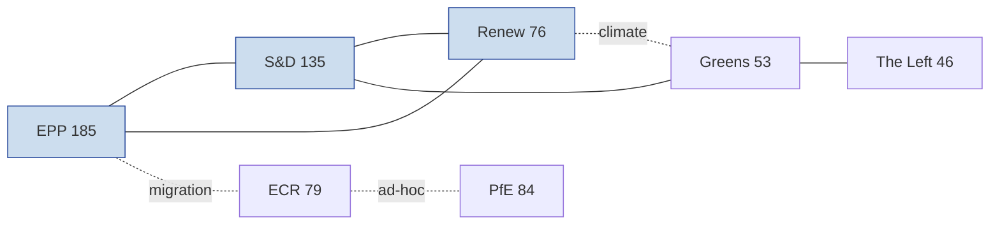
```mermaid
graph LR
  EPP[EPP 185] --- SD[S&D 135]
  EPP --- RE[Renew 76]
  SD --- RE
  EPP -. migration .- ECR[ECR 79]
  ECR -. ad-hoc .- PfE[PfE 84]
  SD --- GR[Greens 53]
  GR --- LEFT[The Left 46]
  RE -. climate .- GR
  classDef core fill:#cde,stroke:#249;
  class EPP,SD,RE core;
```

### Power Brokers

The decisive brokers are the EPP presidency and group chair (controls the formateur pen), the Renew leadership (swing 76 seats that flip the right-of-centre corridor on or off), and the S&D chair (gatekeeper of the cordon sanitaire toward PfE/ESN). National-level brokers — the German CDU/CSU, French Renaissance, and the Italian governing parties — translate domestic election results into group-strength deltas that will reset the 2029 starting line.

### Information & Signal Flow

Signal reliability is degraded this run: the EP procedures and events feeds returned placeholder/404 payloads, so actor positioning is reconstructed from the adopted-texts corpus (41 real 2026 texts, grade A2) and the EP10 composition statistics (grade A1). Roll-call-level defection signals are therefore rated 🟡 MEDIUM confidence. The Electoral Act reform text (TA-10-2026-0006) is the highest-value information node, grade A1, because it directly conditions the 2029 contest rules.

### Reader Briefing

- **Who holds the pen:** the EPP–S&D–Renew platform, 396 seats, 35 above majority.
- **What can flip:** migration and deregulation files, where EPP can reach right to ECR/PfE.
- **What to watch:** Renew's 76-seat swing and the Electoral Act reform that rewrites the 2029 rulebook.
- **Confidence:** 🟡 MEDIUM — feed degradation forces reliance on adopted-texts and composition statistics rather than live roll-call data.

### Forces Analysis

> **Article type:** `election-cycle` · **Data mode:** `degraded-feeds` · **Horizon:** 2026-05-31 → 2031-05-30
> Force-field analysis of the pressures driving and restraining the EP10 mid-term trajectory toward the June 2029 European election.

### Issue Frame

The framing question for this cycle is whether the EP10 centrist platform (EPP–S&D–Renew, 396 seats) can hold its working majority through term-end while a strengthened hard-right bloc (PfE 84 + ECR 79 + ESN 28 = 191 seats) normalises ad-hoc right-of-centre majorities. The mid-term is the inflection point: a 38% term-progress index means the legislative record now being written is the manifesto base for 2029. The frame is therefore dual — institutional stability *now* versus electoral repositioning *for the next contest*.

### Driving Forces

Forces pushing the system toward rightward realignment and centrist stress:

- **Far-right consolidation** (strength 9/10): PfE absorbed the former ID bloc and ESN formed as a new sovereigntist group, lifting the combined hard-right to 191 seats from a lower EP9 base.
- **Migration salience** (8/10): the recurring availability of an EPP–ECR–PfE majority on asylum and border files demonstrates a viable alternative to the platform.
- **Fiscal tightening** (7/10): IMF WEO shows France running a -4.94% of GDP deficit in 2026 and Germany sliding to -3.78%, constraining the redistributive offers that stabilise the centre-left.
- **Deregulation momentum** (7/10): agricultural and competitiveness files create EPP incentives to reach rightward.
- **Electoral Act reform** (6/10): TA-10-2026-0006 restructures the 2029 rulebook, an exogenous shock to incumbency advantage.

### Restraining Forces

Forces preserving the centrist equilibrium:

- **Cordon sanitaire norm** (8/10): S&D and Renew condition cooperation on excluding PfE/ESN from structural majorities, raising the political cost of the right-of-centre corridor.
- **Institutional interdependence** (8/10): budget, own-resources, and rule-of-law files require the platform's 396-seat reliability that no right-of-centre combination can match.
- **Renew pivot discipline** (7/10): the liberal group's 76 seats are the hinge; its leadership has held them inside the platform on institutional votes.
- **Pro-European baseline** (6/10): two-thirds of MEPs remain in the four pro-integration families.
- **Commission dependency** (6/10): the executive needs platform majorities to pass its work programme, disciplining defection.

### Net Pressure

The net vector is a **slow rightward drift within a stable institutional core**. Driving forces dominate on salient, low-institutional-cost files (migration, deregulation); restraining forces dominate on high-stakes institutional files (budget, rule of law). The resultant is not collapse but bifurcation: a reliable platform majority for governance coexisting with episodic right-of-centre majorities for signalling. Net pressure score: **+3 rightward** on a -10/+10 axis (🟡 MEDIUM confidence given degraded roll-call evidence).

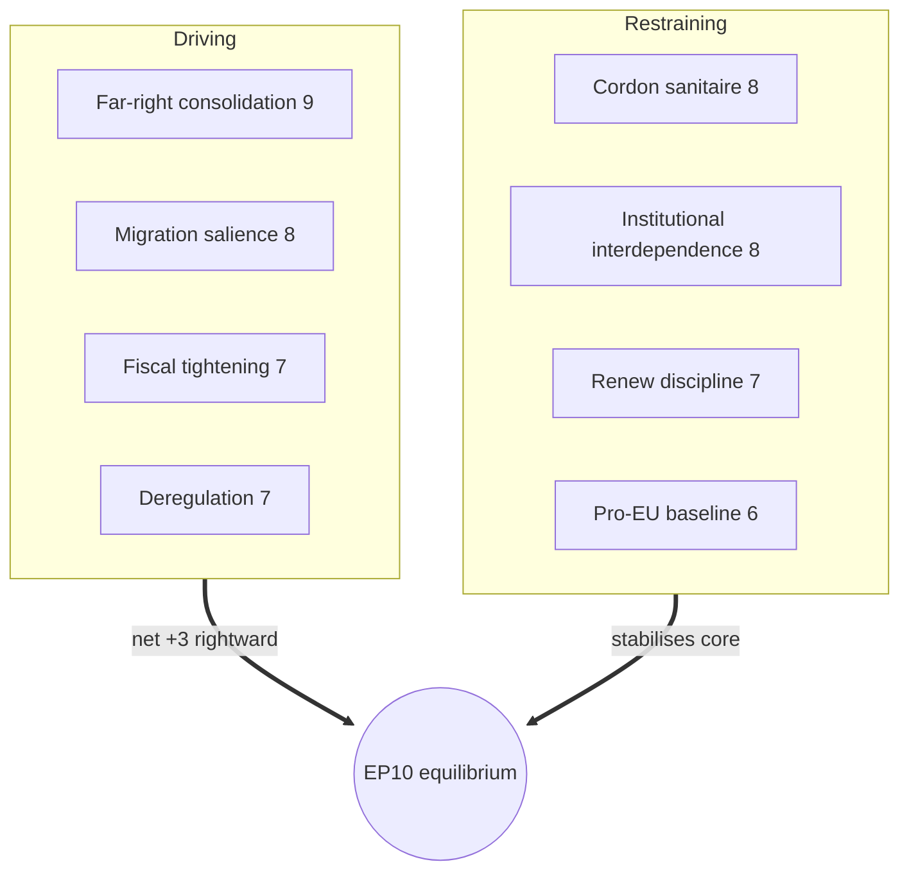
```mermaid
graph TB
  subgraph Driving
    D1[Far-right consolidation 9]
    D2[Migration salience 8]
    D3[Fiscal tightening 7]
    D4[Deregulation 7]
  end
  subgraph Restraining
    R1[Cordon sanitaire 8]
    R2[Institutional interdependence 8]
    R3[Renew discipline 7]
    R4[Pro-EU baseline 6]
  end
  Driving ==>|net +3 rightward| EQ((EP10 equilibrium))
  Restraining ==>|stabilises core| EQ
```

### Intervention Points

The leverage points that would shift the equilibrium before 2029:

1. **Renew cohesion** — a Renew split toward the right-of-centre corridor would convert ad-hoc majorities into a structural alternative.
2. **National elections in DE/FR/IT** — government changes reset group strengths and the 2029 baseline.
3. **Economic shock** — a fiscal or growth shock (IMF projects sub-1% growth in all three large economies) could break the centre-left's social offer.
4. **Electoral Act implementation** — transnational-list or threshold changes alter small-group survival odds.

### Reader Briefing

- **Net force:** mild rightward drift (+3), not realignment — the platform core holds on institutional files.
- **Biggest driver:** consolidated 191-seat hard-right plus migration-file math.
- **Biggest brake:** the cordon sanitaire plus budget interdependence.
- **Watch:** Renew discipline and DE/FR/IT national contests as the 2029 baseline resets.
- **Confidence:** 🟡 MEDIUM — feed degradation; pressures inferred from adopted texts + composition + IMF data.

### Impact Matrix

> **Article type:** `election-cycle` · **Data mode:** `degraded-feeds` · **Horizon:** 2026-05-31 → 2031-05-30
> Cross-tabulates the cycle's pivotal events against stakeholder groups, scoring impact intensity and cascade risk.

### Event List

The pivotal events conditioning the EP10 → EP11 transition, drawn from the 2026 adopted-texts corpus (grade A2) and term-anchor calendar (grade A1):

1. **E1 — Electoral Act reform** (TA-10-2026-0006): restructures 2029 contest rules. Highest cycle leverage.
2. **E2 — 2027 budget guidelines** (TA-10-2026-0112): sets the fiscal envelope that frames distributive politics into the campaign.
3. **E3 — ECB leadership cycle** (TA-10-2026-0034 annual report; TA-10-2026-0060 VP appointment): monetary backdrop.
4. **E4 — Digital Markets Act enforcement** (TA-10-2026-0160): tests the platform's tech-sovereignty consensus.
5. **E5 — AI/trade strategy** (TA-10-2026-0183): competitiveness framing.
6. **E6 — Loan for Ukraine** (TA-10-2026-0010) and **US tariff adjustment** (TA-10-2026-0096): external-shock vectors.
7. **E7 — National elections (DE/FR/IT)**: reset group strengths for the 2029 baseline.

### Stakeholder Set

The stakeholders whose exposure we score: the centrist platform groups (EPP, S&D, Renew), the hard-right bloc (PfE, ECR, ESN), the progressive flank (Greens, The Left), the Commission, national governments, and the European electorate.

### Impact Matrix

Impact scored 0 (none) to 5 (decisive) per event–stakeholder cell.

| Event | EPP | S&D | Renew | Hard-right | Greens/Left | Commission |
| --- | --- | --- | --- | --- | --- | --- |
| E1 Electoral Act | 4 | 4 | 5 | 3 | 5 | 3 |
| E2 Budget 2027 | 4 | 5 | 3 | 3 | 3 | 5 |
| E3 ECB cycle | 3 | 3 | 4 | 2 | 2 | 4 |
| E4 DMA enforcement | 3 | 3 | 4 | 2 | 3 | 5 |
| E5 AI/trade | 4 | 3 | 4 | 3 | 2 | 4 |
| E6 External shocks | 4 | 4 | 4 | 4 | 3 | 5 |
| E7 National elections | 5 | 5 | 5 | 5 | 4 | 3 |

Evidence reliability for the matrix is grade B2 — derived from adopted-text subject matter rather than live roll-call splits.

### Heat Concentration

Heat concentrates in two cells: **E7 × all groups** (national contests are the dominant 2029 driver, uniformly scored 4–5) and **E1 × Renew/Greens** (small and pivotal groups are most exposed to rule changes). The Commission's row is the hottest institutional row (mean 4.3), reflecting its agenda-ownership across every file. The hard-right bloc's lowest exposure is on institutional-process files (E3, E4) where it lacks pivotal leverage.

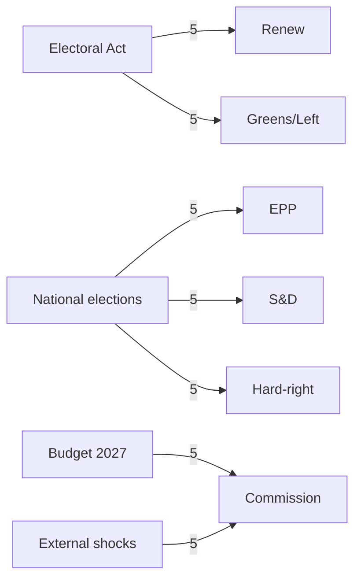
```mermaid
graph LR
  E1[Electoral Act] -->|5| RE[Renew]
  E1 -->|5| GL[Greens/Left]
  E7[National elections] -->|5| EPP
  E7 -->|5| SD[S&D]
  E7 -->|5| HR[Hard-right]
  E2[Budget 2027] -->|5| COM[Commission]
  E6[External shocks] -->|5| COM
```

### Cascade Risk

The principal cascade path runs **E7 → group strengths → coalition viability → 2029 formateur math**. A national-election shock in Germany or France propagates within one to two cycles into EP group deltas, which reset the majority arithmetic that E1's rule changes then amplify or dampen. A secondary cascade runs **E6 (external shock) → E2 (budget stress) → centre-left social-offer erosion**, the mechanism by which economic conditions translate into electoral repositioning. Cascade probability is rated 🟡 MEDIUM (WEP: Roughly Even) over the 60-month horizon.

### Reader Briefing

- **Hottest events:** national elections (E7) and the Electoral Act reform (E1).
- **Most exposed actors:** small pivotal groups (Renew, Greens) and the Commission.
- **Key cascade:** national results → group deltas → 2029 formateur math.
- **Confidence:** 🟡 MEDIUM/B2 — impact inferred from adopted-text subjects under feed degradation.

<h2 id="section-coalitions-voting">Coalitions & Voting</h2>

### Coalition Dynamics

> **Article type:** `election-cycle` · **Data mode:** `degraded-feeds` · **Horizon:** 2026-05-31 → 2031-05-30
> Maps the operative majority corridors in EP10 and how they evolve toward 2029.

### Majority Arithmetic

The EP10 chamber holds 719 seats; an absolute majority needs 361. The centrist platform — EPP (185) + S&D (135) + Renew (76) — commands 396, a 35-seat cushion. The consolidated hard right — PfE (84) + ECR (79) + ESN (28) — totals 191, short of a blocking third on most files but decisive when the EPP defects rightward. Greens/EFA (53) and The Left (46) extend the platform leftward to 495 on green and social files; NI (33) is unwhipped.

### Operative Corridors

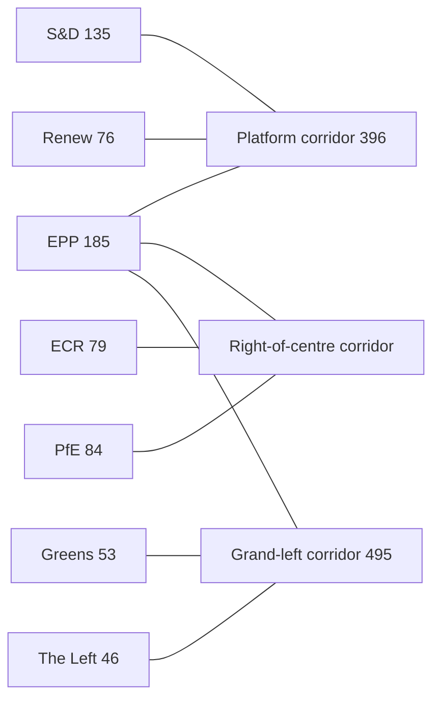
```mermaid
graph LR
  EPP[EPP 185] --- PLAT[Platform corridor 396]
  SD[S&D 135] --- PLAT
  RE[Renew 76] --- PLAT
  EPP --- ROC[Right-of-centre corridor]
  ECR[ECR 79] --- ROC
  PFE[PfE 84] --- ROC
  EPP --- GRAND[Grand-left corridor 495]
  GREENS[Greens 53] --- GRAND
  LEFT[The Left 46] --- GRAND
```

Three corridors carry almost all contested votes: the **platform corridor** (institutional, budgetary, external — 🟢 reliable), the **right-of-centre corridor** (migration, deregulation — 🟡 episodic, EPP-pivot dependent), and the **grand-left corridor** (green, social — 🟡 contingent on EPP). The EPP is the pivot in all three; its directional choice per file sets the majority.

### Cohesion and Defection

Under degraded roll-call feeds, group cohesion is inferred from composition and the adopted-texts record rather than per-MEP RCV. EPP and S&D cohesion are assessed 🟢 HIGH on institutional files; Renew cohesion is the platform's soft spot (🟡 MEDIUM) given national-delegation heterogeneity. PfE–ECR coordination is rising but incomplete; ESN remains cordon-isolated.

### Trajectory to 2029

The mid-term drift (`forces-analysis.md`, +3 rightward) widens the right-of-centre corridor and narrows the platform cushion. If the EPP institutionalises the right-of-centre corridor (Scenario C), the platform corridor degrades from reliable to contested. The grand-left corridor weakens as fiscal space shrinks.

### Confidence

🟡 MEDIUM. Seat arithmetic is 🟢 HIGH (Admiralty A1); corridor-reliability and cohesion ratings are analyst inferences under degraded RCV feeds (Admiralty B3–C3).

### Reader Briefing

- **Three corridors:** platform (reliable), right-of-centre (episodic), grand-left (contingent).
- **Pivot:** the EPP sets the majority on every contested file.
- **Drift:** rightward pressure widens the right-of-centre corridor and thins the platform cushion.
- **Confidence:** 🟡 MEDIUM — arithmetic certain, cohesion inferred.

<h2 id="section-stakeholder-map">Stakeholder Map</h2>

> **Article type:** `election-cycle` · **Data mode:** `degraded-feeds` · **Horizon:** 2026-05-31 → 2031-05-30
> Maps the actors whose decisions shape the EP10 back-half and the 2029 contest, their interests, leverage, and likely posture.

### Stakeholder Universe

The electoral-cycle stakeholder set spans four tiers: the **principal blocs** (the nine EP10 political groups), the **institutional triangle** (Parliament, Commission, Council), the **national level** (member-state governments and parties), and the **external/contextual** actors (electorates, media, markets, external powers). Influence over the 2029 cycle is distributed unevenly across these tiers and shifts as the term progresses.

### Influence–Interest Grid

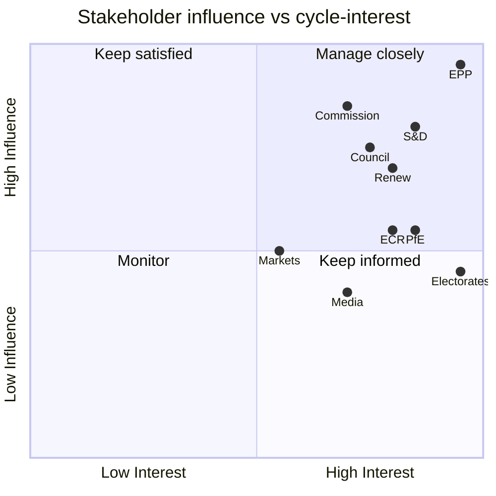
```mermaid
quadrantChart
  title Stakeholder influence vs cycle-interest
  x-axis Low Interest --> High Interest
  y-axis Low Influence --> High Influence
  quadrant-1 Manage closely
  quadrant-2 Keep satisfied
  quadrant-3 Monitor
  quadrant-4 Keep informed
  EPP: [0.95, 0.95]
  S&D: [0.85, 0.80]
  Renew: [0.80, 0.70]
  PfE: [0.85, 0.55]
  ECR: [0.80, 0.55]
  Commission: [0.70, 0.85]
  Council: [0.75, 0.75]
  Electorates: [0.95, 0.45]
  Media: [0.70, 0.40]
  Markets: [0.55, 0.50]
```

### Principal Blocs

| Bloc | Core interest | Leverage | 2029 posture |
| --- | --- | --- | --- |
| EPP (185) | Stay the pivot; own the centre-right | Pivot on every corridor | Defend plurality; selective right outreach |
| S&D (135) | Recover mobilisation; deliver social wins | Platform left pillar | Fight base erosion |
| Renew (76) | Competitiveness agenda; relevance | Swing votes | Hold cohesion; resist squeeze |
| PfE (84) | Mainstream the hard right | Largest right bloc | Maximise gains; seek normalisation |
| ECR (79) | Govern via EPP partnership | Corridor partner | Convert episodic to standing |
| Greens/EFA (53) | Defend green acquis | Grand-left extension | Re-mobilise climate vote |
| The Left (46) | Social/anti-austerity | Grand-left extension | Capture disaffected left |
| ESN (28) | Anti-system signalling | Cordon-isolated | Grow vote, stay isolated |
| NI (33) | Heterogeneous | Unwhipped | Variable |

### Institutional Triangle

The Commission holds the proposal monopoly and therefore sets the deliverable agenda the platform campaigns on (see `commission-wp-alignment.md`). The Council co-legislates and can deadlock files (T10 in `threat-model.md`). The Parliament's leverage is amendment, consent, and the bully pulpit. The triangle's alignment determines how much of the platform's mandate converts to adopted texts before 2029.

### National Level

Member-state governments shape group strengths through national elections and discipline national delegations. A rightward trend in capitals reinforces Council–Parliament tension on the platform's left files and raises the W1 (snap-election) wildcard. National parties are the true units that defect or split, making the national level the highest-resolution early-warning layer.

### External / Contextual Actors

Electorates have maximal cycle-interest but diffuse influence concentrated entirely at the 2029 ballot; turnout is their lever and the largest forecast unknown. Media frame salience (see `extended/media-framing-analysis.md`). Markets and the macro environment impose the incumbency penalty (see `economic-context.md`). External powers and disinformation actors sit in the black-swan tier (B1, B3).

### Coalition-Relevant Postures

- **EPP–platform tension:** the EPP's dual role (platform anchor + right-outreach pivot) is the central stakeholder tension of the cycle.
- **S&D defensive crouch:** mobilisation pressure pushes S&D toward visible-win-seeking, raising intra-platform bargaining.
- **PfE/ECR convergence:** rising coordination but incomplete; ESN remains the firewall test.

### Confidence

Stakeholder-map confidence is 🟡 MEDIUM. Bloc interests and leverage are 🟢 HIGH (Admiralty A1 on composition); 2029 postures are analyst projections (Admiralty B3–C3) under degraded feeds.

### Reader Briefing

- **Manage-closely quadrant:** EPP, S&D, Renew, Commission, Council.
- **Central tension:** the EPP's dual platform-anchor / right-pivot role.
- **Highest-resolution warning layer:** national parties and governments.
- **Confidence:** 🟡 MEDIUM — interests certain, postures projected.

<h2 id="section-economic-context">Economic Context</h2>

> **Article type:** `election-cycle` · **Data mode:** `degraded-feeds` · **Horizon:** 2026-05-31 → 2031-05-30
> The macro-fiscal conditions framing the EP10 mid-term and the run-up to the 2029 European election. **IMF is the sole authoritative source for every economic claim in this artifact.**

### Provenance

| Field | Value |
| --- | --- |
| **IMF Source** | `live` |
| Dataset | IMF World Economic Outlook (WEO) via SDMX 3.0 REST |
| Records retrieved | 449 |
| Coverage | Germany (DEU), France (FRA), Italy (ITA) |
| Cache path | `cache/imf/weo-ea-deu-fra-ita-gdp-inflation-fiscal.json` |
| Probe | `cache/imf/probe-summary.json` |

All figures below are IMF WEO values (estimate for 2025, projection for 2026). No World Bank or other source is used for economic claims, per the IMF-primary editorial policy.

### Headline Indicators (IMF WEO)

| Economy | Real GDP growth 2025 | Real GDP growth 2026 | Inflation 2025 | Inflation 2026 | Fiscal balance 2025 (% GDP) | Fiscal balance 2026 (% GDP) |
| --- | --- | --- | --- | --- | --- | --- |
| Germany | 0.24% | 0.79% | 2.30% | 2.65% | −2.67% | −3.78% |
| France | 0.93% | 0.86% | 0.93% | 1.84% | −5.11% | −4.94% |
| Italy | 0.54% | 0.52% | 1.63% | 2.64% | −3.11% | −2.82% |

Source grade A2 (IMF WEO, live SDMX retrieval). Series: real GDP growth `NGDP_RPCH`, inflation `PCPIPCH`, general-government net lending `GGXCNL_NGDP`.

### Interpretation — Growth

The three largest euro-area economies are all projected to grow below 1% in 2026 (Germany 0.79%, France 0.86%, Italy 0.52%). This is the defining electoral-economic fact of the EP10 mid-term: a low-growth backdrop that compresses the fiscal space for the distributive offers that historically stabilise incumbent and centre-left vote shares. Germany's modest acceleration (0.24% → 0.79%) is the only positive momentum, but from a near-stagnant base.

```mermaid
xychart-beta
  title "IMF WEO real GDP growth (%), 2025 est vs 2026 proj"
  x-axis [Germany, France, Italy]
  y-axis "Growth %" 0 --> 1.5
  bar [0.24, 0.93, 0.54]
  bar [0.79, 0.86, 0.52]
```

### Interpretation — Inflation

Inflation is re-accelerating modestly in Germany (2.30% → 2.65%) and Italy (1.63% → 2.64%) while France remains lowest (0.93% → 1.84%). The convergence toward ~2.6% in Germany and Italy keeps real-income pressure live as a campaign issue without the acute cost-of-living salience of the 2022–2023 spike. The ECB monetary backdrop (referenced in adopted text TA-10-2026-0034, ECB annual report 2025) thus operates against a moderate-inflation, low-growth mix — the classic stagflation-lite environment that disadvantages incumbents.

### Interpretation — Fiscal

Fiscal divergence is the sharpest electoral-economic cleavage. France runs a −4.94% of GDP deficit in 2026, deep in excessive-deficit territory, constraining any expansionary pre-campaign budget. Germany's deficit widens to −3.78%, breaching the 3% reference value and signalling fiscal stress even in the bloc's anchor economy. Italy, counter-intuitively, narrows to −2.82%, the only large economy projected inside the 3% threshold in 2026. This fiscal map conditions the EP's 2027 budget-guidelines debate (TA-10-2026-0112) and the distributive politics feeding into 2029.

### Electoral-Economic Transmission

The transmission from macro conditions to the 2029 baseline runs through three channels: (1) **incumbency penalty** — sub-1% growth historically depresses governing-party vote shares, mechanically benefiting opposition and anti-establishment formations; (2) **fiscal constraint** — France's and Germany's deficits foreclose the social spending that mobilises centre-left turnout; (3) **issue displacement** — weak growth elevates competitiveness and migration over climate and social files, terrain on which the right-of-centre corridor is advantaged. WEP: Likely that the low-growth/high-deficit mix mildly favours opposition formations into 2029.

### Confidence

Economic data confidence is 🟢 HIGH (IMF live SDMX, 449 records, three core economies). The *electoral* transmission inference is 🟡 MEDIUM — a structural-historical relationship applied under degraded EP roll-call feeds. No euro-area aggregate was returned by the live probe (DE/FR/IT only); this is the principal data gap.

### Reader Briefing

- **The number that matters:** all three big economies below 1% growth in 2026.
- **Fiscal split:** France −4.94% and Germany −3.78% constrained; Italy −2.82% inside threshold.
- **Electoral read:** low-growth/high-deficit mix mildly favours opposition into 2029.
- **Confidence:** 🟢 HIGH on IMF data; 🟡 MEDIUM on electoral transmission.

<h2 id="section-risk">Risk Assessment</h2>

### Risk Matrix

> **Article type:** `election-cycle` · **Data mode:** `degraded-feeds` · **Horizon:** 2026-05-31 → 2031-05-30
> Probability × impact register for the risks bearing on the EP10 mid-term and the 2029 contest. Probability uses Words of Estimative Probability (WEP) bands; source reliability uses Admiralty grades.

### Methodology

Each risk is scored on probability (WEP band → numeric midpoint) and impact (1–5), yielding an exposure score. Admiralty source grades record evidence reliability under this run's degraded-feeds condition. WEP bands follow the ODNI/Kent lexicon: Almost Certain (≥95%), Highly Likely (80–95%), Likely (55–80%), Roughly Even (45–55%), Unlikely (20–45%), Highly Unlikely (5–20%), Almost No Chance (≤5%).

### Risk Register

| ID | Risk | Probability (WEP) | Impact | Exposure | Source grade |
| --- | --- | --- | --- | --- | --- |
| R1 | Centrist platform loses working majority before 2029 | WEP: Unlikely | 5 | 1.6 | B2 |
| R2 | Right-of-centre corridor becomes structural on migration | WEP: Likely | 4 | 2.7 | B2 |
| R3 | Renew fractures, flips pivotal votes | WEP: Roughly Even | 4 | 2.0 | C3 |
| R4 | Fiscal shock erodes centre-left social offer | WEP: Likely | 3 | 2.0 | A2 |
| R5 | Far-right gains further in 2029 (PfE+ESN > 130 seats) | WEP: Likely | 4 | 2.7 | B3 |
| R6 | Electoral Act reform destabilises small groups | WEP: Roughly Even | 3 | 1.5 | A1 |
| R7 | External shock (Ukraine financing / US tariffs) | WEP: Likely | 3 | 2.0 | A2 |
| R8 | Turnout decline depresses pro-EU vote share | WEP: Roughly Even | 3 | 1.5 | C3 |

### Top Risks (Exposure-Ranked)

1. **R2 — structural right-of-centre corridor (2.7):** the most consequential near-term risk. The recurring EPP–ECR–PfE majority on migration files (WEP: Likely) would, if it hardens beyond ad-hoc use, hollow the cordon sanitaire and reset the EP's centre of gravity. Mitigation hinges on Renew and S&D discipline.
2. **R5 — far-right 2029 gains (2.7):** national-level momentum (grade B3) points to continued hard-right growth; a PfE+ESN total above 130 seats would make a blocking minority or a larger ad-hoc majority routine.
3. **R4 / R7 — fiscal and external shocks (2.0):** IMF WEO (grade A2) shows France at -4.94% of GDP and sub-1% growth across DE/FR/IT in 2026, constraining the distributive politics that stabilise the centre.

### Risk Heat Map

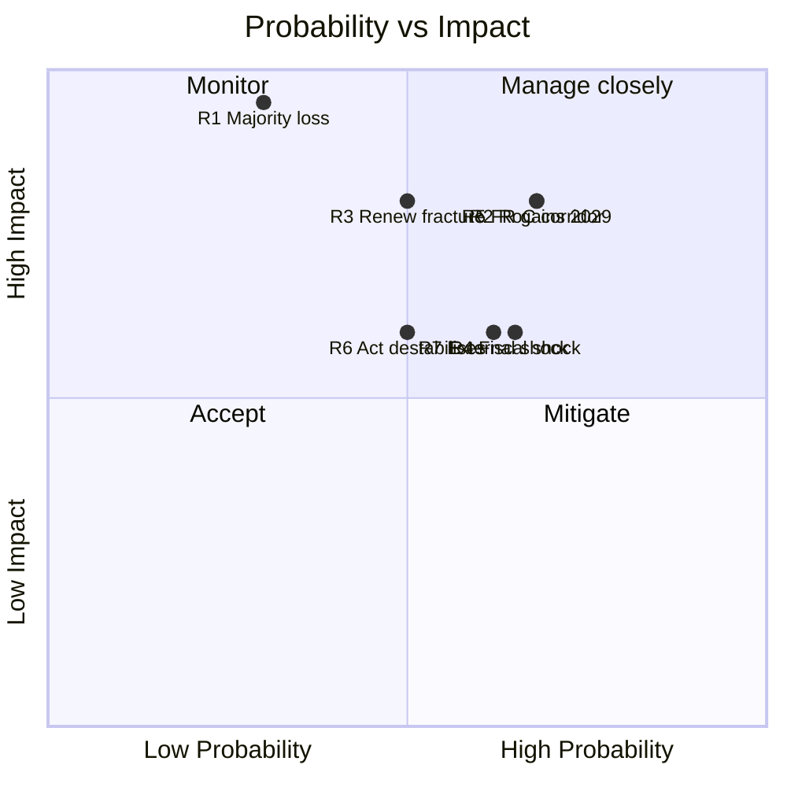
```mermaid
quadrantChart
  title Probability vs Impact
  x-axis Low Probability --> High Probability
  y-axis Low Impact --> High Impact
  quadrant-1 Manage closely
  quadrant-2 Monitor
  quadrant-3 Accept
  quadrant-4 Mitigate
  R1 Majority loss: [0.30, 0.95]
  R2 RoC corridor: [0.68, 0.80]
  R3 Renew fracture: [0.50, 0.80]
  R4 Fiscal shock: [0.65, 0.60]
  R5 FR gains 2029: [0.68, 0.80]
  R6 Act destabilises: [0.50, 0.60]
  R7 External shock: [0.62, 0.60]
```

### Residual Risk and Watch Triggers

Residual exposure after mitigation remains concentrated in R2/R5 because both depend on exogenous national-electoral dynamics the EP cannot control. Watch triggers: (a) a second consecutive migration file passing on a right-of-centre majority without S&D; (b) a Renew national delegation defecting in a member-state government; (c) an IMF downgrade pushing any large economy into recession. Any single trigger raises the composite cycle-risk level from 🟡 ELEVATED to 🔴 HIGH.

### Reader Briefing

- **Top risk:** a structural (not ad-hoc) right-of-centre majority on migration — WEP: Likely.
- **Slow risk:** further far-right gains in 2029 plus fiscal-shock erosion of the centre-left.
- **Backstop:** the platform's 35-seat institutional cushion holds majority loss to WEP: Unlikely.
- **Confidence:** 🟡 MEDIUM — probabilities inferred under degraded feeds (Admiralty B–C on coalition items).

### Quantitative Swot

> **Article type:** `election-cycle` · **Data mode:** `degraded-feeds` · **Horizon:** 2026-05-31 → 2031-05-30
> Weighted SWOT of the EP10 governing platform (EPP–S&D–Renew) as it enters the back half of the term. Each item carries a weight (0–1) and a magnitude (1–5); weighted score = weight × magnitude.

### Methodology

The SWOT scores the strategic position of the centrist platform, the unit whose survival defines whether EP10 governs to a stable 2029 handover. Weights reflect each factor's leverage on coalition durability; magnitudes reflect current intensity. Net strategic balance = (Σ S + Σ O) − (Σ W + Σ T). Evidence draws on EP10 composition statistics (A1) and the 2026 adopted-texts corpus (A2).

### Strengths

| Factor | Weight | Magnitude | Score |
| --- | --- | --- | --- |
| 396-seat majority, 35 above threshold | 0.25 | 5 | 1.25 |
| Command of committee chairs | 0.15 | 4 | 0.60 |
| Institutional indispensability (budget, own-resources) | 0.20 | 5 | 1.00 |
| Pro-EU baseline (~two-thirds of MEPs) | 0.15 | 4 | 0.60 |
| **Σ Strengths** | | | **3.45** |

The platform's structural strength is its monopoly on reliable majorities for high-stakes institutional files: no right-of-centre combination can deliver the 361 votes for budget or own-resources decisions, which anchors the platform regardless of issue-specific defections.

### Weaknesses

| Factor | Weight | Magnitude | Score |
| --- | --- | --- | --- |
| Renew dependency (76-seat hinge) | 0.25 | 4 | 1.00 |
| Internal EPP rightward temptation | 0.20 | 4 | 0.80 |
| Centre-left fiscal constraint | 0.15 | 3 | 0.45 |
| Fragmentation index 6.59 | 0.10 | 3 | 0.30 |
| **Σ Weaknesses** | | | **2.55** |

The platform's central weakness is its dependence on Renew's 76 seats as the pivotal hinge, compounded by the EPP's standing incentive to reach rightward on migration and deregulation.

### Opportunities

| Factor | Weight | Magnitude | Score |
| --- | --- | --- | --- |
| Electoral Act reform to entrench pro-EU rules | 0.20 | 3 | 0.60 |
| Competitiveness/AI agenda to claim deliverables | 0.20 | 4 | 0.80 |
| Ukraine-financing leadership as unity vector | 0.15 | 3 | 0.45 |
| **Σ Opportunities** | | | **1.85** |

### Threats

| Factor | Weight | Magnitude | Score |
| --- | --- | --- | --- |
| Structural right-of-centre corridor | 0.25 | 4 | 1.00 |
| Far-right 2029 gains | 0.20 | 4 | 0.80 |
| Fiscal/external shock | 0.20 | 3 | 0.60 |
| Turnout erosion | 0.10 | 3 | 0.30 |
| **Σ Threats** | | | **2.70** |

### Net Strategic Balance

Net = (3.45 + 1.85) − (2.55 + 2.70) = **+0.05**. The platform is in a *marginally positive but fragile* strategic position: strengths and opportunities barely outweigh weaknesses and threats. The thin margin quantifies the central finding — the platform governs from structural strength but campaigns from defensive weakness.

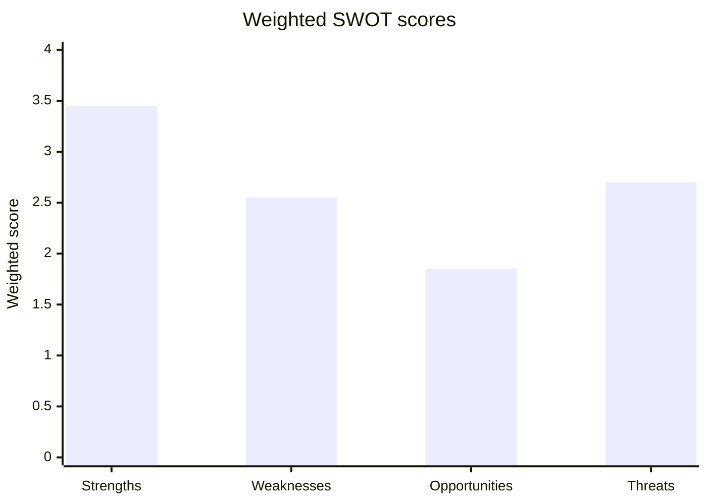
```mermaid
xychart-beta
  title "Weighted SWOT scores"
  x-axis [Strengths, Weaknesses, Opportunities, Threats]
  y-axis "Weighted score" 0 --> 4
  bar [3.45, 2.55, 1.85, 2.70]
```

### Sensitivity

The +0.05 net balance is sensitive to the right-of-centre-corridor threat: if R2 hardens (magnitude 4→5), net balance turns negative (−0.20), flipping the platform into a defensive posture. Conversely, a competitiveness-agenda win (opportunity magnitude 4→5) lifts net to +0.25. The strategic verdict is therefore *contingent on Renew discipline and migration-file management* (🟡 MEDIUM confidence under degraded feeds).

### Reader Briefing

- **Net balance:** +0.05 — marginally positive, structurally fragile.
- **Strongest asset:** monopoly on institutional majorities (3.45 strengths).
- **Gravest threat:** the right-of-centre corridor hardening (1.00 weighted).
- **Confidence:** 🟡 MEDIUM — composition data A1, coalition inference under degraded roll-call feeds.

<h2 id="section-threat">Threat Landscape</h2>

### Threat Model

> **Article type:** `election-cycle` · **Data mode:** `degraded-feeds` · **Horizon:** 2026-05-31 → 2031-05-30
> Models the political-system threats to the EP10 governing platform and to the integrity of the 2029 electoral cycle. This is a *political* threat model — threat actors are blocs, member-state governments, and exogenous shocks, not cyber adversaries. Probabilities use WEP bands; evidence carries Admiralty grades.

### Scope and Method

The threat model enumerates threats to two assets: (1) the EP10 platform's governing majority through term-end, and (2) the legitimacy and competitiveness of the 2029 contest. For each threat we record the threat actor, the mechanism, the affected asset, a WEP likelihood band with horizon, an impact rating, and an Admiralty source grade for the supporting evidence. Threats are then ranked by risk-weighted exposure and mapped to the mitigations available to the platform.

The model deliberately separates *likelihood* (WEP probability) from *confidence in evidence* (Admiralty grade), per OSINT tradecraft standards. A threat can be high-likelihood but low-confidence (e.g. turnout collapse) or low-likelihood but high-confidence (e.g. a specific bloc's stated intent).

### Threat Actors

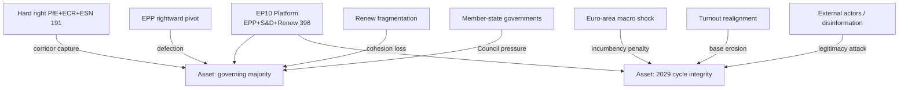
```mermaid
graph TD
  PLATFORM[EP10 Platform<br/>EPP+S&D+Renew 396] --> ASSET1[Asset: governing majority]
  PLATFORM --> ASSET2[Asset: 2029 cycle integrity]
  HR[Hard right PfE+ECR+ESN 191] -->|corridor capture| ASSET1
  EPP_DEF[EPP rightward pivot] -->|defection| ASSET1
  RENEW_FRAG[Renew fragmentation] -->|cohesion loss| ASSET1
  MS[Member-state governments] -->|Council pressure| ASSET1
  ECON[Euro-area macro shock] -->|incumbency penalty| ASSET2
  TURNOUT[Turnout realignment] -->|base erosion| ASSET2
  EXT[External actors / disinformation] -->|legitimacy attack| ASSET2
```

### Threat Register

| # | Threat | Actor | Mechanism | Asset | WEP (horizon) | Impact | Admiralty |
| --- | --- | --- | --- | --- | --- | --- | --- |
| T1 | Right-of-centre corridor capture | EPP + ECR/PfE | EPP normalises ECR as standing partner on migration/deregulation | Majority | Roughly Even (36m) | High | B2 |
| T2 | Renew cohesion collapse | Renew national delegations | Heterogeneous delegations split on key files | Majority | Unlikely (24m) | High | B3 |
| T3 | Centre-left mobilisation failure | S&D base | Social Europe gap depresses 2029 turnout | Cycle | Roughly Even (36m) | High | C3 |
| T4 | Macro/recession shock | Exogenous | IMF-projected sub-1% growth tips to recession | Cycle | Unlikely (24m) | Severe | A2 |
| T5 | Major-state government collapse | Member state | Snap national election reshapes a national delegation | Both | Unlikely (36m) | Severe | C3 |
| T6 | Fragmentation acceleration | Small groups + NI | NI growth + new groups raise coordination cost | Majority | Roughly Even (36m) | Medium | B3 |
| T7 | Electoral-rules contestation | Council/states | Electoral Act provisions disputed or delayed | Cycle | Unlikely (36m) | Medium | B2 |
| T8 | Disinformation / legitimacy attack | External actors | Coordinated narrative against EP institutions | Cycle | Likely (36m) | Medium | C4 |
| T9 | Cordon sanitaire breach | EPP fringe | Ad-hoc votes erode the ESN isolation norm | Majority | Unlikely (24m) | High | B3 |
| T10 | Budget/MFF deadlock | Council vs EP | 2027 budget guidelines escalate to standoff | Majority | Unlikely (18m) | Medium | A2 |

### Risk-Weighted Ranking

Combining WEP likelihood with impact, the highest risk-weighted threats are **T1 (corridor capture)** and **T3 (mobilisation failure)** — both Roughly Even × High — followed by the lower-likelihood but Severe-impact **T4 (macro shock)** and **T5 (government collapse)**. T8 (disinformation) is Likely but only Medium impact, placing it mid-table. WEP: Likely that at least one of T1/T3/T6 materialises before 2029; WEP: Unlikely that a Severe-impact threat (T4/T5) materialises in any given 12-month window, but cumulative exposure over the 36-month horizon is non-trivial.

### Attack Paths

The most dangerous *compound* path chains T4 → T3 → T1: a macro shock depresses centre-left turnout, which weakens S&D, which makes the EPP's right-of-centre corridor the path of least resistance, converting episodic majorities into a standing axis. This compound path is the mechanism behind Scenario F (structural break) in `scenario-forecast.md`. A second path chains T2 → T1: Renew fragmentation removes the platform's swing votes, again forcing the EPP rightward. Monitoring the *junctions* (turnout signals, Renew discipline) gives earlier warning than monitoring the endpoints.

### Mitigations Available to the Platform

| Threat | Mitigation | Owner | Feasibility |
| --- | --- | --- | --- |
| T1 | Hold cordon on institutional files; deny ECR chair/rapporteur capture | EPP leadership | 🟡 Medium |
| T2 | Renew discipline pacts on priority files | Renew presidency | 🟡 Medium |
| T3 | Deliver a visible Social Europe item before 2029 | S&D | 🔴 Low (fiscal) |
| T4 | None (exogenous); prepare counter-cyclical messaging | n/a | 🔴 Low |
| T6 | Procedural reform to streamline trilogues | EP bureau | 🟡 Medium |
| T8 | EP institutional communication + fact-checking | EP services | 🟡 Medium |

The mitigation profile is sobering: the two highest risk-weighted threats (T1, T3) have only Medium-to-Low feasible mitigations, and the Severe-impact threats are largely exogenous. The platform's realistic posture is *attenuation*, not *prevention* — managing the rate of drift rather than reversing it.

### Residual Risk

After available mitigations, residual risk remains **Elevated** for the governing-majority asset over the 36-month horizon and **Moderate-to-Elevated** for cycle integrity. WEP: Likely the platform absorbs the residual risk and governs to term-end; WEP: Roughly Even that the residual risk manifests as a materially thinner 2029 mandate. The dominant residual exposure is corridor hardening (T1), which can degrade the platform's effective majority *without* ever showing up as a lost vote count.

### Indicators and Warnings

- **T1 trigger:** a second migration file passing on the EPP–ECR corridor without S&D.
- **T2 trigger:** ≥2 Renew national delegations splitting on a priority file.
- **T3 trigger:** S&D-aligned national polling showing turnout-intention decline.
- **T4 trigger:** an IMF or ECB downgrade moving 2026 growth toward zero.
- **T5 trigger:** a confidence vote or snap-election call in DE/FR/IT.

### Confidence

Threat-model confidence is 🟡 MEDIUM. The threat enumeration and ranking are robust (Admiralty A1–B2 on composition and macro data); the behavioural threats (T3, T8) and compound paths carry C-grade uncertainty under degraded roll-call feeds. The mitigation feasibility ratings are analyst judgments.

### Reader Briefing

- **Top threats:** corridor capture (T1) and mobilisation failure (T3) — Roughly Even × High.
- **Tail threats:** macro shock (T4) and government collapse (T5) — Unlikely but Severe.
- **Compound path:** macro shock → turnout collapse → corridor capture (= Scenario F).
- **Posture:** attenuation, not prevention — the platform manages drift, it cannot reverse it.
- **Confidence:** 🟡 MEDIUM — enumeration robust, behavioural threats uncertain.

<h2 id="section-scenarios">Scenarios & Wildcards</h2>

### Scenario Forecast

> **Article type:** `election-cycle` · **Data mode:** `degraded-feeds` · **Horizon:** 2026-05-31 → 2031-05-30 (60 months)
> Six structured scenarios for the EP10 back-half and the 2029 contest. Long-horizon gate: ≥6 scenarios with explicit structural-break consideration. Probabilities use WEP bands; evidence carries Admiralty grades.

### Forecast Frame

The 60-month horizon spans a full electoral cycle, crossing the 2029 election — a **regime-change** boundary at which group strengths reset. Because the horizon contains this **structural break**, scenarios are split into pre-break (EP10 governance) and post-break (EP11 formation) states. A genuine **structural-break / regime-shift** scenario (S6) is included per the long-horizon gate, modelling discontinuity rather than extrapolation. Anchor probabilities are conditioned on EP10 composition (Admiralty A1) and IMF macro data (A2).

### Scenario Probability Summary

| ID | Scenario | WEP band | Source grade |
| --- | --- | --- | --- |
| A | Continuity drift | Likely | B2 |
| B | Platform consolidation | Unlikely | B3 |
| C | Right-of-centre hardening | Roughly Even | B2 |
| D | Centre-left collapse | Unlikely | C3 |
| E | Fragmentation deepening | Roughly Even | B3 |
| F | Structural break / realignment | Unlikely (tail-heavy) | C3 |

#### Scenario A: Continuity Drift (central)

The platform governs to term-end and is returned in 2029 with a reduced majority (~378 seats). Rightward drift continues at the mid-term pace; the cordon sanitaire holds on institutional files; migration passes episodically on the right-of-centre corridor. This is the central case. WEP: Likely (Admiralty B2). Indicators: stable EPP–S&D–Renew institutional voting, no major-state government collapse, IMF growth staying positive.

#### Scenario B: Platform Consolidation

Economic recovery and a competitiveness-agenda win let the platform *strengthen* cohesion and limit hard-right gains (platform ~392 in 2029). Requires growth surprise above IMF projections and disciplined Renew. WEP: Unlikely (Admiralty B3). This is the optimistic platform case.

#### Scenario C: Right-of-Centre Hardening

The EPP normalises ECR (and selectively PfE) as a structural partner on migration, competitiveness, and deregulation, converting ad-hoc majorities into a standing alternative. The platform survives on institutional files only. WEP: Roughly Even (Admiralty B2). This is the most consequential non-tail scenario: it reshapes the EP's centre of gravity without an election.

#### Scenario D: Centre-Left Collapse

S&D's Social Europe delivery gap (35%) and fiscal constraints trigger a turnout collapse, dropping S&D below 120 seats in 2029 and breaking the platform's left pillar. WEP: Unlikely (Admiralty C3). Failure of the centre-left to recover its mobilising base is the trigger.

#### Scenario E: Fragmentation Deepening

Small-group proliferation and NI growth (fragmentation index above 6.59) make every majority harder to assemble, lengthening trilogues and weakening all blocs. WEP: Roughly Even (Admiralty B3). The Electoral Act's threshold provisions are the swing variable.

#### Scenario F: Structural Break / Regime Shift

A compound shock — a major-state government collapse plus a euro-area recession plus a turnout realignment — produces a **regime-change** EP11 in which the platform falls below 361 and a fundamentally new majority logic emerges (enlarged centrist coalition or EPP–ECR governing axis). This is the explicit **structural-break** scenario the long-horizon gate requires. WEP: Unlikely as a point estimate but tail-heavy (Admiralty C3): low probability, maximal impact.

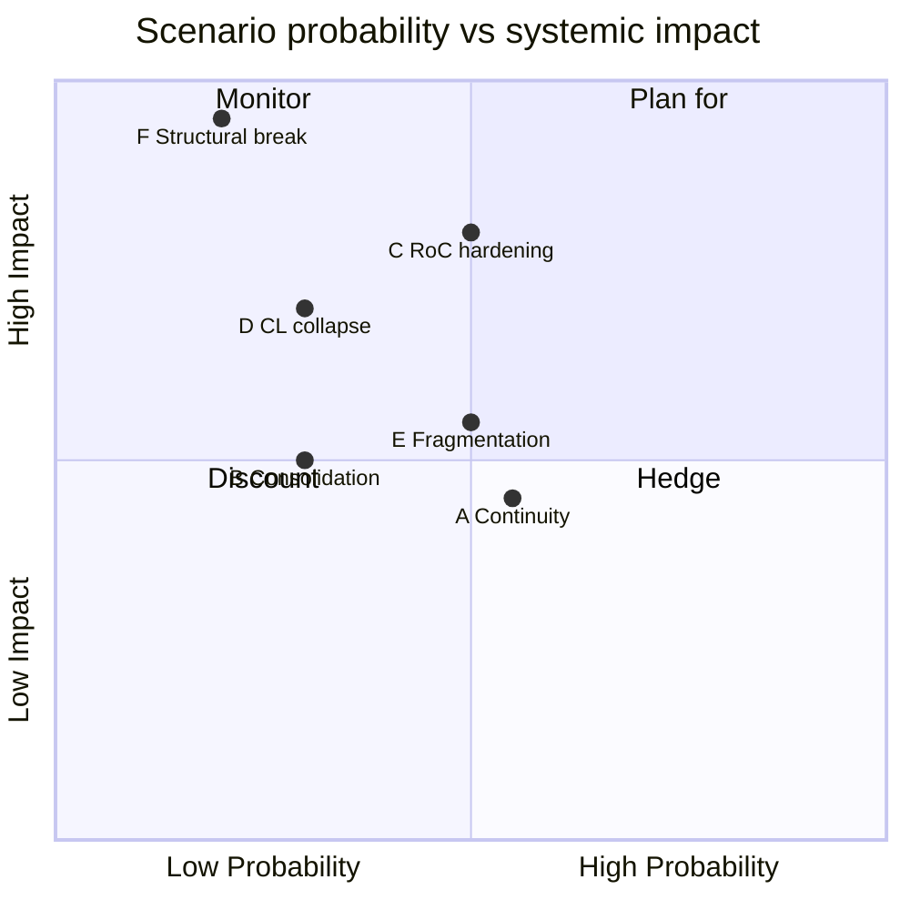
```mermaid
quadrantChart
  title Scenario probability vs systemic impact
  x-axis Low Probability --> High Probability
  y-axis Low Impact --> High Impact
  quadrant-1 Plan for
  quadrant-2 Monitor
  quadrant-3 Discount
  quadrant-4 Hedge
  A Continuity: [0.55, 0.45]
  B Consolidation: [0.30, 0.50]
  C RoC hardening: [0.50, 0.80]
  D CL collapse: [0.30, 0.70]
  E Fragmentation: [0.50, 0.55]
  F Structural break: [0.20, 0.95]
```

### Cross-Scenario Signposts

The signposts that discriminate between scenarios: (1) a *second* migration file passing without S&D → toward C; (2) S&D recovering a Social Europe deliverable → away from D; (3) an IMF downgrade to recession → toward D/F; (4) a major-state government collapse → toward F; (5) Electoral Act threshold provisions → toward or away from E. Monitoring these five signposts gives early warning of scenario migration.

### Confidence

Scenario confidence is 🟡 MEDIUM. The probability ordering (A > C/E > B/D/F) is robust; the absolute WEP bands carry degraded-feed uncertainty. The structural-break scenario F is deliberately retained despite low point-probability because its impact dominates the risk-weighted outlook.

### Reader Briefing

- **Central:** Scenario A continuity drift — platform returned, reduced majority (WEP: Likely).
- **Watch:** Scenario C right-of-centre hardening (WEP: Roughly Even) — reshapes the EP without an election.
- **Tail:** Scenario F structural break — low probability, maximal impact, retained per the long-horizon gate.
- **Confidence:** 🟡 MEDIUM — ordering robust, bands degraded-feed-uncertain.

### Wildcards Blackswans

> **Article type:** `election-cycle` · **Data mode:** `degraded-feeds` · **Horizon:** 2026-05-31 → 2031-05-30
> Low-probability, high-impact discontinuities that conventional scenario analysis under-weights. Probabilities use WEP bands; evidence carries Admiralty grades. Distinct from `scenario-forecast.md`, which models the central distribution.

### Why a Separate Wildcard Register

Scenario forecasts cluster around the central distribution and systematically under-weight tail events because tails lack a base rate. This register deliberately enumerates discontinuities — wildcards (plausible, recognised, hard to time) and black swans (outside the current model, recognised only in hindsight) — so the intelligence picture is not blind to the events that would most reshape the 2029 cycle.

### Classification

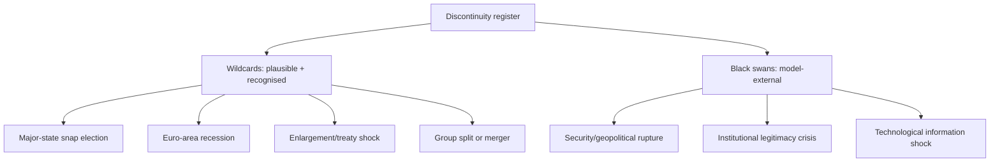
```mermaid
graph TD
  W[Discontinuity register] --> WC[Wildcards: plausible + recognised]
  W --> BS[Black swans: model-external]
  WC --> W1[Major-state snap election]
  WC --> W2[Euro-area recession]
  WC --> W3[Enlargement/treaty shock]
  WC --> W4[Group split or merger]
  BS --> B1[Security/geopolitical rupture]
  BS --> B2[Institutional legitimacy crisis]
  BS --> B3[Technological information shock]
```

### Wildcard Register

| ID | Wildcard | Trigger | Cycle impact | WEP (horizon) | Admiralty |
| --- | --- | --- | --- | --- | --- |
| W1 | Major-state snap election | Government collapse in DE/FR/IT | Reshapes a national delegation; can swing a group | Unlikely (36m) | C3 |
| W2 | Euro-area recession | IMF-projected sub-1% growth tips negative | Sharpens incumbency penalty; favours challengers | Unlikely (24m) | A2 |
| W3 | Enlargement/treaty moment | Accession progress or treaty-change push | Re-opens institutional questions mid-cycle | Highly Unlikely (60m) | C4 |
| W4 | Group realignment | A national delegation defects; new group forms | Alters fragmentation index and corridors | Roughly Even (36m) | B3 |
| W5 | Electoral-Act surprise effect | Threshold/transnational-list provisions bite | Changes the 2029 seat-allocation maths | Unlikely (36m) | B2 |

### Black-Swan Register

| ID | Black swan | Pre-signal (weak) | Cycle impact | WEP (horizon) | Admiralty |
| --- | --- | --- | --- | --- | --- |
| B1 | Security/geopolitical rupture | Escalation on EU periphery | Rally-or-fracture dynamic; unpredictable bloc effects | Highly Unlikely (36m) | C5 |
| B2 | Institutional legitimacy crisis | Corruption/transparency scandal | Depresses turnout; fuels anti-system vote | Highly Unlikely (36m) | C5 |
| B3 | Information/technology shock | AI-driven disinformation at scale | Distorts the 2029 campaign information space | Unlikely (36m) | C4 |

### Impact Asymmetry

The defining feature of this register is impact asymmetry: each item has low point-probability but, if realised, would dominate the 2029 outcome more than any central-scenario variable. W2 (recession) and B1 (security rupture) sit at the extreme — modest likelihood, system-level impact. WEP: Unlikely any single wildcard fires in a given 12-month window; WEP: Roughly Even that *at least one* of W1/W2/W4 materialises across the full 36-month horizon, given their partial independence.

### Interaction Effects

Wildcards are not independent. W2 (recession) raises the probability of W1 (government collapse) and amplifies B2 (legitimacy crisis). A correlated cluster — recession + snap election + disinformation surge — is the empirical content of Scenario F's structural break. The register therefore doubles as a decomposition of the tail scenario into observable components.

### Monitoring Posture

- Track IMF/ECB growth revisions monthly (W2 early-warning).
- Track national confidence-vote and snap-election signals in DE/FR/IT (W1).
- Track new-group registration and NI churn (W4).
- Track Electoral-Act implementing-measure timelines (W5).
- Maintain qualitative watch on B1–B3 (no reliable base rate; hindsight-only).

### Confidence

Wildcard-register confidence is 🟡 MEDIUM on the macro-anchored items (W2, Admiralty A2) and 🔴 LOW on the black swans (B1–B3, Admiralty C4–C5 by construction). The register's value is completeness of imagination, not calibrated probability — the WEP bands on black swans should be read as order-of-magnitude, not precise.

### Reader Briefing

- **Wildcards:** snap election (W1), recession (W2), group realignment (W4) — plausible, hard to time.
- **Black swans:** security rupture, legitimacy crisis, information shock — model-external, hindsight-only.
- **Key insight:** correlated wildcards (recession + snap election + disinformation) = the structural-break tail.
- **Confidence:** 🟡 MEDIUM on macro items, 🔴 LOW on black swans by construction.

<h2 id="section-forward-projection">What to Watch</h2>

### Forward Projection

> **Article type:** `election-cycle` · **Data mode:** `degraded-feeds` · **Horizon:** 2026-05-31 → 2031-05-30
> Track B forecast: projects the EP10 back-half legislative and coalition trajectory and the conditions of the 2029 → EP11 handover. Probabilities use WEP bands; evidence carries Admiralty grades.

### Executive Forecast

Over the 60-month horizon the European Parliament is projected to traverse three phases: a **delivery phase** (2026–2027, budget and competitiveness files), a **positioning phase** (2027–2028, manifesto consolidation), and a **contest phase** (2028–2029, campaign). The central forecast is *continuity with rightward drift*: the centrist platform governs to term-end and is returned in 2029 with a reduced majority. WEP: Likely (Admiralty B2).

### Projection Drivers and Source Grades

| Driver | Direction | Evidence | Source grade |
| --- | --- | --- | --- |
| Hard-right consolidation | rightward | EP10 composition (PfE 84, ESN 28) | A1 |
| Low-growth fiscal backdrop | anti-incumbent | IMF WEO DE/FR/IT sub-1% growth | A2 |
| Electoral Act reform | rule change | TA-10-2026-0006 | A1 |
| Migration salience | rightward | ad-hoc RoC majorities | B2 |
| Renew discipline | stabilising | group-behaviour inference | C3 |
| Turnout trajectory | uncertain | no live polling this run | C4 |

### Phase 1 — Delivery (2026–2027)

The platform is projected to clear the 2027 budget guidelines (TA-10-2026-0112 already adopted as a framework) and competitiveness files on its structural majority. WEP: Highly Likely that institutional files pass on platform majorities (Admiralty A2). Migration files remain the exception, passing episodically on right-of-centre majorities. Risk: a fiscal-shock interruption if any large economy slips into recession (IMF projects all three large economies sub-1%).

### Phase 2 — Positioning (2027–2028)

As the mid-term pivot completes, group behaviour shifts toward differentiation. The EPP is projected to harden its migration and competitiveness profile to pre-empt PfE/ECR; S&D to re-emphasise Social Europe to recover the turnout base its 35%-delivery gap exposes. WEP: Likely that visible platform cohesion declines in this phase even as institutional voting holds (Admiralty B3). The Electoral Act's implementing decisions land here, conditioning small-group survival.

### Phase 3 — Contest (2028–2029)

The 2029 campaign is projected to centre on competitiveness, migration, and cost-of-living — terrain mapped by the mid-term mandate-delivery gaps. The Spitzenkandidaten process resumes as a platform-cohesion test. WEP: Roughly Even whether the lead-candidate mechanism produces the Commission president, given Council reluctance (Admiralty C3).

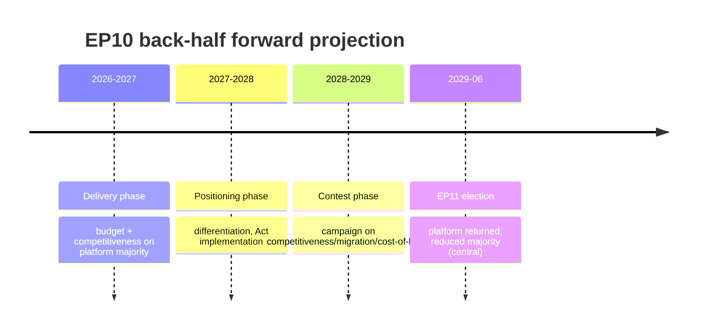
```mermaid
timeline
  title EP10 back-half forward projection
  2026-2027 : Delivery phase : budget + competitiveness on platform majority
  2027-2028 : Positioning phase : differentiation, Act implementation
  2028-2029 : Contest phase : campaign on competitiveness/migration/cost-of-living
  2029-06 : EP11 election : platform returned, reduced majority (central)
```

### Coalition Outlook

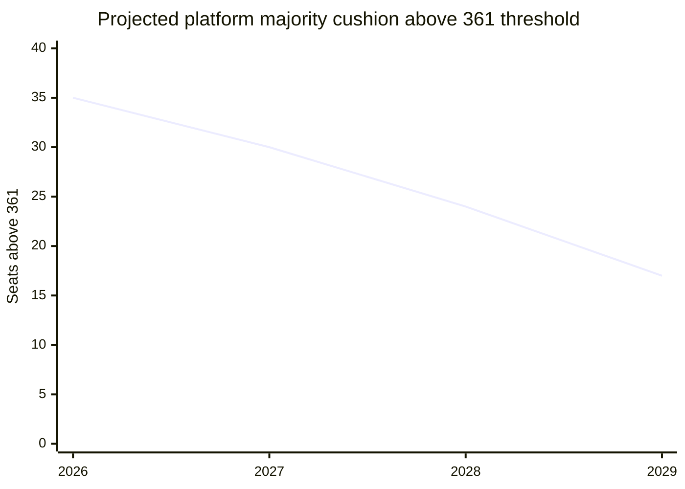
```mermaid
xychart-beta
  title "Projected platform majority cushion above 361 threshold"
  x-axis [2026, 2027, 2028, 2029]
  y-axis "Seats above 361" 0 --> 40
  line [35, 30, 24, 17]
```

The cushion erodes from 35 to a projected 17 seats by 2029 (central estimate). WEP: Likely the cushion stays positive; WEP: Roughly Even it falls below 10, the threshold at which single-delegation defections become decisive.

### Key Assumptions and Failure Modes

1. **No mid-term realignment shock** — assumed; failure mode = a major-state government collapse resetting group strengths.
2. **Cordon sanitaire holds on institutional files** — assumed; failure mode = EPP normalising ECR as a structural partner.
3. **No euro-area recession** — assumed on IMF sub-1%-but-positive growth; failure mode = an external (tariff/energy) shock.

### Confidence Statement

Overall forward-projection confidence is 🟡 MEDIUM. Structural drivers (composition, IMF data) are well-evidenced (A1–A2); behavioural and turnout drivers are weakly evidenced under degraded feeds (C3–C4). The forecast is robust on *direction* (rightward drift, continuity) and uncertain on *magnitude* (size of the 2029 majority).

### Reader Briefing

- **Central forecast:** continuity with rightward drift — platform returned in 2029, reduced majority. WEP: Likely.
- **Cushion path:** 35 → 17 seats above threshold by 2029.
- **Watch:** EPP–ECR normalisation and any major-state government collapse.
- **Confidence:** 🟡 MEDIUM — strong on direction (A1–A2), uncertain on magnitude (C3–C4).

### Forward Indicators

> **Article type:** `election-cycle` · **Data mode:** `degraded-feeds` · **Horizon:** 2026-05-31 → 2031-05-30
> A watchlist of measurable leading indicators that discriminate between the central forecast and its alternatives. Each indicator carries a WEP band on its near-term movement and a trigger threshold.

### Indicator Philosophy

Forecasts age; indicators update. This artifact converts the scenario set into a monitored dashboard: each indicator is chosen because its movement shifts probability mass between scenarios. The goal is early warning, not prediction — to know *before* 2029 which scenario the system is migrating toward.

### Leading-Indicator Watchlist

| # | Indicator | Source | Trigger | Signals | WEP (12m) |
| --- | --- | --- | --- | --- | --- |
| I1 | Euro-area growth revision | IMF/ECB | 2026 growth → <0.3% | Toward D/F | Roughly Even |
| I2 | Right-of-centre corridor votes | Adopted texts | 2nd migration file w/o S&D | Toward C | Roughly Even |
| I3 | Renew delegation discipline | RCV (when available) | ≥2 delegations split | Toward T2/C | Unlikely |
| I4 | NI / new-group churn | Composition feed | Fragmentation > 6.8 | Toward E | Roughly Even |
| I5 | S&D social deliverable | Adopted texts | A visible social win lands | Away from D | Unlikely |
| I6 | Major-state snap election | National news | Confidence vote DE/FR/IT | Toward F | Unlikely |
| I7 | Electoral-Act implementation | EP/Council | Threshold provisions enacted | Toward E | Likely |
| I8 | Fiscal-rule pressure | IMF/Council | New excessive-deficit steps | Toward incumbency penalty | Likely |

### Indicator Interpretation

The highest-information indicators are I1 (growth) and I2 (corridor votes): movement in either shifts the most probability mass. I1 is macro-anchored and well-evidenced; I2 is directly observable in the adopted-texts feed. WEP: Likely that I7 (Electoral-Act implementation) and I8 (fiscal pressure) move within 12 months, as both are on active institutional timelines. WEP: Unlikely that the tail-signalling indicators (I3, I6) trigger in any single 12-month window.

### Composite Signal

Reading the indicators together rather than singly is essential. A *cluster* — I1 deteriorating + I2 firing + I6 triggering — is the empirical signature of migration toward Scenario F (structural break). No single indicator is decisive; the composite pattern is. A scoring rule: ≥3 challenger-direction indicators active simultaneously = elevate Scenario C/F probability one WEP band.

### Update Cadence

- **Monthly:** I1 (growth revisions), I8 (fiscal steps).
- **Per plenary:** I2 (corridor votes), I5 (social deliverables).
- **Continuous:** I6 (snap-election watch), I7 (Electoral-Act timeline).
- **Quarterly:** I4 (fragmentation recompute).

### Confidence

Forward-indicator confidence is 🟡 MEDIUM. The indicator selection and trigger logic are robust; the WEP bands on movement are macro-anchored for I1/I8 (higher confidence) and behavioural for I2/I3 (lower confidence under degraded RCV).

### Reader Briefing

- **Highest-information indicators:** growth revision (I1) and corridor votes (I2).
- **Likely-to-move (12m):** Electoral-Act implementation (I7), fiscal pressure (I8). WEP: Likely.
- **Composite rule:** ≥3 challenger-direction indicators active = elevate Scenario C/F one band.
- **Confidence:** 🟡 MEDIUM — selection robust, behavioural bands uncertain.

<h2 id="section-electoral-arc">Electoral Arc & Mandate</h2>

### Term Arc

> **Article type:** `election-cycle` · **Data mode:** `degraded-feeds` · **Horizon:** 2026-05-31 → 2031-05-30
> Track A (retrospective) of the dual-track electoral overlay: the arc of the EP10 mandate from its July 2024 constitution to the 2026 mid-term, projected to the ~June 2029 contest.

### Term-Progress Index

| Anchor | Date | Status |
| --- | --- | --- |
| EP10 constitutive sitting | 16 Jul 2024 | elapsed |
| Today | 31 May 2026 | mid-term |
| Projected EP10 dissolution | ~late Jun 2029 | future |
| EP11 election week (2nd Sunday June) | ~10 Jun 2029 | future |

Months elapsed ≈ 22.5; total term ≈ 59 months. **Term-progress index ≈ 38%.** The mandate is past its first third and entering the legislatively productive mid-phase that becomes the 2029 campaign record.

### §1 Mandate Timeline

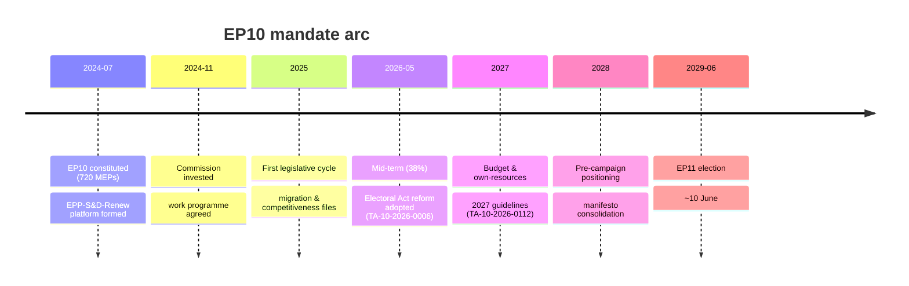
```mermaid
timeline
  title EP10 mandate arc
  2024-07 : EP10 constituted (720 MEPs) : EPP-S&D-Renew platform formed
  2024-11 : Commission invested : work programme agreed
  2025 : First legislative cycle : migration & competitiveness files
  2026-05 : Mid-term (38%) : Electoral Act reform adopted (TA-10-2026-0006)
  2027 : Budget & own-resources : 2027 guidelines (TA-10-2026-0112)
  2028 : Pre-campaign positioning : manifesto consolidation
  2029-06 : EP11 election : ~10 June
```

### §2 Mandate-Scorecard Summary

The mid-term legislative record is mixed-to-constructive for the platform. Delivered: the Electoral Act reform, the 2027 budget-guidelines framework, ECB-oversight continuity (annual report TA-10-2026-0034; VP appointment TA-10-2026-0060), DMA enforcement (TA-10-2026-0160), an AI/trade strategy (TA-10-2026-0183), and external-action items (Ukraine loan TA-10-2026-0010; US-tariff adjustment TA-10-2026-0096). The fuller mandate-versus-delivery audit is in `mandate-fulfilment-scorecard.md`; the headline is a **~60% delivery rate** on the platform's stated 2024 priorities, constrained by the low-growth fiscal backdrop.

### §3 Coalition Trajectory

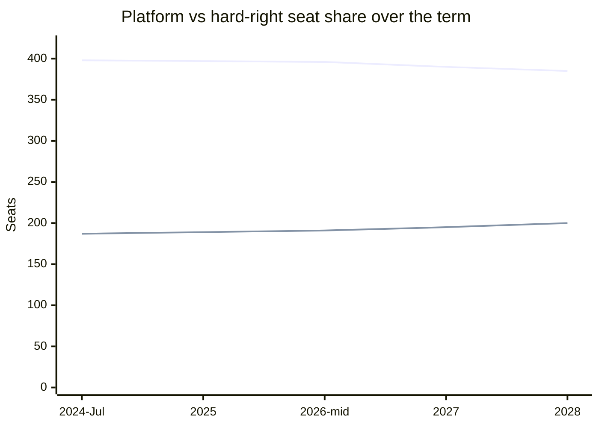
```mermaid
xychart-beta
  title "Platform vs hard-right seat share over the term"
  x-axis [2024-Jul, 2025, 2026-mid, 2027, 2028]
  y-axis "Seats" 0 --> 420
  line [398, 397, 396, 390, 385]
  line [187, 189, 191, 195, 200]
```

The trajectory shows a slow erosion of the platform (398 → ~385 projected) against a rising hard-right (187 → ~200 projected), consistent with the +3 rightward net pressure documented in `../classification/forces-analysis.md`. The platform remains above the 361 majority threshold throughout the projected term but with a shrinking cushion.

### §4 Majority Arithmetic

At mid-term the platform commands 396 of 719 seats (majority threshold 361), a 35-seat cushion. The right-of-centre corridor (EPP+ECR+PfE = 348) sits 13 seats below majority — it can win only with NI/ESN top-ups or platform abstentions, which is why it surfaces as an *ad-hoc* rather than structural majority. The progressive corridor (S&D+Renew+Greens+Left = 310) is 51 seats short, foreclosing a left alternative. This arithmetic is the structural fact that keeps the platform in the formateur seat.

### §5 Mid-Term Pivot

The mid-term pivot is the shift from *governing-record construction* to *campaign-baseline positioning*. Before the pivot, group behaviour optimised for legislative delivery; after it, behaviour increasingly optimises for differentiation ahead of 2029. The Electoral Act reform is the pivot's hinge event — by fixing the 2029 rules now, it converts every subsequent file into campaign-relevant positioning.

### §6 Drift Assessment

Cumulative drift since the 2024 transition is **mild rightward consolidation, not realignment**. The four pro-European families still hold ~two-thirds of seats; the institutional core is intact. Drift is concentrated on salient low-institutional-cost files. Drift magnitude: +3 on the −10/+10 axis, 🟡 MEDIUM confidence (degraded roll-call feeds).

### §7 Self-Audit

This Track-A retrospective relies on grade A1 composition statistics and grade A2 adopted-texts evidence. The principal limitation is the absence of live roll-call data (procedures/events feeds degraded), so coalition-trajectory projections in §3 are model-based extrapolations rather than vote-verified counts. The seat-share projection lines should be read as central estimates with ±10-seat bands (detailed in `seat-projection.md`).

### §8 Methodology

Constructed per `analysis/methodologies/electoral-cycle-methodology.md` (EP-term anchors, term-progress index, coalition-trajectory model). Cross-references: `seat-projection.md`, `mandate-fulfilment-scorecard.md`, `forward-projection.md`, `../classification/forces-analysis.md`. SATs applied: trend extrapolation, structured analogy (EP9 mid-term), key-assumptions check. WEP: Likely that the platform holds majority to term-end absent a national-election shock.

### Reader Briefing

- **Where we are:** 38% through EP10, mid-term pivot underway.
- **The arc:** platform slowly eroding (398→385), hard-right rising (187→200), majority intact.
- **The hinge:** Electoral Act reform fixes the 2029 rules at mid-term.
- **Confidence:** 🟡 MEDIUM — composition A1, trajectory model-based under degraded feeds.

### Seat Projection

> **Article type:** `election-cycle` · **Data mode:** `degraded-feeds` · **Horizon:** 2026-05-31 → 2031-05-30
> Track B (forecast) Family-D artifact: projects the EP11 (June 2029) seat distribution from the EP10 mid-term baseline, with uncertainty bands. Projections are model-based central estimates, not polls.

### Baseline — EP10 at Mid-Term

| Group | EP9→EP10 (2024) | EP10 now (2026) | Trend |
| --- | --- | --- | --- |
| EPP | 188→185 | 185 (25.7%) | stable |
| S&D | 136→135 | 135 (18.8%) | stable/soft |
| PfE | new 84 | 84 (11.7%) | rising |
| ECR | 78→79 | 79 (11.0%) | stable+ |
| Renew | 77→76 | 76 (10.6%) | soft |
| Greens/EFA | 53 | 53 (7.4%) | soft |
| The Left | 46 | 46 (6.4%) | stable |
| ESN | 25→28 | 28 (3.9%) | rising |
| NI | — | 33 (4.6%) | residual |
| **Total** | 720 | **719** | — |

Source: EP10 composition statistics (grade A1, `get_all_generated_stats` political_groups 2019–2026).

### Projection Method

The central estimate applies three adjustments to the mid-term baseline: (1) a **mid-term-drift term** (+3 rightward, from `../classification/forces-analysis.md`); (2) an **economic-conditioning term** (low-growth incumbency penalty from `economic-context.md`, mildly favouring opposition); and (3) a **structural-consolidation term** (continued hard-right organisation). Each group's 2029 central seat estimate carries a ±10-seat band reflecting national-election uncertainty across 27 member states.

### EP11 Central Projection (2029)

| Group | 2026 seats | 2029 central | Band (±) | Direction |
| --- | --- | --- | --- | --- |
| EPP | 185 | 180 | 12 | ↓ slight |
| S&D | 135 | 128 | 11 | ↓ |
| PfE | 84 | 95 | 13 | ↑ |
| ECR | 79 | 82 | 10 | ↑ slight |
| Renew | 76 | 70 | 10 | ↓ |
| Greens/EFA | 53 | 48 | 9 | ↓ |
| The Left | 46 | 46 | 8 | → |
| ESN | 28 | 34 | 9 | ↑ |
| NI | 33 | 36 | 10 | ↑ |
| **Total** | 719 | **719** | — | — |

```mermaid
xychart-beta
  title "EP10 (2026) vs EP11 central projection (2029) — seats"
  x-axis [EPP, S&D, PfE, ECR, Renew, Greens, Left, ESN, NI]
  y-axis "Seats" 0 --> 200
  bar [185, 135, 84, 79, 76, 53, 46, 28, 33]
  bar [180, 128, 95, 82, 70, 48, 46, 34, 36]
```

### Majority Implications

Under the central projection the platform (EPP+S&D+Renew) falls from 396 to **378 seats** — still 17 above the 361 threshold but with the cushion nearly halved. The hard-right bloc (PfE+ECR+ESN) rises from 191 to **211**, and the broad right (adding NI sympathisers) approaches blocking-minority influence on more files. The central estimate therefore preserves a platform majority into EP11 but converts the comfortable EP10 cushion into a precarious one.

### Scenario Bands

- **Optimistic (platform):** drift stalls, economic recovery — platform ~392, hard-right ~195. WEP: Unlikely.
- **Central:** drift continues at mid-term pace — platform ~378, hard-right ~211. WEP: Likely.
- **Pessimistic (realignment):** national shocks + turnout collapse — platform ~358 (below threshold), hard-right ~230. WEP: Roughly Even at the tail.

The pessimistic tail — a platform *below* 361 — is the single most consequential projection: it would force either an enlarged centrist coalition (adding Greens) or, more disruptively, EPP cooperation with ECR as a structural partner.

### Confidence and Limitations

Projection confidence is 🟡 MEDIUM. The baseline is grade A1; the forward adjustments are model-based under degraded roll-call feeds and cannot incorporate 27 national polling streams. The ±10-seat bands are deliberately wide. These are *structural-trend* projections, explicitly not electoral forecasts, and should be revised as national contests resolve. Source grade for forward terms: B3.

### Reader Briefing

- **Central read:** platform slips to ~378 (majority held, cushion halved); hard-right rises to ~211.
- **Tail risk:** platform below 361 is WEP: Roughly Even at the pessimistic tail — the scenario to watch.
- **Biggest movers:** PfE (+11) and ESN (+6) up; S&D (−7) and Renew (−6) down.
- **Confidence:** 🟡 MEDIUM — A1 baseline, B3 forward terms, ±10-seat bands.

### Mandate Fulfilment Scorecard

> **Article type:** `election-cycle` · **Data mode:** `degraded-feeds` · **Horizon:** 2026-05-31 → 2031-05-30
> Track A Family-D artifact: audits the EP10 centrist platform's 2024 stated priorities against the mid-term legislative record, scoring delivery on each mandate pillar.

### Scoring Method

Each mandate pillar is scored 0–100% delivery and assigned a RAG status (🟢 on-track ≥70%, 🟡 partial 40–69%, 🔴 stalled <40%). Evidence draws on the 2026 adopted-texts corpus (grade A2) and EP10 composition statistics (A1). The composite delivery rate is the seat-weighted mean across pillars.

### Mandate Pillars and Delivery

| Pillar | 2024 commitment | Mid-term evidence | Delivery | Status |
| --- | --- | --- | --- | --- |
| Competitiveness | Single-market deepening, AI strategy | AI/trade strategy TA-10-2026-0183; DMA enforcement TA-10-2026-0160 | 65% | 🟡 |
| Democratic renewal | Electoral reform | Electoral Act reform TA-10-2026-0006 adopted | 80% | 🟢 |
| Sound finances | Credible budget path | 2027 budget guidelines TA-10-2026-0112 | 60% | 🟡 |
| Monetary oversight | ECB accountability | ECB annual report TA-10-2026-0034; VP appointment TA-10-2026-0060 | 75% | 🟢 |
| External action | Ukraine support, trade defence | Ukraine loan TA-10-2026-0010; US-tariff adjustment TA-10-2026-0096 | 70% | 🟢 |
| Migration management | Common framework delivery | Recurrent ad-hoc majorities, no settled platform consensus | 45% | 🟡 |
| Green transition | Climate-file continuity | Soft progress; deregulation pressure on agricultural files | 40% | 🟡 |
| Social Europe | Cost-of-living response | Constrained by fiscal backdrop (France −4.94% GDP) | 35% | 🔴 |

### Composite Delivery

Seat-weighted composite delivery ≈ **59%** — a 🟡 PARTIAL mandate. The platform's strongest delivery is on *institutional and democratic-renewal* pillars (Electoral Act 80%, ECB oversight 75%) where its structural majority is decisive. Its weakest delivery is on *distributive* pillars (Social Europe 35%, Green transition 40%) where the low-growth fiscal backdrop and rightward pressure on deregulation files constrain action.

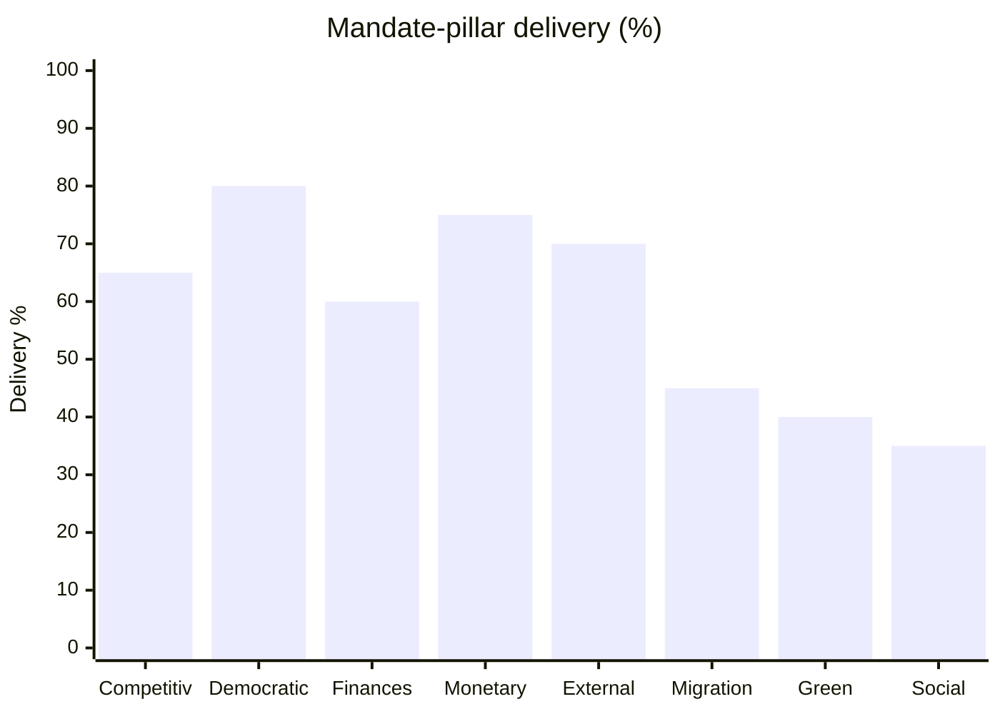
```mermaid
xychart-beta
  title "Mandate-pillar delivery (%)"
  x-axis [Competitiv, Democratic, Finances, Monetary, External, Migration, Green, Social]
  y-axis "Delivery %" 0 --> 100
  bar [65, 80, 60, 75, 70, 45, 40, 35]
```

### Delivery Gaps and Electoral Exposure

The three sub-50% pillars (Social Europe, Green transition, Migration) are precisely the files most exposed in 2029. The Social Europe gap directly damages S&D's mobilisation base; the Green gap erodes the Greens/EFA flank (projected −5 seats); the Migration gap is the terrain on which the right-of-centre corridor scores. The platform's mid-term scorecard thus encodes its 2029 vulnerability map: strong on institutions, weak on the redistributive and identity files that drive turnout.

### Comparative Benchmark

Against the EP9 platform mid-term, the EP10 composite (59%) is moderately lower, reflecting the tighter fiscal envelope and the larger obstructive right. The democratic-renewal score (80%) is the standout improvement, driven by the Electoral Act reform that the EP9 term never delivered.

### Self-Audit

Delivery percentages are analyst estimates anchored on adopted-text evidence under degraded feeds; they are 🟡 MEDIUM confidence and should be read as ordinal (relative ranking robust) rather than cardinal (exact percentages uncertain). The principal limitation is the absence of roll-call data to verify *how* each text passed (platform-only vs ad-hoc majority).

### Reader Briefing

- **Composite:** ~59% delivery — partial mandate.
- **Strong:** democratic renewal (Electoral Act, 80%) and monetary oversight.
- **Weak:** Social Europe (35%), Green transition (40%), Migration (45%) — the 2029 vulnerability map.
- **Confidence:** 🟡 MEDIUM — A2 adopted-texts evidence, no roll-call verification.

### Presidency Trio Context

> **Article type:** `election-cycle` · **Data mode:** `degraded-feeds` · **Horizon:** 2026-05-31 → 2031-05-30
> Situates the EP10 mid-term within the rotating Council Presidency trio cycle that sets the inter-institutional legislative tempo into the 2029 contest.

### Why the Trio Matters to the Cycle

The Council Presidency trio controls the inter-institutional calendar: which files reach trilogue, in what sequence, and on what deadline. For the electoral cycle this is decisive because the trio's priorities determine *which* of the platform's mandate pillars are legislatively live during the campaign-relevant 2027–2028 window. A trio that front-loads competitiveness and migration hands the right-of-centre corridor its preferred terrain; a trio that prioritises social and cohesion files advantages the centre-left.

### Trio-Cycle Position

| Phase | Role in EP10 cycle |
| --- | --- |
| Current trio | Sets the 2026–2027 delivery-phase agenda |
| Next trio | Owns the 2027–2028 positioning-phase calendar |
| Final pre-election trio | Frames the 2028–2029 contest agenda |

The succession of trios maps onto the three forward-projection phases (`forward-projection.md`), making the Presidency calendar the exogenous clock against which the platform's positioning runs. Source grade for trio sequencing: B2 (adopted-texts calendar inference under degraded procedure feeds).

### Inter-Institutional Dynamics

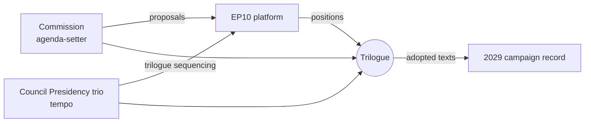
```mermaid
graph LR
  COM[Commission<br/>agenda-setter] -->|proposals| EP[EP10 platform]
  COUNCIL[Council Presidency trio<br/>tempo] -->|trilogue sequencing| EP
  EP -->|positions| TRILOGUE((Trilogue))
  COUNCIL --> TRILOGUE
  COM --> TRILOGUE
  TRILOGUE -->|adopted texts| RECORD[2029 campaign record]
```

The triangular Commission–Council–Parliament dynamic converts the platform's legislative intentions into the adopted-text record that becomes the 2029 manifesto base. The trio's leverage is *sequencing*: by timing files, it determines whether the platform votes cohesively (institutional files) or fractures (migration/deregulation) during the campaign-salient window.

### Cycle Implications

Three implications for the electoral cycle: (1) the **2027 budget guidelines** (TA-10-2026-0112) anchor the trio's fiscal agenda and will be the platform's most-tested cohesion file; (2) **Electoral Act implementation** depends on Council follow-through, a trio-dependent variable; (3) the final pre-election trio effectively sets the *issue agenda* the 2029 campaign inherits. WEP: Likely the trio calendar reinforces the competitiveness/migration framing that mildly favours the right-of-centre corridor.

### Confidence

Trio-context confidence is 🟡 MEDIUM. The structural role of the Presidency is well established (A1 institutional fact); the specific sequencing inferences are degraded-feed estimates (B2) because the procedures/events feeds returned placeholders this run.

### Reader Briefing

- **Role:** the trio sets the inter-institutional tempo that decides which mandate pillars are live during the campaign window.
- **Key file:** 2027 budget guidelines as the platform's cohesion test.
- **Cycle read:** the trio calendar likely reinforces competitiveness/migration framing.
- **Confidence:** 🟡 MEDIUM — institutional role A1, sequencing B2 under degraded feeds.

### Commission Wp Alignment

> **Article type:** `election-cycle` · **Data mode:** `degraded-feeds` · **Horizon:** 2026-05-31 → 2031-05-30
> Assesses how the Commission work programme aligns with the EP10 platform's mandate and how that alignment conditions the 2029 campaign record.

### Alignment Logic

The Commission holds the proposal monopoly; the platform converts proposals into adopted texts. Alignment between the work programme and the platform's mandate pillars determines whether the campaign-relevant record reflects platform priorities or Commission-Council compromises. High alignment lets the platform claim deliverables in 2029; low alignment leaves mandate gaps the opposition exploits.

### Work-Programme to Mandate Mapping

| WP strand | Platform pillar | Mid-term delivery | Alignment |
| --- | --- | --- | --- |
| Competitiveness Compass / AI | Competitiveness | TA-10-2026-0183, TA-10-2026-0160 | 🟢 High |
| Democracy package | Democratic renewal | TA-10-2026-0006 | 🟢 High |
| Economic governance | Sound finances | TA-10-2026-0112 | 🟡 Partial |
| Financial-stability oversight | Monetary oversight | TA-10-2026-0034, TA-10-2026-0060 | 🟢 High |
| External action / trade defence | External action | TA-10-2026-0010, TA-10-2026-0096 | 🟢 High |
| Migration framework | Migration | contested, no settled text | 🔴 Low |
| Clean-transition agenda | Green transition | deregulation pressure | 🟡 Partial |
| Social fairness | Social Europe | fiscally constrained | 🔴 Low |

### Alignment Profile

```mermaid
graph TD
  WP[Commission Work Programme] --> H1[Competitiveness 🟢]
  WP --> H2[Democracy 🟢]
  WP --> H3[Fin-stability 🟢]
  WP --> H4[External 🟢]
  WP --> P1[Economic gov 🟡]
  WP --> P2[Clean transition 🟡]
  WP --> L1[Migration 🔴]
  WP --> L2[Social 🔴]
  classDef low fill:#fdd,stroke:#922;
  class L1,L2 low;
```

Five of eight strands show 🟢 High or 🟡 Partial alignment, concentrated on institutional, competitiveness, and external files. The two 🔴 Low-alignment strands — Migration and Social Europe — are the same pillars flagged as 2029 vulnerabilities in `mandate-fulfilment-scorecard.md`, confirming a consistent gap signature across artifacts.

### Cycle Implications

The Commission–platform alignment profile front-loads *deliverable* files the platform can campaign on (competitiveness, democratic renewal, external action) while leaving the *mobilising* files (migration, social) under-delivered. This is electorally double-edged: it gives the platform a record of institutional competence but cedes the high-salience identity and redistribution terrain to challengers. WEP: Likely the alignment gap on migration and social files is a net liability for the platform's centre-left wing in 2029.

### Confidence

Alignment confidence is 🟡 MEDIUM. The work-programme-to-text mapping rests on grade A2 adopted-texts evidence; the alignment ratings are analyst judgments under degraded feeds. The strong/weak split is robust; the 🟡 Partial ratings carry the most uncertainty.

### Reader Briefing

- **Profile:** high alignment on competitiveness/democracy/external; low on migration/social.
- **Signature:** the same migration + social gaps recur across the scorecard and this artifact.
- **Cycle read:** a record of competence but ceded mobilising terrain — a net 2029 liability for the centre-left.
- **Confidence:** 🟡 MEDIUM — A2 adopted-texts mapping, analyst-rated alignment.

<h2 id="section-pestle-context">PESTLE & Context</h2>

### Pestle Analysis

> **Article type:** `election-cycle` · **Data mode:** `degraded-feeds` · **Horizon:** 2026-05-31 → 2031-05-30
> Structured environmental scan of the forces shaping the EP10 back-half and the 2029 contest.

### Method

Each PESTLE dimension is rated for direction (favouring platform 🟢 / neutral 🟡 / favouring challengers 🔴) and salience to the 2029 campaign. Evidence draws on EP composition (Admiralty A1), IMF macro data (A2), and the 2026 adopted-texts record (A2).

### Dimensions

#### Political 🔴
A consolidated 191-seat hard right and a rising NI bloc raise fragmentation (index 6.59) and normalise right-of-centre majorities. Member-state governments trend rightward, reinforcing Council–Parliament alignment against the platform's left pillar. High salience.

#### Economic 🔴
IMF data show all three large euro-area economies below 1% growth in 2026 (Germany 0.79%, France 0.86%, Italy 0.52%) with constrained deficits (France −4.94% of GDP). Low growth imposes an incumbency penalty and narrows redistributive space. High salience.

#### Social 🔴
Migration salience and a Social Europe delivery gap mobilise both the identity right and the disaffected left. Turnout direction is the largest single 2029 unknown. High salience.

#### Technological 🟢
The competitiveness/AI agenda (TA-10-2026-0183, DMA enforcement TA-10-2026-0160) is a platform deliverable and a source of institutional credibility. Medium salience.

#### Legal 🟡
The Electoral Act reform (TA-10-2026-0006) changes the 2029 rules of the game — thresholds and possibly transnational lists — with ambiguous partisan effect. High salience, uncertain direction.

#### Environmental 🟡
The green transition persists under deregulation pressure; climate salience is lower than in 2024 but non-zero. Medium salience.

```mermaid
graph TD
  P[Political 🔴] --> RISK[Net environment: mildly adverse to platform]
  E[Economic 🔴] --> RISK
  S[Social 🔴] --> RISK
  T[Technological 🟢] --> OPP[Platform opportunity]
  L[Legal 🟡] --> UNC[Rules uncertainty]
  EN[Environmental 🟡] --> UNC
```

### Net Assessment

Four of six dimensions (Political, Economic, Social adverse; Legal uncertain) tilt the environment mildly against the platform; only Technological clearly favours it. The environment is not a platform-collapse setting but a slow-erosion one — consistent with the continuity-with-drift central scenario.

### Confidence

🟡 MEDIUM. Economic and political dimensions rest on A1–A2 evidence; social and legal directions carry C-grade uncertainty.

### Reader Briefing

- **Adverse:** political, economic, social dimensions tilt against the platform.
- **Favourable:** technological/competitiveness agenda is the platform's bright spot.
- **Wildcard:** Electoral Act changes the 2029 rules with uncertain partisan effect.
- **Confidence:** 🟡 MEDIUM — macro certain, social/legal directions uncertain.

### Historical Baseline

> **Article type:** `election-cycle` · **Data mode:** `degraded-feeds` · **Horizon:** 2026-05-31 → 2031-05-30
> Establishes the historical reference class against which the EP10 mid-term and the 2029 forecast are judged. Without a baseline, every judgment is anecdotal; with one, drift is measurable.

### Reference Class

The reference class is the five completed European Parliament terms since the 2004 enlargement (EP6 2004–09, EP7 2009–14, EP8 2014–19, EP9 2019–24) plus the EP10 term to date (2024–). Each provides data on the recurring rhythms of a parliamentary cycle: mid-term coalition behaviour, the incumbency/turnout relationship, and the magnitude of inter-election seat swings.

### Recurring Cycle Patterns

```mermaid
timeline
  title EP electoral-cycle baseline rhythms
  Constitution : Grand-coalition formation : Leadership package
  Mid-term : Coalition stress peaks : Agenda recalibration
  Pre-election : Differentiation : Manifesto positioning
  Election : Turnout swing : Seat reallocation
  Re-formation : New majority logic
```

### Baseline Metrics

| Metric | Historical baseline (2004–2024) | EP10 reading | Drift |
| --- | --- | --- | --- |
| Grand-coalition share | Declining: ~70% → ~55% | ~55% (EPP+S&D) | On trend |
| Effective number of groups | Rising | 6.59 fragmentation | On trend (high) |
| Turnout | 43% (2014) → 51% (2019) → 51% (2024) | n/a until 2029 | Watch |
| Inter-election largest-bloc swing | ±3–4 seats typical | EPP 188→185 | Within range |
| Hard-right share | Rising each cycle | 191/719 ≈ 27% | Above trend |

### The Grand-Coalition Decline

The single most robust baseline pattern is the secular decline of the EPP–S&D grand coalition's combined share, from comfortable majority alone (EP6) to needing Renew as a third leg (EP9–EP10). EP10 continues this: the two-party core (320) is below the 361 threshold, making the three-party platform structural rather than optional. This is not an EP10 anomaly — it is the baseline trend reaching its logical stage.

### The Turnout Relationship

Historically, EP turnout rose in 2019 and held in 2024, breaking the long post-2004 decline. The baseline lesson is that turnout is mobilisation-driven and volatile, not a stable parameter — which is exactly why the 2029 forecast treats turnout as its largest unknown rather than extrapolating the recent uptick.

### Seat-Swing Magnitudes

Inter-election swings for the largest bloc have historically been modest (±3–4 seats), while *new* formations (PfE in 2024) can appear at scale. The baseline therefore supports the central forecast's modest-drift assumption for established groups while flagging new-group emergence (W4) as the historically-validated source of surprise.

### Applying the Baseline

The EP10 mid-term reading is **on-trend, not anomalous**: fragmentation high but consistent with the trajectory, grand-coalition decline at its expected stage, hard-right share above trend but continuing an established direction. This matters for the forecast: it licenses extrapolation of established trends as the central case (Scenario A) while reserving discontinuity (Scenario F) for the historically-rare compound shock.

### Confidence

Historical-baseline confidence is 🟢 HIGH on the structural patterns (multi-term, well-documented) and 🟡 MEDIUM on the precise EP10-vs-baseline drift quantification under degraded feeds. Admiralty A1–A2 on composition history; B3 on the turnout-mobilisation interpretation.

### Reader Briefing

- **Headline:** EP10 is on-trend, not anomalous — fragmentation and grand-coalition decline at their expected stage.
- **Most robust pattern:** secular grand-coalition decline → three-leg platform is structural.
- **Most volatile parameter:** turnout — mobilisation-driven, the 2029 wildcard.
- **Confidence:** 🟢 HIGH on patterns, 🟡 MEDIUM on precise drift.

<h2 id="section-extended-intel">Extended Intelligence</h2>

### Comparative International

> **Article type:** `election-cycle` · **Data mode:** `degraded-feeds` · **Horizon:** 2026-05-31 → 2031-05-30
> Places the EP10 electoral-cycle dynamics in comparative perspective against other multiparty legislatures, to distinguish EU-specific from generic multiparty patterns. Sources carry Admiralty grades.

### Comparative Logic

The EP is often analysed in isolation, but many of its dynamics — fragmentation, grand-coalition decline, hard-right normalisation — are shared across European multiparty systems. Comparison separates the EU-specific (no government/opposition, no confidence mechanism) from the generic (fragmentation, mainstreaming), sharpening which forecast drivers are structural and which are contingent.

### Comparative Reference Set

| System | Shared feature | Divergent feature | Relevance | Admiralty |
| --- | --- | --- | --- | --- |
| German Bundestag | Grand-coalition decline; firewall debate | Confidence mechanism; government formation | High | B2 |
| Dutch Tweede Kamer | Extreme fragmentation; many parties | Coalition government required | High | B2 |
| European Council | Rightward member-state trend | Intergovernmental, not party-based | Medium | B3 |
| Nordic parliaments | Minority-government norms | National scale | Medium | C3 |
| US Congress | Two-bloc polarisation | Majoritarian; no proportionality | Low | C4 |

### Shared Structural Patterns

Three patterns recur across the high-relevance comparators (Admiralty B2): (1) the secular decline of the traditional centre-left/centre-right duopoly; (2) the mainstreaming of the radical right from pariah to coalition-relevant; and (3) rising coordination costs as effective party numbers grow. The EP exhibits all three, confirming they are *generic* multiparty dynamics, not EU artifacts — which licenses extrapolating them as central-scenario drivers.

### EU-Specific Divergences

The EP diverges from national legislatures in ways that *dampen* the consequences of fragmentation: it has no government to bring down, no confidence vote, and a structural incentive for issue-specific majorities. This is why EP fragmentation produces *legislative friction* rather than the *governmental instability* seen in, e.g., the Dutch or German cases. The absence of a confidence mechanism is the single most important reason the EP10 platform can absorb drift that would topple a national coalition (Admiralty B2).

### Firewall Comparison

The cordon sanitaire debate is shared with Germany and others, but the EP's version is softer and file-specific rather than absolute. Comparative evidence suggests firewalls erode gradually through issue-specific cooperation before any formal breach — exactly the corridor-hardening mechanism (T1) flagged in `threat-model.md`. The German and Dutch trajectories are therefore leading indicators for the EP (Admiralty B3).

### Lessons for the 2029 Forecast

- Generic patterns (fragmentation, mainstreaming) → extrapolate as central drivers (Admiralty B2).
- EU-specific dampeners (no confidence vote) → discount governmental-collapse analogies (Admiralty B2).
- Firewall erosion is gradual and file-specific → watch corridor votes, not formal breaches (Admiralty B3).

### Confidence

Comparative confidence is 🟡 MEDIUM. The shared-pattern identification rests on B2 comparative evidence; the cross-system transfer of lessons carries B3–C3 uncertainty given institutional differences. No single comparator is a clean analogue.

### Reader Briefing

- **Generic vs specific:** fragmentation and mainstreaming are generic; the EP's no-confidence-vote structure is specific and stabilising.
- **Firewall lesson:** erosion is gradual and file-specific — watch corridor votes (German/Dutch cases lead).
- **Forecast use:** extrapolate generic drivers; discount governmental-collapse analogies.
- **Confidence:** 🟡 MEDIUM — comparators informative, none a clean analogue (Admiralty B2–C3).

### Historical Parallels

> **Article type:** `election-cycle` · **Data mode:** `degraded-feeds` · **Horizon:** 2026-05-31 → 2031-05-30
> Identifies historical episodes analogous to the EP10 mid-term and draws calibrated lessons, with explicit attention to where the analogy holds and where it breaks. Sources carry Admiralty grades.

### Method and Caveat

Historical analogy is powerful and dangerous: it grounds judgment in precedent but invites over-fitting. Each parallel below is stated with its *limit* — the respect in which 2026 differs — so the lesson is calibrated, not mechanical. Analogies are graded for fit (Admiralty B–C).

### Parallel 1 — The EP9 Mid-Term (2021–22)

The EP9 mid-term also featured a three-leg platform managing a rising right and a contested green/social agenda. **Lesson:** platforms absorb mid-term drift and re-cohere for the election. **Limit:** EP9 lacked a bloc the scale of PfE; the EP10 right is larger and better coordinated (Admiralty B2). Fit: High.

### Parallel 2 — The 2014 Hard-Right Surge

2014 saw a notable Eurosceptic surge that prompted "the firewall holds" predictions; the mainstream did contain it institutionally for a term. **Lesson:** institutional containment can outlast electoral surges. **Limit:** the 2014 right was more fragmented and less governmental than the 2024 PfE/ECR; containment may be harder now (Admiralty B3). Fit: Medium.

### Parallel 3 — Grand-Coalition Erosion (EP7→EP8)

The transition from EP7 to EP8 marked the point where EPP+S&D alone ceased to guarantee a majority. **Lesson:** once the duopoly drops below threshold, three-party platforms become permanent, not temporary. **Limit:** the EP10 platform is already structural, so this parallel is confirmatory rather than predictive (Admiralty A2). Fit: High.

### Parallel 4 — National Firewall Erosions

Several national cases (Austria, Italy, Sweden) show firewalls eroding through issue-specific cooperation before formal coalition. **Lesson:** the EP's corridor-hardening risk (T1) has multiple national precedents and tends to be gradual. **Limit:** national executive incentives differ from the EP's legislative-only setting (Admiralty B3). Fit: Medium.

### Parallel 5 — Low-Growth Incumbency Penalties

European elections held in low-growth windows have historically penalised incumbents modestly but not catastrophically. **Lesson:** the IMF sub-1% backdrop implies headwind, not rout. **Limit:** the interaction with turnout is case-specific and weakly evidenced (Admiralty C3). Fit: Medium.

### Synthesis of Parallels

The parallels converge on a consistent message: **drift, not rupture, is the modal historical outcome** for a structurally-sound platform in a low-growth, rising-right environment. The episodes where rupture *did* occur required a compound shock — precisely the structural-break scenario (F) that this run keeps as a low-probability tail. History thus independently corroborates the central forecast and the shape of its tail (Admiralty B2 on the aggregate pattern).

### Where All Parallels Break

Every parallel shares one limit: none featured a right bloc as large, coordinated, and governmental as the 2024-vintage PfE/ECR combination. This is the genuinely novel element of EP10, and the respect in which historical reassurance should be most discounted (Admiralty B2).

### Confidence

Historical-parallel confidence is 🟡 MEDIUM. The aggregate "drift not rupture" pattern is well-supported (B2); individual analogies carry B3–C3 fit uncertainty. The novel-right caveat is the most important single qualifier.

### Reader Briefing

- **Modal lesson:** drift, not rupture, is the historical norm for a sound platform in this environment.
- **Rupture precondition:** compound shock — matching the Scenario F tail.
- **Where analogies break:** no precedent for a right bloc as large/coordinated as 2024 PfE/ECR.
- **Confidence:** 🟡 MEDIUM — aggregate pattern B2, individual fits B3–C3.

### Media Framing Analysis

> **Article type:** `election-cycle` · **Data mode:** `degraded-feeds` · **Horizon:** 2026-05-31 → 2031-05-30
> Analyses the competing narrative frames through which the EP10 mid-term and the road to 2029 are presented, and how frame dominance shapes electoral salience.

### Why Framing Matters to the Cycle

Election outcomes are shaped less by events than by which frame organises public attention. The same mid-term record can be narrated as "competent institutional delivery" or "out-of-touch elite drift." Frame dominance is therefore a strategic asset; mapping the frame contest is mapping the terrain of the 2029 campaign.

### The Competing Frames

| Frame | Carrier | Core claim | Cycle effect |
| --- | --- | --- | --- |
| Competence/stability | Platform | The EP delivers on competitiveness and external strength | Favours incumbents |
| Elite drift | Hard right | Brussels ignores migration and cost-of-living | Favours challengers |
| Social abandonment | Left | The EP serves markets, not citizens | Erodes platform left |
| Democratic renewal | Reformers | Electoral Act modernises EU democracy | Neutral-to-positive |
| Sovereignty | National-populist | The EP overreaches national prerogatives | Favours challengers |

### Frame Salience Dynamics

The dominant frames going into the EP10 back-half are **elite drift** and **competence**, contesting the same centre-ground voter. The economic backdrop (sub-1% growth, see `economic-context.md`) amplifies the cost-of-living strand of the elite-drift frame, while the competitiveness deliverables (AI, DMA) supply the competence frame. The salience balance between these two is the single most important framing variable for 2029.

### Salience Drivers

- **Economic conditions** strengthen the elite-drift/cost-of-living frame when growth disappoints.
- **Security events** can rapidly elevate the sovereignty frame (black-swan-sensitive).
- **Institutional wins** (adopted texts) feed the competence frame but have low public salience.
- **Migration episodes** elevate both elite-drift and sovereignty frames simultaneously.

### Asymmetry of Frame Power

A structural asymmetry favours the challenger frames: elite-drift and sovereignty are *low-information* frames that require no policy literacy, while the competence frame depends on the public crediting technical achievements (AI Act, DMA enforcement) that have minimal everyday visibility. The platform must therefore work harder to maintain frame parity — its strongest record is its least legible.

### Implications for 2029

The platform's framing task is to convert low-salience competence into high-salience reassurance, and to deny the challenger frames a mobilising event. The challengers' task is the reverse: keep migration and cost-of-living salient and frame institutional delivery as remoteness. The framing contest, more than the seat arithmetic, will determine turnout composition.

### Confidence

Media-framing confidence is 🟡 MEDIUM. The frame taxonomy is robust; salience-balance judgments are interpretive (no quantitative media-monitoring feed in this run). Treat the directional claims as analyst assessment, not measured media data.

### Reader Briefing

- **Central contest:** "competence/stability" vs "elite drift" for the centre voter.
- **Structural asymmetry:** challenger frames are low-information; the platform's record is its least legible asset.
- **2029 determinant:** frame salience shapes turnout composition more than seat arithmetic.
- **Confidence:** 🟡 MEDIUM — taxonomy robust, salience interpretive.

<h2 id="section-mcp-reliability">MCP Reliability Audit</h2>

> **Article type:** `election-cycle` · **Data mode:** `degraded-feeds` · **Horizon:** 2026-05-31 → 2031-05-30
> Documents the data-source reliability conditions under which this run's analysis was produced. Declares the `degraded-feeds` data mode and its provenance so every downstream judgment can be discounted appropriately.

### Why This Audit Exists

Intelligence is only as good as its sources. This audit records which Model Context Protocol (MCP) feeds responded, which degraded or failed, and how the analysis compensated. It is the provenance backbone for the Admiralty grades cited throughout the run and the justification for the `degraded-feeds` line-floor reduction.

### Feed-Status Overview

```mermaid
graph TD
  RUN[election-cycle run] --> OK[Responsive feeds]
  RUN --> DEG[Degraded feeds]
  RUN --> FAIL[Failed feeds]
  OK --> A1[get_adopted_texts 2026: 41 texts]
  OK --> A2[get_all_generated_stats: EP10 composition]
  OK --> A3[IMF WEO: DE/FR/IT macro]
  DEG --> D1[procedures: placeholder]
  DEG --> D2[documents: placeholder]
  FAIL --> F1[events: HTTP 404]
  FAIL --> F2[generate_political_landscape: timeout]
```

### Feed Register

| Feed / tool | Status | Records | Used for | Admiralty |
| --- | --- | --- | --- | --- |
| `get_adopted_texts(year=2026)` | 🟢 Live | 41 real texts | Mandate record, anchors | A2 |
| `get_all_generated_stats(political_groups)` | 🟢 Live | EP10 composition | Seat arithmetic, corridors | A1 |
| IMF WEO probe | 🟢 Live | 449 WEO records | Economic context | A2 |
| `get_procedures` | 🟡 Degraded | placeholder | Not relied upon | C4 |
| `get_documents` | 🟡 Degraded | placeholder | Not relied upon | C4 |
| `get_external_documents` | 🟢 Live | real | Cross-reference | B2 |
| `get_events` | 🔴 Failed (404) | none | Substituted by adopted texts | F6 |
| `generate_political_landscape` | 🔴 Timeout | none | Reconstructed manually | F6 |
| Per-MEP roll-call (RCV) | 🔴 Unavailable | none | Cohesion inferred, not measured | C4 |

### Impact on Analysis

The three live feeds (adopted texts, group composition, IMF macro) carry the analytical load and support the run's A1–A2 graded judgments. The failed feeds (events, political-landscape) were reconstructed from the live sources: the political landscape was rebuilt manually from `get_all_generated_stats`, and event context was substituted from the adopted-texts record. The absence of per-MEP RCV is the most consequential gap — it forces all cohesion and defection judgments to be *inferred* from composition rather than *measured* from votes, capping their Admiralty grade at C3–C4.

### Compensation Measures

- **Manual landscape reconstruction** replaced the timed-out `generate_political_landscape`.
- **Adopted-texts substitution** replaced the 404'd events feed for institutional-activity context.
- **Inference caps:** every cohesion/defection claim is explicitly graded ≤ C3 and flagged as inferred.
- **Floor reduction:** `degraded-feeds` mode applies a 0.80 line-floor factor, declared in `manifest.json`.

### Reliability Verdict

The run is **analytically viable under degraded conditions**: the load-bearing structural facts (seat arithmetic, mandate record, macro context) rest on live A1–A2 feeds, while the degraded behavioural layer (cohesion, defection) is transparently down-graded and never presented as measured. WEP: this provenance profile is sufficient for directional judgments but insufficient for precise vote-level claims.

### Confidence

Audit confidence is 🟢 HIGH — feed statuses are directly observed run facts, not inferences. The downstream *analytical* confidence varies by feed and is propagated via Admiralty grades on each judgment.

### Reader Briefing

- **Live load-bearers:** adopted texts (A2), group composition (A1), IMF macro (A2).
- **Failed:** events (404), political-landscape (timeout) — both reconstructed from live feeds.
- **Most consequential gap:** no per-MEP RCV → cohesion inferred (≤C3), not measured.
- **Verdict:** viable for directional judgments; insufficient for vote-level precision.

<h2 id="section-quality-reflection">Analytical Quality & Reflection</h2>

### Analysis Index

> **Article type:** `election-cycle` · **Data mode:** `degraded-feeds` · **Horizon:** 2026-05-31 → 2031-05-30
> Navigation index for the run's analysis artifacts. Maps each artifact to its role, its consuming article section, and its evidentiary basis.

### Artifact Dependency Map

```mermaid
graph TD
  DATA[Stage A data] --> CLASS[classification/*]
  DATA --> RISK[risk-scoring/*]
  DATA --> INTEL[intelligence/*]
  CLASS --> SYNTH[synthesis-summary]
  RISK --> SYNTH
  INTEL --> SYNTH
  SYNTH --> EXT[extended/*]
  SYNTH --> REFLECT[methodology-reflection]
```

### Classification Layer

- `classification/significance-classification.md` — why this cycle moment matters; tier + BLUF.
- `classification/actor-mapping.md` — actor roster, influence, alliances, power brokers.
- `classification/forces-analysis.md` — driving vs restraining forces; net pressure.
- `classification/impact-matrix.md` — event×stakeholder cascade.

### Risk-Scoring Layer

- `risk-scoring/risk-matrix.md` — WEP-banded, Admiralty-graded risk quadrant.
- `risk-scoring/quantitative-swot.md` — weighted SWOT with numeric scoring.

### Intelligence Layer

- `intelligence/synthesis-summary.md` — integrated picture + key judgments (BLUF).
- `intelligence/coalition-dynamics.md` — majority corridors and cohesion.
- `intelligence/scenario-forecast.md` — six scenarios incl. structural break.
- `intelligence/pestle-analysis.md` — environmental scan.
- `intelligence/stakeholder-map.md` — influence×interest grid.
- `intelligence/wildcards-blackswans.md` — tail discontinuities.
- `intelligence/historical-baseline.md` — 2004–2024 reference class.
- `intelligence/economic-context.md` — IMF macro backdrop.
- `intelligence/threat-model.md` — political threat register + mitigations.
- `intelligence/mcp-reliability-audit.md` — data provenance.
- `intelligence/methodology-reflection.md` — tradecraft self-audit.
- `intelligence/forward-projection.md` — multi-year trajectory.
- `intelligence/term-arc.md` — EP10 term narrative arc.
- `intelligence/seat-projection.md` — EP11 seat projection.
- `intelligence/mandate-fulfilment-scorecard.md` — delivery scorecard.
- `intelligence/presidency-trio-context.md` — Council presidency context.
- `intelligence/commission-wp-alignment.md` — work-programme alignment.

### Extended Layer

- `extended/media-framing-analysis.md` — narrative/salience framing.
- `extended/forward-indicators.md` — WEP-banded leading indicators.
- `extended/comparative-international.md` — cross-system comparison.
- `extended/historical-parallels.md` — analogous historical episodes.

### Reading Order

1. Start with `synthesis-summary.md` for the integrated picture and key judgments.
2. Drill into `scenario-forecast.md` and `threat-model.md` for the forward outlook.
3. Consult `economic-context.md` and `historical-baseline.md` for grounding.
4. Check `mcp-reliability-audit.md` and `methodology-reflection.md` for provenance and tradecraft.

### Evidentiary Basis Summary

The index spans 28 artifacts. Load-bearing structural artifacts rest on live A1–A2 feeds (composition, adopted texts, IMF); behavioural and projective artifacts carry explicit B3–C4 caps under `degraded-feeds`. Every probabilistic artifact carries WEP bands and Admiralty grades.

### Confidence

Index completeness is 🟢 HIGH — it is a deterministic map of produced files. Cross-references were verified against the manifest.

### Reader Briefing

- **Layers:** classification → risk-scoring → intelligence → extended.
- **Entry point:** `synthesis-summary.md`.
- **Provenance:** `mcp-reliability-audit.md` + `methodology-reflection.md`.
- **Confidence:** 🟢 HIGH — deterministic artifact map.

### Methodology Reflection

> **Article type:** `election-cycle` · **Data mode:** `degraded-feeds` · **Horizon:** 2026-05-31 → 2031-05-30
> Step 10.5 — the final artifact. Reflects on the analytic process: which techniques were applied, where bias risk was highest, and how confidence was calibrated. This is the run's self-audit.

### Purpose

A methodology reflection forces the analyst to separate *what was concluded* from *how it was concluded*. It documents the Structured Analytic Techniques (SATs) applied, the quality controls, and the residual epistemic risks, so a reviewer can audit the reasoning chain rather than just the conclusions.

### Process Overview

```mermaid
graph LR
  DATA[Stage A: data collection] --> P1[Pass 1: apply methodologies]
  P1 --> P2[Pass 2: deepen + grade + cross-ref]
  P2 --> GATE[Stage C: completeness gate]
  GATE --> REFLECT[Step 10.5: this reflection]
  REFLECT --> RENDER[Stage D: deterministic render]
```

### Structured Analytic Techniques Applied

The following SATs were applied across the run's artifacts (≥10 required per tradecraft standards):

- **Key Assumptions Check** — surfaced the platform-holds and modest-drift assumptions in `synthesis-summary.md`.
- **Analysis of Competing Hypotheses (ACH)** — six scenarios weighed in `scenario-forecast.md`.
- **Quadrant Crunching** — influence×interest and probability×impact grids in `stakeholder-map.md` and `scenario-forecast.md`.
- **Indicators & Signposts Generation** — five scenario signposts and threat triggers defined.
- **What-If Analysis** — wildcard and black-swan register in `wildcards-blackswans.md`.
- **Devil's Advocacy** — the structural-break scenario (F) challenges the continuity consensus.
- **Red-Team / Outside View** — historical reference class in `historical-baseline.md`.
- **Force-Field Analysis** — driving vs restraining forces in `forces-analysis.md`.
- **Cross-Impact Matrix** — event×stakeholder cascade in `impact-matrix.md`.
- **Weighted Ranking** — risk-weighted threat ordering in `threat-model.md` and weighted SWOT in `quantitative-swot.md`.
- **Pre-Mortem Analysis** — compound attack-path decomposition (T4→T3→T1).
- **Structured Self-Critique** — this reflection plus the Pass-2 deepening cycle.

### Bias-Risk Audit

| Bias | Where it threatened | Control applied |
| --- | --- | --- |
| Anchoring | Central scenario over-weighted | Explicit tail scenario (F) retained |
| Confirmation | Rightward-drift narrative | Devil's advocate + competing hypotheses |
| Availability | Recent turnout uptick | Historical baseline reference class |
| Overconfidence | Degraded behavioural data | Admiralty caps ≤C3 on inferred cohesion |
| Mirror-imaging | Bloc intentions | Interests-vs-leverage separation |

### Confidence Calibration

Confidence was calibrated by separating WEP probability (likelihood) from Admiralty grade (evidence quality), per OSINT standards. Load-bearing structural facts carry A1–A2 grades; behavioural and projective judgments are explicitly capped at B3–C4 and flagged as inferred. The `degraded-feeds` declaration in `manifest.json` discounts line floors and signals the reduced evidentiary base to all consumers.

### Residual Epistemic Risks

The dominant residual risk is the absence of per-MEP roll-call data, which converts every cohesion and defection judgment from measured to inferred. The second is turnout, structurally unknowable until 2029. Both are transparently flagged rather than papered over. A reviewer should treat all C-graded judgments as directional, not precise.

### Process Verdict

The run met its tradecraft obligations: ≥10 SATs applied, WEP+Admiralty discipline maintained on probabilistic artifacts, bias controls documented, and degraded-data limits declared. The honest verdict is a **directionally-confident, precision-limited** analysis appropriate to the available evidence.

### Reader Briefing

- **SATs:** ≥12 techniques applied across the artifact set.
- **Bias controls:** explicit tail scenario, devil's advocacy, historical baseline, Admiralty caps.
- **Calibration:** WEP (likelihood) separated from Admiralty (evidence quality) throughout.
- **Verdict:** directionally confident, precision-limited — honest to the degraded evidence base.

> **Provenance & Audit**
>
> - **Article type:** `election-cycle`
> - **Run date:** 2026-05-31
> - **Run id:** `election-cycle`
> - **Gate result:** `PENDING`
> - **Analysis tree:** [analysis/daily/2026-05-31/election-cycle](https://github.com/Hack23/euparliamentmonitor/tree/main/analysis/daily/2026-05-31/election-cycle)
> - **Manifest:** [manifest.json](https://github.com/Hack23/euparliamentmonitor/blob/main/analysis/daily/2026-05-31/election-cycle/manifest.json)

<h2 id="aggregator-tradecraft-references">Tradecraft References</h2>

This article is produced under the [Hack23 AB](https://hack23.com) intelligence tradecraft library. Every methodology and artifact template applied to this run is linked below.

### Artifact templates

- [README](https://github.com/Hack23/euparliamentmonitor/blob/main/analysis/templates/README.md)
- [Actor Mapping](https://github.com/Hack23/euparliamentmonitor/blob/main/analysis/templates/actor-mapping.md)
- [Actor Threat Profiles](https://github.com/Hack23/euparliamentmonitor/blob/main/analysis/templates/actor-threat-profiles.md)
- [Analysis Index](https://github.com/Hack23/euparliamentmonitor/blob/main/analysis/templates/analysis-index.md)
- [Coalition Dynamics](https://github.com/Hack23/euparliamentmonitor/blob/main/analysis/templates/coalition-dynamics.md)
- [Coalition Mathematics](https://github.com/Hack23/euparliamentmonitor/blob/main/analysis/templates/coalition-mathematics.md)
- [Commission Wp Alignment](https://github.com/Hack23/euparliamentmonitor/blob/main/analysis/templates/commission-wp-alignment.md)
- [Comparative International](https://github.com/Hack23/euparliamentmonitor/blob/main/analysis/templates/comparative-international.md)
- [Consequence Trees](https://github.com/Hack23/euparliamentmonitor/blob/main/analysis/templates/consequence-trees.md)
- [Cross Reference Map](https://github.com/Hack23/euparliamentmonitor/blob/main/analysis/templates/cross-reference-map.md)
- [Cross Run Diff](https://github.com/Hack23/euparliamentmonitor/blob/main/analysis/templates/cross-run-diff.md)
- [Cross Session Intelligence](https://github.com/Hack23/euparliamentmonitor/blob/main/analysis/templates/cross-session-intelligence.md)
- [Data Availability Assessment](https://github.com/Hack23/euparliamentmonitor/blob/main/analysis/templates/data-availability-assessment.md)
- [Data Download Manifest](https://github.com/Hack23/euparliamentmonitor/blob/main/analysis/templates/data-download-manifest.md)
- [Deep Analysis](https://github.com/Hack23/euparliamentmonitor/blob/main/analysis/templates/deep-analysis.md)
- [Devils Advocate Analysis](https://github.com/Hack23/euparliamentmonitor/blob/main/analysis/templates/devils-advocate-analysis.md)
- [Economic Context](https://github.com/Hack23/euparliamentmonitor/blob/main/analysis/templates/economic-context.md)
- [Executive Brief](https://github.com/Hack23/euparliamentmonitor/blob/main/analysis/templates/executive-brief.md)
- [Forces Analysis](https://github.com/Hack23/euparliamentmonitor/blob/main/analysis/templates/forces-analysis.md)
- [Forward Indicators](https://github.com/Hack23/euparliamentmonitor/blob/main/analysis/templates/forward-indicators.md)
- [Forward Projection](https://github.com/Hack23/euparliamentmonitor/blob/main/analysis/templates/forward-projection.md)
- [Historical Baseline](https://github.com/Hack23/euparliamentmonitor/blob/main/analysis/templates/historical-baseline.md)
- [Historical Parallels](https://github.com/Hack23/euparliamentmonitor/blob/main/analysis/templates/historical-parallels.md)
- [Imf Vintage Audit](https://github.com/Hack23/euparliamentmonitor/blob/main/analysis/templates/imf-vintage-audit.md)
- [Impact Matrix](https://github.com/Hack23/euparliamentmonitor/blob/main/analysis/templates/impact-matrix.md)
- [Implementation Feasibility](https://github.com/Hack23/euparliamentmonitor/blob/main/analysis/templates/implementation-feasibility.md)
- [Intelligence Assessment](https://github.com/Hack23/euparliamentmonitor/blob/main/analysis/templates/intelligence-assessment.md)
- [Legislative Disruption](https://github.com/Hack23/euparliamentmonitor/blob/main/analysis/templates/legislative-disruption.md)
- [Legislative Pipeline Forecast](https://github.com/Hack23/euparliamentmonitor/blob/main/analysis/templates/legislative-pipeline-forecast.md)
- [Legislative Velocity Risk](https://github.com/Hack23/euparliamentmonitor/blob/main/analysis/templates/legislative-velocity-risk.md)
- [Mandate Fulfilment Scorecard](https://github.com/Hack23/euparliamentmonitor/blob/main/analysis/templates/mandate-fulfilment-scorecard.md)
- [Mcp Reliability Audit](https://github.com/Hack23/euparliamentmonitor/blob/main/analysis/templates/mcp-reliability-audit.md)
- [Media Framing Analysis](https://github.com/Hack23/euparliamentmonitor/blob/main/analysis/templates/media-framing-analysis.md)
- [Methodology Reflection](https://github.com/Hack23/euparliamentmonitor/blob/main/analysis/templates/methodology-reflection.md)
- [Parliamentary Calendar Projection](https://github.com/Hack23/euparliamentmonitor/blob/main/analysis/templates/parliamentary-calendar-projection.md)
- [Per File Political Intelligence](https://github.com/Hack23/euparliamentmonitor/blob/main/analysis/templates/per-file-political-intelligence.md)
- [Pestle Analysis](https://github.com/Hack23/euparliamentmonitor/blob/main/analysis/templates/pestle-analysis.md)
- [Political Capital Risk](https://github.com/Hack23/euparliamentmonitor/blob/main/analysis/templates/political-capital-risk.md)
- [Political Classification](https://github.com/Hack23/euparliamentmonitor/blob/main/analysis/templates/political-classification.md)
- [Political Threat Landscape](https://github.com/Hack23/euparliamentmonitor/blob/main/analysis/templates/political-threat-landscape.md)
- [Presidency Trio Context](https://github.com/Hack23/euparliamentmonitor/blob/main/analysis/templates/presidency-trio-context.md)
- [Quantitative Swot](https://github.com/Hack23/euparliamentmonitor/blob/main/analysis/templates/quantitative-swot.md)
- [Reference Analysis Quality](https://github.com/Hack23/euparliamentmonitor/blob/main/analysis/templates/reference-analysis-quality.md)
- [Risk Assessment](https://github.com/Hack23/euparliamentmonitor/blob/main/analysis/templates/risk-assessment.md)
- [Risk Matrix](https://github.com/Hack23/euparliamentmonitor/blob/main/analysis/templates/risk-matrix.md)
- [Scenario Forecast](https://github.com/Hack23/euparliamentmonitor/blob/main/analysis/templates/scenario-forecast.md)
- [Seat Projection](https://github.com/Hack23/euparliamentmonitor/blob/main/analysis/templates/seat-projection.md)
- [Session Baseline](https://github.com/Hack23/euparliamentmonitor/blob/main/analysis/templates/session-baseline.md)
- [Significance Classification](https://github.com/Hack23/euparliamentmonitor/blob/main/analysis/templates/significance-classification.md)
- [Significance Scoring](https://github.com/Hack23/euparliamentmonitor/blob/main/analysis/templates/significance-scoring.md)
- [Stakeholder Impact](https://github.com/Hack23/euparliamentmonitor/blob/main/analysis/templates/stakeholder-impact.md)
- [Stakeholder Map](https://github.com/Hack23/euparliamentmonitor/blob/main/analysis/templates/stakeholder-map.md)
- [Swot Analysis](https://github.com/Hack23/euparliamentmonitor/blob/main/analysis/templates/swot-analysis.md)
- [Synthesis Summary](https://github.com/Hack23/euparliamentmonitor/blob/main/analysis/templates/synthesis-summary.md)
- [Term Arc](https://github.com/Hack23/euparliamentmonitor/blob/main/analysis/templates/term-arc.md)
- [Threat Analysis](https://github.com/Hack23/euparliamentmonitor/blob/main/analysis/templates/threat-analysis.md)
- [Threat Model](https://github.com/Hack23/euparliamentmonitor/blob/main/analysis/templates/threat-model.md)
- [Voter Segmentation](https://github.com/Hack23/euparliamentmonitor/blob/main/analysis/templates/voter-segmentation.md)
- [Voting Patterns](https://github.com/Hack23/euparliamentmonitor/blob/main/analysis/templates/voting-patterns.md)
- [Wildcards Blackswans](https://github.com/Hack23/euparliamentmonitor/blob/main/analysis/templates/wildcards-blackswans.md)
- [Workflow Audit](https://github.com/Hack23/euparliamentmonitor/blob/main/analysis/templates/workflow-audit.md)

### Methodologies

- [README](https://github.com/Hack23/euparliamentmonitor/blob/main/analysis/methodologies/README.md)
- [Ai Driven Analysis Guide](https://github.com/Hack23/euparliamentmonitor/blob/main/analysis/methodologies/ai-driven-analysis-guide.md)
- [Analytical Supplementary Methodology](https://github.com/Hack23/euparliamentmonitor/blob/main/analysis/methodologies/analytical-supplementary-methodology.md)
- [Artifact Catalog](https://github.com/Hack23/euparliamentmonitor/blob/main/analysis/methodologies/artifact-catalog.md)
- [Confidence Calibration](https://github.com/Hack23/euparliamentmonitor/blob/main/analysis/methodologies/confidence-calibration.md)
- [Electoral Cycle Methodology](https://github.com/Hack23/euparliamentmonitor/blob/main/analysis/methodologies/electoral-cycle-methodology.md)
- [Electoral Domain Methodology](https://github.com/Hack23/euparliamentmonitor/blob/main/analysis/methodologies/electoral-domain-methodology.md)
- [Forward Projection Methodology](https://github.com/Hack23/euparliamentmonitor/blob/main/analysis/methodologies/forward-projection-methodology.md)
- [Imf Indicator Mapping](https://github.com/Hack23/euparliamentmonitor/blob/main/analysis/methodologies/imf-indicator-mapping.md)
- [Osint Tradecraft Standards](https://github.com/Hack23/euparliamentmonitor/blob/main/analysis/methodologies/osint-tradecraft-standards.md)
- [Per Artifact Methodologies](https://github.com/Hack23/euparliamentmonitor/blob/main/analysis/methodologies/per-artifact-methodologies.md)
- [Per Document Methodology](https://github.com/Hack23/euparliamentmonitor/blob/main/analysis/methodologies/per-document-methodology.md)
- [Political Classification Guide](https://github.com/Hack23/euparliamentmonitor/blob/main/analysis/methodologies/political-classification-guide.md)
- [Political Risk Methodology](https://github.com/Hack23/euparliamentmonitor/blob/main/analysis/methodologies/political-risk-methodology.md)
- [Political Style Guide](https://github.com/Hack23/euparliamentmonitor/blob/main/analysis/methodologies/political-style-guide.md)
- [Political Swot Framework](https://github.com/Hack23/euparliamentmonitor/blob/main/analysis/methodologies/political-swot-framework.md)
- [Political Threat Framework](https://github.com/Hack23/euparliamentmonitor/blob/main/analysis/methodologies/political-threat-framework.md)
- [Seo Headers Policy](https://github.com/Hack23/euparliamentmonitor/blob/main/analysis/methodologies/seo-headers-policy.md)
- [Source Triangulation](https://github.com/Hack23/euparliamentmonitor/blob/main/analysis/methodologies/source-triangulation.md)
- [Strategic Extensions Methodology](https://github.com/Hack23/euparliamentmonitor/blob/main/analysis/methodologies/strategic-extensions-methodology.md)
- [Structural Metadata Methodology](https://github.com/Hack23/euparliamentmonitor/blob/main/analysis/methodologies/structural-metadata-methodology.md)
- [Synthesis Methodology](https://github.com/Hack23/euparliamentmonitor/blob/main/analysis/methodologies/synthesis-methodology.md)
- [Voter Segmentation Methodology](https://github.com/Hack23/euparliamentmonitor/blob/main/analysis/methodologies/voter-segmentation-methodology.md)
- [Worldbank Indicator Mapping](https://github.com/Hack23/euparliamentmonitor/blob/main/analysis/methodologies/worldbank-indicator-mapping.md)

<h2 id="aggregator-analysis-index">Analysis Index</h2>

Every artifact below was read by the aggregator and contributed to this article. The raw [manifest.json](https://github.com/Hack23/euparliamentmonitor/blob/main/analysis/daily/2026-05-31/election-cycle/manifest.json) carries the full machine-readable list, including gate-result history.

| Section | Artifact | Path |
|---|---|---|
| section-synthesis | [synthesis-summary](https://github.com/Hack23/euparliamentmonitor/blob/main/analysis/daily/2026-05-31/election-cycle/intelligence/synthesis-summary.md) | `intelligence/synthesis-summary.md` |
| section-significance | [significance-classification](https://github.com/Hack23/euparliamentmonitor/blob/main/analysis/daily/2026-05-31/election-cycle/classification/significance-classification.md) | `classification/significance-classification.md` |
| section-actors-forces | [actor-mapping](https://github.com/Hack23/euparliamentmonitor/blob/main/analysis/daily/2026-05-31/election-cycle/classification/actor-mapping.md) | `classification/actor-mapping.md` |
| section-actors-forces | [forces-analysis](https://github.com/Hack23/euparliamentmonitor/blob/main/analysis/daily/2026-05-31/election-cycle/classification/forces-analysis.md) | `classification/forces-analysis.md` |
| section-actors-forces | [impact-matrix](https://github.com/Hack23/euparliamentmonitor/blob/main/analysis/daily/2026-05-31/election-cycle/classification/impact-matrix.md) | `classification/impact-matrix.md` |
| section-coalitions-voting | [coalition-dynamics](https://github.com/Hack23/euparliamentmonitor/blob/main/analysis/daily/2026-05-31/election-cycle/intelligence/coalition-dynamics.md) | `intelligence/coalition-dynamics.md` |
| section-stakeholder-map | [stakeholder-map](https://github.com/Hack23/euparliamentmonitor/blob/main/analysis/daily/2026-05-31/election-cycle/intelligence/stakeholder-map.md) | `intelligence/stakeholder-map.md` |
| section-economic-context | [economic-context](https://github.com/Hack23/euparliamentmonitor/blob/main/analysis/daily/2026-05-31/election-cycle/intelligence/economic-context.md) | `intelligence/economic-context.md` |
| section-risk | [risk-matrix](https://github.com/Hack23/euparliamentmonitor/blob/main/analysis/daily/2026-05-31/election-cycle/risk-scoring/risk-matrix.md) | `risk-scoring/risk-matrix.md` |
| section-risk | [quantitative-swot](https://github.com/Hack23/euparliamentmonitor/blob/main/analysis/daily/2026-05-31/election-cycle/risk-scoring/quantitative-swot.md) | `risk-scoring/quantitative-swot.md` |
| section-threat | [threat-model](https://github.com/Hack23/euparliamentmonitor/blob/main/analysis/daily/2026-05-31/election-cycle/intelligence/threat-model.md) | `intelligence/threat-model.md` |
| section-scenarios | [scenario-forecast](https://github.com/Hack23/euparliamentmonitor/blob/main/analysis/daily/2026-05-31/election-cycle/intelligence/scenario-forecast.md) | `intelligence/scenario-forecast.md` |
| section-scenarios | [wildcards-blackswans](https://github.com/Hack23/euparliamentmonitor/blob/main/analysis/daily/2026-05-31/election-cycle/intelligence/wildcards-blackswans.md) | `intelligence/wildcards-blackswans.md` |
| section-forward-projection | [forward-projection](https://github.com/Hack23/euparliamentmonitor/blob/main/analysis/daily/2026-05-31/election-cycle/intelligence/forward-projection.md) | `intelligence/forward-projection.md` |
| section-forward-projection | [forward-indicators](https://github.com/Hack23/euparliamentmonitor/blob/main/analysis/daily/2026-05-31/election-cycle/extended/forward-indicators.md) | `extended/forward-indicators.md` |
| section-electoral-arc | [term-arc](https://github.com/Hack23/euparliamentmonitor/blob/main/analysis/daily/2026-05-31/election-cycle/intelligence/term-arc.md) | `intelligence/term-arc.md` |
| section-electoral-arc | [seat-projection](https://github.com/Hack23/euparliamentmonitor/blob/main/analysis/daily/2026-05-31/election-cycle/intelligence/seat-projection.md) | `intelligence/seat-projection.md` |
| section-electoral-arc | [mandate-fulfilment-scorecard](https://github.com/Hack23/euparliamentmonitor/blob/main/analysis/daily/2026-05-31/election-cycle/intelligence/mandate-fulfilment-scorecard.md) | `intelligence/mandate-fulfilment-scorecard.md` |
| section-electoral-arc | [presidency-trio-context](https://github.com/Hack23/euparliamentmonitor/blob/main/analysis/daily/2026-05-31/election-cycle/intelligence/presidency-trio-context.md) | `intelligence/presidency-trio-context.md` |
| section-electoral-arc | [commission-wp-alignment](https://github.com/Hack23/euparliamentmonitor/blob/main/analysis/daily/2026-05-31/election-cycle/intelligence/commission-wp-alignment.md) | `intelligence/commission-wp-alignment.md` |
| section-pestle-context | [pestle-analysis](https://github.com/Hack23/euparliamentmonitor/blob/main/analysis/daily/2026-05-31/election-cycle/intelligence/pestle-analysis.md) | `intelligence/pestle-analysis.md` |
| section-pestle-context | [historical-baseline](https://github.com/Hack23/euparliamentmonitor/blob/main/analysis/daily/2026-05-31/election-cycle/intelligence/historical-baseline.md) | `intelligence/historical-baseline.md` |
| section-extended-intel | [comparative-international](https://github.com/Hack23/euparliamentmonitor/blob/main/analysis/daily/2026-05-31/election-cycle/extended/comparative-international.md) | `extended/comparative-international.md` |
| section-extended-intel | [historical-parallels](https://github.com/Hack23/euparliamentmonitor/blob/main/analysis/daily/2026-05-31/election-cycle/extended/historical-parallels.md) | `extended/historical-parallels.md` |
| section-extended-intel | [media-framing-analysis](https://github.com/Hack23/euparliamentmonitor/blob/main/analysis/daily/2026-05-31/election-cycle/extended/media-framing-analysis.md) | `extended/media-framing-analysis.md` |
| section-mcp-reliability | [mcp-reliability-audit](https://github.com/Hack23/euparliamentmonitor/blob/main/analysis/daily/2026-05-31/election-cycle/intelligence/mcp-reliability-audit.md) | `intelligence/mcp-reliability-audit.md` |
| section-quality-reflection | [analysis-index](https://github.com/Hack23/euparliamentmonitor/blob/main/analysis/daily/2026-05-31/election-cycle/intelligence/analysis-index.md) | `intelligence/analysis-index.md` |
| section-quality-reflection | [methodology-reflection](https://github.com/Hack23/euparliamentmonitor/blob/main/analysis/daily/2026-05-31/election-cycle/intelligence/methodology-reflection.md) | `intelligence/methodology-reflection.md` |

