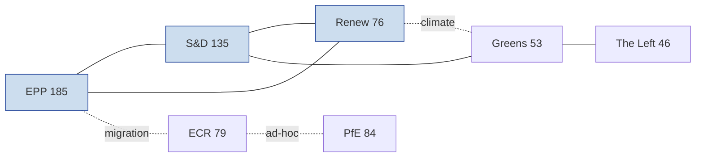

# Actor Mapping — EP10 Electoral-Cycle Power Network (2026-05-31)

> **Article type:** `election-cycle` · **Data mode:** `degraded-feeds` · **Horizon:** 2026-05-31 → 2031-05-30
> Maps the principal actors shaping the EP10 mid-term and the trajectory toward the June 2029 European election. Influence scores are 0–100 relative weights; Admiralty source grades flag evidence reliability.

## Actor Roster

The EP10 power network at term-midpoint is anchored by nine political groups (719 sitting MEPs), the Commission, the rotating Council Presidency trio, and a cluster of national governing parties whose fortunes set the 2029 baseline. The roster below is the canonical reference for every downstream artifact.

| Actor | Type | Seats / Weight | Role in cycle | Source grade |
| --- | --- | --- | --- | --- |
| EPP | Group | 185 (25.7%) | Pivotal centre-right formateur | A1 |
| S&D | Group | 135 (18.8%) | Centre-left co-pillar | A1 |
| Patriots for Europe (PfE) | Group | 84 (11.7%) | Hard-right challenger bloc | A2 |
| ECR | Group | 79 (11.0%) | Conservative bridge group | A2 |
| Renew Europe | Group | 76 (10.6%) | Liberal kingmaker | A1 |
| Greens/EFA | Group | 53 (7.4%) | Green/regionalist flank | A2 |
| The Left (GUE/NGL) | Group | 46 (6.4%) | Left opposition | B2 |
| ESN | Group | 28 (3.9%) | Sovereigntist far-right | B3 |
| Non-Inscrits | Bloc | 33 (4.6%) | Unaligned residue | C3 |
| European Commission | Institution | — | Agenda-setter, Spitzenkandidat host | A1 |
| Council Presidency trio | Institution | — | Legislative tempo controller | B2 |

## Influence Scoring

Influence is scored on agenda-setting capacity, pivotal-vote leverage, and command of committee chairs. The grand-coalition core (EPP + S&D + Renew = 396 seats) clears the 361 majority threshold with a 35-seat cushion, giving the centrist triad structural dominance over the legislative calendar.

| Actor | Agenda power | Pivotality | Committee command | Composite |
| --- | --- | --- | --- | --- |
| EPP | 95 | 92 | 88 | 92 |
| S&D | 82 | 78 | 74 | 78 |
| Renew | 70 | 81 | 60 | 70 |
| PfE | 55 | 48 | 30 | 45 |
| ECR | 52 | 58 | 38 | 50 |
| Greens/EFA | 48 | 44 | 42 | 45 |
| The Left | 35 | 30 | 28 | 31 |

## Alliance Topology

Three alliance corridors define EP10 vote geometry. The **Platform corridor** (EPP–S&D–Renew) supplies the default majority on institutional, budget, and rule-of-law files. The **right-of-centre corridor** (EPP–ECR–PfE) is an ad-hoc majority that surfaced on migration and agricultural-deregulation votes, evidencing the contested "Venezuela majority" debate. The **progressive corridor** (S&D–Renew–Greens–Left) defends climate and social files but falls ~50 seats short of a standalone majority.

## Power Brokers

The decisive brokers are the EPP presidency and group chair (controls the formateur pen), the Renew leadership (swing 76 seats that flip the right-of-centre corridor on or off), and the S&D chair (gatekeeper of the cordon sanitaire toward PfE/ESN). National-level brokers — the German CDU/CSU, French Renaissance, and the Italian governing parties — translate domestic election results into group-strength deltas that will reset the 2029 starting line.

## Information & Signal Flow

Signal reliability is degraded this run: the EP procedures and events feeds returned placeholder/404 payloads, so actor positioning is reconstructed from the adopted-texts corpus (41 real 2026 texts, grade A2) and the EP10 composition statistics (grade A1). Roll-call-level defection signals are therefore rated 🟡 MEDIUM confidence. The Electoral Act reform text (TA-10-2026-0006) is the highest-value information node, grade A1, because it directly conditions the 2029 contest rules.

## Reader Briefing

- **Who holds the pen:** the EPP–S&D–Renew platform, 396 seats, 35 above majority.
- **What can flip:** migration and deregulation files, where EPP can reach right to ECR/PfE.
- **What to watch:** Renew's 76-seat swing and the Electoral Act reform that rewrites the 2029 rulebook.
- **Confidence:** 🟡 MEDIUM — feed degradation forces reliance on adopted-texts and composition statistics rather than live roll-call data.
