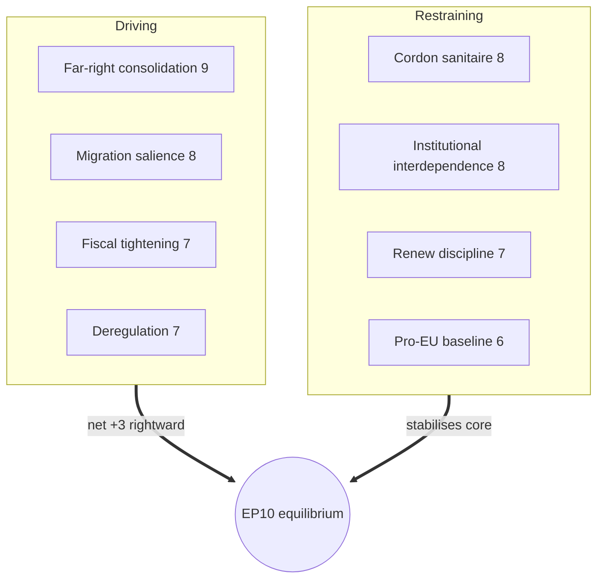

# Forces Analysis — Electoral-Cycle Pressure Field (2026-05-31)

> **Article type:** `election-cycle` · **Data mode:** `degraded-feeds` · **Horizon:** 2026-05-31 → 2031-05-30
> Force-field analysis of the pressures driving and restraining the EP10 mid-term trajectory toward the June 2029 European election.

## Issue Frame

The framing question for this cycle is whether the EP10 centrist platform (EPP–S&D–Renew, 396 seats) can hold its working majority through term-end while a strengthened hard-right bloc (PfE 84 + ECR 79 + ESN 28 = 191 seats) normalises ad-hoc right-of-centre majorities. The mid-term is the inflection point: a 38% term-progress index means the legislative record now being written is the manifesto base for 2029. The frame is therefore dual — institutional stability *now* versus electoral repositioning *for the next contest*.

## Driving Forces

Forces pushing the system toward rightward realignment and centrist stress:

- **Far-right consolidation** (strength 9/10): PfE absorbed the former ID bloc and ESN formed as a new sovereigntist group, lifting the combined hard-right to 191 seats from a lower EP9 base.
- **Migration salience** (8/10): the recurring availability of an EPP–ECR–PfE majority on asylum and border files demonstrates a viable alternative to the platform.
- **Fiscal tightening** (7/10): IMF WEO shows France running a -4.94% of GDP deficit in 2026 and Germany sliding to -3.78%, constraining the redistributive offers that stabilise the centre-left.
- **Deregulation momentum** (7/10): agricultural and competitiveness files create EPP incentives to reach rightward.
- **Electoral Act reform** (6/10): TA-10-2026-0006 restructures the 2029 rulebook, an exogenous shock to incumbency advantage.

## Restraining Forces

Forces preserving the centrist equilibrium:

- **Cordon sanitaire norm** (8/10): S&D and Renew condition cooperation on excluding PfE/ESN from structural majorities, raising the political cost of the right-of-centre corridor.
- **Institutional interdependence** (8/10): budget, own-resources, and rule-of-law files require the platform's 396-seat reliability that no right-of-centre combination can match.
- **Renew pivot discipline** (7/10): the liberal group's 76 seats are the hinge; its leadership has held them inside the platform on institutional votes.
- **Pro-European baseline** (6/10): two-thirds of MEPs remain in the four pro-integration families.
- **Commission dependency** (6/10): the executive needs platform majorities to pass its work programme, disciplining defection.

## Net Pressure

The net vector is a **slow rightward drift within a stable institutional core**. Driving forces dominate on salient, low-institutional-cost files (migration, deregulation); restraining forces dominate on high-stakes institutional files (budget, rule of law). The resultant is not collapse but bifurcation: a reliable platform majority for governance coexisting with episodic right-of-centre majorities for signalling. Net pressure score: **+3 rightward** on a -10/+10 axis (🟡 MEDIUM confidence given degraded roll-call evidence).

## Intervention Points

The leverage points that would shift the equilibrium before 2029:

1. **Renew cohesion** — a Renew split toward the right-of-centre corridor would convert ad-hoc majorities into a structural alternative.
2. **National elections in DE/FR/IT** — government changes reset group strengths and the 2029 baseline.
3. **Economic shock** — a fiscal or growth shock (IMF projects sub-1% growth in all three large economies) could break the centre-left's social offer.
4. **Electoral Act implementation** — transnational-list or threshold changes alter small-group survival odds.

## Reader Briefing

- **Net force:** mild rightward drift (+3), not realignment — the platform core holds on institutional files.
- **Biggest driver:** consolidated 191-seat hard-right plus migration-file math.
- **Biggest brake:** the cordon sanitaire plus budget interdependence.
- **Watch:** Renew discipline and DE/FR/IT national contests as the 2029 baseline resets.
- **Confidence:** 🟡 MEDIUM — feed degradation; pressures inferred from adopted texts + composition + IMF data.
