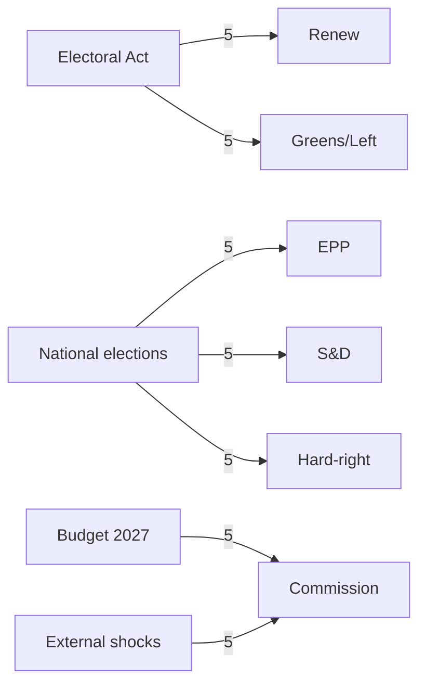

# Impact Matrix — Electoral-Cycle Event/Stakeholder Mapping (2026-05-31)

> **Article type:** `election-cycle` · **Data mode:** `degraded-feeds` · **Horizon:** 2026-05-31 → 2031-05-30
> Cross-tabulates the cycle's pivotal events against stakeholder groups, scoring impact intensity and cascade risk.

## Event List

The pivotal events conditioning the EP10 → EP11 transition, drawn from the 2026 adopted-texts corpus (grade A2) and term-anchor calendar (grade A1):

1. **E1 — Electoral Act reform** (TA-10-2026-0006): restructures 2029 contest rules. Highest cycle leverage.
2. **E2 — 2027 budget guidelines** (TA-10-2026-0112): sets the fiscal envelope that frames distributive politics into the campaign.
3. **E3 — ECB leadership cycle** (TA-10-2026-0034 annual report; TA-10-2026-0060 VP appointment): monetary backdrop.
4. **E4 — Digital Markets Act enforcement** (TA-10-2026-0160): tests the platform's tech-sovereignty consensus.
5. **E5 — AI/trade strategy** (TA-10-2026-0183): competitiveness framing.
6. **E6 — Loan for Ukraine** (TA-10-2026-0010) and **US tariff adjustment** (TA-10-2026-0096): external-shock vectors.
7. **E7 — National elections (DE/FR/IT)**: reset group strengths for the 2029 baseline.

## Stakeholder Set

The stakeholders whose exposure we score: the centrist platform groups (EPP, S&D, Renew), the hard-right bloc (PfE, ECR, ESN), the progressive flank (Greens, The Left), the Commission, national governments, and the European electorate.

## Impact Matrix

Impact scored 0 (none) to 5 (decisive) per event–stakeholder cell.

| Event | EPP | S&D | Renew | Hard-right | Greens/Left | Commission |
| --- | --- | --- | --- | --- | --- | --- |
| E1 Electoral Act | 4 | 4 | 5 | 3 | 5 | 3 |
| E2 Budget 2027 | 4 | 5 | 3 | 3 | 3 | 5 |
| E3 ECB cycle | 3 | 3 | 4 | 2 | 2 | 4 |
| E4 DMA enforcement | 3 | 3 | 4 | 2 | 3 | 5 |
| E5 AI/trade | 4 | 3 | 4 | 3 | 2 | 4 |
| E6 External shocks | 4 | 4 | 4 | 4 | 3 | 5 |
| E7 National elections | 5 | 5 | 5 | 5 | 4 | 3 |

Evidence reliability for the matrix is grade B2 — derived from adopted-text subject matter rather than live roll-call splits.

## Heat Concentration

Heat concentrates in two cells: **E7 × all groups** (national contests are the dominant 2029 driver, uniformly scored 4–5) and **E1 × Renew/Greens** (small and pivotal groups are most exposed to rule changes). The Commission's row is the hottest institutional row (mean 4.3), reflecting its agenda-ownership across every file. The hard-right bloc's lowest exposure is on institutional-process files (E3, E4) where it lacks pivotal leverage.

## Cascade Risk

The principal cascade path runs **E7 → group strengths → coalition viability → 2029 formateur math**. A national-election shock in Germany or France propagates within one to two cycles into EP group deltas, which reset the majority arithmetic that E1's rule changes then amplify or dampen. A secondary cascade runs **E6 (external shock) → E2 (budget stress) → centre-left social-offer erosion**, the mechanism by which economic conditions translate into electoral repositioning. Cascade probability is rated 🟡 MEDIUM (WEP: Roughly Even) over the 60-month horizon.

## Reader Briefing

- **Hottest events:** national elections (E7) and the Electoral Act reform (E1).
- **Most exposed actors:** small pivotal groups (Renew, Greens) and the Commission.
- **Key cascade:** national results → group deltas → 2029 formateur math.
- **Confidence:** 🟡 MEDIUM/B2 — impact inferred from adopted-text subjects under feed degradation.
