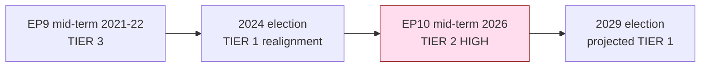

# Significance Classification — Electoral-Cycle Mid-Term Assessment (2026-05-31)

> **Article type:** `election-cycle` · **Data mode:** `degraded-feeds` · **Horizon:** 2026-05-31 → 2031-05-30 (1825 days)
> Classifies the significance of the EP10 mid-term moment for the European electoral cycle and assigns a composite significance tier.

## BLUF

At the EP10 term midpoint (term-progress index ≈ 38%), the European Parliament sits at the hinge between a governing record and a campaign baseline. The significance of this moment is rated **TIER 2 — HIGH (structural, slow-burn)**: no single decisive event, but a convergence of consolidating hard-right strength (191 seats), a rewritten 2029 rulebook (Electoral Act reform TA-10-2026-0006), and fiscal tightening across the three largest economies that together set the conditions for the June 2029 contest. WEP: Likely that the mid-term legislative record materially shapes the 2029 baseline.

## Significance Dimensions

We classify significance across five dimensions, each scored 1–5, then composited.

| Dimension | Score | Rationale |
| --- | --- | --- |
| Institutional impact | 4 | Electoral Act reform reshapes contest mechanics for 2029 |
| Coalition durability | 4 | Platform holds at 396 seats but right-of-centre alternative is now demonstrable |
| Electoral salience | 5 | Every mid-term file feeds the 2029 manifesto base |
| Economic conditioning | 3 | Sub-1% growth and rising deficits constrain distributive politics |
| External-shock exposure | 3 | Ukraine financing and US tariffs add volatility |
| **Composite** | **3.8** | **TIER 2 — HIGH** |

## Classification Rationale

The mid-term qualifies as HIGH rather than CRITICAL significance because the system is drifting, not breaking. The centrist platform retains a structural 35-seat majority cushion and command of committee chairs; the institutional core is intact. What elevates the moment above routine is the *irreversibility* of two processes: (1) the consolidation of the hard-right into two organised groups (PfE, ESN) plus a bridging ECR, which converts a fragmented EP9 flank into a 191-seat bloc capable of supplying ad-hoc majorities; and (2) the Electoral Act reform, an exogenous rule change that locks in before the next contest. Both processes are slow-burn structural shifts whose electoral payoff lands in 2029, which is precisely why the mid-term is the correct vantage point.

## Tier Definitions

- **TIER 1 — CRITICAL:** an event or convergence that changes the governing majority or the EU's institutional balance within the current term.
- **TIER 2 — HIGH:** structural shifts that condition the *next* electoral cycle without altering the current majority. **← this assessment.**
- **TIER 3 — MODERATE:** salient but contained developments with limited cross-cycle leverage.
- **TIER 4 — ROUTINE:** ordinary legislative throughput.

## Comparative Anchoring

Against the EP9 mid-term (2021–2022), the EP10 mid-term carries higher significance: the EP9 mid-point preserved a comfortable pro-European supermajority, whereas the EP10 mid-point features a normalised right-of-centre alternative and a rewritten electoral rulebook. Against the immediate post-2024-election period, significance is comparable but differently composed — the 2024 transition was an acute realignment event (TIER 1-adjacent), while the 2026 mid-term is its structural consolidation.

## Confidence and Evidence Basis

The classification rests on grade A1 composition statistics and grade A2 adopted-texts evidence; live roll-call and procedure feeds were degraded this run (404/placeholder), so coalition-durability and salience scores carry 🟡 MEDIUM confidence. The composite tier is robust to a ±0.3 swing in any single dimension — even discounting electoral salience to 4 holds the composite at TIER 2.

## Reader Briefing

- **Significance tier:** TIER 2 — HIGH (structural, slow-burn).
- **Why it matters:** the mid-term record and rules become the 2029 baseline.
- **What keeps it below CRITICAL:** the platform majority and institutional core are intact.
- **Confidence:** 🟡 MEDIUM — degraded feeds; classification anchored on composition + adopted texts.
