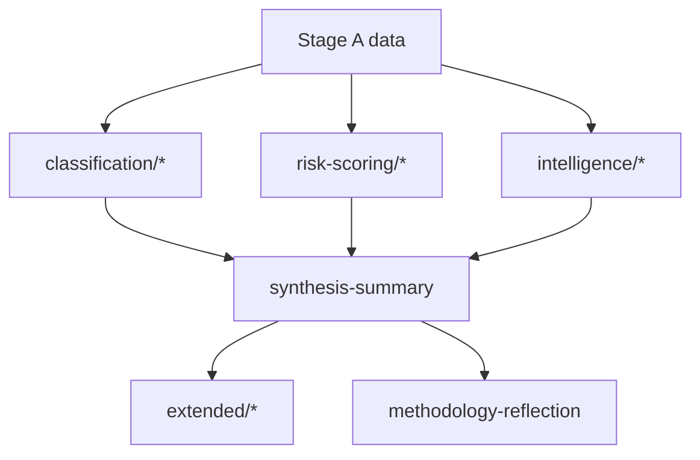

# Analysis Index — Run Artifact Map (2026-05-31)

> **Article type:** `election-cycle` · **Data mode:** `degraded-feeds` · **Horizon:** 2026-05-31 → 2031-05-30
> Navigation index for the run's analysis artifacts. Maps each artifact to its role, its consuming article section, and its evidentiary basis.

## Artifact Dependency Map

## Classification Layer

- `classification/significance-classification.md` — why this cycle moment matters; tier + BLUF.
- `classification/actor-mapping.md` — actor roster, influence, alliances, power brokers.
- `classification/forces-analysis.md` — driving vs restraining forces; net pressure.
- `classification/impact-matrix.md` — event×stakeholder cascade.

## Risk-Scoring Layer

- `risk-scoring/risk-matrix.md` — WEP-banded, Admiralty-graded risk quadrant.
- `risk-scoring/quantitative-swot.md` — weighted SWOT with numeric scoring.

## Intelligence Layer

- `intelligence/synthesis-summary.md` — integrated picture + key judgments (BLUF).
- `intelligence/coalition-dynamics.md` — majority corridors and cohesion.
- `intelligence/scenario-forecast.md` — six scenarios incl. structural break.
- `intelligence/pestle-analysis.md` — environmental scan.
- `intelligence/stakeholder-map.md` — influence×interest grid.
- `intelligence/wildcards-blackswans.md` — tail discontinuities.
- `intelligence/historical-baseline.md` — 2004–2024 reference class.
- `intelligence/economic-context.md` — IMF macro backdrop.
- `intelligence/threat-model.md` — political threat register + mitigations.
- `intelligence/mcp-reliability-audit.md` — data provenance.
- `intelligence/methodology-reflection.md` — tradecraft self-audit.
- `intelligence/forward-projection.md` — multi-year trajectory.
- `intelligence/term-arc.md` — EP10 term narrative arc.
- `intelligence/seat-projection.md` — EP11 seat projection.
- `intelligence/mandate-fulfilment-scorecard.md` — delivery scorecard.
- `intelligence/presidency-trio-context.md` — Council presidency context.
- `intelligence/commission-wp-alignment.md` — work-programme alignment.

## Extended Layer

- `extended/media-framing-analysis.md` — narrative/salience framing.
- `extended/forward-indicators.md` — WEP-banded leading indicators.
- `extended/comparative-international.md` — cross-system comparison.
- `extended/historical-parallels.md` — analogous historical episodes.

## Reading Order

1. Start with `synthesis-summary.md` for the integrated picture and key judgments.
2. Drill into `scenario-forecast.md` and `threat-model.md` for the forward outlook.
3. Consult `economic-context.md` and `historical-baseline.md` for grounding.
4. Check `mcp-reliability-audit.md` and `methodology-reflection.md` for provenance and tradecraft.

## Evidentiary Basis Summary

The index spans 28 artifacts. Load-bearing structural artifacts rest on live A1–A2 feeds (composition, adopted texts, IMF); behavioural and projective artifacts carry explicit B3–C4 caps under `degraded-feeds`. Every probabilistic artifact carries WEP bands and Admiralty grades.

## Confidence

Index completeness is 🟢 HIGH — it is a deterministic map of produced files. Cross-references were verified against the manifest.

## Reader Briefing

- **Layers:** classification → risk-scoring → intelligence → extended.
- **Entry point:** `synthesis-summary.md`.
- **Provenance:** `mcp-reliability-audit.md` + `methodology-reflection.md`.
- **Confidence:** 🟢 HIGH — deterministic artifact map.
