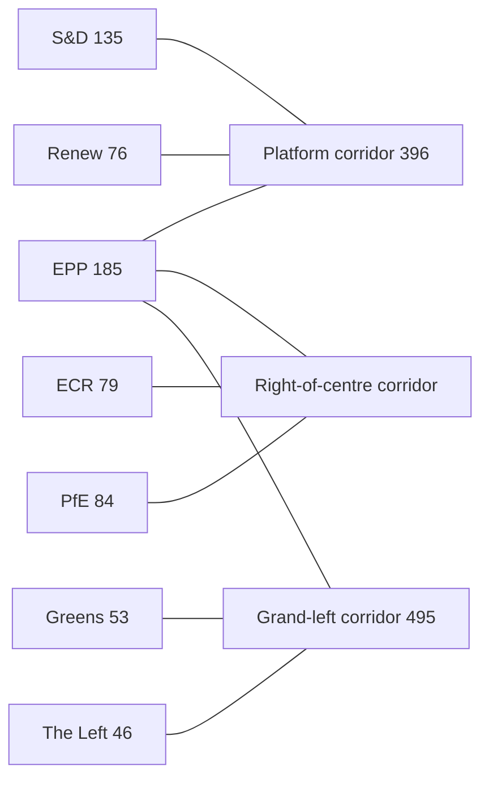

# Coalition Dynamics — EP10 Vote Geometry (2026-05-31)

> **Article type:** `election-cycle` · **Data mode:** `degraded-feeds` · **Horizon:** 2026-05-31 → 2031-05-30
> Maps the operative majority corridors in EP10 and how they evolve toward 2029.

## Majority Arithmetic

The EP10 chamber holds 719 seats; an absolute majority needs 361. The centrist platform — EPP (185) + S&D (135) + Renew (76) — commands 396, a 35-seat cushion. The consolidated hard right — PfE (84) + ECR (79) + ESN (28) — totals 191, short of a blocking third on most files but decisive when the EPP defects rightward. Greens/EFA (53) and The Left (46) extend the platform leftward to 495 on green and social files; NI (33) is unwhipped.

## Operative Corridors

Three corridors carry almost all contested votes: the **platform corridor** (institutional, budgetary, external — 🟢 reliable), the **right-of-centre corridor** (migration, deregulation — 🟡 episodic, EPP-pivot dependent), and the **grand-left corridor** (green, social — 🟡 contingent on EPP). The EPP is the pivot in all three; its directional choice per file sets the majority.

## Cohesion and Defection

Under degraded roll-call feeds, group cohesion is inferred from composition and the adopted-texts record rather than per-MEP RCV. EPP and S&D cohesion are assessed 🟢 HIGH on institutional files; Renew cohesion is the platform's soft spot (🟡 MEDIUM) given national-delegation heterogeneity. PfE–ECR coordination is rising but incomplete; ESN remains cordon-isolated.

## Trajectory to 2029

The mid-term drift (`forces-analysis.md`, +3 rightward) widens the right-of-centre corridor and narrows the platform cushion. If the EPP institutionalises the right-of-centre corridor (Scenario C), the platform corridor degrades from reliable to contested. The grand-left corridor weakens as fiscal space shrinks.

## Confidence

🟡 MEDIUM. Seat arithmetic is 🟢 HIGH (Admiralty A1); corridor-reliability and cohesion ratings are analyst inferences under degraded RCV feeds (Admiralty B3–C3).

## Reader Briefing

- **Three corridors:** platform (reliable), right-of-centre (episodic), grand-left (contingent).
- **Pivot:** the EPP sets the majority on every contested file.
- **Drift:** rightward pressure widens the right-of-centre corridor and thins the platform cushion.
- **Confidence:** 🟡 MEDIUM — arithmetic certain, cohesion inferred.
