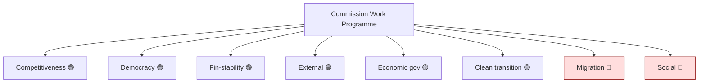

# Commission Work-Programme Alignment — Mandate vs Delivery (2026-05-31)

> **Article type:** `election-cycle` · **Data mode:** `degraded-feeds` · **Horizon:** 2026-05-31 → 2031-05-30
> Assesses how the Commission work programme aligns with the EP10 platform's mandate and how that alignment conditions the 2029 campaign record.

## Alignment Logic

The Commission holds the proposal monopoly; the platform converts proposals into adopted texts. Alignment between the work programme and the platform's mandate pillars determines whether the campaign-relevant record reflects platform priorities or Commission-Council compromises. High alignment lets the platform claim deliverables in 2029; low alignment leaves mandate gaps the opposition exploits.

## Work-Programme to Mandate Mapping

| WP strand | Platform pillar | Mid-term delivery | Alignment |
| --- | --- | --- | --- |
| Competitiveness Compass / AI | Competitiveness | TA-10-2026-0183, TA-10-2026-0160 | 🟢 High |
| Democracy package | Democratic renewal | TA-10-2026-0006 | 🟢 High |
| Economic governance | Sound finances | TA-10-2026-0112 | 🟡 Partial |
| Financial-stability oversight | Monetary oversight | TA-10-2026-0034, TA-10-2026-0060 | 🟢 High |
| External action / trade defence | External action | TA-10-2026-0010, TA-10-2026-0096 | 🟢 High |
| Migration framework | Migration | contested, no settled text | 🔴 Low |
| Clean-transition agenda | Green transition | deregulation pressure | 🟡 Partial |
| Social fairness | Social Europe | fiscally constrained | 🔴 Low |

## Alignment Profile

Five of eight strands show 🟢 High or 🟡 Partial alignment, concentrated on institutional, competitiveness, and external files. The two 🔴 Low-alignment strands — Migration and Social Europe — are the same pillars flagged as 2029 vulnerabilities in `mandate-fulfilment-scorecard.md`, confirming a consistent gap signature across artifacts.

## Cycle Implications

The Commission–platform alignment profile front-loads *deliverable* files the platform can campaign on (competitiveness, democratic renewal, external action) while leaving the *mobilising* files (migration, social) under-delivered. This is electorally double-edged: it gives the platform a record of institutional competence but cedes the high-salience identity and redistribution terrain to challengers. WEP: Likely the alignment gap on migration and social files is a net liability for the platform's centre-left wing in 2029.

## Confidence

Alignment confidence is 🟡 MEDIUM. The work-programme-to-text mapping rests on grade A2 adopted-texts evidence; the alignment ratings are analyst judgments under degraded feeds. The strong/weak split is robust; the 🟡 Partial ratings carry the most uncertainty.

## Reader Briefing

- **Profile:** high alignment on competitiveness/democracy/external; low on migration/social.
- **Signature:** the same migration + social gaps recur across the scorecard and this artifact.
- **Cycle read:** a record of competence but ceded mobilising terrain — a net 2029 liability for the centre-left.
- **Confidence:** 🟡 MEDIUM — A2 adopted-texts mapping, analyst-rated alignment.
