# Economic Context — Electoral-Cycle Fiscal Backdrop (2026-05-31)

> **Article type:** `election-cycle` · **Data mode:** `degraded-feeds` · **Horizon:** 2026-05-31 → 2031-05-30
> The macro-fiscal conditions framing the EP10 mid-term and the run-up to the 2029 European election. **IMF is the sole authoritative source for every economic claim in this artifact.**

## Provenance

| Field | Value |
| --- | --- |
| **IMF Source** | `live` |
| Dataset | IMF World Economic Outlook (WEO) via SDMX 3.0 REST |
| Records retrieved | 449 |
| Coverage | Germany (DEU), France (FRA), Italy (ITA) |
| Cache path | `cache/imf/weo-ea-deu-fra-ita-gdp-inflation-fiscal.json` |
| Probe | `cache/imf/probe-summary.json` |

All figures below are IMF WEO values (estimate for 2025, projection for 2026). No World Bank or other source is used for economic claims, per the IMF-primary editorial policy.

## Headline Indicators (IMF WEO)

| Economy | Real GDP growth 2025 | Real GDP growth 2026 | Inflation 2025 | Inflation 2026 | Fiscal balance 2025 (% GDP) | Fiscal balance 2026 (% GDP) |
| --- | --- | --- | --- | --- | --- | --- |
| Germany | 0.24% | 0.79% | 2.30% | 2.65% | −2.67% | −3.78% |
| France | 0.93% | 0.86% | 0.93% | 1.84% | −5.11% | −4.94% |
| Italy | 0.54% | 0.52% | 1.63% | 2.64% | −3.11% | −2.82% |

Source grade A2 (IMF WEO, live SDMX retrieval). Series: real GDP growth `NGDP_RPCH`, inflation `PCPIPCH`, general-government net lending `GGXCNL_NGDP`.

## Interpretation — Growth

The three largest euro-area economies are all projected to grow below 1% in 2026 (Germany 0.79%, France 0.86%, Italy 0.52%). This is the defining electoral-economic fact of the EP10 mid-term: a low-growth backdrop that compresses the fiscal space for the distributive offers that historically stabilise incumbent and centre-left vote shares. Germany's modest acceleration (0.24% → 0.79%) is the only positive momentum, but from a near-stagnant base.

```mermaid
xychart-beta
  title "IMF WEO real GDP growth (%), 2025 est vs 2026 proj"
  x-axis [Germany, France, Italy]
  y-axis "Growth %" 0 --> 1.5
  bar [0.24, 0.93, 0.54]
  bar [0.79, 0.86, 0.52]
```

## Interpretation — Inflation

Inflation is re-accelerating modestly in Germany (2.30% → 2.65%) and Italy (1.63% → 2.64%) while France remains lowest (0.93% → 1.84%). The convergence toward ~2.6% in Germany and Italy keeps real-income pressure live as a campaign issue without the acute cost-of-living salience of the 2022–2023 spike. The ECB monetary backdrop (referenced in adopted text TA-10-2026-0034, ECB annual report 2025) thus operates against a moderate-inflation, low-growth mix — the classic stagflation-lite environment that disadvantages incumbents.

## Interpretation — Fiscal

Fiscal divergence is the sharpest electoral-economic cleavage. France runs a −4.94% of GDP deficit in 2026, deep in excessive-deficit territory, constraining any expansionary pre-campaign budget. Germany's deficit widens to −3.78%, breaching the 3% reference value and signalling fiscal stress even in the bloc's anchor economy. Italy, counter-intuitively, narrows to −2.82%, the only large economy projected inside the 3% threshold in 2026. This fiscal map conditions the EP's 2027 budget-guidelines debate (TA-10-2026-0112) and the distributive politics feeding into 2029.

## Electoral-Economic Transmission

The transmission from macro conditions to the 2029 baseline runs through three channels: (1) **incumbency penalty** — sub-1% growth historically depresses governing-party vote shares, mechanically benefiting opposition and anti-establishment formations; (2) **fiscal constraint** — France's and Germany's deficits foreclose the social spending that mobilises centre-left turnout; (3) **issue displacement** — weak growth elevates competitiveness and migration over climate and social files, terrain on which the right-of-centre corridor is advantaged. WEP: Likely that the low-growth/high-deficit mix mildly favours opposition formations into 2029.

## Confidence

Economic data confidence is 🟢 HIGH (IMF live SDMX, 449 records, three core economies). The *electoral* transmission inference is 🟡 MEDIUM — a structural-historical relationship applied under degraded EP roll-call feeds. No euro-area aggregate was returned by the live probe (DE/FR/IT only); this is the principal data gap.

## Reader Briefing

- **The number that matters:** all three big economies below 1% growth in 2026.
- **Fiscal split:** France −4.94% and Germany −3.78% constrained; Italy −2.82% inside threshold.
- **Electoral read:** low-growth/high-deficit mix mildly favours opposition into 2029.
- **Confidence:** 🟢 HIGH on IMF data; 🟡 MEDIUM on electoral transmission.
