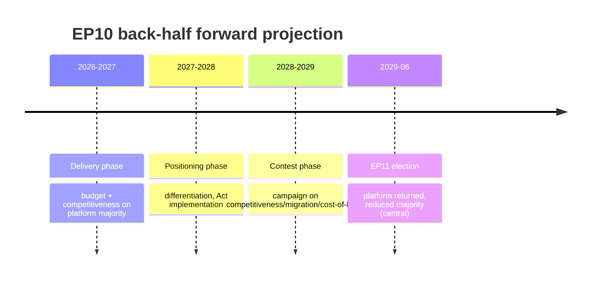
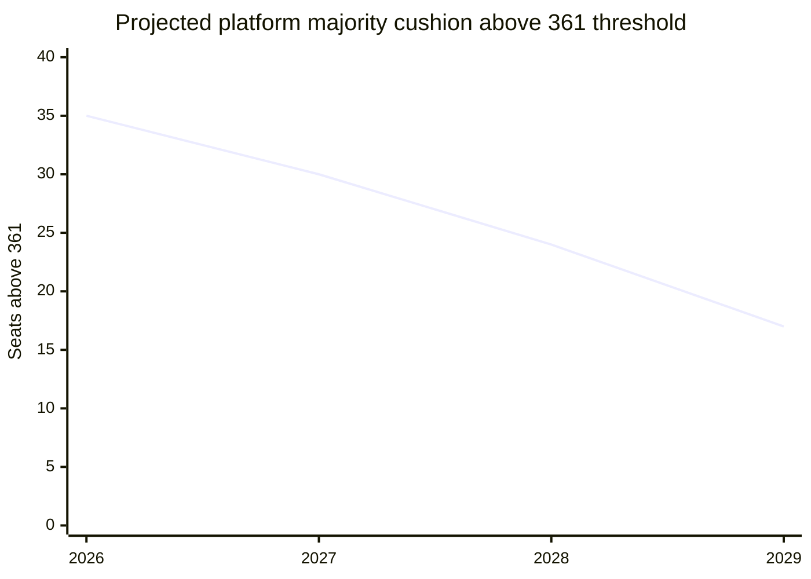

# Forward Projection — EP10 Back-Half to EP11 (2026-05-31)

> **Article type:** `election-cycle` · **Data mode:** `degraded-feeds` · **Horizon:** 2026-05-31 → 2031-05-30
> Track B forecast: projects the EP10 back-half legislative and coalition trajectory and the conditions of the 2029 → EP11 handover. Probabilities use WEP bands; evidence carries Admiralty grades.

## Executive Forecast

Over the 60-month horizon the European Parliament is projected to traverse three phases: a **delivery phase** (2026–2027, budget and competitiveness files), a **positioning phase** (2027–2028, manifesto consolidation), and a **contest phase** (2028–2029, campaign). The central forecast is *continuity with rightward drift*: the centrist platform governs to term-end and is returned in 2029 with a reduced majority. WEP: Likely (Admiralty B2).

## Projection Drivers and Source Grades

| Driver | Direction | Evidence | Source grade |
| --- | --- | --- | --- |
| Hard-right consolidation | rightward | EP10 composition (PfE 84, ESN 28) | A1 |
| Low-growth fiscal backdrop | anti-incumbent | IMF WEO DE/FR/IT sub-1% growth | A2 |
| Electoral Act reform | rule change | TA-10-2026-0006 | A1 |
| Migration salience | rightward | ad-hoc RoC majorities | B2 |
| Renew discipline | stabilising | group-behaviour inference | C3 |
| Turnout trajectory | uncertain | no live polling this run | C4 |

## Phase 1 — Delivery (2026–2027)

The platform is projected to clear the 2027 budget guidelines (TA-10-2026-0112 already adopted as a framework) and competitiveness files on its structural majority. WEP: Highly Likely that institutional files pass on platform majorities (Admiralty A2). Migration files remain the exception, passing episodically on right-of-centre majorities. Risk: a fiscal-shock interruption if any large economy slips into recession (IMF projects all three large economies sub-1%).

## Phase 2 — Positioning (2027–2028)

As the mid-term pivot completes, group behaviour shifts toward differentiation. The EPP is projected to harden its migration and competitiveness profile to pre-empt PfE/ECR; S&D to re-emphasise Social Europe to recover the turnout base its 35%-delivery gap exposes. WEP: Likely that visible platform cohesion declines in this phase even as institutional voting holds (Admiralty B3). The Electoral Act's implementing decisions land here, conditioning small-group survival.

## Phase 3 — Contest (2028–2029)

The 2029 campaign is projected to centre on competitiveness, migration, and cost-of-living — terrain mapped by the mid-term mandate-delivery gaps. The Spitzenkandidaten process resumes as a platform-cohesion test. WEP: Roughly Even whether the lead-candidate mechanism produces the Commission president, given Council reluctance (Admiralty C3).

## Coalition Outlook

The cushion erodes from 35 to a projected 17 seats by 2029 (central estimate). WEP: Likely the cushion stays positive; WEP: Roughly Even it falls below 10, the threshold at which single-delegation defections become decisive.

## Key Assumptions and Failure Modes

1. **No mid-term realignment shock** — assumed; failure mode = a major-state government collapse resetting group strengths.
2. **Cordon sanitaire holds on institutional files** — assumed; failure mode = EPP normalising ECR as a structural partner.
3. **No euro-area recession** — assumed on IMF sub-1%-but-positive growth; failure mode = an external (tariff/energy) shock.

## Confidence Statement

Overall forward-projection confidence is 🟡 MEDIUM. Structural drivers (composition, IMF data) are well-evidenced (A1–A2); behavioural and turnout drivers are weakly evidenced under degraded feeds (C3–C4). The forecast is robust on *direction* (rightward drift, continuity) and uncertain on *magnitude* (size of the 2029 majority).

## Reader Briefing

- **Central forecast:** continuity with rightward drift — platform returned in 2029, reduced majority. WEP: Likely.
- **Cushion path:** 35 → 17 seats above threshold by 2029.
- **Watch:** EPP–ECR normalisation and any major-state government collapse.
- **Confidence:** 🟡 MEDIUM — strong on direction (A1–A2), uncertain on magnitude (C3–C4).
