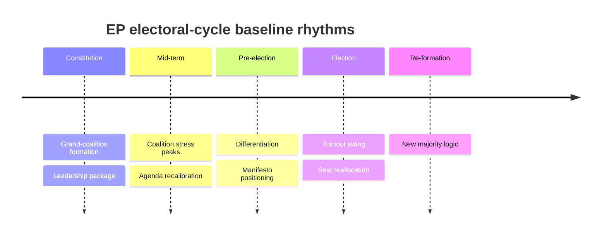

# Historical Baseline — EP Electoral Cycles 2004–2024 (2026-05-31)

> **Article type:** `election-cycle` · **Data mode:** `degraded-feeds` · **Horizon:** 2026-05-31 → 2031-05-30
> Establishes the historical reference class against which the EP10 mid-term and the 2029 forecast are judged. Without a baseline, every judgment is anecdotal; with one, drift is measurable.

## Reference Class

The reference class is the five completed European Parliament terms since the 2004 enlargement (EP6 2004–09, EP7 2009–14, EP8 2014–19, EP9 2019–24) plus the EP10 term to date (2024–). Each provides data on the recurring rhythms of a parliamentary cycle: mid-term coalition behaviour, the incumbency/turnout relationship, and the magnitude of inter-election seat swings.

## Recurring Cycle Patterns

## Baseline Metrics

| Metric | Historical baseline (2004–2024) | EP10 reading | Drift |
| --- | --- | --- | --- |
| Grand-coalition share | Declining: ~70% → ~55% | ~55% (EPP+S&D) | On trend |
| Effective number of groups | Rising | 6.59 fragmentation | On trend (high) |
| Turnout | 43% (2014) → 51% (2019) → 51% (2024) | n/a until 2029 | Watch |
| Inter-election largest-bloc swing | ±3–4 seats typical | EPP 188→185 | Within range |
| Hard-right share | Rising each cycle | 191/719 ≈ 27% | Above trend |

## The Grand-Coalition Decline

The single most robust baseline pattern is the secular decline of the EPP–S&D grand coalition's combined share, from comfortable majority alone (EP6) to needing Renew as a third leg (EP9–EP10). EP10 continues this: the two-party core (320) is below the 361 threshold, making the three-party platform structural rather than optional. This is not an EP10 anomaly — it is the baseline trend reaching its logical stage.

## The Turnout Relationship

Historically, EP turnout rose in 2019 and held in 2024, breaking the long post-2004 decline. The baseline lesson is that turnout is mobilisation-driven and volatile, not a stable parameter — which is exactly why the 2029 forecast treats turnout as its largest unknown rather than extrapolating the recent uptick.

## Seat-Swing Magnitudes

Inter-election swings for the largest bloc have historically been modest (±3–4 seats), while *new* formations (PfE in 2024) can appear at scale. The baseline therefore supports the central forecast's modest-drift assumption for established groups while flagging new-group emergence (W4) as the historically-validated source of surprise.

## Applying the Baseline

The EP10 mid-term reading is **on-trend, not anomalous**: fragmentation high but consistent with the trajectory, grand-coalition decline at its expected stage, hard-right share above trend but continuing an established direction. This matters for the forecast: it licenses extrapolation of established trends as the central case (Scenario A) while reserving discontinuity (Scenario F) for the historically-rare compound shock.

## Confidence

Historical-baseline confidence is 🟢 HIGH on the structural patterns (multi-term, well-documented) and 🟡 MEDIUM on the precise EP10-vs-baseline drift quantification under degraded feeds. Admiralty A1–A2 on composition history; B3 on the turnout-mobilisation interpretation.

## Reader Briefing

- **Headline:** EP10 is on-trend, not anomalous — fragmentation and grand-coalition decline at their expected stage.
- **Most robust pattern:** secular grand-coalition decline → three-leg platform is structural.
- **Most volatile parameter:** turnout — mobilisation-driven, the 2029 wildcard.
- **Confidence:** 🟢 HIGH on patterns, 🟡 MEDIUM on precise drift.
