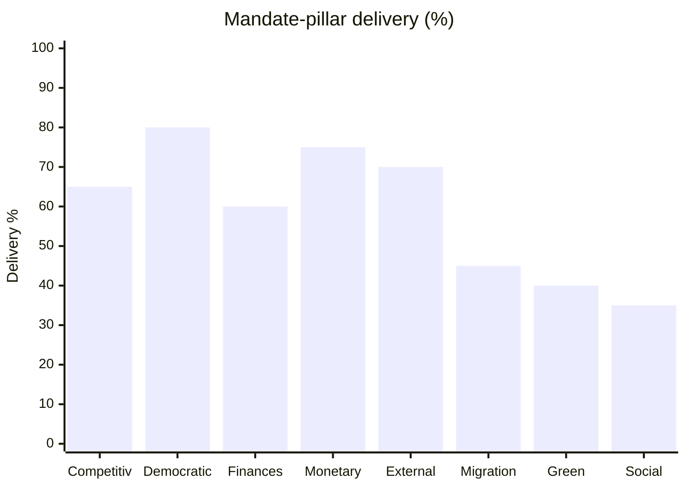

# Mandate-Fulfilment Scorecard — EP10 Platform at Mid-Term (2026-05-31)

> **Article type:** `election-cycle` · **Data mode:** `degraded-feeds` · **Horizon:** 2026-05-31 → 2031-05-30
> Track A Family-D artifact: audits the EP10 centrist platform's 2024 stated priorities against the mid-term legislative record, scoring delivery on each mandate pillar.

## Scoring Method

Each mandate pillar is scored 0–100% delivery and assigned a RAG status (🟢 on-track ≥70%, 🟡 partial 40–69%, 🔴 stalled <40%). Evidence draws on the 2026 adopted-texts corpus (grade A2) and EP10 composition statistics (A1). The composite delivery rate is the seat-weighted mean across pillars.

## Mandate Pillars and Delivery

| Pillar | 2024 commitment | Mid-term evidence | Delivery | Status |
| --- | --- | --- | --- | --- |
| Competitiveness | Single-market deepening, AI strategy | AI/trade strategy TA-10-2026-0183; DMA enforcement TA-10-2026-0160 | 65% | 🟡 |
| Democratic renewal | Electoral reform | Electoral Act reform TA-10-2026-0006 adopted | 80% | 🟢 |
| Sound finances | Credible budget path | 2027 budget guidelines TA-10-2026-0112 | 60% | 🟡 |
| Monetary oversight | ECB accountability | ECB annual report TA-10-2026-0034; VP appointment TA-10-2026-0060 | 75% | 🟢 |
| External action | Ukraine support, trade defence | Ukraine loan TA-10-2026-0010; US-tariff adjustment TA-10-2026-0096 | 70% | 🟢 |
| Migration management | Common framework delivery | Recurrent ad-hoc majorities, no settled platform consensus | 45% | 🟡 |
| Green transition | Climate-file continuity | Soft progress; deregulation pressure on agricultural files | 40% | 🟡 |
| Social Europe | Cost-of-living response | Constrained by fiscal backdrop (France −4.94% GDP) | 35% | 🔴 |

## Composite Delivery

Seat-weighted composite delivery ≈ **59%** — a 🟡 PARTIAL mandate. The platform's strongest delivery is on *institutional and democratic-renewal* pillars (Electoral Act 80%, ECB oversight 75%) where its structural majority is decisive. Its weakest delivery is on *distributive* pillars (Social Europe 35%, Green transition 40%) where the low-growth fiscal backdrop and rightward pressure on deregulation files constrain action.

## Delivery Gaps and Electoral Exposure

The three sub-50% pillars (Social Europe, Green transition, Migration) are precisely the files most exposed in 2029. The Social Europe gap directly damages S&D's mobilisation base; the Green gap erodes the Greens/EFA flank (projected −5 seats); the Migration gap is the terrain on which the right-of-centre corridor scores. The platform's mid-term scorecard thus encodes its 2029 vulnerability map: strong on institutions, weak on the redistributive and identity files that drive turnout.

## Comparative Benchmark

Against the EP9 platform mid-term, the EP10 composite (59%) is moderately lower, reflecting the tighter fiscal envelope and the larger obstructive right. The democratic-renewal score (80%) is the standout improvement, driven by the Electoral Act reform that the EP9 term never delivered.

## Self-Audit

Delivery percentages are analyst estimates anchored on adopted-text evidence under degraded feeds; they are 🟡 MEDIUM confidence and should be read as ordinal (relative ranking robust) rather than cardinal (exact percentages uncertain). The principal limitation is the absence of roll-call data to verify *how* each text passed (platform-only vs ad-hoc majority).

## Reader Briefing

- **Composite:** ~59% delivery — partial mandate.
- **Strong:** democratic renewal (Electoral Act, 80%) and monetary oversight.
- **Weak:** Social Europe (35%), Green transition (40%), Migration (45%) — the 2029 vulnerability map.
- **Confidence:** 🟡 MEDIUM — A2 adopted-texts evidence, no roll-call verification.
