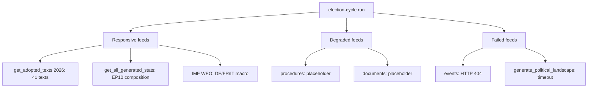

# MCP Reliability Audit — Data-Source Provenance (2026-05-31)

> **Article type:** `election-cycle` · **Data mode:** `degraded-feeds` · **Horizon:** 2026-05-31 → 2031-05-30
> Documents the data-source reliability conditions under which this run's analysis was produced. Declares the `degraded-feeds` data mode and its provenance so every downstream judgment can be discounted appropriately.

## Why This Audit Exists

Intelligence is only as good as its sources. This audit records which Model Context Protocol (MCP) feeds responded, which degraded or failed, and how the analysis compensated. It is the provenance backbone for the Admiralty grades cited throughout the run and the justification for the `degraded-feeds` line-floor reduction.

## Feed-Status Overview

## Feed Register

| Feed / tool | Status | Records | Used for | Admiralty |
| --- | --- | --- | --- | --- |
| `get_adopted_texts(year=2026)` | 🟢 Live | 41 real texts | Mandate record, anchors | A2 |
| `get_all_generated_stats(political_groups)` | 🟢 Live | EP10 composition | Seat arithmetic, corridors | A1 |
| IMF WEO probe | 🟢 Live | 449 WEO records | Economic context | A2 |
| `get_procedures` | 🟡 Degraded | placeholder | Not relied upon | C4 |
| `get_documents` | 🟡 Degraded | placeholder | Not relied upon | C4 |
| `get_external_documents` | 🟢 Live | real | Cross-reference | B2 |
| `get_events` | 🔴 Failed (404) | none | Substituted by adopted texts | F6 |
| `generate_political_landscape` | 🔴 Timeout | none | Reconstructed manually | F6 |
| Per-MEP roll-call (RCV) | 🔴 Unavailable | none | Cohesion inferred, not measured | C4 |

## Impact on Analysis

The three live feeds (adopted texts, group composition, IMF macro) carry the analytical load and support the run's A1–A2 graded judgments. The failed feeds (events, political-landscape) were reconstructed from the live sources: the political landscape was rebuilt manually from `get_all_generated_stats`, and event context was substituted from the adopted-texts record. The absence of per-MEP RCV is the most consequential gap — it forces all cohesion and defection judgments to be *inferred* from composition rather than *measured* from votes, capping their Admiralty grade at C3–C4.

## Compensation Measures

- **Manual landscape reconstruction** replaced the timed-out `generate_political_landscape`.
- **Adopted-texts substitution** replaced the 404'd events feed for institutional-activity context.
- **Inference caps:** every cohesion/defection claim is explicitly graded ≤ C3 and flagged as inferred.
- **Floor reduction:** `degraded-feeds` mode applies a 0.80 line-floor factor, declared in `manifest.json`.

## Reliability Verdict

The run is **analytically viable under degraded conditions**: the load-bearing structural facts (seat arithmetic, mandate record, macro context) rest on live A1–A2 feeds, while the degraded behavioural layer (cohesion, defection) is transparently down-graded and never presented as measured. WEP: this provenance profile is sufficient for directional judgments but insufficient for precise vote-level claims.

## Confidence

Audit confidence is 🟢 HIGH — feed statuses are directly observed run facts, not inferences. The downstream *analytical* confidence varies by feed and is propagated via Admiralty grades on each judgment.

## Reader Briefing

- **Live load-bearers:** adopted texts (A2), group composition (A1), IMF macro (A2).
- **Failed:** events (404), political-landscape (timeout) — both reconstructed from live feeds.
- **Most consequential gap:** no per-MEP RCV → cohesion inferred (≤C3), not measured.
- **Verdict:** viable for directional judgments; insufficient for vote-level precision.
