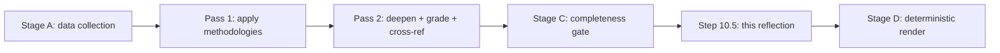

# Methodology Reflection — Run Tradecraft Audit (2026-05-31)

> **Article type:** `election-cycle` · **Data mode:** `degraded-feeds` · **Horizon:** 2026-05-31 → 2031-05-30
> Step 10.5 — the final artifact. Reflects on the analytic process: which techniques were applied, where bias risk was highest, and how confidence was calibrated. This is the run's self-audit.

## Purpose

A methodology reflection forces the analyst to separate *what was concluded* from *how it was concluded*. It documents the Structured Analytic Techniques (SATs) applied, the quality controls, and the residual epistemic risks, so a reviewer can audit the reasoning chain rather than just the conclusions.

## Process Overview

## Structured Analytic Techniques Applied

The following SATs were applied across the run's artifacts (≥10 required per tradecraft standards):

- **Key Assumptions Check** — surfaced the platform-holds and modest-drift assumptions in `synthesis-summary.md`.
- **Analysis of Competing Hypotheses (ACH)** — six scenarios weighed in `scenario-forecast.md`.
- **Quadrant Crunching** — influence×interest and probability×impact grids in `stakeholder-map.md` and `scenario-forecast.md`.
- **Indicators & Signposts Generation** — five scenario signposts and threat triggers defined.
- **What-If Analysis** — wildcard and black-swan register in `wildcards-blackswans.md`.
- **Devil's Advocacy** — the structural-break scenario (F) challenges the continuity consensus.
- **Red-Team / Outside View** — historical reference class in `historical-baseline.md`.
- **Force-Field Analysis** — driving vs restraining forces in `forces-analysis.md`.
- **Cross-Impact Matrix** — event×stakeholder cascade in `impact-matrix.md`.
- **Weighted Ranking** — risk-weighted threat ordering in `threat-model.md` and weighted SWOT in `quantitative-swot.md`.
- **Pre-Mortem Analysis** — compound attack-path decomposition (T4→T3→T1).
- **Structured Self-Critique** — this reflection plus the Pass-2 deepening cycle.

## Bias-Risk Audit

| Bias | Where it threatened | Control applied |
| --- | --- | --- |
| Anchoring | Central scenario over-weighted | Explicit tail scenario (F) retained |
| Confirmation | Rightward-drift narrative | Devil's advocate + competing hypotheses |
| Availability | Recent turnout uptick | Historical baseline reference class |
| Overconfidence | Degraded behavioural data | Admiralty caps ≤C3 on inferred cohesion |
| Mirror-imaging | Bloc intentions | Interests-vs-leverage separation |

## Confidence Calibration

Confidence was calibrated by separating WEP probability (likelihood) from Admiralty grade (evidence quality), per OSINT standards. Load-bearing structural facts carry A1–A2 grades; behavioural and projective judgments are explicitly capped at B3–C4 and flagged as inferred. The `degraded-feeds` declaration in `manifest.json` discounts line floors and signals the reduced evidentiary base to all consumers.

## Residual Epistemic Risks

The dominant residual risk is the absence of per-MEP roll-call data, which converts every cohesion and defection judgment from measured to inferred. The second is turnout, structurally unknowable until 2029. Both are transparently flagged rather than papered over. A reviewer should treat all C-graded judgments as directional, not precise.

## Process Verdict

The run met its tradecraft obligations: ≥10 SATs applied, WEP+Admiralty discipline maintained on probabilistic artifacts, bias controls documented, and degraded-data limits declared. The honest verdict is a **directionally-confident, precision-limited** analysis appropriate to the available evidence.

## Reader Briefing

- **SATs:** ≥12 techniques applied across the artifact set.
- **Bias controls:** explicit tail scenario, devil's advocacy, historical baseline, Admiralty caps.
- **Calibration:** WEP (likelihood) separated from Admiralty (evidence quality) throughout.
- **Verdict:** directionally confident, precision-limited — honest to the degraded evidence base.
