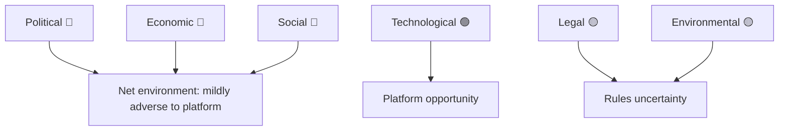

# PESTLE Analysis — EP10 Electoral-Cycle Environment (2026-05-31)

> **Article type:** `election-cycle` · **Data mode:** `degraded-feeds` · **Horizon:** 2026-05-31 → 2031-05-30
> Structured environmental scan of the forces shaping the EP10 back-half and the 2029 contest.

## Method

Each PESTLE dimension is rated for direction (favouring platform 🟢 / neutral 🟡 / favouring challengers 🔴) and salience to the 2029 campaign. Evidence draws on EP composition (Admiralty A1), IMF macro data (A2), and the 2026 adopted-texts record (A2).

## Dimensions

### Political 🔴
A consolidated 191-seat hard right and a rising NI bloc raise fragmentation (index 6.59) and normalise right-of-centre majorities. Member-state governments trend rightward, reinforcing Council–Parliament alignment against the platform's left pillar. High salience.

### Economic 🔴
IMF data show all three large euro-area economies below 1% growth in 2026 (Germany 0.79%, France 0.86%, Italy 0.52%) with constrained deficits (France −4.94% of GDP). Low growth imposes an incumbency penalty and narrows redistributive space. High salience.

### Social 🔴
Migration salience and a Social Europe delivery gap mobilise both the identity right and the disaffected left. Turnout direction is the largest single 2029 unknown. High salience.

### Technological 🟢
The competitiveness/AI agenda (TA-10-2026-0183, DMA enforcement TA-10-2026-0160) is a platform deliverable and a source of institutional credibility. Medium salience.

### Legal 🟡
The Electoral Act reform (TA-10-2026-0006) changes the 2029 rules of the game — thresholds and possibly transnational lists — with ambiguous partisan effect. High salience, uncertain direction.

### Environmental 🟡
The green transition persists under deregulation pressure; climate salience is lower than in 2024 but non-zero. Medium salience.

## Net Assessment

Four of six dimensions (Political, Economic, Social adverse; Legal uncertain) tilt the environment mildly against the platform; only Technological clearly favours it. The environment is not a platform-collapse setting but a slow-erosion one — consistent with the continuity-with-drift central scenario.

## Confidence

🟡 MEDIUM. Economic and political dimensions rest on A1–A2 evidence; social and legal directions carry C-grade uncertainty.

## Reader Briefing

- **Adverse:** political, economic, social dimensions tilt against the platform.
- **Favourable:** technological/competitiveness agenda is the platform's bright spot.
- **Wildcard:** Electoral Act changes the 2029 rules with uncertain partisan effect.
- **Confidence:** 🟡 MEDIUM — macro certain, social/legal directions uncertain.
