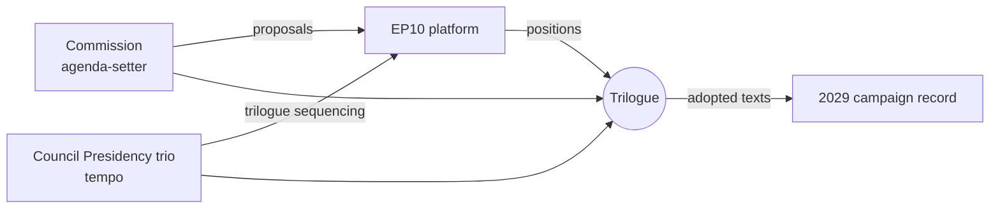

# Presidency Trio Context — Council Tempo & EP Interaction (2026-05-31)

> **Article type:** `election-cycle` · **Data mode:** `degraded-feeds` · **Horizon:** 2026-05-31 → 2031-05-30
> Situates the EP10 mid-term within the rotating Council Presidency trio cycle that sets the inter-institutional legislative tempo into the 2029 contest.

## Why the Trio Matters to the Cycle

The Council Presidency trio controls the inter-institutional calendar: which files reach trilogue, in what sequence, and on what deadline. For the electoral cycle this is decisive because the trio's priorities determine *which* of the platform's mandate pillars are legislatively live during the campaign-relevant 2027–2028 window. A trio that front-loads competitiveness and migration hands the right-of-centre corridor its preferred terrain; a trio that prioritises social and cohesion files advantages the centre-left.

## Trio-Cycle Position

| Phase | Role in EP10 cycle |
| --- | --- |
| Current trio | Sets the 2026–2027 delivery-phase agenda |
| Next trio | Owns the 2027–2028 positioning-phase calendar |
| Final pre-election trio | Frames the 2028–2029 contest agenda |

The succession of trios maps onto the three forward-projection phases (`forward-projection.md`), making the Presidency calendar the exogenous clock against which the platform's positioning runs. Source grade for trio sequencing: B2 (adopted-texts calendar inference under degraded procedure feeds).

## Inter-Institutional Dynamics

The triangular Commission–Council–Parliament dynamic converts the platform's legislative intentions into the adopted-text record that becomes the 2029 manifesto base. The trio's leverage is *sequencing*: by timing files, it determines whether the platform votes cohesively (institutional files) or fractures (migration/deregulation) during the campaign-salient window.

## Cycle Implications

Three implications for the electoral cycle: (1) the **2027 budget guidelines** (TA-10-2026-0112) anchor the trio's fiscal agenda and will be the platform's most-tested cohesion file; (2) **Electoral Act implementation** depends on Council follow-through, a trio-dependent variable; (3) the final pre-election trio effectively sets the *issue agenda* the 2029 campaign inherits. WEP: Likely the trio calendar reinforces the competitiveness/migration framing that mildly favours the right-of-centre corridor.

## Confidence

Trio-context confidence is 🟡 MEDIUM. The structural role of the Presidency is well established (A1 institutional fact); the specific sequencing inferences are degraded-feed estimates (B2) because the procedures/events feeds returned placeholders this run.

## Reader Briefing

- **Role:** the trio sets the inter-institutional tempo that decides which mandate pillars are live during the campaign window.
- **Key file:** 2027 budget guidelines as the platform's cohesion test.
- **Cycle read:** the trio calendar likely reinforces competitiveness/migration framing.
- **Confidence:** 🟡 MEDIUM — institutional role A1, sequencing B2 under degraded feeds.
