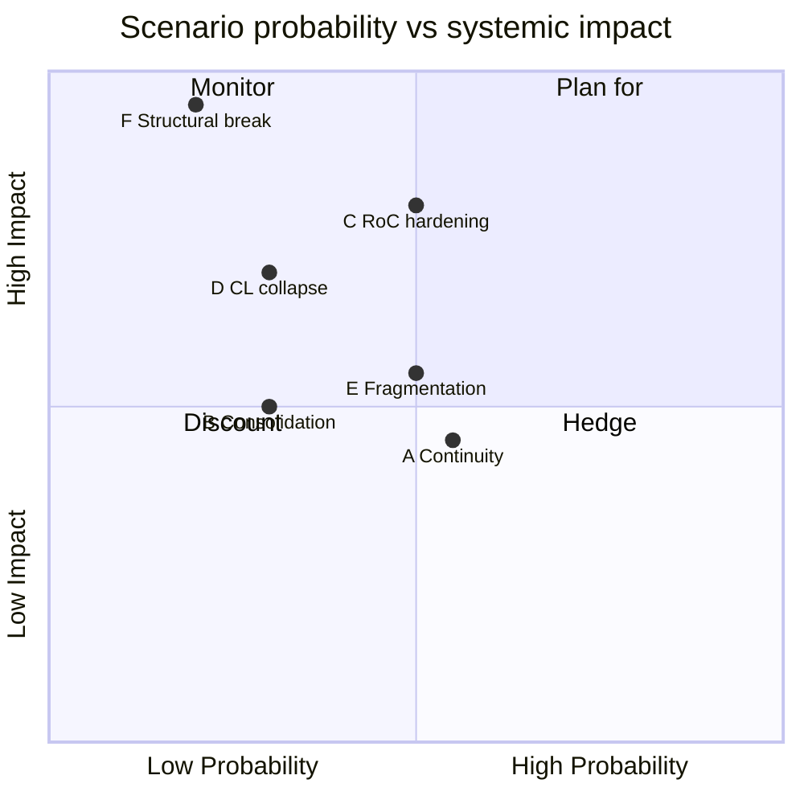

# Scenario Forecast — EP10 → EP11 Electoral Cycle (2026-05-31)

> **Article type:** `election-cycle` · **Data mode:** `degraded-feeds` · **Horizon:** 2026-05-31 → 2031-05-30 (60 months)
> Six structured scenarios for the EP10 back-half and the 2029 contest. Long-horizon gate: ≥6 scenarios with explicit structural-break consideration. Probabilities use WEP bands; evidence carries Admiralty grades.

## Forecast Frame

The 60-month horizon spans a full electoral cycle, crossing the 2029 election — a **regime-change** boundary at which group strengths reset. Because the horizon contains this **structural break**, scenarios are split into pre-break (EP10 governance) and post-break (EP11 formation) states. A genuine **structural-break / regime-shift** scenario (S6) is included per the long-horizon gate, modelling discontinuity rather than extrapolation. Anchor probabilities are conditioned on EP10 composition (Admiralty A1) and IMF macro data (A2).

## Scenario Probability Summary

| ID | Scenario | WEP band | Source grade |
| --- | --- | --- | --- |
| A | Continuity drift | Likely | B2 |
| B | Platform consolidation | Unlikely | B3 |
| C | Right-of-centre hardening | Roughly Even | B2 |
| D | Centre-left collapse | Unlikely | C3 |
| E | Fragmentation deepening | Roughly Even | B3 |
| F | Structural break / realignment | Unlikely (tail-heavy) | C3 |

### Scenario A: Continuity Drift (central)

The platform governs to term-end and is returned in 2029 with a reduced majority (~378 seats). Rightward drift continues at the mid-term pace; the cordon sanitaire holds on institutional files; migration passes episodically on the right-of-centre corridor. This is the central case. WEP: Likely (Admiralty B2). Indicators: stable EPP–S&D–Renew institutional voting, no major-state government collapse, IMF growth staying positive.

### Scenario B: Platform Consolidation

Economic recovery and a competitiveness-agenda win let the platform *strengthen* cohesion and limit hard-right gains (platform ~392 in 2029). Requires growth surprise above IMF projections and disciplined Renew. WEP: Unlikely (Admiralty B3). This is the optimistic platform case.

### Scenario C: Right-of-Centre Hardening

The EPP normalises ECR (and selectively PfE) as a structural partner on migration, competitiveness, and deregulation, converting ad-hoc majorities into a standing alternative. The platform survives on institutional files only. WEP: Roughly Even (Admiralty B2). This is the most consequential non-tail scenario: it reshapes the EP's centre of gravity without an election.

### Scenario D: Centre-Left Collapse

S&D's Social Europe delivery gap (35%) and fiscal constraints trigger a turnout collapse, dropping S&D below 120 seats in 2029 and breaking the platform's left pillar. WEP: Unlikely (Admiralty C3). Failure of the centre-left to recover its mobilising base is the trigger.

### Scenario E: Fragmentation Deepening

Small-group proliferation and NI growth (fragmentation index above 6.59) make every majority harder to assemble, lengthening trilogues and weakening all blocs. WEP: Roughly Even (Admiralty B3). The Electoral Act's threshold provisions are the swing variable.

### Scenario F: Structural Break / Regime Shift

A compound shock — a major-state government collapse plus a euro-area recession plus a turnout realignment — produces a **regime-change** EP11 in which the platform falls below 361 and a fundamentally new majority logic emerges (enlarged centrist coalition or EPP–ECR governing axis). This is the explicit **structural-break** scenario the long-horizon gate requires. WEP: Unlikely as a point estimate but tail-heavy (Admiralty C3): low probability, maximal impact.

## Cross-Scenario Signposts

The signposts that discriminate between scenarios: (1) a *second* migration file passing without S&D → toward C; (2) S&D recovering a Social Europe deliverable → away from D; (3) an IMF downgrade to recession → toward D/F; (4) a major-state government collapse → toward F; (5) Electoral Act threshold provisions → toward or away from E. Monitoring these five signposts gives early warning of scenario migration.

## Confidence

Scenario confidence is 🟡 MEDIUM. The probability ordering (A > C/E > B/D/F) is robust; the absolute WEP bands carry degraded-feed uncertainty. The structural-break scenario F is deliberately retained despite low point-probability because its impact dominates the risk-weighted outlook.

## Reader Briefing

- **Central:** Scenario A continuity drift — platform returned, reduced majority (WEP: Likely).
- **Watch:** Scenario C right-of-centre hardening (WEP: Roughly Even) — reshapes the EP without an election.
- **Tail:** Scenario F structural break — low probability, maximal impact, retained per the long-horizon gate.
- **Confidence:** 🟡 MEDIUM — ordering robust, bands degraded-feed-uncertain.
