# Seat Projection — EP11 (2029) Central Estimate (2026-05-31)

> **Article type:** `election-cycle` · **Data mode:** `degraded-feeds` · **Horizon:** 2026-05-31 → 2031-05-30
> Track B (forecast) Family-D artifact: projects the EP11 (June 2029) seat distribution from the EP10 mid-term baseline, with uncertainty bands. Projections are model-based central estimates, not polls.

## Baseline — EP10 at Mid-Term

| Group | EP9→EP10 (2024) | EP10 now (2026) | Trend |
| --- | --- | --- | --- |
| EPP | 188→185 | 185 (25.7%) | stable |
| S&D | 136→135 | 135 (18.8%) | stable/soft |
| PfE | new 84 | 84 (11.7%) | rising |
| ECR | 78→79 | 79 (11.0%) | stable+ |
| Renew | 77→76 | 76 (10.6%) | soft |
| Greens/EFA | 53 | 53 (7.4%) | soft |
| The Left | 46 | 46 (6.4%) | stable |
| ESN | 25→28 | 28 (3.9%) | rising |
| NI | — | 33 (4.6%) | residual |
| **Total** | 720 | **719** | — |

Source: EP10 composition statistics (grade A1, `get_all_generated_stats` political_groups 2019–2026).

## Projection Method

The central estimate applies three adjustments to the mid-term baseline: (1) a **mid-term-drift term** (+3 rightward, from `../classification/forces-analysis.md`); (2) an **economic-conditioning term** (low-growth incumbency penalty from `economic-context.md`, mildly favouring opposition); and (3) a **structural-consolidation term** (continued hard-right organisation). Each group's 2029 central seat estimate carries a ±10-seat band reflecting national-election uncertainty across 27 member states.

## EP11 Central Projection (2029)

| Group | 2026 seats | 2029 central | Band (±) | Direction |
| --- | --- | --- | --- | --- |
| EPP | 185 | 180 | 12 | ↓ slight |
| S&D | 135 | 128 | 11 | ↓ |
| PfE | 84 | 95 | 13 | ↑ |
| ECR | 79 | 82 | 10 | ↑ slight |
| Renew | 76 | 70 | 10 | ↓ |
| Greens/EFA | 53 | 48 | 9 | ↓ |
| The Left | 46 | 46 | 8 | → |
| ESN | 28 | 34 | 9 | ↑ |
| NI | 33 | 36 | 10 | ↑ |
| **Total** | 719 | **719** | — | — |

```mermaid
xychart-beta
  title "EP10 (2026) vs EP11 central projection (2029) — seats"
  x-axis [EPP, S&D, PfE, ECR, Renew, Greens, Left, ESN, NI]
  y-axis "Seats" 0 --> 200
  bar [185, 135, 84, 79, 76, 53, 46, 28, 33]
  bar [180, 128, 95, 82, 70, 48, 46, 34, 36]
```

## Majority Implications

Under the central projection the platform (EPP+S&D+Renew) falls from 396 to **378 seats** — still 17 above the 361 threshold but with the cushion nearly halved. The hard-right bloc (PfE+ECR+ESN) rises from 191 to **211**, and the broad right (adding NI sympathisers) approaches blocking-minority influence on more files. The central estimate therefore preserves a platform majority into EP11 but converts the comfortable EP10 cushion into a precarious one.

## Scenario Bands

- **Optimistic (platform):** drift stalls, economic recovery — platform ~392, hard-right ~195. WEP: Unlikely.
- **Central:** drift continues at mid-term pace — platform ~378, hard-right ~211. WEP: Likely.
- **Pessimistic (realignment):** national shocks + turnout collapse — platform ~358 (below threshold), hard-right ~230. WEP: Roughly Even at the tail.

The pessimistic tail — a platform *below* 361 — is the single most consequential projection: it would force either an enlarged centrist coalition (adding Greens) or, more disruptively, EPP cooperation with ECR as a structural partner.

## Confidence and Limitations

Projection confidence is 🟡 MEDIUM. The baseline is grade A1; the forward adjustments are model-based under degraded roll-call feeds and cannot incorporate 27 national polling streams. The ±10-seat bands are deliberately wide. These are *structural-trend* projections, explicitly not electoral forecasts, and should be revised as national contests resolve. Source grade for forward terms: B3.

## Reader Briefing

- **Central read:** platform slips to ~378 (majority held, cushion halved); hard-right rises to ~211.
- **Tail risk:** platform below 361 is WEP: Roughly Even at the pessimistic tail — the scenario to watch.
- **Biggest movers:** PfE (+11) and ESN (+6) up; S&D (−7) and Renew (−6) down.
- **Confidence:** 🟡 MEDIUM — A1 baseline, B3 forward terms, ±10-seat bands.
