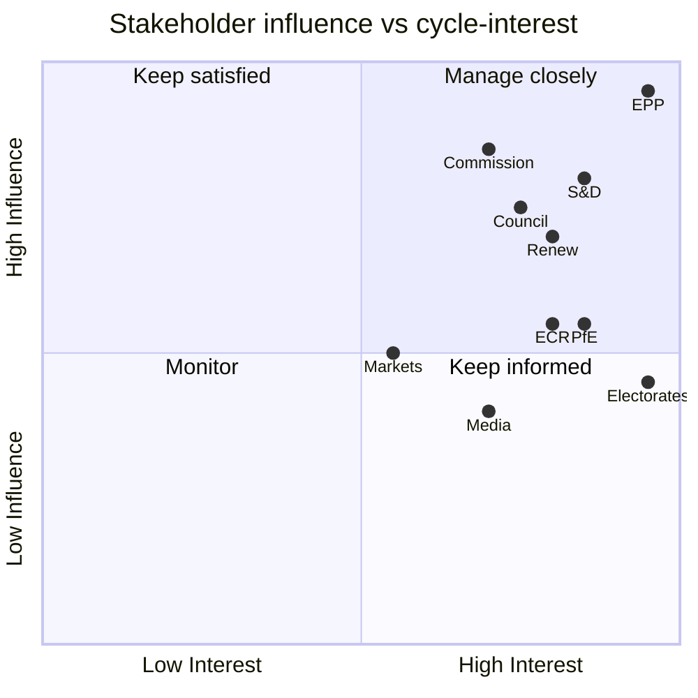

# Stakeholder Map — EP10 Electoral-Cycle Actors (2026-05-31)

> **Article type:** `election-cycle` · **Data mode:** `degraded-feeds` · **Horizon:** 2026-05-31 → 2031-05-30
> Maps the actors whose decisions shape the EP10 back-half and the 2029 contest, their interests, leverage, and likely posture.

## Stakeholder Universe

The electoral-cycle stakeholder set spans four tiers: the **principal blocs** (the nine EP10 political groups), the **institutional triangle** (Parliament, Commission, Council), the **national level** (member-state governments and parties), and the **external/contextual** actors (electorates, media, markets, external powers). Influence over the 2029 cycle is distributed unevenly across these tiers and shifts as the term progresses.

## Influence–Interest Grid

## Principal Blocs

| Bloc | Core interest | Leverage | 2029 posture |
| --- | --- | --- | --- |
| EPP (185) | Stay the pivot; own the centre-right | Pivot on every corridor | Defend plurality; selective right outreach |
| S&D (135) | Recover mobilisation; deliver social wins | Platform left pillar | Fight base erosion |
| Renew (76) | Competitiveness agenda; relevance | Swing votes | Hold cohesion; resist squeeze |
| PfE (84) | Mainstream the hard right | Largest right bloc | Maximise gains; seek normalisation |
| ECR (79) | Govern via EPP partnership | Corridor partner | Convert episodic to standing |
| Greens/EFA (53) | Defend green acquis | Grand-left extension | Re-mobilise climate vote |
| The Left (46) | Social/anti-austerity | Grand-left extension | Capture disaffected left |
| ESN (28) | Anti-system signalling | Cordon-isolated | Grow vote, stay isolated |
| NI (33) | Heterogeneous | Unwhipped | Variable |

## Institutional Triangle

The Commission holds the proposal monopoly and therefore sets the deliverable agenda the platform campaigns on (see `commission-wp-alignment.md`). The Council co-legislates and can deadlock files (T10 in `threat-model.md`). The Parliament's leverage is amendment, consent, and the bully pulpit. The triangle's alignment determines how much of the platform's mandate converts to adopted texts before 2029.

## National Level

Member-state governments shape group strengths through national elections and discipline national delegations. A rightward trend in capitals reinforces Council–Parliament tension on the platform's left files and raises the W1 (snap-election) wildcard. National parties are the true units that defect or split, making the national level the highest-resolution early-warning layer.

## External / Contextual Actors

Electorates have maximal cycle-interest but diffuse influence concentrated entirely at the 2029 ballot; turnout is their lever and the largest forecast unknown. Media frame salience (see `extended/media-framing-analysis.md`). Markets and the macro environment impose the incumbency penalty (see `economic-context.md`). External powers and disinformation actors sit in the black-swan tier (B1, B3).

## Coalition-Relevant Postures

- **EPP–platform tension:** the EPP's dual role (platform anchor + right-outreach pivot) is the central stakeholder tension of the cycle.
- **S&D defensive crouch:** mobilisation pressure pushes S&D toward visible-win-seeking, raising intra-platform bargaining.
- **PfE/ECR convergence:** rising coordination but incomplete; ESN remains the firewall test.

## Confidence

Stakeholder-map confidence is 🟡 MEDIUM. Bloc interests and leverage are 🟢 HIGH (Admiralty A1 on composition); 2029 postures are analyst projections (Admiralty B3–C3) under degraded feeds.

## Reader Briefing

- **Manage-closely quadrant:** EPP, S&D, Renew, Commission, Council.
- **Central tension:** the EPP's dual platform-anchor / right-pivot role.
- **Highest-resolution warning layer:** national parties and governments.
- **Confidence:** 🟡 MEDIUM — interests certain, postures projected.
