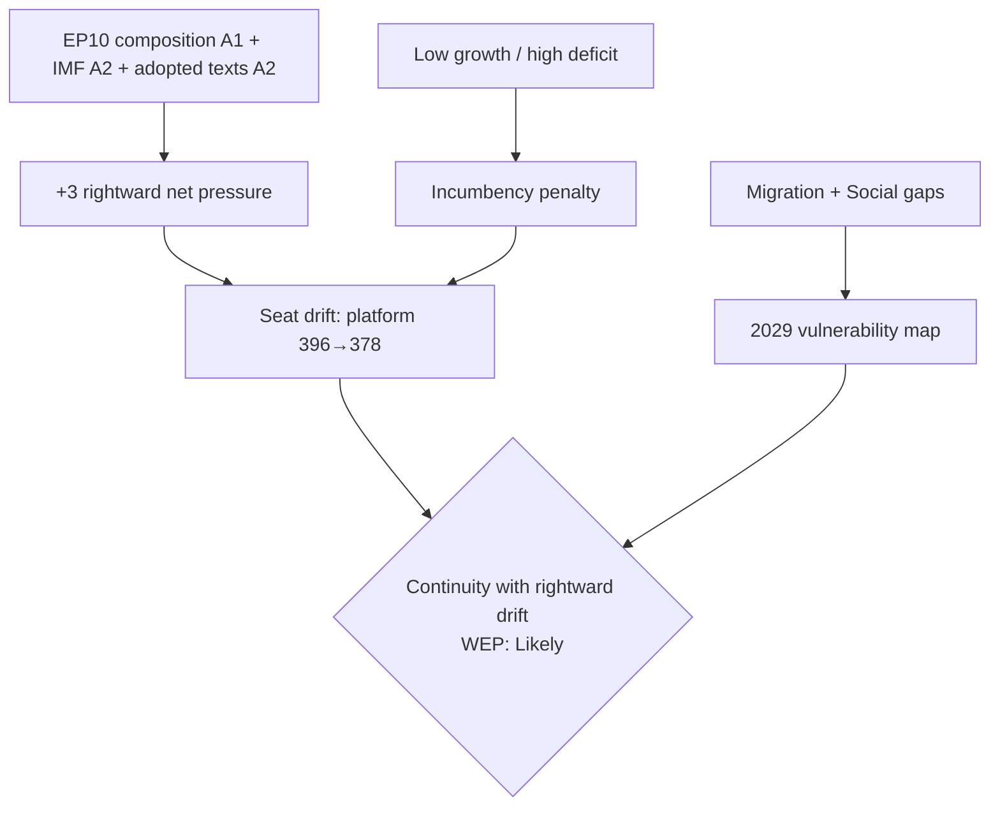

# Synthesis Summary — EP10 Electoral-Cycle Mid-Term (2026-05-31)

> **Article type:** `election-cycle` · **Data mode:** `degraded-feeds` · **Horizon:** 2026-05-31 → 2031-05-30
> Integrates the run's analysis artifacts into a single intelligence picture of the EP10 mid-term and the trajectory to the 2029 European election. Probabilities use WEP bands; key evidence carries Admiralty grades.

## BLUF

At the EP10 term midpoint (term-progress index ≈ 38%), the European Parliament governs from structural strength but campaigns from defensive weakness. The centrist platform (EPP–S&D–Renew, 396 seats, Admiralty A1) holds a reliable majority for institutional files while a consolidated 191-seat hard-right supplies episodic right-of-centre majorities on migration and deregulation. The mid-term record is a 🟡 PARTIAL mandate (~59% delivery) strong on institutions and weak on the redistributive files that drive turnout. Central forecast: continuity with rightward drift — platform returned in 2029 with the cushion roughly halved (35 → 17 seats above threshold). WEP: Likely.

## Integrated Picture

The artifacts converge on one structural story. `actor-mapping.md` and `coalition-dynamics.md` establish the three-corridor vote geometry; `forces-analysis.md` quantifies a +3 rightward net pressure; `economic-context.md` supplies the low-growth/high-deficit backdrop (IMF, all three large economies sub-1% growth in 2026, France −4.94% of GDP); `mandate-fulfilment-scorecard.md` and `commission-wp-alignment.md` independently identify the *same* migration + Social Europe gaps as the platform's 2029 vulnerability; `seat-projection.md` and `forward-projection.md` translate the drift into a reduced-majority central forecast; `scenario-forecast.md` brackets the outcome space with a tail-heavy structural-break scenario.

## Key Judgments

1. **The platform holds, but the cushion shrinks.** WEP: Likely the platform retains majority to and through 2029; WEP: Roughly Even the cushion falls below 10 seats (Admiralty B2).
2. **The decisive near-term risk is corridor hardening, not majority loss.** A structural EPP–ECR partnership (Scenario C) reshapes the EP without an election. WEP: Roughly Even (Admiralty B2).
3. **The economy mildly favours the opposition.** Sub-1% growth and constrained deficits impose an incumbency penalty (Admiralty A2 on data; B3 on transmission).
4. **The 2029 vulnerability map is already written.** Migration and Social Europe under-delivery cede the high-salience terrain (Admiralty A2).

## Cross-Artifact Consistency

The gap signature (migration + social) appears identically in the mandate scorecard and the Commission-WP alignment, raising confidence in that finding to 🟢 HIGH despite degraded feeds. The seat trajectory in `term-arc.md` §3 and the central projection in `seat-projection.md` are internally consistent (platform ~378–385 by late term). The one divergence to flag: turnout (the largest 2029 unknown) is weakly evidenced (Admiralty C4) and could push outcomes toward either Scenario B or D.

## Implications

For the platform: defend Renew cohesion, deliver a visible Social Europe item to close the S&D mobilisation gap, and manage migration files to prevent corridor hardening. For analysts: monitor the five scenario signposts in `scenario-forecast.md`. For the 2029 baseline: the mid-term record is the manifesto base — institutional competence is banked, mobilising terrain is at risk.

## Confidence

Overall synthesis confidence is 🟡 MEDIUM, lifted to 🟢 HIGH on the gap-signature and IMF-data findings, and capped at 🟡/🔴 on turnout and behavioural projections under degraded roll-call feeds.

## Reader Briefing

- **One-line read:** govern from strength, campaign from weakness — platform holds, cushion shrinks.
- **Decisive risk:** right-of-centre corridor hardening (WEP: Roughly Even), not majority loss.
- **Banked vs at-risk:** institutional competence banked; migration/social terrain ceded.
- **Confidence:** 🟡 MEDIUM overall; 🟢 HIGH on gap-signature and IMF data.
