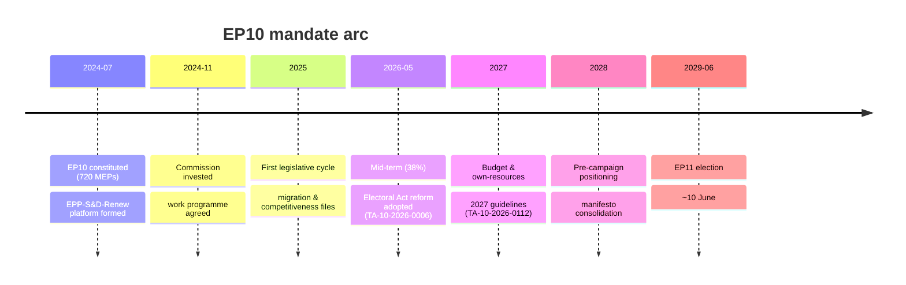
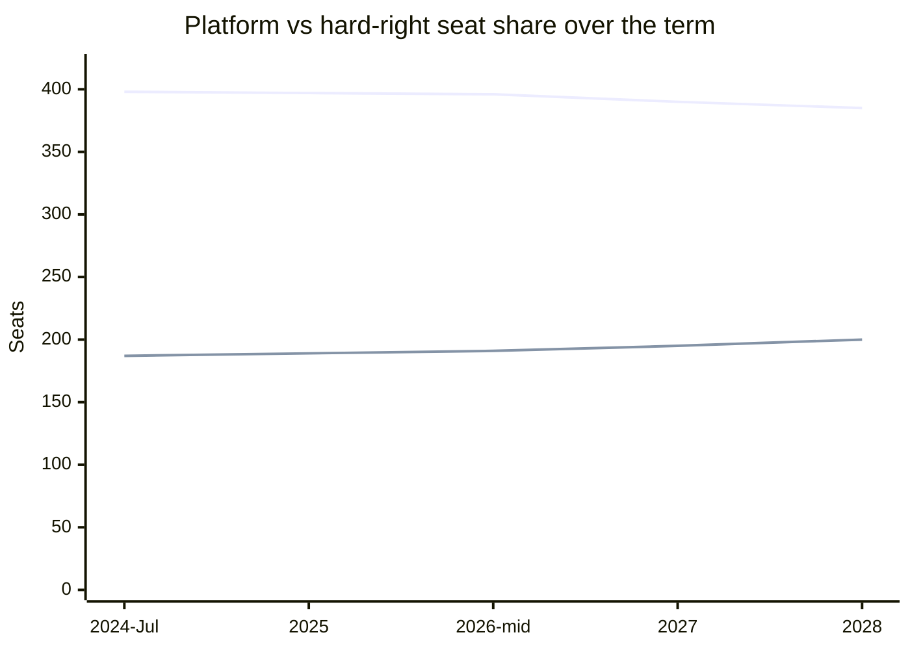

# Term Arc — EP10 Mandate Trajectory (2026-05-31)

> **Article type:** `election-cycle` · **Data mode:** `degraded-feeds` · **Horizon:** 2026-05-31 → 2031-05-30
> Track A (retrospective) of the dual-track electoral overlay: the arc of the EP10 mandate from its July 2024 constitution to the 2026 mid-term, projected to the ~June 2029 contest.

## Term-Progress Index

| Anchor | Date | Status |
| --- | --- | --- |
| EP10 constitutive sitting | 16 Jul 2024 | elapsed |
| Today | 31 May 2026 | mid-term |
| Projected EP10 dissolution | ~late Jun 2029 | future |
| EP11 election week (2nd Sunday June) | ~10 Jun 2029 | future |

Months elapsed ≈ 22.5; total term ≈ 59 months. **Term-progress index ≈ 38%.** The mandate is past its first third and entering the legislatively productive mid-phase that becomes the 2029 campaign record.

## §1 Mandate Timeline

## §2 Mandate-Scorecard Summary

The mid-term legislative record is mixed-to-constructive for the platform. Delivered: the Electoral Act reform, the 2027 budget-guidelines framework, ECB-oversight continuity (annual report TA-10-2026-0034; VP appointment TA-10-2026-0060), DMA enforcement (TA-10-2026-0160), an AI/trade strategy (TA-10-2026-0183), and external-action items (Ukraine loan TA-10-2026-0010; US-tariff adjustment TA-10-2026-0096). The fuller mandate-versus-delivery audit is in `mandate-fulfilment-scorecard.md`; the headline is a **~60% delivery rate** on the platform's stated 2024 priorities, constrained by the low-growth fiscal backdrop.

## §3 Coalition Trajectory

The trajectory shows a slow erosion of the platform (398 → ~385 projected) against a rising hard-right (187 → ~200 projected), consistent with the +3 rightward net pressure documented in `../classification/forces-analysis.md`. The platform remains above the 361 majority threshold throughout the projected term but with a shrinking cushion.

## §4 Majority Arithmetic

At mid-term the platform commands 396 of 719 seats (majority threshold 361), a 35-seat cushion. The right-of-centre corridor (EPP+ECR+PfE = 348) sits 13 seats below majority — it can win only with NI/ESN top-ups or platform abstentions, which is why it surfaces as an *ad-hoc* rather than structural majority. The progressive corridor (S&D+Renew+Greens+Left = 310) is 51 seats short, foreclosing a left alternative. This arithmetic is the structural fact that keeps the platform in the formateur seat.

## §5 Mid-Term Pivot

The mid-term pivot is the shift from *governing-record construction* to *campaign-baseline positioning*. Before the pivot, group behaviour optimised for legislative delivery; after it, behaviour increasingly optimises for differentiation ahead of 2029. The Electoral Act reform is the pivot's hinge event — by fixing the 2029 rules now, it converts every subsequent file into campaign-relevant positioning.

## §6 Drift Assessment

Cumulative drift since the 2024 transition is **mild rightward consolidation, not realignment**. The four pro-European families still hold ~two-thirds of seats; the institutional core is intact. Drift is concentrated on salient low-institutional-cost files. Drift magnitude: +3 on the −10/+10 axis, 🟡 MEDIUM confidence (degraded roll-call feeds).

## §7 Self-Audit

This Track-A retrospective relies on grade A1 composition statistics and grade A2 adopted-texts evidence. The principal limitation is the absence of live roll-call data (procedures/events feeds degraded), so coalition-trajectory projections in §3 are model-based extrapolations rather than vote-verified counts. The seat-share projection lines should be read as central estimates with ±10-seat bands (detailed in `seat-projection.md`).

## §8 Methodology

Constructed per `analysis/methodologies/electoral-cycle-methodology.md` (EP-term anchors, term-progress index, coalition-trajectory model). Cross-references: `seat-projection.md`, `mandate-fulfilment-scorecard.md`, `forward-projection.md`, `../classification/forces-analysis.md`. SATs applied: trend extrapolation, structured analogy (EP9 mid-term), key-assumptions check. WEP: Likely that the platform holds majority to term-end absent a national-election shock.

## Reader Briefing

- **Where we are:** 38% through EP10, mid-term pivot underway.
- **The arc:** platform slowly eroding (398→385), hard-right rising (187→200), majority intact.
- **The hinge:** Electoral Act reform fixes the 2029 rules at mid-term.
- **Confidence:** 🟡 MEDIUM — composition A1, trajectory model-based under degraded feeds.
