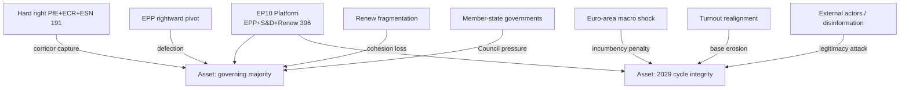

# Threat Model — EP10 Electoral-Cycle Political Risk (2026-05-31)

> **Article type:** `election-cycle` · **Data mode:** `degraded-feeds` · **Horizon:** 2026-05-31 → 2031-05-30
> Models the political-system threats to the EP10 governing platform and to the integrity of the 2029 electoral cycle. This is a *political* threat model — threat actors are blocs, member-state governments, and exogenous shocks, not cyber adversaries. Probabilities use WEP bands; evidence carries Admiralty grades.

## Scope and Method

The threat model enumerates threats to two assets: (1) the EP10 platform's governing majority through term-end, and (2) the legitimacy and competitiveness of the 2029 contest. For each threat we record the threat actor, the mechanism, the affected asset, a WEP likelihood band with horizon, an impact rating, and an Admiralty source grade for the supporting evidence. Threats are then ranked by risk-weighted exposure and mapped to the mitigations available to the platform.

The model deliberately separates *likelihood* (WEP probability) from *confidence in evidence* (Admiralty grade), per OSINT tradecraft standards. A threat can be high-likelihood but low-confidence (e.g. turnout collapse) or low-likelihood but high-confidence (e.g. a specific bloc's stated intent).

## Threat Actors

## Threat Register

| # | Threat | Actor | Mechanism | Asset | WEP (horizon) | Impact | Admiralty |
| --- | --- | --- | --- | --- | --- | --- | --- |
| T1 | Right-of-centre corridor capture | EPP + ECR/PfE | EPP normalises ECR as standing partner on migration/deregulation | Majority | Roughly Even (36m) | High | B2 |
| T2 | Renew cohesion collapse | Renew national delegations | Heterogeneous delegations split on key files | Majority | Unlikely (24m) | High | B3 |
| T3 | Centre-left mobilisation failure | S&D base | Social Europe gap depresses 2029 turnout | Cycle | Roughly Even (36m) | High | C3 |
| T4 | Macro/recession shock | Exogenous | IMF-projected sub-1% growth tips to recession | Cycle | Unlikely (24m) | Severe | A2 |
| T5 | Major-state government collapse | Member state | Snap national election reshapes a national delegation | Both | Unlikely (36m) | Severe | C3 |
| T6 | Fragmentation acceleration | Small groups + NI | NI growth + new groups raise coordination cost | Majority | Roughly Even (36m) | Medium | B3 |
| T7 | Electoral-rules contestation | Council/states | Electoral Act provisions disputed or delayed | Cycle | Unlikely (36m) | Medium | B2 |
| T8 | Disinformation / legitimacy attack | External actors | Coordinated narrative against EP institutions | Cycle | Likely (36m) | Medium | C4 |
| T9 | Cordon sanitaire breach | EPP fringe | Ad-hoc votes erode the ESN isolation norm | Majority | Unlikely (24m) | High | B3 |
| T10 | Budget/MFF deadlock | Council vs EP | 2027 budget guidelines escalate to standoff | Majority | Unlikely (18m) | Medium | A2 |

## Risk-Weighted Ranking

Combining WEP likelihood with impact, the highest risk-weighted threats are **T1 (corridor capture)** and **T3 (mobilisation failure)** — both Roughly Even × High — followed by the lower-likelihood but Severe-impact **T4 (macro shock)** and **T5 (government collapse)**. T8 (disinformation) is Likely but only Medium impact, placing it mid-table. WEP: Likely that at least one of T1/T3/T6 materialises before 2029; WEP: Unlikely that a Severe-impact threat (T4/T5) materialises in any given 12-month window, but cumulative exposure over the 36-month horizon is non-trivial.

## Attack Paths

The most dangerous *compound* path chains T4 → T3 → T1: a macro shock depresses centre-left turnout, which weakens S&D, which makes the EPP's right-of-centre corridor the path of least resistance, converting episodic majorities into a standing axis. This compound path is the mechanism behind Scenario F (structural break) in `scenario-forecast.md`. A second path chains T2 → T1: Renew fragmentation removes the platform's swing votes, again forcing the EPP rightward. Monitoring the *junctions* (turnout signals, Renew discipline) gives earlier warning than monitoring the endpoints.

## Mitigations Available to the Platform

| Threat | Mitigation | Owner | Feasibility |
| --- | --- | --- | --- |
| T1 | Hold cordon on institutional files; deny ECR chair/rapporteur capture | EPP leadership | 🟡 Medium |
| T2 | Renew discipline pacts on priority files | Renew presidency | 🟡 Medium |
| T3 | Deliver a visible Social Europe item before 2029 | S&D | 🔴 Low (fiscal) |
| T4 | None (exogenous); prepare counter-cyclical messaging | n/a | 🔴 Low |
| T6 | Procedural reform to streamline trilogues | EP bureau | 🟡 Medium |
| T8 | EP institutional communication + fact-checking | EP services | 🟡 Medium |

The mitigation profile is sobering: the two highest risk-weighted threats (T1, T3) have only Medium-to-Low feasible mitigations, and the Severe-impact threats are largely exogenous. The platform's realistic posture is *attenuation*, not *prevention* — managing the rate of drift rather than reversing it.

## Residual Risk

After available mitigations, residual risk remains **Elevated** for the governing-majority asset over the 36-month horizon and **Moderate-to-Elevated** for cycle integrity. WEP: Likely the platform absorbs the residual risk and governs to term-end; WEP: Roughly Even that the residual risk manifests as a materially thinner 2029 mandate. The dominant residual exposure is corridor hardening (T1), which can degrade the platform's effective majority *without* ever showing up as a lost vote count.

## Indicators and Warnings

- **T1 trigger:** a second migration file passing on the EPP–ECR corridor without S&D.
- **T2 trigger:** ≥2 Renew national delegations splitting on a priority file.
- **T3 trigger:** S&D-aligned national polling showing turnout-intention decline.
- **T4 trigger:** an IMF or ECB downgrade moving 2026 growth toward zero.
- **T5 trigger:** a confidence vote or snap-election call in DE/FR/IT.

## Confidence

Threat-model confidence is 🟡 MEDIUM. The threat enumeration and ranking are robust (Admiralty A1–B2 on composition and macro data); the behavioural threats (T3, T8) and compound paths carry C-grade uncertainty under degraded roll-call feeds. The mitigation feasibility ratings are analyst judgments.

## Reader Briefing

- **Top threats:** corridor capture (T1) and mobilisation failure (T3) — Roughly Even × High.
- **Tail threats:** macro shock (T4) and government collapse (T5) — Unlikely but Severe.
- **Compound path:** macro shock → turnout collapse → corridor capture (= Scenario F).
- **Posture:** attenuation, not prevention — the platform manages drift, it cannot reverse it.
- **Confidence:** 🟡 MEDIUM — enumeration robust, behavioural threats uncertain.
