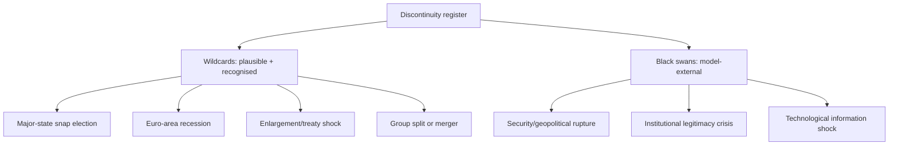

# Wildcards & Black Swans — EP10 → 2029 Cycle (2026-05-31)

> **Article type:** `election-cycle` · **Data mode:** `degraded-feeds` · **Horizon:** 2026-05-31 → 2031-05-30
> Low-probability, high-impact discontinuities that conventional scenario analysis under-weights. Probabilities use WEP bands; evidence carries Admiralty grades. Distinct from `scenario-forecast.md`, which models the central distribution.

## Why a Separate Wildcard Register

Scenario forecasts cluster around the central distribution and systematically under-weight tail events because tails lack a base rate. This register deliberately enumerates discontinuities — wildcards (plausible, recognised, hard to time) and black swans (outside the current model, recognised only in hindsight) — so the intelligence picture is not blind to the events that would most reshape the 2029 cycle.

## Classification

## Wildcard Register

| ID | Wildcard | Trigger | Cycle impact | WEP (horizon) | Admiralty |
| --- | --- | --- | --- | --- | --- |
| W1 | Major-state snap election | Government collapse in DE/FR/IT | Reshapes a national delegation; can swing a group | Unlikely (36m) | C3 |
| W2 | Euro-area recession | IMF-projected sub-1% growth tips negative | Sharpens incumbency penalty; favours challengers | Unlikely (24m) | A2 |
| W3 | Enlargement/treaty moment | Accession progress or treaty-change push | Re-opens institutional questions mid-cycle | Highly Unlikely (60m) | C4 |
| W4 | Group realignment | A national delegation defects; new group forms | Alters fragmentation index and corridors | Roughly Even (36m) | B3 |
| W5 | Electoral-Act surprise effect | Threshold/transnational-list provisions bite | Changes the 2029 seat-allocation maths | Unlikely (36m) | B2 |

## Black-Swan Register

| ID | Black swan | Pre-signal (weak) | Cycle impact | WEP (horizon) | Admiralty |
| --- | --- | --- | --- | --- | --- |
| B1 | Security/geopolitical rupture | Escalation on EU periphery | Rally-or-fracture dynamic; unpredictable bloc effects | Highly Unlikely (36m) | C5 |
| B2 | Institutional legitimacy crisis | Corruption/transparency scandal | Depresses turnout; fuels anti-system vote | Highly Unlikely (36m) | C5 |
| B3 | Information/technology shock | AI-driven disinformation at scale | Distorts the 2029 campaign information space | Unlikely (36m) | C4 |

## Impact Asymmetry

The defining feature of this register is impact asymmetry: each item has low point-probability but, if realised, would dominate the 2029 outcome more than any central-scenario variable. W2 (recession) and B1 (security rupture) sit at the extreme — modest likelihood, system-level impact. WEP: Unlikely any single wildcard fires in a given 12-month window; WEP: Roughly Even that *at least one* of W1/W2/W4 materialises across the full 36-month horizon, given their partial independence.

## Interaction Effects

Wildcards are not independent. W2 (recession) raises the probability of W1 (government collapse) and amplifies B2 (legitimacy crisis). A correlated cluster — recession + snap election + disinformation surge — is the empirical content of Scenario F's structural break. The register therefore doubles as a decomposition of the tail scenario into observable components.

## Monitoring Posture

- Track IMF/ECB growth revisions monthly (W2 early-warning).
- Track national confidence-vote and snap-election signals in DE/FR/IT (W1).
- Track new-group registration and NI churn (W4).
- Track Electoral-Act implementing-measure timelines (W5).
- Maintain qualitative watch on B1–B3 (no reliable base rate; hindsight-only).

## Confidence

Wildcard-register confidence is 🟡 MEDIUM on the macro-anchored items (W2, Admiralty A2) and 🔴 LOW on the black swans (B1–B3, Admiralty C4–C5 by construction). The register's value is completeness of imagination, not calibrated probability — the WEP bands on black swans should be read as order-of-magnitude, not precise.

## Reader Briefing

- **Wildcards:** snap election (W1), recession (W2), group realignment (W4) — plausible, hard to time.
- **Black swans:** security rupture, legitimacy crisis, information shock — model-external, hindsight-only.
- **Key insight:** correlated wildcards (recession + snap election + disinformation) = the structural-break tail.
- **Confidence:** 🟡 MEDIUM on macro items, 🔴 LOW on black swans by construction.
