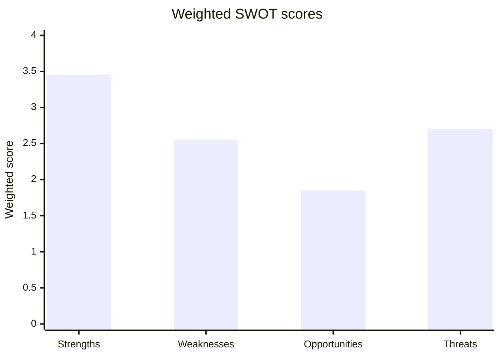

# Quantitative SWOT — EP10 Centrist Platform at Mid-Term (2026-05-31)

> **Article type:** `election-cycle` · **Data mode:** `degraded-feeds` · **Horizon:** 2026-05-31 → 2031-05-30
> Weighted SWOT of the EP10 governing platform (EPP–S&D–Renew) as it enters the back half of the term. Each item carries a weight (0–1) and a magnitude (1–5); weighted score = weight × magnitude.

## Methodology

The SWOT scores the strategic position of the centrist platform, the unit whose survival defines whether EP10 governs to a stable 2029 handover. Weights reflect each factor's leverage on coalition durability; magnitudes reflect current intensity. Net strategic balance = (Σ S + Σ O) − (Σ W + Σ T). Evidence draws on EP10 composition statistics (A1) and the 2026 adopted-texts corpus (A2).

## Strengths

| Factor | Weight | Magnitude | Score |
| --- | --- | --- | --- |
| 396-seat majority, 35 above threshold | 0.25 | 5 | 1.25 |
| Command of committee chairs | 0.15 | 4 | 0.60 |
| Institutional indispensability (budget, own-resources) | 0.20 | 5 | 1.00 |
| Pro-EU baseline (~two-thirds of MEPs) | 0.15 | 4 | 0.60 |
| **Σ Strengths** | | | **3.45** |

The platform's structural strength is its monopoly on reliable majorities for high-stakes institutional files: no right-of-centre combination can deliver the 361 votes for budget or own-resources decisions, which anchors the platform regardless of issue-specific defections.

## Weaknesses

| Factor | Weight | Magnitude | Score |
| --- | --- | --- | --- |
| Renew dependency (76-seat hinge) | 0.25 | 4 | 1.00 |
| Internal EPP rightward temptation | 0.20 | 4 | 0.80 |
| Centre-left fiscal constraint | 0.15 | 3 | 0.45 |
| Fragmentation index 6.59 | 0.10 | 3 | 0.30 |
| **Σ Weaknesses** | | | **2.55** |

The platform's central weakness is its dependence on Renew's 76 seats as the pivotal hinge, compounded by the EPP's standing incentive to reach rightward on migration and deregulation.

## Opportunities

| Factor | Weight | Magnitude | Score |
| --- | --- | --- | --- |
| Electoral Act reform to entrench pro-EU rules | 0.20 | 3 | 0.60 |
| Competitiveness/AI agenda to claim deliverables | 0.20 | 4 | 0.80 |
| Ukraine-financing leadership as unity vector | 0.15 | 3 | 0.45 |
| **Σ Opportunities** | | | **1.85** |

## Threats

| Factor | Weight | Magnitude | Score |
| --- | --- | --- | --- |
| Structural right-of-centre corridor | 0.25 | 4 | 1.00 |
| Far-right 2029 gains | 0.20 | 4 | 0.80 |
| Fiscal/external shock | 0.20 | 3 | 0.60 |
| Turnout erosion | 0.10 | 3 | 0.30 |
| **Σ Threats** | | | **2.70** |

## Net Strategic Balance

Net = (3.45 + 1.85) − (2.55 + 2.70) = **+0.05**. The platform is in a *marginally positive but fragile* strategic position: strengths and opportunities barely outweigh weaknesses and threats. The thin margin quantifies the central finding — the platform governs from structural strength but campaigns from defensive weakness.

## Sensitivity

The +0.05 net balance is sensitive to the right-of-centre-corridor threat: if R2 hardens (magnitude 4→5), net balance turns negative (−0.20), flipping the platform into a defensive posture. Conversely, a competitiveness-agenda win (opportunity magnitude 4→5) lifts net to +0.25. The strategic verdict is therefore *contingent on Renew discipline and migration-file management* (🟡 MEDIUM confidence under degraded feeds).

## Reader Briefing

- **Net balance:** +0.05 — marginally positive, structurally fragile.
- **Strongest asset:** monopoly on institutional majorities (3.45 strengths).
- **Gravest threat:** the right-of-centre corridor hardening (1.00 weighted).
- **Confidence:** 🟡 MEDIUM — composition data A1, coalition inference under degraded roll-call feeds.
