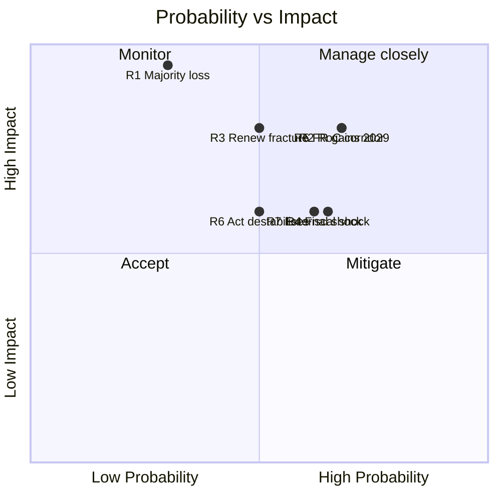

# Risk Matrix — Electoral-Cycle Risk Register (2026-05-31)

> **Article type:** `election-cycle` · **Data mode:** `degraded-feeds` · **Horizon:** 2026-05-31 → 2031-05-30
> Probability × impact register for the risks bearing on the EP10 mid-term and the 2029 contest. Probability uses Words of Estimative Probability (WEP) bands; source reliability uses Admiralty grades.

## Methodology

Each risk is scored on probability (WEP band → numeric midpoint) and impact (1–5), yielding an exposure score. Admiralty source grades record evidence reliability under this run's degraded-feeds condition. WEP bands follow the ODNI/Kent lexicon: Almost Certain (≥95%), Highly Likely (80–95%), Likely (55–80%), Roughly Even (45–55%), Unlikely (20–45%), Highly Unlikely (5–20%), Almost No Chance (≤5%).

## Risk Register

| ID | Risk | Probability (WEP) | Impact | Exposure | Source grade |
| --- | --- | --- | --- | --- | --- |
| R1 | Centrist platform loses working majority before 2029 | WEP: Unlikely | 5 | 1.6 | B2 |
| R2 | Right-of-centre corridor becomes structural on migration | WEP: Likely | 4 | 2.7 | B2 |
| R3 | Renew fractures, flips pivotal votes | WEP: Roughly Even | 4 | 2.0 | C3 |
| R4 | Fiscal shock erodes centre-left social offer | WEP: Likely | 3 | 2.0 | A2 |
| R5 | Far-right gains further in 2029 (PfE+ESN > 130 seats) | WEP: Likely | 4 | 2.7 | B3 |
| R6 | Electoral Act reform destabilises small groups | WEP: Roughly Even | 3 | 1.5 | A1 |
| R7 | External shock (Ukraine financing / US tariffs) | WEP: Likely | 3 | 2.0 | A2 |
| R8 | Turnout decline depresses pro-EU vote share | WEP: Roughly Even | 3 | 1.5 | C3 |

## Top Risks (Exposure-Ranked)

1. **R2 — structural right-of-centre corridor (2.7):** the most consequential near-term risk. The recurring EPP–ECR–PfE majority on migration files (WEP: Likely) would, if it hardens beyond ad-hoc use, hollow the cordon sanitaire and reset the EP's centre of gravity. Mitigation hinges on Renew and S&D discipline.
2. **R5 — far-right 2029 gains (2.7):** national-level momentum (grade B3) points to continued hard-right growth; a PfE+ESN total above 130 seats would make a blocking minority or a larger ad-hoc majority routine.
3. **R4 / R7 — fiscal and external shocks (2.0):** IMF WEO (grade A2) shows France at -4.94% of GDP and sub-1% growth across DE/FR/IT in 2026, constraining the distributive politics that stabilise the centre.

## Risk Heat Map

## Residual Risk and Watch Triggers

Residual exposure after mitigation remains concentrated in R2/R5 because both depend on exogenous national-electoral dynamics the EP cannot control. Watch triggers: (a) a second consecutive migration file passing on a right-of-centre majority without S&D; (b) a Renew national delegation defecting in a member-state government; (c) an IMF downgrade pushing any large economy into recession. Any single trigger raises the composite cycle-risk level from 🟡 ELEVATED to 🔴 HIGH.

## Reader Briefing

- **Top risk:** a structural (not ad-hoc) right-of-centre majority on migration — WEP: Likely.
- **Slow risk:** further far-right gains in 2029 plus fiscal-shock erosion of the centre-left.
- **Backstop:** the platform's 35-seat institutional cushion holds majority loss to WEP: Unlikely.
- **Confidence:** 🟡 MEDIUM — probabilities inferred under degraded feeds (Admiralty B–C on coalition items).
