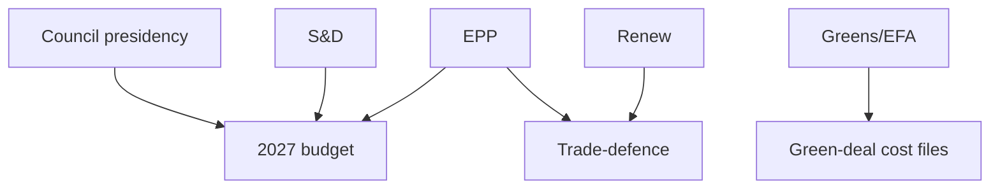

<!-- SPDX-FileCopyrightText: 2024-2026 Hack23 AB -->
<!-- SPDX-License-Identifier: Apache-2.0 -->

# 🧭 Actor Mapping — June 2026 Month-Ahead

**Run date:** 2026-05-31 · **Article type:** `month-ahead` · **Classification:** Public

Source basis: EP `get_adopted_texts` (year=2026) and `get_procedures` proxy,
cross-referenced with EP10 group-composition history.

## 1. Actor Roster

| Actor | Type | Primary interest |
| --- | --- | --- |
| EPP | Political group | Fiscal discipline, competitiveness |
| S&D | Political group | Social spending, Ukraine solidarity |
| Renew | Political group | Single-market, trade openness |
| Greens/EFA | Political group | Green-deal protection |
| BUDG committee | Committee | 2027 envelope gatekeeping |
| INTA committee | Committee | Trade-defence file ownership |
| Council presidency | External co-legislator | Budget bargaining |

## 2. Influence Assessment

EPP and S&D jointly hold the budget-procedure pivot; neither carries the 2027
envelope alone, so the grand-coalition dynamic dominates. Renew is the marginal
swing on trade-defence. Influence is concentrated in the BUDG rapporteur chain
and the two largest groups.

## 3. Alliance Structure

The operative alliance is EPP-S&D-Renew for budget and Ukraine, widening to
include Greens/EFA on green-deal-cost files and narrowing toward an EPP-ECR
centre-right bloc on trade-defence protectionism.

## 4. Power Brokers

The decisive brokers are the BUDG rapporteur and the S&D group leadership,
whose willingness to bundle or sequence Ukraine financing sets the budget
timeline. The Council presidency is the external broker on the envelope ceiling.

## 5. Information Flows

Actor positions are inferred from the adopted-texts record (`get_adopted_texts`),
established group ideology, and committee ownership. Forward whipping intentions
are not yet observable this run because the forward roll-call feed was degraded.

## 6. Mermaid — actor influence network

## 7. SAT note

Applies **Stakeholder Mapping** and **Analysis of Competing Hypotheses** —
competing coalition hypotheses are carried forward to `coalition-dynamics.md`.

## 8. Reader Briefing

For citizens: the June EP agenda is steered mainly by the two largest groups
(EPP and S&D) acting together on the budget, with smaller groups deciding the
trade-defence outcome. Watch which way Renew leans on tariffs — that is the
swing vote.

## 9. Confidence

🟡 MEDIUM — positions inferred from the adopted-texts record; specific June
whipping intentions not yet observable.

---

*Feeds `classification/forces-analysis.md` and `intelligence/coalition-dynamics.md`.*
