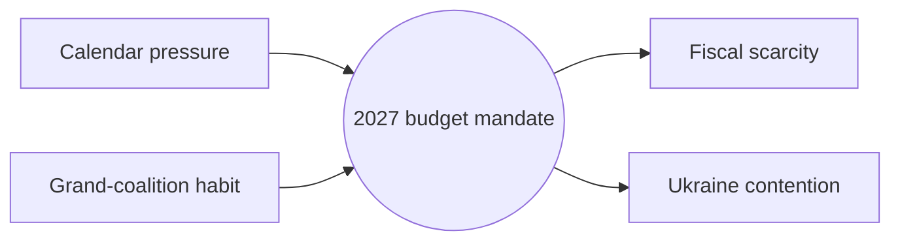

<!-- SPDX-FileCopyrightText: 2024-2026 Hack23 AB -->
<!-- SPDX-License-Identifier: Apache-2.0 -->

# ⚖️ Forces Analysis — June 2026 Month-Ahead

**Run date:** 2026-05-31 · **Article type:** `month-ahead` · **Classification:** Public

Source basis: EP `get_adopted_texts` (year=2026) plus IMF WEO fiscal backdrop.

## 1. Issue Frame

The dominant June file is the 2027 budget procedure. The frame is a contest
between timely mandate adoption (driven by the autumn deadline) and slippage
(driven by fiscal-space scarcity and Ukraine-financing contention).

## 2. Driving Forces

| Driving force | Strength |
| --- | --- |
| Calendar pressure (autumn deadline) | High |
| Grand-coalition habit | Medium |
| Council co-legislator pressure | Medium |
| Rapporteur continuity | Medium |

## 3. Restraining Forces

| Restraining force | Strength |
| --- | --- |
| Fiscal-space scarcity (IMF deficits) | High |
| Ukraine financing contention | High |
| Trade-defence distraction | Medium |
| Degraded forward visibility | Low |

## 4. Net Pressure

Driving and restraining forces are roughly balanced, tilting slightly toward
on-time mandate adoption because the autumn deadline is a hard external forcing
function. The decisive variable is whether Ukraine financing is bundled into
the budget timeline or sequenced separately.

## 5. Intervention Points

The highest-leverage intervention point is the BUDG mandate vote scheduling.
Sequencing Ukraine financing after the mandate would relieve the restraining
pressure; bundling it raises slippage risk materially.

## 6. Mermaid — force-field diagram

## 7. SAT note

Applies **Force-Field Analysis** and **Key Assumptions Check**. The load-bearing
assumption — that the autumn deadline holds — is logged and would invert the net
assessment if relaxed.

## 8. Reader Briefing

For citizens: the EU's 2027 budget is on a tight clock. A hard autumn deadline
pushes lawmakers to agree in June, but tight national finances and the cost of
backing Ukraine pull the other way. The outcome hinges on whether the two are
handled together or one at a time.

## 9. Confidence

🟡 MEDIUM — force weights are analyst-assigned ordinal estimates, not measured
vote counts.

---

*Builds on `classification/actor-mapping.md`; feeds `risk-scoring/risk-matrix.md`.*
