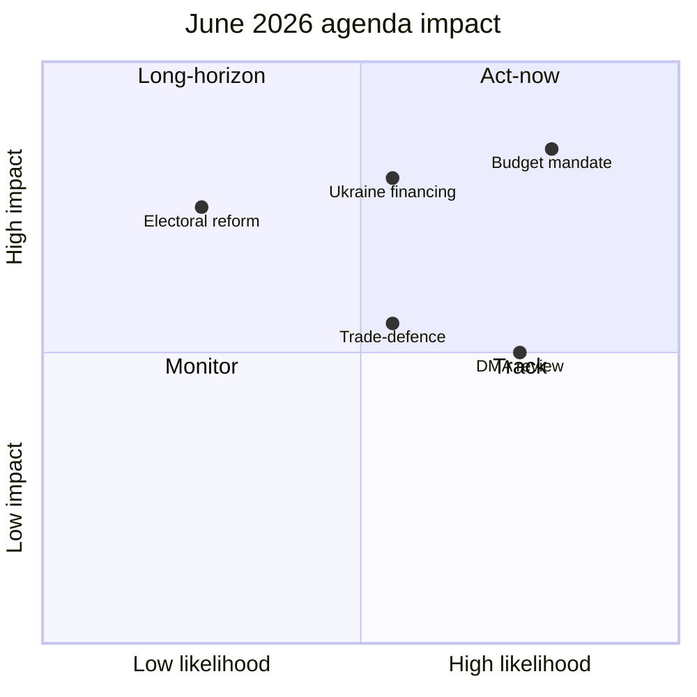

<!-- SPDX-FileCopyrightText: 2024-2026 Hack23 AB -->
<!-- SPDX-License-Identifier: Apache-2.0 -->

# 🎯 Impact Matrix — June 2026 Month-Ahead

**Run date:** 2026-05-31 · **Article type:** `month-ahead` · **Classification:** Public

Source basis: EP `get_adopted_texts` (year=2026) and `get_procedures` proxy.

## 1. Event List

| Item | Committee |
| --- | --- |
| 2027 budget mandate | BUDG |
| Ukraine financing & accountability | AFET/BUDG |
| Trade-defence response (US tariffs, Mercosur CJEU) | INTA |
| DMA enforcement review | IMCO |
| European Electoral Act reform | AFCO |

## 2. Stakeholder Exposure

The 2027 budget mandate exposes every DG and all political groups; Ukraine
financing concentrates exposure on AFET/BUDG and the Council; trade-defence
exposure falls on INTA and export-sensitive member states.

## 3. Impact Matrix

| Item | Likelihood (June) | Impact magnitude | Quadrant |
| --- | --- | --- | --- |
| 2027 budget mandate | High | High | Act-now |
| Ukraine financing | Medium | High | Watch-closely |
| Trade-defence response | Medium | Medium | Monitor |
| DMA enforcement review | High | Medium | Track |
| Electoral Act reform | Low | High | Long-horizon |

## 4. Heat Map

🔴 Budget mandate (high/high) · 🟠 Ukraine financing (med/high) ·
🟡 Trade-defence (med/med) · 🟡 DMA review (high/med) ·
🟢 Electoral reform (low/high, long-horizon).

## 5. Cascade Analysis

Budget-mandate slippage would cascade into Ukraine-financing delay (shared
envelope) and weaken the EP's trade-defence funding posture. The budget file is
the upstream node whose failure propagates furthest.

## 6. Mermaid — impact quadrants

## 7. SAT note

Applies **Stakeholder Mapping** and **What-If Analysis** — the What-If leg tests
how the grid reorders if Ukraine financing slips to July.

## 8. Reader Briefing

For citizens: the budget is the one June item that is both likely to move and
high-impact, so it leads. Ukraine financing matters as much but its timing is
uncertain. Everything else is secondary this month.

## 9. Confidence

🟡 MEDIUM — likelihood scores inherit the degraded forward-feed uncertainty.

---

*Pairs with `classification/significance-classification.md`.*
