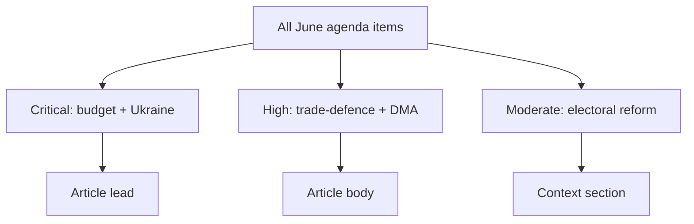

<!-- SPDX-FileCopyrightText: 2024-2026 Hack23 AB -->
<!-- SPDX-License-Identifier: Apache-2.0 -->

# 🏷️ Significance Classification — June 2026 Month-Ahead

**Run date:** 2026-05-31 · **Article type:** `month-ahead` · **Classification:** Public

## 1. Purpose

Classify the significance of each June-2026 EP agenda item so the article
can lead with the highest-impact files and the analysis chain can weight
risk and stakeholder effort proportionally.

## 2. Significance scale

| Tier | Definition | Reader signal |
| --- | --- | --- |
| 🔴 Critical | Cross-institutional, budget-binding, or rule-of-law | Lead story |
| 🟠 High | Single-committee flagship with EU-wide effect | Section lead |
| 🟡 Moderate | Sectoral or procedural milestone | Supporting |
| 🟢 Low | Routine throughput | Mention only |

## 3. Item classification

| Agenda item | Committee | Tier | Rationale |
| --- | --- | --- | --- |
| 2027 budget procedure | BUDG | 🔴 Critical | Sets EU fiscal envelope; binds all DG spending |
| Ukraine financing & accountability | AFET/BUDG | 🔴 Critical | Geopolitical + budget exposure |
| Trade-defence (US tariffs, Mercosur CJEU) | INTA | 🟠 High | External-trade posture, legal contingency |
| DMA enforcement review | IMCO | 🟠 High | Digital-market rule enforcement |
| European Electoral Act reform | AFCO | 🟡 Moderate | Long-horizon institutional reform |

## 4. Significance drivers

The June ranking is dominated by **fiscal bindingness** — items that move
the 2027 envelope outrank items that are merely sectoral. Ukraine financing
ranks Critical despite uncertainty because its budget exposure is large and
its timing is exogenous to the EP calendar.

## 5. Mermaid — significance funnel

## 6. Confidence

🟡 MEDIUM — classification rests on the adopted-texts pipeline and the
historical June agenda shape; the degraded forward feed means provisional
item ordering may shift once the final June agenda publishes.

---

*Pairs with `classification/actor-mapping.md` and `classification/impact-matrix.md`.*
