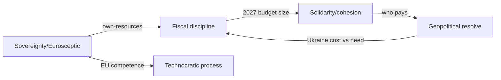

<!-- SPDX-FileCopyrightText: 2024-2026 Hack23 AB -->
<!-- SPDX-License-Identifier: Apache-2.0 -->

# 📰 Media Framing Analysis — June 2026 Month-Ahead

**Run date:** 2026-05-31 · **Article type:** `month-ahead` · **Data mode:** `degraded-feeds`
**Method:** competing-frames analysis of how the June agenda is likely to be
narrated across the European media/political spectrum, with neutrality controls.
This artifact informs editorial balance — it does **not** endorse any frame.

---

## 1. BLUF

The June agenda will be contested through (at least) five framings: a
**fiscal-discipline** frame, a **solidarity/cohesion** frame, a **geopolitical-
resolve** frame, a **sovereignty/Eurosceptic** frame, and a **technocratic
process** frame. Each maps to identifiable stakeholders and selectively
foregrounds the same underlying facts. The platform's editorial duty is to
present the load-bearing facts (IMF macro, adopted-text pipeline) and let the
frames be visible without adopting one. 🟡 MEDIUM.

---

## 2. Frame inventory

| Frame | Carriers | Core message | Selective emphasis |
|-------|----------|--------------|--------------------|
| Fiscal discipline | EPP, net-contributors, Berlin | "Spend within means" | Deficits, headroom |
| Solidarity/cohesion | S&D, Greens, recipients | "Don't abandon priorities" | Cohesion, Ukraine need |
| Geopolitical resolve | AFET mainstream | "Stand firm on Ukraine" | Security, credibility |
| Sovereignty/Eurosceptic | ECR/ID flanks | "EU overreach / cost" | Own-resources, migration |
| Technocratic process | Commission, rapporteurs | "Orderly procedure" | Timetables, legality |

---

## 3. Frame narratives

### 3.1 Fiscal-discipline frame
Foregrounds the IMF deficit numbers (France −4.9%) to argue the 2027 budget must
contract or reprioritise. Strong evidentiary basis (A1 IMF) but selectively
downplays the cost of *not* funding Ukraine/cohesion. Likely dominant in German
and Nordic coverage.

### 3.2 Solidarity/cohesion frame
Emphasises the human and strategic cost of cuts; frames Ukraine financing as
non-negotiable and cohesion as the EU's purpose. Selectively under-weights fiscal
constraints. Likely dominant in southern/eastern and S&D-aligned coverage.

### 3.3 Geopolitical-resolve frame
Centres Ukraine and security; treats the budget as a means to strategic ends.
Risks crowding out distributional nuance. Amplified if a wildcard (W1) fires.

### 3.4 Sovereignty/Eurosceptic frame
Recasts budget and trade debates as EU overreach and cost to citizens; foregrounds
own-resources and migration. Selectively ignores collective-action benefits.
Amplified by French fiscal stress.

### 3.5 Technocratic-process frame
Presents June as orderly procedure (readings, consents, timetables). Accurate but
can obscure the political stakes; characteristic of institutional/wire coverage.

---

## 4. Neutrality controls (editorial)

1. **Anchor on shared facts** — IMF series, adopted-text refs — before any frame.
2. **Attribute frames to carriers**, never to the platform's voice.
3. **Present competing frames in proximity** so no single one stands unchallenged.
4. **Band uncertainty** (WEP) rather than asserting outcomes.
5. **Avoid loaded verbs**; report positions, don't valorise them.

---

## 5. Framing-risk watch

The highest framing risk is **mono-frame capture** if a wildcard fires (e.g. W1
→ geopolitical-resolve dominance, or W2 → fiscal-discipline dominance). The
article should preserve multi-frame balance even under a shock.

---

## 6. Confidence & SATs

🟡 MEDIUM. Frame inventory is robust; relative media-share predictions are softer.

**Mandatory SATs applied:** Devil's Advocacy, Key Assumptions Check,
Analysis of Competing Hypotheses.

## 7. Frame-conflict map

The frames do not merely coexist — they compete pairwise over the same agenda
items. Mapping the conflicts shows where the article must be most careful to
preserve balance.

Each edge is a contested item where two frames assign opposite valence to the
same fact. The article should surface the fact and both valences, not arbitrate.

## 8. Frame-by-item application

| June item | Likely dominant frame | Competing frame | Balance note |
|-----------|-----------------------|-----------------|--------------|
| 2027 budget | Fiscal discipline | Solidarity | Pair both; cite IMF |
| Ukraine financing | Geopolitical resolve | Fiscal discipline | Show cost AND need |
| Trade defence | Sovereignty | Technocratic | Attribute, don't endorse |
| DMA enforcement | Technocratic | Sovereignty | Keep factual |
| Electoral Act | Technocratic | Sovereignty | Procedural framing |

## 9. Language-register guidance

For the 14-language render, framing-neutral verbs matter more than in
single-language copy because connotations shift across languages. Prefer
**reports / proposes / debates / adopts** over **slams / caves / triumphs**.
Numbers (IMF deficits, vote tallies) travel across languages without framing
load and should anchor each section before any interpretive sentence.

## 10. Mono-frame-capture early warning

| Trigger | Capturing frame | Mitigation in render |
|---------|-----------------|----------------------|
| W1 escalation fires | Geopolitical resolve | Retain budget/fiscal para |
| W2 French fiscal event | Fiscal discipline | Retain solidarity para |
| W3 US tariff | Sovereignty | Retain technocratic para |

The editorial rule is invariant: **even under a shock, no single frame may
occupy the article uncontested.**

## 11. Confidence restatement

🟡 MEDIUM. The frame taxonomy and conflict map are robust; only the relative
media-share predictions are softer and are not load-bearing for editorial
balance.

## 12. Neutrality self-audit checklist

Before the Stage D render, the framing analysis hands down this checklist for the
article to satisfy:

- [ ] Every contested item presents ≥2 frames (per §8 map)
- [ ] No evaluative verbs (slams/caves/triumphs) in any language render
- [ ] Numbers precede interpretation in each section
- [ ] No frame occupies the article uncontested, even under a shock (§10)
- [ ] Attribution, not endorsement, for all trade-defence/sovereignty claims

## 13. Confidence restatement

🟡 MEDIUM — the framing taxonomy is robust; only the relative media-share
predictions are soft and non-load-bearing for editorial balance.

---

*Informs editorial balance in the Stage D render; pairs with
`intelligence/stakeholder-map.md`.*
