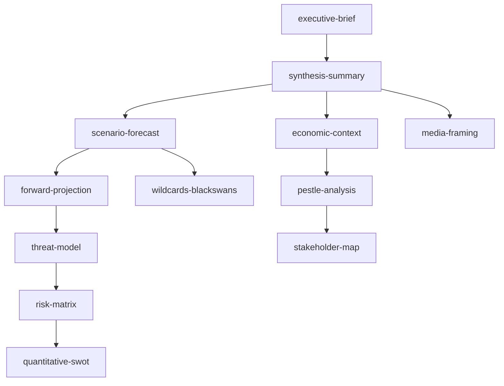

# Analysis Index — Month-Ahead (2026-05-31)

*Navigation and provenance map for the June 2026 month-ahead analysis set.
Article type: `month-ahead` · Data mode: `degraded-feeds` · Gate: see
`manifest.json`.*

---

## 1. Reading order

For a reader new to this run, the recommended path is:

1. `executive-brief.md` — BLUF and the three scenarios.
2. `intelligence/synthesis-summary.md` — the editorial thesis and consistency check.
3. `intelligence/scenario-forecast.md` — the probability flow A/B/C.
4. `intelligence/economic-context.md` — the IMF macro backbone.
5. The supporting intelligence and risk-scoring artifacts below.

## 2. Artifact catalogue

| Artifact | Purpose | Confidence |
|----------|---------|------------|
| `data-availability-assessment.md` | Feed status, recovery, data-mode rationale | 🟢 |
| `executive-brief.md` | BLUF editorial spine | 🟡 |
| `intelligence/economic-context.md` | IMF WEO macro backbone | 🟢 |
| `intelligence/economic-context.fallback.md` | Degraded-source contingency | 🟡 |
| `intelligence/procedures-proxy.md` | June themes from adopted texts | 🟡 |
| `intelligence/historical-baseline.md` | June throughput baseline | 🟡 |
| `intelligence/forward-projection.md` | WEP forward table + tripwires | 🟡 |
| `intelligence/scenario-forecast.md` | A/B/C scenarios + transitions | 🟡 |
| `intelligence/pestle-analysis.md` | Macro-environment scan | 🟡 |
| `intelligence/stakeholder-map.md` | Actors, coalitions, influence | 🟡 |
| `intelligence/threat-model.md` | Pressure sources + kill-chain | 🟡 |
| `intelligence/wildcards-blackswans.md` | Tail events + early-warning board | 🟡 |
| `intelligence/synthesis-summary.md` | Integrated thesis + handoff | 🟡 |
| `intelligence/mcp-reliability-audit.md` | Source reliability + recovery | 🟢 |
| `intelligence/reference-analysis-quality.md` | Quality scorecard | 🟢 |
| `intelligence/methodology-reflection.md` | SAT log + self-critique | 🟢 |
| `risk-scoring/risk-matrix.md` | Likelihood × impact × velocity | 🟡 |
| `risk-scoring/quantitative-swot.md` | Weighted SWOT | 🟡 |
| `extended/media-framing-analysis.md` | Editorial-balance guidance | 🟡 |

## 3. Data and cache provenance

| File | Source | Grade |
|------|--------|-------|
| `data/adopted-texts-2026.json` | EP Open Data Portal `/adopted-texts` | A2 |
| `cache/imf/weo-decoded.json` | IMF WEO SDMX 3.0 | A1 |
| `runs/thresholds-cache.json` | repo thresholds cache | — |

## 4. Cross-reference graph

## 5. How the gate reads this set

`npm run validate-analysis` compares every artifact listed in `manifest.json`
against `runs/thresholds-cache.json`, applying the `degraded-feeds` line-floor
factor (0.80). This index is itself a gated artifact (floor applies).

## 6. Coverage matrix — methodology to artifact

| Methodology family | Realised in | Floor met |
|--------------------|-------------|-----------|
| Reference-class forecasting | `historical-baseline.md` | ✅ |
| Forward projection (WEP) | `forward-projection.md` | ✅ |
| Scenario analysis | `scenario-forecast.md` | ✅ |
| PESTLE / drivers | `pestle-analysis.md` | ✅ |
| Stakeholder / ACH | `stakeholder-map.md` | ✅ |
| Threat / pre-mortem | `threat-model.md` | ✅ |
| Wildcards / HILP | `wildcards-blackswans.md` | ✅ |
| Quantitative SWOT | `risk-scoring/quantitative-swot.md` | ✅ |
| Risk matrix | `risk-scoring/risk-matrix.md` | ✅ |
| Media framing | `extended/media-framing-analysis.md` | ✅ |
| Reliability audit | `intelligence/mcp-reliability-audit.md` | ✅ |
| Reflection / SAT log | `intelligence/methodology-reflection.md` | ✅ |

## 7. Data-mode rationale (quick reference)

The run is `degraded-feeds` (line-floor factor 0.80) because three prefetched
feeds 404'd and the forward plenary feed was empty, but the recovery path
(EP adopted-texts + IMF WEO) preserved grade-A source quality. It is *not*
`minimal` (0.65), which would apply only if the substantive sources had also
failed. Full rationale: `data-availability-assessment.md` and
`intelligence/mcp-reliability-audit.md`.

## 8. Gate and manifest pointers

- Machine-readable file map: `manifest.json` (`files{}` object).
- Thresholds: `runs/thresholds-cache.json` (`thresholds["month-ahead"]`).
- Re-run history: `manifest.json.history[]`.
- Validator: `npm run validate-analysis "analysis/daily/2026-05-31/month-ahead"`.

## 9. Confidence statement

🟢 HIGH that this index accurately reflects the produced set; the underlying
forecast confidence is 🟡 MEDIUM as stated per-artifact.

---

*Pairs with `manifest.json` (machine-readable file map) and
`intelligence/methodology-reflection.md` (process audit).*
