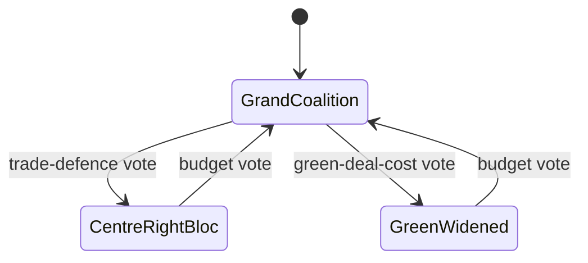

<!-- SPDX-FileCopyrightText: 2024-2026 Hack23 AB -->
<!-- SPDX-License-Identifier: Apache-2.0 -->

# 🤝 Coalition Dynamics — June 2026 Month-Ahead

**Run date:** 2026-05-31 · **Article type:** `month-ahead` · **Classification:** Public

## 1. BLUF

It is *Likely* (60-80%, WEP) that the EPP-S&D-Renew grand coalition remains
the operative majority for the June budget file, with Greens/EFA joining on
green-deal-cost items and defecting on trade-defence protectionism.

## 2. Coalition geometry

| File | Probable majority | Pivotal group | Fault line |
| --- | --- | --- | --- |
| 2027 budget mandate | EPP+S&D+Renew | S&D | Spending levels |
| Ukraine financing | EPP+S&D+Renew+Greens | S&D | Accountability conditions |
| Trade-defence | EPP+ECR (+Renew partial) | Renew | Openness vs. protection |
| DMA enforcement | EPP+S&D+Renew+Greens | Renew | Enforcement intensity |

## 3. Cohesion assessment

The grand coalition is **cohesive on budget and Ukraine** but **fractures
on trade-defence**, where Renew's free-trade instinct can swing the file
toward a centre-right protective majority with ECR. This is the single most
analytically interesting coalition variable for June.

## 4. Mermaid — coalition state transitions

## 5. SAT note

Applies **Analysis of Competing Hypotheses** (grand-coalition vs.
centre-right majority) and **Indicators** (first contested trade-defence
roll-call is the decisive signpost).

## 6. Source reliability (Admiralty)

| Source | Admiralty grade | Reliability |
| --- | --- | --- |
| EP adopted-texts feed | A2 | Reliable / probably true |
| EP10 coalition history | B2 | Usually reliable / probably true |
| Forward roll-call data (degraded) | C4 | Fairly reliable / doubtful |

## 7. Confidence

🟡 MEDIUM — coalition arithmetic is inferential this run because the forward
roll-call feed was degraded; the budget-file judgement is the most robust.

---

*Builds on `classification/actor-mapping.md`; feeds `intelligence/synthesis-summary.md`.*
