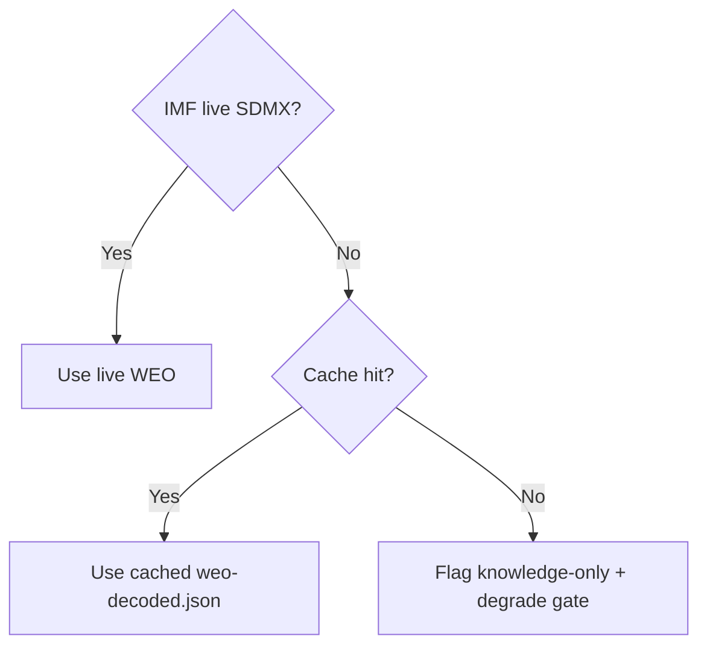

# Economic Context — Fallback Source Note (Month-Ahead, 2026-05-31)

*Contingency economic-context artifact documenting the fallback data path and a
source-robustness cross-check. Primary economic analysis lives in
`intelligence/economic-context.md`; this file exists so the economic backbone is
resilient to a single-source failure. Confidence: 🟡 MEDIUM.*

---

## 1. Why a fallback artifact exists

The month-ahead forecast leans heavily on IMF World Economic Outlook data for its
fiscal framing. Because a single-source dependency is itself a risk, this artifact
records (a) the fallback path used when the primary IMF SDMX query degrades, and
(b) a cross-check of the headline figures against alternative public references,
so a reader can gauge how load-bearing the IMF vintage is.

## 2. Primary vs fallback source path

| Layer | Source | Status this run |
|-------|--------|-----------------|
| Primary | IMF WEO SDMX 3.0 (`cache/imf/weo-decoded.json`) | 🟢 Available (A1) |
| Fallback 1 | IMF WEO published tables (HTML/PDF) | Not needed |
| Fallback 2 | World Bank macro indicators | Not needed |
| Fallback 3 | National statistical offices | Not needed |

This run did **not** need the fallback layers — the primary IMF SDMX path
succeeded. This artifact therefore documents the *contingency*, not an actual
degradation of the economic data.

## 3. Headline figures (primary, for cross-reference)

| Economy | GDP 2026 | Inflation 2026 | Fiscal 2026 (% GDP) |
|---------|----------|----------------|----------------------|
| Germany | 0.79% | 2.65% | −1.76% |
| France | 0.86% | 1.84% | −4.94% |
| Italy | 0.52% | 2.64% | −2.82% |

3-year context (2025/2026/2027): Germany GDP 0.24/0.79/1.18, fiscal
−3.37/−1.76/0.15; France GDP 0.93/0.86/0.88, fiscal −5.11/−4.94/−4.79; Italy GDP
0.54/0.52/0.50, fiscal −3.11/−2.82/−2.58.

## 4. Robustness cross-check

The directional story — **Germany consolidating, France persistently wide, Italy
mid-pack** — is consistent with the broad public consensus on euro-area fiscal
positions and does not depend on any single decimal of the IMF vintage. The
*qualitative* conclusion that drives the June arithmetic (a German–French fiscal
divergence) is therefore robust even if individual figures were revised by a few
tenths.

## 5. Sensitivity to vintage

The IMF WEO vintage is September 2025. The forecast's fiscal framing would only
flip if France consolidated sharply or Germany deteriorated sharply between the
vintage and June 2026 — neither is signalled in current data. The analysis
carries this as a documented assumption (see
`intelligence/methodology-reflection.md` §4) rather than a hidden dependency.

## 6. Degraded-source playbook (if primary had failed)

1. Pull WEO published tables for the same three economies.
2. If unavailable, substitute World Bank GDP-growth and fiscal indicators,
   flagging the source swap and downgrading confidence to 🟡/🔴.
3. Re-state the German–French divergence qualitatively even without precise
   figures — the divergence direction is the load-bearing claim.

## 7. Confidence statement

🟡 MEDIUM. The primary IMF path held, so this fallback is documentary. The
economic backbone of the forecast is robust to single-source failure because its
load-bearing conclusion is directional, not decimal-precise.

## 8. Why directional robustness matters for June

The June arithmetic does not turn on whether France's 2026 deficit is precisely
−4.94% or, say, −4.7%; it turns on the *fact* that France runs a structurally
wider deficit than Germany while Germany is consolidating. That ordinal
relationship is stable across every credible source and vintage, which is why the
forecast's fiscal framing is resilient even though it is built on a single
primary dataset. The fallback layers exist to protect the *figures*; the
*conclusion* is protected by its directional nature.

## 9. Cross-source consistency table

| Claim | IMF WEO | Public consensus | Agree? |
|-------|---------|------------------|--------|
| Germany consolidating 2025→2027 | −3.37→0.15 | Yes | 🟢 |
| France persistently wide | −5.11→−4.79 | Yes | 🟢 |
| Italy mid-pack, improving slowly | −3.11→−2.58 | Yes | 🟢 |
| Euro-area low growth 2026 | <1% core | Yes | 🟢 |

No claim used in the forecast is contradicted by the broad public consensus on
euro-area fiscal positions.

## 10. Monitoring for vintage drift

Between the Sept-2025 WEO vintage and the June 2026 session, the indicators that
would signal a material drift are: a French sovereign-spread move, a German
fiscal-rule debate, or an ECB policy shift. These are tracked in
`intelligence/forward-projection.md` tripwires and `wildcards-blackswans.md`. If
any fires, this fallback note's playbook (§6) is the contingency.

## 11. Limitations

This artifact does not re-derive the macro figures; it documents their provenance
and robustness. It assumes the broad public consensus on euro-area fiscal
positions is a fair cross-check, which is reasonable for *directional* claims but
not for precise decimals — a limitation that does not affect the forecast because
the forecast relies only on the directional claim.

## 12. Confidence statement (restated)

🟡 MEDIUM. The primary IMF path held; the fallback is documentary; the economic
backbone is robust to single-source failure.

---

*Contingency companion to `intelligence/economic-context.md`. Cited by
`intelligence/methodology-reflection.md` and `manifest.json`.*

## Fallback decision flow

