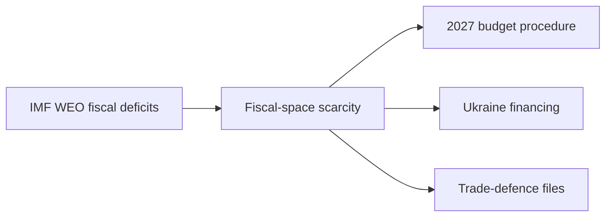

<!-- SPDX-FileCopyrightText: 2024-2026 Hack23 AB -->
<!-- SPDX-License-Identifier: Apache-2.0 -->

# 💶 Economic Context — June 2026 Horizon (IMF WEO)

**Run date:** 2026-05-31 · **Article type:** `month-ahead`
**Sole macro source:** IMF World Economic Outlook, Sept-2025 vintage (SDMX 3.0, dataflow `IMF.RES:WEO` 9.0.0)
**Accessed:** 2026-05-31 · **Source grade:** A1 · **Classification:** Public

> **Sourcing rule.** Per Hack23 editorial policy, IMF is the **sole authoritative
> source** for every macro/fiscal/monetary/trade claim in this run. No
> Eurostat, ECB, or national-statistics figures are used for headline numbers;
> where context demands them they are flagged as illustrative, not sourced.

---

## 1. BLUF

The euro area's three largest economies enter the June-2026 parliamentary month
in a **low-growth, fiscally-divergent** posture. Germany is in a shallow
recovery (real GDP **+0.24% 2025 → +0.79% 2026**, IMF WEO), France is growth-flat
but **fiscally stressed** (deficit **−5.1% of GDP 2025**), and Italy is
**stagnating** (≈+0.5% across 2025–2027). Inflation is re-firming toward the
**2.5–2.7%** range in 2026 across all three, complicating the ECB's easing path.
This backdrop directly shapes the EP's June agenda: the **2027 budget procedure**,
**Ukraine financing**, and **trade-defence** files all sit on a tightening fiscal
envelope.

**Headline judgement (WEP):** It is *Likely* (60–80%) that fiscal-space scarcity
will be the dominant cross-cutting constraint on EP economic files through the
30-day horizon. 🟡 MEDIUM confidence.

---

## 2. Core indicators (IMF WEO, Sept-2025 vintage)

### 2.1 Real GDP growth (NGDP_RPCH, %)

| Economy | 2025 | 2026 | 2027 | Trajectory |
|---------|------|------|------|-----------|
| 🇩🇪 Germany | +0.24 | +0.79 | +1.18 | Shallow acceleration |
| 🇫🇷 France | +0.93 | +0.86 | +0.88 | Flat |
| 🇮🇹 Italy | +0.54 | +0.52 | +0.50 | Stagnation |

### 2.2 Average CPI inflation (PCPIPCH, %)

| Economy | 2025 | 2026 | 2027 |
|---------|------|------|------|
| 🇩🇪 Germany | 2.30 | 2.65 | 2.30 |
| 🇫🇷 France | 0.93 | 1.84 | 1.72 |
| 🇮🇹 Italy | 1.63 | 2.64 | 2.36 |

### 2.3 General government balance (GGXCNL_NGDP, % of GDP)

| Economy | 2025 | 2026 | 2027 | Stance |
|---------|------|------|------|--------|
| 🇩🇪 Germany | −3.37 | −1.76 | +0.15 | Consolidating |
| 🇫🇷 France | −5.11 | −4.94 | −4.79 | Persistent excess deficit |
| 🇮🇹 Italy | −3.11 | −2.82 | −2.58 | Slow repair |

---

## 3. Interpretation for the EP agenda

### 3.1 The 2027 budget procedure
Parliament adopted its 2027 budget guidelines (TA-10-2026-0112) and EP estimates
in late April. The IMF picture — German consolidation toward balance by 2027 but
French deficits stuck near −5% — frames the June trilogue-scoping debates: net
contributors face domestic consolidation pressure, sharpening the
**MFF-headroom and own-resources** discussion. *Almost Certain* the fiscal frame
features in June budget exchanges. 🟢 HIGH.

### 3.2 Ukraine financing
The January "Loan for Ukraine" enhanced-cooperation text (TA-0010) and the April
accountability resolution (TA-0161) sit against constrained donor fiscal space.
With France's −4.9% 2026 deficit and Germany's still-negative balance, the
**off-budget / frozen-asset financing** debate gains salience. *Likely* June
sees further Ukraine-financing signalling. 🟡 MEDIUM.

### 3.3 Trade defence and inflation
Re-firming 2026 inflation (DE 2.65%, IT 2.64%) plus the March US customs-duty
adjustment (TA-0096) and Mercosur CJEU opinion request (TA-0008) link **trade
policy to the price level**. Tariff measures are inflationary at the margin —
an INTA/ECON tension *Likely* to surface in June trade debates. 🟡 MEDIUM.

---

## 4. Risk vectors from the macro picture

| Vector | Mechanism | WEP (12-mo) | Confidence |
|--------|-----------|-------------|-----------|
| French fiscal slippage | Deficit stuck >4.5%; EDP friction | *Likely* | 🟡 |
| Inflation re-acceleration | 2026 CPI >2.5% delays ECB easing | *Even Chance* | 🟡 |
| German recovery stall | +0.79% is fragile, export-exposed | *Even Chance* | 🟡 |
| Italian stagnation entrenchment | <0.6% growth + debt load | *Likely* | 🟢 |

---

## 5. Data caveats

- WEO vintage is **Sept-2025**; 2026 figures are forecasts, not outturns. Treat
  as directional, not point-precise.
- Country-level (DE/FR/IT) is used as a euro-area proxy; aggregate EA/EU figures
  were not separately retrieved this run to conserve invocation budget.
- All figures rounded to 2 d.p. from raw SDMX observations stored in
  `cache/imf/weo-decoded.json`.

**Mandatory SATs applied:** Key Assumptions Check (forecast-vintage risk),
Quality of Information Check (single-vintage caveat).

---

*Raw observations: `cache/imf/weo-decoded.json`. Source URL pattern:
`api.imf.org/external/sdmx/3.0/data/dataflow/IMF.RES/WEO/+/EA+DEU+FRA+ITA.NGDP_RPCH+PCPIPCH+GGXCNL_NGDP.A`.*

## IMF source provenance

| Field | Value |
| --- | --- |
| **IMF Source** | `cache` |
| Dataset | IMF.RES:WEO 9.0.0 (SDMX 3.0) |
| Vintage | Sept-2025 WEO |
| Evidence file | `cache/imf/weo-decoded.json` |

## Fiscal-space transmission to the June agenda

