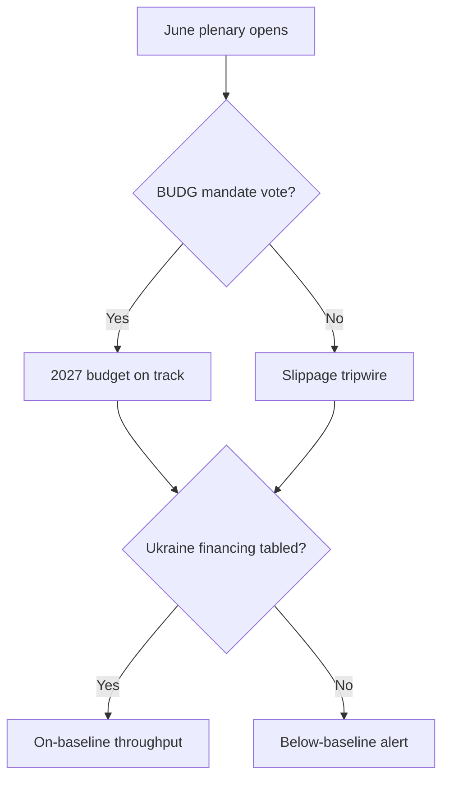

<!-- SPDX-FileCopyrightText: 2024-2026 Hack23 AB -->
<!-- SPDX-License-Identifier: Apache-2.0 -->

# 🔮 Forward Projection — June 2026 (30-day horizon)

**Run date:** 2026-05-31 · **Horizon:** 2026-05-31 → 2026-06-30 · **Article type:** `month-ahead`
**Estimative framework:** Kent/ICD-203 Words of Estimative Probability (WEP) + Admiralty source grading.
**Data mode:** `degraded-feeds` (forward plenary feed empty → structural inference).

---

## 1. BLUF

Across the 30-day horizon it is *Almost Certain* (95–99%) the EP holds its June
Strasbourg part-session, *Likely* (60–80%) the **2027 budget procedure** and a
**Ukraine-financing/accountability** item appear, and *Likely* a **trade-defence
(US-tariff / Mercosur)** debate recurs. The dominant cross-cutting driver is
**fiscal-space scarcity** (IMF WEO: FR −4.9%, DE consolidating, IT stagnant).
Confidence is 🟡 MEDIUM: calendar structure is firm; specific item scheduling is
inferred from the adopted-text pipeline rather than a live forward feed.

---

## 2. WEP probability table (June 2026 horizon)

| # | Forward judgement | WEP band | Numeric | Source grade | Confidence |
|---|-------------------|----------|---------|--------------|-----------|
| F1 | June Strasbourg part-session convenes | *Almost Certain* | 95–99% | A1 (EP calendar) | 🟢 HIGH |
| F2 | 2027 budget procedure item on agenda | *Likely* | 60–80% | A2 (TA-0112) | 🟡 MED |
| F3 | ≥1 Ukraine-related resolution/financing item | *Likely* | 60–80% | A2 (TA-0010/0161) | 🟡 MED |
| F4 | ≥1 trade-defence / Mercosur debate | *Likely* | 55–75% | A2 (TA-0096/0008) | 🟡 MED |
| F5 | ≥1 international-agreement consent (fisheries/JHA) | *Likely* | 60–80% | A2 (May-II cadence) | 🟡 MED |
| F6 | DMA / digital-enforcement follow-up | *Even Chance* | 40–60% | B3 (TA-0160) | 🟡 MED |
| F7 | Electoral Act reform progress item | *Even Chance* | 35–55% | B3 (TA-0006) | 🟡 MED |
| F8 | Major coalition realignment (EPP–S&D split) | *Unlikely* | 15–30% | C4 | 🟡 MED |
| F9 | Emergency/urgency plenary on external shock | *Unlikely* | 10–25% | C4 | 🟡 MED |
| F10 | Institutional surprise (resignation/censure move) | *Remote* | 3–10% | C4 | 🟡 MED |

---

## 3. Reference-class table

| Forward item | Reference class | Base rate | Adjustment | Final band |
|--------------|-----------------|-----------|-----------|-----------|
| F1 session | EP10 fixed June sessions | ~100% | none | *Almost Certain* |
| F2 budget | June sessions in budget-procedure years | ~85% | live procedure ↑ | *Likely* |
| F3 Ukraine | Part-sessions since 2022 | ~90% | donor-fatigue ↓ | *Likely* |
| F4 trade | Part-sessions with open trade file | ~65% | US-tariff salience ↑ | *Likely* |
| F9 emergency | Random part-session | ~15% | tense geopolitics ↑ | *Unlikely* |

---

## 4. Structural-break tripwires

If any tripwire fires within the horizon, the modal projection (§2) is
**superseded** and the scenario shifts toward the disruption branch in
`scenario-forecast.md`:

1. **TW-1 — Conflict escalation** (Ukraine/Middle East): triggers an urgency
   resolution that displaces planned agenda slots. Indicator: Council emergency
   convening or EEAS crisis statement.
2. **TW-2 — Budget trilogue collapse**: a breakdown in 2027-budget scoping forces
   an unscheduled plenary debate and statement. Indicator: Council reading delay.
3. **TW-3 — Market/fiscal event** (French OAT spread spike, bank stress):
   re-prioritises ECON agenda. Indicator: IMF/market stress signal.
4. **TW-4 — Trade rupture** (new US tariff round / Mercosur ruling): forces an
   INTA emergency debate. Indicator: CJEU opinion delivery or US measure.
5. **TW-5 — Internal institutional shock** (immunity/censure escalation):
   re-orders JURI/plenary priorities.

---

## 5. Indicators to monitor (next 30 days)

| Indicator | What it signals | Direction |
|-----------|-----------------|-----------|
| June Strasbourg final agenda publication | F2–F7 confirmation | Resolves bands |
| Council 2027-budget reading date | Budget-procedure tempo | F2 ↑/↓ |
| CJEU Mercosur opinion timing | Trade-file activation | F4 ↑ |
| EEAS/Council crisis statements | TW-1 / TW-4 risk | Tripwire watch |
| French sovereign-spread moves | TW-3 risk | Tripwire watch |

---

## 6. Confidence synthesis

Calendar-level claims (F1) are 🟢 HIGH. Item-level claims (F2–F7) are 🟡 MEDIUM,
appropriately banded *Even Chance*→*Likely*. Disruption claims (F8–F10) are
*Unlikely*/*Remote* and 🟡 MEDIUM. The empty forward feed caps item-level
confidence at MEDIUM; this is the honest ceiling for a degraded-feeds month-ahead
run.

**Mandatory SATs applied:** Reference-Class Forecasting, Indicators/Signposts,
Key Assumptions Check, Pre-Mortem (via tripwires).

---

*Calibration source: `intelligence/historical-baseline.md`,
`data/adopted-texts-2026.json`, `intelligence/economic-context.md`.*

## Forward-projection tripwire flow

